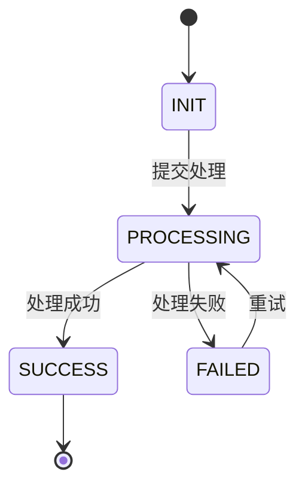
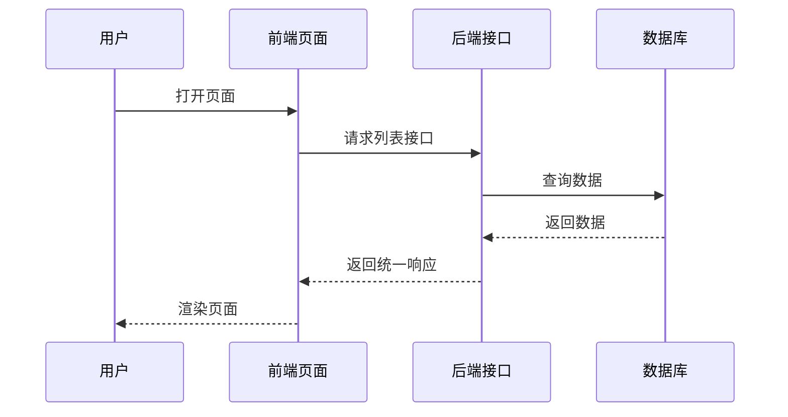

# 后端真实需求技术实现文档模板 V4.0

> 适用对象：Claude Code、Cursor、Codex、后端开发、测试、架构评审、DBA、运维  
> 适用场景：基于 PRD / 需求描述 / 原型 / 前端代码 / 后端代码 / 数据库现状，生成可评审、可开发、可测试、可上线、可回滚的后端技术实现文档  
> 推荐技术栈：Spring Boot / Spring Cloud + MySQL / Redis / MQ / Nacos / Sentinel / MyBatis / MyBatis-Plus  
> 核心原则：先澄清，再分析；先现状，再方案；先测试，再实现；先回滚，再上线

---

## 0. 文档定位

这份文档不是普通技术方案模板，而是给 Claude Code 执行真实需求开发时使用的**技术实现交付模板**。

Claude Code 应先根据 PRD 或需求资料，结合指定 Skill 完成以下闭环：

```text
需求澄清
  ↓
PRD / 需求拆解
  ↓
原型与前端交互分析
  ↓
存量后端代码现状分析
  ↓
数据库现状分析
  ↓
后端技术实现文档生成
  ↓
任务拆分
  ↓
TDD / 接口测试 / 回归测试
  ↓
代码实现
  ↓
Review / Verify / Ship
```

最终目标：

```text
让 Claude Code 不只是“写代码”，而是先产出一份可执行技术实现文档，再按文档一步步完成开发。
```

---

## 1. Claude Code 使用方式

### 1.1 推荐目录结构

```text
project-root/
├── CLAUDE.md
├── AGENTS.md
├── CONTEXT.md
├── docs/
│   ├── requirements/
│   │   └── xxx-prd.md
│   ├── specs/
│   │   └── xxx-requirement/
│   │       ├── 01-requirement-analysis.md
│   │       ├── 02-backend-technical-implementation.md
│   │       ├── 03-api-contract.md
│   │       ├── 04-db-change.sql
│   │       ├── 05-apifox-test-cases.md
│   │       ├── 06-dev-tasks.md
│   │       ├── 07-release-plan.md
│   │       └── 08-rollback-plan.md
│   └── templates/
│       └── backend-technical-implementation-template-v4.md
└── .claude/
    └── skills/
        └── backend-requirement-implementation/
            └── SKILL.md
```

### 1.2 推荐触发 Prompt

```markdown
请基于以下 PRD / 需求，使用 backend-requirement-implementation Skill，先生成后端技术实现文档，再按文档拆分开发任务。

要求：
1. 不要直接写业务代码。
2. 先判断资料等级 L1 / L2 / L3 / L4。
3. 先用 Skill 完成需求澄清、PRD 拆解、前端交互分析、后端现状分析、数据库现状分析。
4. 再按照《后端真实需求技术实现文档模板 V4.0》生成技术文档。
5. 文档通过质量评分后，再进入 Plan / TDD / Build / Test / Review / Ship。

PRD / 需求如下：
【粘贴 PRD 或需求描述】

原型 / 页面说明如下：
【粘贴原型链接、截图说明、页面说明】

前端项目路径：
【可选】

后端项目路径：
【可选】

数据库表结构：
【可选】
```

---

## 2. Skill 使用编排总览

| 阶段 | 目标 | 推荐 Skill / 命令 | 输出物 | 是否强制 |
|---|---|---|---|---|
| Step 0 | 判断资料完整度 | `backend-requirement-implementation` 内置任务识别 | L1 / L2 / L3 / L4 资料等级 | 是 |
| Step 1 | 需求澄清 | `/grill-me`、`/grill-with-docs`、`idea-refine` | 澄清问题、假设前提、非目标范围 | 是 |
| Step 2 | PRD 规格化 | `/spec`、`api-and-interface-design` | 需求目标、功能清单、业务规则、验收标准 | 是 |
| Step 3 | 现状理解 | `context-engineering`、`/zoom-out` | 系统上下文、现有模块、调用链、复用能力 | 是 |
| Step 4 | 前端交互分析 | `frontend-ui-engineering`、`browser-testing-with-devtools` | 页面-接口映射、接口数量核对、交互时序 | L2+ 强制 |
| Step 5 | 后端架构分析 | `architecture`、`context-engineering` | 包结构、类结构、公共能力、相似模块 | L3+ 强制 |
| Step 6 | 数据库分析 | `api-and-interface-design`、自定义 DB 分析流程 | 表复用、字段复用、索引、DDL、迁移、回滚 | L3+ 强制 |
| Step 7 | 技术方案生成 | `writing-plans`、`/plan` | 后端技术实现文档 | 是 |
| Step 8 | 任务拆分 | `/plan`、`/to-issues`、`using-git-worktrees` | 可执行任务列表、文件级改动计划 | 是 |
| Step 9 | TDD 开发 | `/tdd`、`/build` | 失败测试、最小实现、重构记录 | 开发阶段强制 |
| Step 10 | 验证测试 | `/test`、`/diagnose` | 单测、接口测试、回归测试、问题定位 | 是 |
| Step 11 | 代码评审 | `/review`、`code-simplify` | Review 清单、复杂度优化建议 | 是 |
| Step 12 | 上线交付 | `/ship` | 发布说明、灰度方案、回滚方案、验收记录 | 是 |

---

## 3. 资料等级判定

| 等级 | 输入资料 | Claude Code 允许输出 | 禁止行为 |
|---|---|---|---|
| L1 | 只有一句需求描述 | 澄清问题、假设前提、粗粒度技术方向 | 禁止输出可开发文档 |
| L2 | 有 PRD + 原型 / 页面说明 | 可评审技术方案、接口初稿、测试初稿 | 禁止假装已分析代码 |
| L3 | 有 PRD + 原型 + 前端代码 / 后端代码 / 表结构 | 可开发技术实现文档、文件级任务拆分 | 禁止脱离存量代码风格设计 |
| L4 | 有 L3 全部 + 线上接口文档 + 权限模型 + 发布流程 | 完整研发交付包 | 禁止省略上线回滚和质量门禁 |

### 3.1 资料不足处理规则

当资料不足时，Claude Code 必须在文档开头标注：

```markdown
## 资料完整度评估

当前资料等级：L1 / L2 / L3 / L4

已提供资料：
- [x] PRD
- [ ] 原型
- [ ] 前端源码
- [ ] 后端源码
- [ ] 数据库表结构
- [ ] 权限模型
- [ ] 发布流程

缺失资料影响：
1. 【说明影响】
2. 【说明影响】

本次输出边界：
- 可以输出：【内容】
- 暂不能输出：【内容】
```

---

## 4. 后端技术实现文档正文模板

# 《【需求名称】后端技术实现与测试方案》

> 文档版本：v1.0  
> 需求状态：待评审 / 待开发 / 开发中 / 待测试 / 待上线 / 已上线  
> 当前资料等级：L1 / L2 / L3 / L4  
> 生成方式：Claude Code + backend-requirement-implementation Skill  
> 核心原则：最小侵入、兼容优先、复用优先、可测试、可灰度、可回滚

---

## 1. 文档基本信息

| 项目 | 内容 |
|---|---|
| 需求名称 |  |
| 需求编号 |  |
| 所属系统 |  |
| 所属模块 |  |
| 业务线 |  |
| 需求来源 | 产品 / 运营 / 客服 / 风控 / 技术治理 / 其他 |
| 项目类型 | 存量项目增量开发 |
| 技术栈 | Spring Boot + MySQL |
| 持久层 | MyBatis / MyBatis-Plus / JPA / 其他 |
| 接口风格 | REST / RPC / 内部接口 / MQ / 定时任务 |
| 是否核心链路 | 是 / 否 |
| 是否涉及资金 | 是 / 否 |
| 是否涉及权限 | 是 / 否 |
| 是否涉及隐私数据 | 是 / 否 |
| 是否涉及高并发 | 是 / 否 |
| 是否涉及数据库变更 | 是 / 否 |
| 是否涉及 Redis | 是 / 否 |
| 是否涉及 MQ | 是 / 否 |
| 是否涉及外部服务 | 是 / 否 |
| 是否需要灰度 | 是 / 否 |
| 是否需要回滚脚本 | 是 / 否 |
| 开发负责人 |  |
| 测试负责人 |  |
| DBA 负责人 |  |
| 运维负责人 |  |
| 产品负责人 |  |
| 关联 PRD |  |
| 关联原型 |  |
| 关联任务单 |  |
| 关联代码分支 |  |
| 关联 Apifox 项目 |  |

---

## 2. AI 与研发边界规则

### 2.1 当前任务定位

本需求属于：

```text
已有后端系统上的增量开发 / 局部改造 / 能力扩展
```

不属于：

```text
新建项目
大规模重构
替换技术架构
重写历史模块
```

### 2.2 禁止行为

| 编号 | 禁止行为 |
|---|---|
| R-001 | 不允许默认重构现有系统 |
| R-002 | 不允许默认修改旧接口返回结构 |
| R-003 | 不允许默认删除旧字段、旧表、旧逻辑 |
| R-004 | 不允许无理由新增中间件、框架、服务 |
| R-005 | 不允许脱离现有项目分层、包结构、命名风格另起一套体系 |
| R-006 | 不允许在信息不足时把假设当事实 |
| R-007 | 不允许只写 Controller / Service，不写数据库、事务、测试、上线、回滚 |
| R-008 | 不允许新增写接口而不设计幂等 |
| R-009 | 不允许新增列表接口而不设计分页深度限制 |
| R-010 | 不允许涉及敏感字段却不设计脱敏策略 |

### 2.3 强制输出规则

| 编号 | 强制规则 |
|---|---|
| M-001 | 所有改动必须标注：新增 / 修改 / 复用 / 保持不变 |
| M-002 | 必须先写现状分析，再写技术方案 |
| M-003 | 必须说明兼容旧逻辑、旧接口、旧数据的方式 |
| M-004 | 必须输出接口设计、数据库设计、事务设计、并发设计、测试设计 |
| M-005 | 必须输出 Apifox 用例、回归用例、异常用例 |
| M-006 | 必须输出上线步骤、灰度策略、回滚方案 |
| M-007 | 必须输出质量评分，低于 80 分不得进入开发 |

---

## 3. PRD / 需求深度分析摘要

### 3.1 需求一句话概述

```text
【用一句话说明本需求要解决的问题和交付能力】
```

### 3.2 业务目标

| 目标编号 | 业务目标 | 衡量标准 |
|---|---|---|
| G-001 |  |  |
| G-002 |  |  |
| G-003 |  |  |

### 3.3 用户角色

| 角色 | 权限范围 | 主要操作 | 数据范围 |
|---|---|---|---|
|  |  |  |  |

### 3.4 功能拆解

| 编号 | PRD 功能点 | 优先级 | 涉及页面 | 涉及后端模块 | 是否本期实现 |
|---|---|---|---|---|---|
| FR-001 |  | P0 / P1 / P2 |  |  | 是 / 否 |

### 3.5 业务规则提取

| 编号 | 规则描述 | 触发条件 | 处理方式 | 异常分支 |
|---|---|---|---|---|
| BR-001 |  |  |  |  |

### 3.6 字段字典

| 字段名 | 中文名 | 类型 | 长度 | 必填 | 枚举值 | 默认值 | 说明 |
|---|---|---|---:|---|---|---|---|
|  |  |  |  | 是 / 否 |  |  |  |

### 3.7 状态机分析



### 3.8 非目标范围

| 编号 | 不做内容 | 原因 |
|---|---|---|
| N-001 |  |  |

---

## 4. 前端交互与接口映射分析

> 如果没有原型或前端代码，本章必须标注资料缺失和风险，不允许凭空设计。

### 4.1 页面清单

| 页面编号 | 页面名称 | 页面类型 | 说明 |
|---|---|---|---|
| P-001 |  | 列表页 / 详情页 / 弹窗 / 抽屉 |  |

### 4.2 页面元素与交互动作

| 页面 | 页面元素 | 交互动作 | 是否需要后端接口 | 说明 |
|---|---|---|---|---|
|  |  |  | 是 / 否 |  |

### 4.3 页面-接口映射表

| 页面 | 页面元素 | 交互动作 | 接口名称 | URL | Method | 触发时机 |
|---|---|---|---|---|---|---|
| 列表页 | 搜索区 | 点击查询 | 查询列表 | `/api/xxx/list` | POST | 页面加载、搜索、分页 |

### 4.4 接口数量核对

| 页面 | 原型交互数量 | 已设计接口数量 | 是否遗漏 | 遗漏说明 |
|---|---:|---:|---|---|
|  |  |  | 是 / 否 |  |

### 4.5 前端交互时序图



---

## 5. 存量系统现状分析

### 5.1 当前业务流程

```text
【当前已有业务流程】
```

### 5.2 当前模块现状

| 模块名称 | 工程路径 / 包路径 | 当前职责 | 本次是否涉及 | 处理方式 |
|---|---|---|---|---|
|  |  |  | 是 / 否 | 复用 / 修改 / 新增 / 保持不变 |

### 5.3 当前类结构现状

| 类名 | 类型 | 当前职责 | 本次处理方式 | 说明 |
|---|---|---|---|---|
| XxxController | Controller |  | 复用 / 修改 / 不涉及 |  |
| XxxService | Service |  | 复用 / 修改 / 不涉及 |  |
| XxxServiceImpl | ServiceImpl |  | 复用 / 修改 / 不涉及 |  |
| XxxMapper | Mapper |  | 复用 / 修改 / 不涉及 |  |
| XxxEntity | Entity |  | 复用 / 修改 / 不涉及 |  |

### 5.4 公共能力复用扫描

| 能力 | 是否存在 | 位置 | 本需求是否复用 | 说明 |
|---|---|---|---|---|
| 统一返回结构 | 是 / 否 |  | 是 / 否 | 禁止新定义返回格式 |
| 全局异常处理 | 是 / 否 |  | 是 / 否 | 复用现有异常体系 |
| 权限注解 | 是 / 否 |  | 是 / 否 | 接口必须接入权限体系 |
| 操作日志 | 是 / 否 |  | 是 / 否 | 写操作优先复用 |
| 数据权限 | 是 / 否 |  | 是 / 否 | 涉及用户、组织、租户时必须分析 |
| 字典能力 | 是 / 否 |  | 是 / 否 | 枚举优先复用 |
| 分页组件 | 是 / 否 |  | 是 / 否 | 列表接口必须复用 |
| 导出能力 | 是 / 否 |  | 是 / 否 | 导出接口优先复用 |
| 文件上传 | 是 / 否 |  | 是 / 否 | 上传需求优先复用 |
| 分布式锁 | 是 / 否 |  | 是 / 否 | 并发写场景优先复用 |
| 幂等组件 | 是 / 否 |  | 是 / 否 | 写接口优先复用 |

### 5.5 相似模块分析

| 现有模块 | 相似度 | 可复用内容 | 不可复用内容 | 复用策略 |
|---|---|---|---|---|
|  | 高 / 中 / 低 |  |  |  |

---

## 6. 改动范围与影响分析

### 6.1 改动总览

| 类型 | 对象 | 改动方式 | 风险等级 | 说明 |
|---|---|---|---|---|
| 模块 |  | 新增 / 修改 / 复用 | 高 / 中 / 低 |  |
| 类 |  | 新增 / 修改 / 复用 | 高 / 中 / 低 |  |
| 接口 |  | 新增 / 修改 / 复用 | 高 / 中 / 低 |  |
| 表 |  | 新增 / 修改 / 复用 | 高 / 中 / 低 |  |
| 配置 |  | 新增 / 修改 / 复用 | 高 / 中 / 低 |  |
| 缓存 |  | 新增 / 修改 / 复用 | 高 / 中 / 低 |  |
| MQ |  | 新增 / 修改 / 复用 | 高 / 中 / 低 |  |
| 定时任务 |  | 新增 / 修改 / 复用 | 高 / 中 / 低 |  |

### 6.2 明确不改动范围

| 不改动对象 | 原因 | 防误伤措施 |
|---|---|---|
|  |  |  |

### 6.3 上下游影响

| 系统 | 影响说明 | 是否需要联调 | 联系人 | 联调内容 |
|---|---|---|---|---|
| 前端系统 |  | 是 / 否 |  |  |
| 第三方系统 |  | 是 / 否 |  |  |
| 内部服务 |  | 是 / 否 |  |  |
| 数据平台 |  | 是 / 否 |  |  |

---

## 7. 技术方案设计

### 7.1 总体方案

```markdown
本次采用【新增接口 / 修改旧接口 / 新增扩展表 / 配置开关 / 异步任务 / 分布式锁】组合方案。

选择原因：
1. 【原因 1】
2. 【原因 2】
3. 【原因 3】

不采用其他方案的原因：
1. 【不采用方案 A 的原因】
2. 【不采用方案 B 的原因】
```

### 7.2 模块与包结构设计

```text
com.xxx.project.module.xxx
├── controller
│   └── XxxController.java
├── service
│   ├── XxxService.java
│   └── impl
│       └── XxxServiceImpl.java
├── manager
│   └── XxxManager.java
├── mapper
│   └── XxxMapper.java
├── model
│   ├── entity
│   │   └── XxxEntity.java
│   ├── dto
│   │   ├── XxxCreateDTO.java
│   │   ├── XxxUpdateDTO.java
│   │   └── XxxQueryDTO.java
│   ├── vo
│   │   └── XxxVO.java
│   └── enums
│       └── XxxStatusEnum.java
├── config
│   └── XxxFeatureProperties.java
└── constant
    └── XxxConstant.java
```

### 7.3 新增类清单

| 类名 | 类型 | 包路径 | 职责 | 对应接口 / 流程 | 是否必须 |
|---|---|---|---|---|---|
| XxxController | Controller |  | 接口入口 |  | 是 |
| XxxService | Service |  | 业务接口定义 |  | 是 |
| XxxServiceImpl | ServiceImpl |  | 业务实现 |  | 是 |
| XxxManager | Manager |  | 复杂流程编排 |  | 视情况 |
| XxxMapper | Mapper |  | 数据库访问 |  | 是 |
| XxxEntity | Entity |  | 表结构映射 |  | 是 |
| XxxCreateDTO | DTO |  | 创建入参 |  | 是 |
| XxxVO | VO |  | 接口响应 |  | 是 |

### 7.4 修改类清单

| 类名 | 当前职责 | 修改内容 | 修改原因 | 风险等级 | 回归点 |
|---|---|---|---|---|---|
|  |  |  |  | 高 / 中 / 低 |  |

### 7.5 调用链说明

```text
Controller
  ↓ 参数校验 / 权限校验
Service
  ↓ 事务边界 / 业务规则
Manager
  ↓ 组合流程 / 外部依赖 / 幂等并发
Mapper
  ↓ SQL 查询 / 写入
MySQL
```

---

## 8. 数据库设计

### 8.1 表改动总览

| 表名 | 改动类型 | 是否大表 | 是否影响历史数据 | 是否需要迁移 | 是否可回滚 | 风险等级 |
|---|---|---|---|---|---|---|
| xxx_table | 新增 / 修改 / 复用 | 是 / 否 | 是 / 否 | 是 / 否 | 是 / 否 | 高 / 中 / 低 |

### 8.2 新增表设计

#### 表名：`xxx_record`

#### 表用途

```text
用于记录 XXX 业务处理记录，支持幂等、查询、失败重试、审计和问题排查。
```

#### 建表 SQL

```sql
CREATE TABLE `xxx_record` (
  `id` BIGINT NOT NULL AUTO_INCREMENT COMMENT '主键ID',
  `biz_no` VARCHAR(64) NOT NULL COMMENT '业务编号',
  `request_id` VARCHAR(64) NOT NULL COMMENT '请求幂等号',
  `biz_type` VARCHAR(32) NOT NULL COMMENT '业务类型',
  `status` VARCHAR(32) NOT NULL DEFAULT 'INIT' COMMENT '状态：INIT-初始化，PROCESSING-处理中，SUCCESS-成功，FAILED-失败',
  `request_content` TEXT DEFAULT NULL COMMENT '请求内容，禁止存储未脱敏敏感信息',
  `response_content` TEXT DEFAULT NULL COMMENT '响应内容，禁止存储未脱敏敏感信息',
  `fail_reason` VARCHAR(512) DEFAULT NULL COMMENT '失败原因',
  `retry_count` INT NOT NULL DEFAULT 0 COMMENT '重试次数',
  `created_by` VARCHAR(64) DEFAULT NULL COMMENT '创建人',
  `updated_by` VARCHAR(64) DEFAULT NULL COMMENT '更新人',
  `created_at` DATETIME NOT NULL DEFAULT CURRENT_TIMESTAMP COMMENT '创建时间',
  `updated_at` DATETIME NOT NULL DEFAULT CURRENT_TIMESTAMP ON UPDATE CURRENT_TIMESTAMP COMMENT '更新时间',
  `deleted` TINYINT NOT NULL DEFAULT 0 COMMENT '是否删除：0-否，1-是',
  PRIMARY KEY (`id`),
  UNIQUE KEY `uk_request_id` (`request_id`),
  UNIQUE KEY `uk_biz_no` (`biz_no`),
  KEY `idx_status_created_at` (`status`, `created_at`),
  KEY `idx_created_by_created_at` (`created_by`, `created_at`)
) ENGINE=InnoDB DEFAULT CHARSET=utf8mb4 COMMENT='XXX业务处理记录表';
```

### 8.3 字段说明

| 字段名 | 类型 | 是否必填 | 默认值 | 说明 | 是否敏感 |
|---|---|---|---|---|---|
| id | bigint | 是 | 自增 | 主键 ID | 否 |
| biz_no | varchar(64) | 是 | 无 | 业务编号 | 否 |
| request_id | varchar(64) | 是 | 无 | 请求幂等号 | 否 |
| status | varchar(32) | 是 | INIT | 状态 | 否 |
| request_content | text | 否 | null | 请求内容，必须脱敏 | 是 / 否 |
| response_content | text | 否 | null | 响应内容，必须脱敏 | 是 / 否 |

### 8.4 索引说明

| 索引名 | 字段 | 类型 | 使用场景 | 风险 |
|---|---|---|---|---|
| uk_request_id | request_id | 唯一索引 | 幂等控制 | requestId 生成规则必须稳定 |
| uk_biz_no | biz_no | 唯一索引 | 业务唯一性 | 业务编号不能重复 |
| idx_status_created_at | status, created_at | 普通索引 | 状态分页查询 | 低区分度字段需结合时间 |

### 8.5 修改表设计

```sql
ALTER TABLE `xxx_table`
  ADD COLUMN `xxx_field` VARCHAR(64) DEFAULT NULL COMMENT '字段说明',
  ADD KEY `idx_xxx_field` (`xxx_field`);
```

### 8.6 数据迁移方案

```sql
UPDATE xxx_table
SET xxx_status = 'INIT'
WHERE xxx_status IS NULL;
```

### 8.7 数据回滚方案

| 回滚项 | 处理方式 |
|---|---|
| 新增字段 | 默认保留，不物理删除 |
| 新增表 | 默认保留，不删除数据 |
| 新增索引 | 如影响写入性能，可单独评估删除 |
| 迁移数据 | 提供反向修复脚本 |
| 脏数据 | 根据 biz_no / request_id 定位后修复 |

### 8.8 大表 DDL 风险评估

| 项目 | 内容 |
|---|---|
| 表名 |  |
| 当前数据量 |  |
| 日增长量 |  |
| 是否核心业务表 | 是 / 否 |
| 是否高峰持续写入 | 是 / 否 |
| 是否允许短暂锁表 | 是 / 否 |
| 推荐变更方式 | 直接 ALTER / pt-online-schema-change / gh-ost |
| 执行窗口 |  |
| 回滚方式 |  |

---

## 9. 接口设计

### 9.1 接口设计原则

| 原则 | 要求 |
|---|---|
| 兼容性 | 旧接口不改结构；如必须改，只能新增可选字段 |
| 参数校验 | 所有入参必须有校验规则 |
| 错误码 | 每种业务失败必须有明确错误码 |
| 幂等性 | 所有写接口必须有幂等策略 |
| 权限 | 所有敏感接口必须有鉴权和数据权限 |
| 分页 | 列表接口必须限制 pageSize 和查询深度 |
| 脱敏 | 敏感字段返回前必须脱敏 |
| 测试 | 每个接口必须配套 Apifox 用例 |

### 9.2 统一响应结构

```json
{
  "code": 0,
  "message": "成功",
  "data": {}
}
```

### 9.3 错误码设计

| 错误码 | 含义 | 触发场景 | 前端提示 |
|---|---|---|---|
| 0 | 成功 | 请求成功 | 成功 |
| 400001 | 参数错误 | 参数为空、格式错误、超出范围 | 参数错误，请检查后重试 |
| 400404 | 数据不存在 | 查询对象不存在 | 数据不存在或已被删除 |
| 400409 | 状态冲突 | 当前状态不允许操作 | 当前状态不允许操作 |
| 403001 | 无权限 | 无菜单、按钮或数据权限 | 无权限访问 |
| 409001 | 处理中 | 重复提交或资源被锁定 | 当前数据正在处理中，请稍后重试 |
| 429001 | 请求过于频繁 | 触发限流 | 操作过于频繁，请稍后重试 |
| 500001 | 系统异常 | 未知异常 | 系统异常，请稍后重试 |
| 503001 | 外部服务不可用 | 下游超时、熔断、失败 | 服务暂不可用，请稍后重试 |

### 9.4 接口一：创建 XXX

#### 基本信息

| 项目 | 内容 |
|---|---|
| 接口名称 | 创建 XXX |
| URL | `/api/xxx/create` |
| Method | POST |
| Content-Type | application/json |
| 前端页面来源 | 【页面名称 / 文件路径】 |
| 触发动作 | 点击“提交”按钮 |
| 是否新增接口 | 是 |
| 是否影响旧接口 | 否 |
| 是否需要登录 | 是 |
| 是否需要权限 | 是 |
| 权限编码 | `xxx:create` |
| 是否需要幂等 | 是 |
| 是否需要限流 | 是 / 否 |
| 是否需要分布式锁 | 是 / 否 |
| 是否涉及敏感数据 | 是 / 否 |

#### 请求示例

```json
{
  "requestId": "REQ202605080001",
  "name": "测试名称",
  "type": "DEFAULT",
  "phone": "13800138000",
  "remark": "备注信息"
}
```

#### 请求参数说明

| 参数 | 类型 | 是否必填 | 校验规则 | 说明 | 是否敏感 |
|---|---|---|---|---|---|
| requestId | string | 是 | 长度 16-64 | 请求幂等号 | 否 |
| name | string | 是 | 长度 1-64 | 名称 | 否 |
| type | string | 是 | 枚举：DEFAULT / CUSTOM | 类型 | 否 |
| phone | string | 否 | 手机号格式 | 手机号 | 是 |
| remark | string | 否 | 最大 255 字符 | 备注 | 视情况 |

#### 响应示例

```json
{
  "code": 0,
  "message": "成功",
  "data": {
    "id": 10001,
    "bizNo": "BIZ202605080001",
    "phone": "138****8000",
    "status": "SUCCESS"
  }
}
```

#### 幂等设计

| 项目 | 说明 |
|---|---|
| 幂等键 | requestId / bizNo / 业务唯一键 |
| 幂等存储 | 数据库唯一索引 / Redis SETNX / 幂等记录表 |
| 重复请求处理 | 返回首次处理结果，不重复插入 |
| 幂等有效期 | 10 分钟 / 24 小时 / 永久，按业务确定 |
| 兜底方式 | 数据库唯一索引 |

#### 分布式锁设计

| 项目 | 说明 |
|---|---|
| 锁实现 | Redisson / Redis SETNX / 数据库状态机 |
| 锁 Key | `xxx:lock:{bizNo}` |
| TTL | 10 秒 |
| 等待时间 | 0 秒 / 3 秒 |
| 加锁失败策略 | 快速失败 / 返回处理中 |
| 释放策略 | try-finally 释放，TTL 兜底 |
| Redis 异常策略 | 降级为数据库唯一索引兜底 / 直接失败 |

### 9.5 列表查询接口

| 项目 | 内容 |
|---|---|
| 接口名称 | 查询 XXX 列表 |
| URL | `/api/xxx/list` |
| Method | POST |
| 前端页面来源 | 【页面名称 / 文件路径】 |
| 触发动作 | 页面加载、搜索、分页 |
| 是否分页 | 是 |
| 最大 pageSize | 100 |
| 最大查询深度 | 10000 |
| 默认排序 | created_at desc |
| 是否需要权限 | 是 |
| 是否涉及数据权限 | 是 / 否 |

#### 请求示例

```json
{
  "keyword": "测试",
  "status": "SUCCESS",
  "startTime": "2026-05-01 00:00:00",
  "endTime": "2026-05-08 23:59:59",
  "pageNo": 1,
  "pageSize": 20
}
```

#### 分页与排序限制

| 限制项 | 规则 |
|---|---|
| pageNo | 必须 >= 1 |
| pageSize | 1 - 100 |
| 查询深度 | pageNo * pageSize <= 10000 |
| 排序字段 | 只允许白名单字段 |
| 无条件查询 | 不允许查询超大范围数据 |
| 超限处理 | 返回“查询范围过大，请缩小筛选条件” |

---

## 10. Service、事务与并发设计

### 10.1 Service 方法设计

| 方法名 | 入参 | 返回值 | 职责 | 是否事务 |
|---|---|---|---|---|
| createXxx | XxxCreateDTO | XxxVO | 创建业务数据 | 是 |
| updateXxx | XxxUpdateDTO | Boolean | 更新业务数据 | 是 |
| queryXxxDetail | Long id | XxxVO | 查询详情 | 否 |
| queryXxxList | XxxQueryDTO | PageResult<XxxVO> | 分页查询 | 否 |
| retryXxx | String bizNo | Boolean | 失败重试 | 是 |

### 10.2 事务边界

| 方法 | 是否开启事务 | 事务范围 | 注意事项 |
|---|---|---|---|
| createXxx | 是 | 参数校验后到本地数据写入完成 | 不在事务中调用外部接口 |
| updateXxx | 是 | 状态校验与更新 | 使用 CAS 防并发覆盖 |
| queryXxxDetail | 否 | 只读查询 | 不需要事务 |
| retryXxx | 是 | 状态抢占与重试记录 | 避免重复重试 |

### 10.3 并发控制策略

| 场景 | 控制方式 | 兜底 |
|---|---|---|
| 重复创建 | requestId 唯一索引 | 查询已有结果 |
| 同一资源并发操作 | 分布式锁 | 数据库状态机 CAS |
| 状态流转并发 | `where status = 原状态` | 更新行数为 0 则失败 |
| 批量任务并发执行 | 任务抢占 | INIT -> PROCESSING |
| MQ 重复消费 | 消费记录表 | 唯一索引 |

---

## 11. 缓存 / MQ / 外部服务设计

### 11.1 缓存设计

| 缓存对象 | Key | Value | TTL | 更新策略 |
|---|---|---|---|---|
| XXX详情 | `xxx:detail:{id}` | XXX详情 JSON | 10 分钟 | 更新后删除缓存 |

| 风险 | 处理方式 |
|---|---|
| 缓存穿透 | 参数校验、空值短 TTL、布隆过滤器 |
| 缓存击穿 | 热点 Key 互斥锁、逻辑过期 |
| 缓存雪崩 | TTL 随机化、多级缓存 |
| 缓存不一致 | 先更新数据库，再删除缓存；必要时延迟双删 |
| Redis 故障 | 降级查 DB / 快速失败 / 本地缓存兜底 |

### 11.2 MQ 设计

| 项目 | 内容 |
|---|---|
| Topic |  |
| Consumer Group |  |
| 消息 Key | bizNo / requestId |
| 消息体 |  |
| 是否顺序消息 | 是 / 否 |
| 是否延迟消息 | 是 / 否 |
| 最大重试次数 |  |
| 死信处理 |  |

### 11.3 外部服务调用设计

| 外部服务 | 调用方式 | 用途 | 超时时间 | 重试策略 | 降级策略 |
|---|---|---|---|---|---|
|  | HTTP / RPC |  | 3000ms | 默认不重试 | 返回默认值 / 标记失败 / 进入补偿 |

---

## 12. 权限、安全、日志与可观测性设计

### 12.1 权限设计

| 接口 | 登录校验 | 功能权限 | 数据权限 | 权限编码 |
|---|---|---|---|---|
| /api/xxx/create | 是 | 是 | 是 / 否 | xxx:create |
| /api/xxx/list | 是 | 是 | 是 | xxx:list |

### 12.2 越权风险

| 风险 | 示例 | 处理方式 |
|---|---|---|
| 水平越权 | 用户 A 查询用户 B 数据 | 根据用户 / 组织 / 租户过滤 |
| 垂直越权 | 普通用户访问管理员接口 | 权限点校验 |
| 参数篡改 | 修改 userId / orgId | 服务端重新取登录态 |

### 12.3 日志设计

| 日志类型 | 打印位置 | 内容 | 是否脱敏 |
|---|---|---|---|
| 入参日志 | Controller / Consumer 入口 | traceId、用户、关键业务参数 | 是 |
| 业务日志 | 核心状态变化 | bizNo、状态、耗时 | 视情况 |
| 异常日志 | catch / 全局异常处理 | 错误码、异常堆栈、关键参数 | 是 |
| 审计日志 | 写操作成功后 | 操作人、操作时间、变更内容 | 是 |

### 12.4 监控指标

| 指标 | 说明 | 告警阈值 |
|---|---|---|
| 接口 QPS | 请求量 | 根据系统基线配置 |
| 接口 P95 / P99 | 接口耗时 | 超过 xxx ms 告警 |
| 错误率 | code != 0 或异常 | 超过 x% 告警 |
| DB 慢查询 | SQL 耗时 | 超过 xxx ms 告警 |
| 锁失败次数 | 获取锁失败次数 | 持续升高告警 |
| MQ 堆积量 | 消息积压 | 超过 xxx 条告警 |
| 外部服务失败率 | 下游调用失败 | 超过 x% 告警 |

---

## 13. 测试方案设计

### 13.1 测试范围

| 类型 | 是否需要 | 说明 |
|---|---|---|
| 单元测试 | 是 / 否 | Service、工具类、规则校验 |
| Mapper 测试 | 是 / 否 | SQL、分页、索引命中 |
| 接口测试 | 是 | Apifox 覆盖所有接口 |
| 集成测试 | 是 / 否 | DB、Redis、MQ、外部服务 |
| 回归测试 | 是 | 覆盖旧接口、旧流程 |
| 并发测试 | 是 / 否 | 写接口、状态流转 |
| 异常测试 | 是 | 参数、权限、下游失败 |
| 安全测试 | 是 / 否 | 越权、脱敏、SQL 注入 |
| 性能测试 | 是 / 否 | 高并发、大数据量查询 |

### 13.2 单元测试用例

| 用例编号 | 测试对象 | 测试场景 | 输入 | 预期结果 |
|---|---|---|---|---|
| UT-001 | XxxService#createXxx | 正常创建 | 合法参数 | 创建成功 |
| UT-002 | XxxService#createXxx | 参数为空 | name 为空 | 抛出参数异常 |
| UT-003 | XxxService#createXxx | 重复提交 | 相同 requestId | 返回已有结果 |
| UT-004 | XxxService#createXxx | 状态冲突 | 已完成数据再次操作 | 返回状态冲突 |
| UT-005 | XxxService#createXxx | 无权限 | 非授权用户 | 返回无权限 |

### 13.3 Apifox 接口用例

| 用例编号 | 接口 | 场景 | 请求参数 | 预期 code | 预期 message |
|---|---|---|---|---|---|
| API-001 | /api/xxx/create | 创建成功 | 合法参数 | 0 | 成功 |
| API-002 | /api/xxx/create | 缺少必填参数 | name 为空 | 400001 | 参数错误 |
| API-003 | /api/xxx/create | 重复提交 | 相同 requestId | 0 | 成功 |
| API-004 | /api/xxx/create | 无权限 | 无权限用户 | 403001 | 无权限访问 |
| API-005 | /api/xxx/list | 正常分页 | pageNo=1,pageSize=20 | 0 | 成功 |
| API-006 | /api/xxx/list | 分页过深 | pageNo * pageSize > 10000 | 400001 | 查询范围过大 |

### 13.4 回归测试清单

| 回归对象 | 回归内容 | 是否通过 |
|---|---|---|
| 旧接口 | 返回结构不变 | 是 / 否 |
| 旧流程 | 原有业务流程正常 | 是 / 否 |
| 旧数据 | 历史数据查询正常 | 是 / 否 |
| 旧权限 | 原有权限不受影响 | 是 / 否 |
| 旧定时任务 | 执行正常 | 是 / 否 |
| 旧 MQ 消费 | 消费正常 | 是 / 否 |

### 13.5 并发测试

| 场景 | 并发数 | 预期 |
|---|---:|---|
| 相同 requestId 并发创建 | 50 | 只创建一条 |
| 相同 bizNo 并发操作 | 50 | 只有一个成功，其余返回处理中 |
| 列表高频查询 | 100 | 不出现慢 SQL 和超时 |
| MQ 重复消费 | 100 | 不重复处理 |

### 13.6 测试命令

```bash
mvn test
mvn -Dtest=XxxServiceTest test
mvn verify
mvn clean package -DskipTests=false
```

---

## 14. 开发任务拆分

> Claude Code 必须把任务拆成可小步提交、可验证、可回滚的任务。每个任务必须有明确文件路径和验证命令。

| 任务编号 | 任务名称 | 修改文件 | 验证方式 | 推荐 Skill |
|---|---|---|---|---|
| DEV-001 | 需求澄清与规格化 | docs/specs/xxx/01-requirement-analysis.md | 人工确认 | `/grill-with-docs`、`/spec` |
| DEV-002 | 新增 DTO / VO / Enum | `model/dto`、`model/vo`、`model/enums` | 编译通过、单测 | `/tdd` |
| DEV-003 | 新增数据库表与 Mapper | `mapper`、`xml`、DDL | Mapper 测试 | `/tdd` |
| DEV-004 | 实现 Service 业务逻辑 | `service/impl` | Service 单测 | `/tdd`、`/build` |
| DEV-005 | 实现 Controller 接口 | `controller` | Apifox 测试 | `/build`、`/test` |
| DEV-006 | 增加幂等和并发控制 | `service/impl` | 并发测试 | `/tdd`、`/diagnose` |
| DEV-007 | 增加日志和监控指标 | 日志 / metrics | 日志检查 | `/review` |
| DEV-008 | 补充回归与验收 | test / Apifox | 回归清单 | `/test`、`/ship` |

---

## 15. 上线方案

### 15.1 上线前检查

| 检查项 | 是否完成 | 说明 |
|---|---|---|
| 技术文档评审通过 | 是 / 否 |  |
| 代码合并完成 | 是 / 否 |  |
| 单元测试通过 | 是 / 否 |  |
| 接口测试通过 | 是 / 否 |  |
| 回归测试通过 | 是 / 否 |  |
| DDL 已评审 | 是 / 否 |  |
| 索引已评审 | 是 / 否 |  |
| 配置已准备 | 是 / 否 |  |
| 灰度策略已确认 | 是 / 否 |  |
| 监控告警已配置 | 是 / 否 |  |
| 回滚方案已确认 | 是 / 否 |  |

### 15.2 上线步骤

```text
1. 执行数据库 DDL
2. 验证表结构和索引
3. 发布后端服务
4. 保持新功能开关关闭
5. 验证旧接口、旧流程
6. 开启灰度用户 / 灰度租户
7. 观察日志、错误率、耗时、DB 指标
8. 扩大灰度范围
9. 全量开启
```

### 15.3 灰度策略

| 灰度阶段 | 范围 | 观察指标 | 放量条件 |
|---|---|---|---|
| 第一阶段 | 内部用户 | 错误率、耗时、日志 | 无异常 30 分钟 |
| 第二阶段 | 5% 用户 | QPS、P95、DB 慢查询 | 无异常 1 小时 |
| 第三阶段 | 30% 用户 | 错误率、下游失败率 | 无异常半天 |
| 第四阶段 | 100% 用户 | 全量指标 | 稳定运行 |

---

## 16. 回滚方案

### 16.1 回滚触发条件

| 条件 | 处理 |
|---|---|
| 接口错误率明显升高 | 关闭功能开关 / 回滚版本 |
| P95 / P99 明显升高 | 降级 / 回滚 |
| DB 慢查询明显增加 | 关闭入口 / 回滚 SQL |
| MQ 大量堆积 | 暂停生产 / 扩容消费 |
| 数据出现重复或错乱 | 关闭写入口，执行数据修复 |
| 下游服务被拖垮 | 启用熔断降级 |

### 16.2 回滚步骤

```text
1. 关闭功能开关
2. 停止新流量进入
3. 回滚后端版本
4. 验证旧接口恢复正常
5. 检查新增数据是否需要修复
6. 输出事故记录和修复方案
```

### 16.3 数据回滚

| 数据类型 | 回滚方式 |
|---|---|
| 新增业务数据 | 根据 bizNo / requestId 标记无效 |
| 状态变更数据 | 使用变更日志恢复 |
| 新增表数据 | 默认保留，不物理删除 |
| 迁移数据 | 执行反向修复脚本 |
| 缓存数据 | 删除相关缓存 Key |

---

## 17. 风险清单

| 风险编号 | 风险描述 | 影响 | 概率 | 等级 | 应对方案 |
|---|---|---|---|---|---|
| RISK-001 | 并发重复提交导致重复数据 | 数据异常 | 中 | 高 | requestId 唯一索引 + 幂等查询 |
| RISK-002 | 列表查询慢 SQL | 影响数据库 | 中 | 高 | 索引优化 + 分页限制 |
| RISK-003 | 外部服务超时 | 接口变慢 | 中 | 中 | 超时 + 熔断 + 降级 |
| RISK-004 | 缓存不一致 | 查询结果异常 | 低 | 中 | 更新 DB 后删除缓存 |
| RISK-005 | 灰度配置错误 | 新能力提前全量 | 低 | 高 | 默认关闭 + 配置审核 |
| RISK-006 | 日志泄露敏感信息 | 合规风险 | 低 | 高 | 日志脱敏工具统一处理 |

---

## 18. 验收标准

### 18.1 功能验收

| 验收项 | 标准 | 是否通过 |
|---|---|---|
| 需求功能完整 | PRD 中本期范围全部实现 | 是 / 否 |
| 业务规则正确 | 校验、状态流转、异常分支符合要求 | 是 / 否 |
| 页面接口完整 | 原型交互无接口遗漏 | 是 / 否 |
| 权限控制正确 | 无越权访问 | 是 / 否 |

### 18.2 接口验收

| 验收项 | 标准 | 是否通过 |
|---|---|---|
| 接口响应结构统一 | 符合项目统一返回格式 | 是 / 否 |
| 错误码明确 | 每个异常场景有明确错误码 | 是 / 否 |
| 幂等有效 | 重复请求不重复处理 | 是 / 否 |
| 分页限制有效 | 超深分页被拦截 | 是 / 否 |

### 18.3 数据验收

| 验收项 | 标准 | 是否通过 |
|---|---|---|
| 表结构正确 | DDL 已执行且字段正确 | 是 / 否 |
| 索引有效 | 查询命中预期索引 | 是 / 否 |
| 历史数据兼容 | 旧数据查询和使用正常 | 是 / 否 |
| 敏感数据保护 | 响应和日志均已脱敏 | 是 / 否 |

### 18.4 非功能验收

| 验收项 | 标准 | 是否通过 |
|---|---|---|
| 性能达标 | P95 / P99 满足要求 | 是 / 否 |
| 稳定性达标 | 下游异常有降级或失败处理 | 是 / 否 |
| 可观测性完整 | 日志、指标、告警完整 | 是 / 否 |
| 可回滚 | 支持关闭开关或版本回退 | 是 / 否 |

---

## 19. 差异报告

### 19.1 PRD vs 原型差异

| 编号 | PRD 描述 | 原型体现 | 差异类型 | 建议 |
|---|---|---|---|---|
|  |  |  | 无差异 / PRD 缺失 / 原型缺失 / 描述不一致 |  |

### 19.2 原型 vs 前端代码差异

| 编号 | 原型交互 | 前端代码实现 | 差异类型 | 建议 |
|---|---|---|---|---|
|  |  |  | 无差异 / 代码缺失 / 原型多余 / 参数不一致 |  |

### 19.3 前端代码 vs 后端接口差异

| 编号 | 前端调用 | 后端接口 | 差异类型 | 建议 |
|---|---|---|---|---|
|  |  |  | 无差异 / 接口缺失 / 字段不一致 / 返回结构不一致 |  |

### 19.4 技术方案 vs 存量系统差异

| 编号 | 方案设计 | 存量系统现状 | 差异类型 | 建议 |
|---|---|---|---|---|
|  |  |  | 无差异 / 风格不一致 / 缺少公共能力 / 需补充适配 |  |

---

## 20. 待确认问题与假设前提

### 20.1 待确认问题

| 编号 | 问题 | 影响 | 负责人 | 截止时间 |
|---|---|---|---|---|
| Q-001 |  |  |  |  |

### 20.2 假设前提

| 编号 | 假设 | 如果不成立的影响 |
|---|---|---|
| A-001 |  |  |

---

## 21. 文档质量评分

| 评分维度 | 权重 | 得分 | 说明 |
|---|---:|---:|---|
| 需求理解完整度 | 15 |  | PRD 是否完整拆解 |
| 前端交互覆盖度 | 15 |  | 是否逐页覆盖交互，接口是否零遗漏 |
| 接口设计完整度 | 15 |  | URL、参数、响应、错误码、权限、幂等是否完整 |
| 数据库设计可执行性 | 15 |  | DDL、索引、迁移、回滚是否完整 |
| 后端类设计落地性 | 10 |  | 是否贴合存量项目结构 |
| 兼容性与风险控制 | 10 |  | 是否最小侵入、可灰度、可回滚 |
| 测试设计完整度 | 10 |  | 单测、接口、回归、异常、并发是否完整 |
| 上线验收完整度 | 10 |  | 上线、回滚、验收清单是否完整 |
| 总分 | 100 |  | 90+ 可进入开发，80-89 可进入评审，低于 80 不得开发 |

---

## 22. Claude Code 开发执行顺序

技术文档通过评审后，Claude Code 必须按下面顺序执行：

```text
1. /plan
   根据技术文档拆分任务，确保每个任务有文件路径和验证方式。

2. /tdd
   对核心 Service、Mapper、接口契约先写失败测试。

3. /build
   按任务逐步实现，每次只做一个垂直切片。

4. /test
   运行单测、接口测试、回归测试。

5. /diagnose
   如果构建或测试失败，先定位根因，不允许盲目猜修。

6. /review
   检查兼容性、安全性、性能、可维护性、测试覆盖。

7. /ship
   输出发布说明、灰度步骤、回滚步骤、上线后验证清单。
```

---

## 附录 A：技术评审检查清单

| 检查项 | 是否通过 |
|---|---|
| 是否完成资料等级判断 | 是 / 否 |
| 是否完成 PRD 深度分析 | 是 / 否 |
| 是否完成原型 / 页面交互分析 | 是 / 否 |
| 是否完成页面-接口映射 | 是 / 否 |
| 是否完成接口数量核对 | 是 / 否 |
| 是否完成存量系统现状分析 | 是 / 否 |
| 是否完成后端公共能力复用扫描 | 是 / 否 |
| 是否完成数据库现状分析 | 是 / 否 |
| 是否明确新增 / 修改 / 复用 / 不变 | 是 / 否 |
| 是否兼容旧接口 | 是 / 否 |
| 是否兼容旧数据 | 是 / 否 |
| 是否有完整接口设计 | 是 / 否 |
| 是否有完整数据库设计 | 是 / 否 |
| 是否有事务边界 | 是 / 否 |
| 是否有幂等设计 | 是 / 否 |
| 是否有并发控制 | 是 / 否 |
| 是否有缓存异常预案 | 是 / 否 |
| 是否有外部服务容错 | 是 / 否 |
| 是否有日志脱敏 | 是 / 否 |
| 是否有 Apifox 用例 | 是 / 否 |
| 是否有回归测试 | 是 / 否 |
| 是否有上线方案 | 是 / 否 |
| 是否有回滚方案 | 是 / 否 |
| 是否有风险清单 | 是 / 否 |
| 是否完成质量评分 | 是 / 否 |
