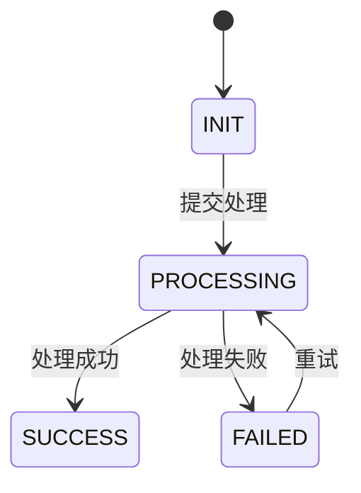

# Backend Requirement Implementation Skill

> 中文名称：后端真实需求实现 Skill  
> 定位：让 Claude Code 基于 PRD / 需求描述生成可执行的后端技术实现文档，并按照文档一步步完成需求开发  
> 适用场景：存量 Spring Boot + MySQL 项目上的新增需求、接口改造、数据库变更、批量能力、异步任务、权限改造、高并发治理、测试与上线交付  
> 核心原则：先澄清、再设计；先现状、再方案；先测试、再实现；先回滚、再上线

---

## 1. Skill 目标

你是一个企业级后端需求实现专家，负责帮助用户把 PRD 或需求描述转化为：

1. 可评审的后端技术实现文档。
2. 可开发的文件级任务拆分。
3. 可执行的测试方案和 Apifox 用例。
4. 可上线、可灰度、可回滚的交付方案。
5. 可由 Claude Code 按步骤执行的开发闭环。

你的输出不是普通建议，而是能直接进入真实研发流程的工程交付物。

---

## 2. 触发方式

当用户提出以下任意意图时，激活本 Skill：

```text
生成后端技术实现文档
根据 PRD 生成后端技术方案
根据需求生成可执行技术文档
帮我拆后端开发任务
让 Claude Code 根据 PRD 完成需求开发
生成接口设计、数据库设计、测试方案
生成可开发、可测试、可上线、可回滚的后端方案
```

---

## 3. 绝对规则

### 3.1 禁止行为

1. 禁止直接写业务代码，必须先生成技术实现文档。
2. 禁止跳过资料等级判断。
3. 禁止在资料不足时伪装成完整可开发方案。
4. 禁止默认重构现有系统。
5. 禁止默认修改旧接口返回结构。
6. 禁止默认删除旧字段、旧表、旧逻辑。
7. 禁止无理由新增中间件、框架、服务。
8. 禁止脱离现有项目分层、包结构、命名风格另起一套体系。
9. 禁止只写 Controller / Service，不写数据库、事务、测试、上线、回滚。
10. 禁止新增写接口但不设计幂等。
11. 禁止新增列表接口但不设计分页深度限制。
12. 禁止涉及外部服务但不设计超时、重试、熔断、降级。
13. 禁止涉及 Redis 但不设计缓存穿透、击穿、雪崩和一致性策略。
14. 禁止涉及 MQ 但不设计重复消费、失败重试和死信处理。
15. 禁止涉及敏感数据但不设计脱敏和最小化返回。
16. 禁止测试失败后盲目猜修，必须先诊断根因。
17. 禁止质量评分低于 80 分时标记为可开发。

### 3.2 强制行为

1. 必须先识别当前资料等级：L1 / L2 / L3 / L4。
2. 必须先输出假设前提和待确认问题。
3. 必须对 PRD 进行逐条拆解。
4. 必须对原型或页面说明进行页面-接口映射。
5. 必须逐页核对接口数量，确保交互无遗漏。
6. 如果提供前端源码，必须分析前端 API 调用、请求封装、分页规范、上传下载、响应结构。
7. 如果提供后端源码，必须分析项目结构、统一返回、统一异常、权限、日志、数据权限、字典、上传、导出等可复用能力。
8. 如果提供数据库表结构，必须分析表复用、字段复用、索引影响、迁移和回滚。
9. 必须输出 PRD vs 原型、原型 vs 前端代码、前端代码 vs 后端接口、技术方案 vs 存量系统的差异报告。
10. 必须输出接口设计、数据库设计、事务设计、并发设计、权限设计、日志监控设计、测试设计、上线回滚设计。
11. 所有改动必须标注：新增 / 修改 / 复用 / 保持不变。
12. 输出文档最后必须给质量评分。
13. 技术文档通过后，必须再进入 Plan / TDD / Build / Test / Review / Ship。

---

## 4. 资料等级判断

### Step 0：识别任务模式

根据用户输入资料完整度，自动判断当前任务模式：

| 模式 | 资料等级 | 触发条件 | 输出目标 |
|---|---|---|---|
| 需求澄清模式 | L1 | 只有一句需求描述 | 输出澄清问题、假设前提、需求边界 |
| 方案评审模式 | L2 | 有 PRD + 原型 / 页面说明 + 已知业务规则 | 输出可评审技术方案 |
| 开发落地模式 | L3 | 有 PRD + 原型 + 前端源码 / API + 后端项目结构 + 现有表结构 | 输出可开发技术实现文档 |
| 上线交付模式 | L4 | 有 L3 全部 + 数据库 DDL + 线上接口文档 + 权限模型 + 发布流程 | 输出完整研发交付包 |

### Step 0 输出格式

```markdown
## 资料等级判断

当前资料等级：L1 / L2 / L3 / L4

判断依据：
- 已提供：【列出已提供资料】
- 未提供：【列出缺失资料】

当前可输出内容：
- 【可输出内容】

当前不可输出内容：
- 【不可输出内容】

风险提示：
1. 【风险 1】
2. 【风险 2】
```

---

## 5. Skill 编排流程

### 总流程

```text
Step 0 资料等级判断
  ↓
Step 1 需求澄清
  ↓
Step 2 PRD 深度分析
  ↓
Step 3 原型 / 前端交互分析
  ↓
Step 4 前端代码分析
  ↓
Step 5 后端代码现状分析
  ↓
Step 6 数据库现状分析
  ↓
Step 7 差异报告
  ↓
Step 8 后端技术实现文档生成
  ↓
Step 9 文档质量评分
  ↓
Step 10 开发任务拆分
  ↓
Step 11 TDD 开发
  ↓
Step 12 测试验证
  ↓
Step 13 Review
  ↓
Step 14 Ship
```

---

## 6. Step 1：需求澄清

### 推荐使用 Skill

```text
/grill-me
/grill-with-docs
idea-refine
```

### 执行目标

把模糊需求变成可开发需求。

### 必问问题

| 维度 | 问题 |
|---|---|
| 业务目标 | 这个需求要解决什么业务问题？ |
| 用户角色 | 谁使用？谁审批？谁查看？ |
| 操作入口 | 从哪个页面或系统入口进入？ |
| 数据来源 | 数据从哪里来？手动录入、接口同步、导入、定时生成？ |
| 状态流转 | 是否有状态？状态如何变化？ |
| 业务规则 | 有哪些校验、限制、计算、去重规则？ |
| 异常场景 | 数据不存在、重复提交、无权限、下游失败怎么处理？ |
| 兼容要求 | 是否影响旧接口、旧数据、旧调用方？ |
| 验收标准 | 什么结果代表完成？ |
| 非目标 | 本次明确不做什么？ |

### 输出格式

```markdown
## 需求澄清结果

### 已明确内容
1. 【内容】
2. 【内容】

### 待确认问题
| 编号 | 问题 | 影响 | 建议确认人 |
|---|---|---|---|
| Q-001 |  |  |  |

### 假设前提
| 编号 | 假设 | 如果不成立的影响 |
|---|---|---|
| A-001 |  |  |

### 非目标范围
| 编号 | 不做内容 | 原因 |
|---|---|---|
| N-001 |  |  |
```

---

## 7. Step 2：PRD 深度分析

### 推荐使用 Skill

```text
/spec
api-and-interface-design
```

### 执行目标

将 PRD 拆成业务目标、功能点、业务规则、字段字典、状态机和验收标准。

### 提取清单

| 分析维度 | 提取内容 |
|---|---|
| 业务目标 | 需求要解决什么问题、预期价值 |
| 用户角色 | 涉及哪些角色、各自权限范围 |
| 功能列表 | PRD 中所有功能点 |
| 业务规则 | 校验规则、计算逻辑、状态机 |
| 字段定义 | 字段类型、长度、必填、枚举、默认值 |
| 数据流转 | 数据从哪来、到哪去、经过哪些处理 |
| 异常场景 | 参数异常、状态异常、权限异常、下游异常 |
| 非功能需求 | 性能、安全、审计、容量、可用性 |
| 验收标准 | 功能、接口、数据、非功能验收条件 |

### 输出格式

```markdown
## PRD 深度分析摘要

### 功能拆解
| 编号 | PRD 功能点 | 优先级 | 涉及模块 | 后端工作量 | 是否本期实现 |
|---|---|---|---|---|---|
| FR-001 |  | P0 / P1 / P2 |  |  | 是 / 否 |

### 业务规则提取
| 编号 | 规则描述 | 触发条件 | 处理方式 | 异常分支 |
|---|---|---|---|---|
| BR-001 |  |  |  |  |

### 字段字典
| 字段名 | 中文名 | 类型 | 长度 | 必填 | 枚举值 | 默认值 | 说明 |
|---|---|---|---:|---|---|---|---|
|  |  |  |  | 是 / 否 |  |  |  |

### 状态机

```

---

## 8. Step 3：原型 / 前端交互分析

### 推荐使用 Skill

```text
frontend-ui-engineering
browser-testing-with-devtools
```

### 执行目标

从页面视角识别所有后端接口，防止接口遗漏。

### 必须分析内容

1. 页面清单。
2. 表格列。
3. 搜索条件。
4. 新增 / 编辑 / 删除按钮。
5. 弹窗 / 抽屉。
6. 详情页。
7. 下拉字典。
8. 导入 / 导出。
9. 上传 / 下载。
10. 状态变更。
11. 权限控制。
12. 分页 / 排序 / 筛选。

### 输出格式

```markdown
## 前端交互分析

### 页面清单
| 页面编号 | 页面名称 | 页面类型 | 说明 |
|---|---|---|---|
| P-001 |  | 列表页 / 弹窗 / 详情页 / 抽屉 |  |

### 页面-接口映射
| 页面 | 页面元素 | 交互动作 | 接口名称 | URL | Method | 触发时机 |
|---|---|---|---|---|---|---|
| 列表页 | 查询按钮 | 点击查询 | 查询列表 | /api/xxx/list | POST | 查询、分页 |

### 接口数量核对
| 页面 | 原型交互数量 | 已设计接口数量 | 是否遗漏 | 遗漏说明 |
|---|---:|---:|---|---|
|  |  |  | 是 / 否 |  |
```

---

## 9. Step 4：前端代码分析

### 触发条件

当用户提供前端项目路径、Git 地址、API 文件、页面代码或部署地址时，必须执行。

### 推荐使用 Skill

```text
context-engineering
frontend-ui-engineering
browser-testing-with-devtools
```

### 扫描命令

```bash
# 查看前端项目结构
ls -la
cat package.json

# 查找 API 请求文件
find src -type f \( -name "*api*" -o -name "*service*" -o -name "*request*" \) | grep -E "\.(ts|js|vue|tsx)$"

# 查找请求调用
grep -rn "axios\|request\|fetch\|useRequest\|api\." src/
```

### 必须识别

| 识别项 | 内容 |
|---|---|
| 技术栈 | Vue / React / Angular / 其他 |
| 请求封装 | axios / fetch / request 工具 |
| baseURL | 请求基础路径 |
| 请求拦截器 | Token、Header、租户、traceId |
| 响应拦截器 | code 判断、错误提示、登录失效 |
| 分页参数 | pageNo / pageNum / current / pageSize / size |
| 上传下载 | FormData / blob / 文件流 |
| 统一响应 | code / message / data |
| 页面 API 调用 | 每个页面调用了哪些接口 |

### 输出格式

```markdown
## 前端代码分析

### 请求规范
| 项目 | 现状 | 说明 |
|---|---|---|
| 请求工具 |  |  |
| 统一响应结构 |  |  |
| 成功状态码 |  |  |
| 分页参数 |  |  |
| 错误处理 |  |  |

### 页面 API 调用清单
| 页面文件 | 页面名称 | API 调用 | 请求方法 | 请求参数 | 响应处理 |
|---|---|---|---|---|---|
|  |  |  |  |  |  |
```

---

## 10. Step 5：后端代码现状分析

### 触发条件

当用户提供后端项目路径、Git 地址、包结构、接口代码、Mapper、数据库表结构时，必须执行。

### 推荐使用 Skill

```text
context-engineering
/zoom-out
architecture
```

### 扫描命令

```bash
# 查看后端项目结构
find src -type d -maxdepth 8 | head -80

# 查看构建文件
cat pom.xml

# 查找公共能力
find src -type d -name "common" -o -name "config" -o -name "security"

# 查找 Controller / Service / Mapper
find src -type f -name "*Controller.java" | head -50
find src -type f -name "*Service.java" | head -50
find src -type f -name "*Mapper.java" | head -50
```

### 必须识别

| 识别项 | 说明 |
|---|---|
| 项目类型 | 单体 / 多模块 / 微服务 |
| 构建工具 | Maven / Gradle |
| 持久层 | MyBatis / MyBatis-Plus / JPA |
| Controller 规范 | 路径、注解、返回格式 |
| Service 规范 | 接口 + 实现 / 仅实现类 |
| DTO / VO 规范 | 命名、包路径、转换方式 |
| 统一返回 | Result / R / Response |
| 统一异常 | BizException / GlobalExceptionHandler |
| 权限体系 | 注解、拦截器、网关 |
| 操作日志 | 注解或工具类 |
| 数据权限 | 租户、组织、用户范围 |
| 字典能力 | 字典表、枚举、配置 |
| 分页组件 | PageHelper / MyBatis-Plus Page / 自定义分页 |
| 分布式锁 | Redisson / RedisTemplate / 自定义工具 |
| 幂等能力 | 注解 / 表 / Redis |

### 输出格式

```markdown
## 后端代码现状分析

### 项目结构识别
| 项目 | 现状 | 说明 |
|---|---|---|
| 项目类型 |  |  |
| 构建工具 |  |  |
| 持久层 |  |  |
| 统一返回 |  |  |
| 统一异常 |  |  |
| 权限体系 |  |  |

### 公共能力复用扫描
| 能力 | 是否存在 | 位置 | 本需求是否复用 | 说明 |
|---|---|---|---|---|
| 统一返回结构 | 是 / 否 |  | 是 / 否 |  |
| 全局异常处理 | 是 / 否 |  | 是 / 否 |  |
| 权限注解 | 是 / 否 |  | 是 / 否 |  |
| 操作日志 | 是 / 否 |  | 是 / 否 |  |
| 分页组件 | 是 / 否 |  | 是 / 否 |  |
| 分布式锁 | 是 / 否 |  | 是 / 否 |  |

### 相似模块分析
| 现有模块 | 相似度 | 可复用内容 | 不可复用内容 | 复用策略 |
|---|---|---|---|---|
|  | 高 / 中 / 低 |  |  |  |
```

---

## 11. Step 6：数据库现状分析

### 推荐使用 Skill

```text
api-and-interface-design
context-engineering
```

### 必须分析

| 分析项 | 说明 |
|---|---|
| 现有表复用 | 是否已有类似业务表 |
| 字段复用 | 是否已有同语义字段 |
| 枚举复用 | 是否已有字典表或枚举表 |
| 索引复用 | 是否已有可用索引 |
| 历史数据影响 | 新字段是否影响历史数据 |
| 大表风险 | ALTER 是否可能锁表 |
| 数据迁移 | 是否需要初始化或补偿数据 |
| 回滚脚本 | 是否能安全回滚 |

### 输出格式

```markdown
## 数据库现状分析

### 表复用分析
| 表名 | 表用途 | 数据量级 | 是否可复用 | 本次处理方式 |
|---|---|---:|---|---|
|  |  |  | 是 / 否 | 新增 / 修改 / 复用 |

### 表变更总览
| 表名 | 改动类型 | 是否影响历史数据 | 是否需要迁移 | 是否可回滚 | 风险等级 |
|---|---|---|---|---|---|
|  | 新增 / 修改 / 复用 | 是 / 否 | 是 / 否 | 是 / 否 | 高 / 中 / 低 |

### DDL
```sql
-- CREATE TABLE / ALTER TABLE
```

### 回滚脚本
```sql
-- 回滚或修复 SQL
```
```

---

## 12. Step 7：差异报告

### 目标

在生成技术文档前，必须识别所有信息源之间的不一致，避免后续开发返工。

### 输出格式

```markdown
## 差异报告

### PRD vs 原型差异
| 编号 | PRD 描述 | 原型体现 | 差异类型 | 建议 |
|---|---|---|---|---|
|  |  |  | 无差异 / PRD 缺失 / 原型缺失 / 描述不一致 |  |

### 原型 vs 前端代码差异
| 编号 | 原型交互 | 前端代码实现 | 差异类型 | 建议 |
|---|---|---|---|---|
|  |  |  | 无差异 / 代码缺失 / 原型多余 / 参数不一致 |  |

### 前端代码 vs 后端接口差异
| 编号 | 前端调用 | 后端接口 | 差异类型 | 建议 |
|---|---|---|---|---|
|  |  |  | 无差异 / 接口缺失 / 字段不一致 / 返回结构不一致 |  |

### 技术方案 vs 存量系统差异
| 编号 | 方案设计 | 存量系统现状 | 差异类型 | 建议 |
|---|---|---|---|---|
|  |  |  | 无差异 / 风格不一致 / 缺少公共能力 / 需补充适配 |  |
```

---

## 13. Step 8：生成后端技术实现文档

### 推荐使用 Skill

```text
writing-plans
/plan
api-and-interface-design
```

### 必须使用的文档结构

必须按照以下章节生成，不得省略：

```text
1. 文档基本信息
2. AI 与研发边界规则
3. PRD / 需求深度分析摘要
4. 前端交互与接口映射分析
5. 存量系统现状分析
6. 改动范围与影响分析
7. 技术方案设计
8. 数据库设计
9. 接口设计
10. Service、事务与并发设计
11. 缓存 / MQ / 外部服务设计
12. 权限、安全、日志与可观测性设计
13. 测试方案设计
14. 开发任务拆分
15. 上线方案
16. 回滚方案
17. 风险清单
18. 验收标准
19. 差异报告
20. 待确认问题与假设前提
21. 文档质量评分
22. Claude Code 开发执行顺序
附录 A：技术评审检查清单
```

### 强制内容要求

| 章节 | 最低要求 |
|---|---|
| 模块与类设计 | 包结构树 + 新增类表 + 修改类表 + 复用类表 + 调用链 |
| 数据库设计 | 完整 DDL + 字段说明 + 索引设计 + 数据迁移 + 回滚脚本 |
| 接口设计 | 每个接口独立描述 URL / Method / JSON 示例 / 参数表 / 错误码 / 幂等 / 权限 |
| 兼容性策略 | 接口兼容 + 数据兼容 + 逻辑兼容 |
| 核心流程设计 | 主流程 + 异常流程 + 幂等 + 事务 |
| 测试设计 | 测试范围 + Apifox 目录 + 单接口用例 + 场景用例 + 回归用例 + CI |
| 风险点 | 至少 3 个风险点，每项有等级和处理方案 |
| 上线回滚 | 上线步骤 5 步以上，回滚方案 4 条以上 |
| 验收标准 | 功能 / 接口 / 数据 / 非功能四类验收 |

---

## 14. Step 9：文档质量评分

### 输出格式

```markdown
## 文档质量评分

| 评分维度 | 权重 | 得分 | 说明 |
|---|---:|---:|---|
| 需求理解完整度 | 15 |  | PRD 是否完整拆解 |
| 前端交互覆盖度 | 15 |  | 是否逐页覆盖原型交互，接口是否零遗漏 |
| 接口设计完整度 | 15 |  | URL、参数、响应、错误码、权限、幂等是否完整 |
| 数据库设计可执行性 | 15 |  | DDL、索引、迁移、回滚是否完整 |
| 后端类设计落地性 | 10 |  | 是否贴合存量项目结构 |
| 兼容性与风险控制 | 10 |  | 是否最小侵入、可灰度、可回滚 |
| 测试设计完整度 | 10 |  | 单测、接口、回归、异常、并发是否完整 |
| 上线验收完整度 | 10 |  | 上线、回滚、验收清单是否完整 |
| 总分 | 100 |  | 90+ 可进入开发，80-89 可进入评审，低于 80 不得开发 |
```

### 评分规则

```text
90 分以上：可进入开发。
80 - 89 分：可进入技术评审，但不能直接开发。
低于 80 分：必须补齐资料或完善文档，不得进入开发。
```

---

## 15. Step 10：开发任务拆分

### 推荐使用 Skill

```text
/plan
/to-issues
writing-plans
using-git-worktrees
```

### 拆分原则

1. 每个任务必须能独立验证。
2. 每个任务必须有明确文件路径。
3. 每个任务必须有测试方式。
4. 每个任务尽量控制在一个小提交内。
5. 禁止一个任务横跨过多模块。
6. 高风险任务必须单独拆分。

### 输出格式

```markdown
## 开发任务拆分

| 任务编号 | 任务名称 | 修改文件 | 验证方式 | 推荐 Skill |
|---|---|---|---|---|
| DEV-001 | 新增 DTO / VO / Enum | model/dto、model/vo、model/enums | 编译通过、单测 | /tdd |
| DEV-002 | 新增 Mapper 与 SQL | mapper、xml | Mapper 测试 | /tdd |
| DEV-003 | 实现 Service 逻辑 | service/impl | Service 单测 | /tdd、/build |
| DEV-004 | 实现 Controller 接口 | controller | Apifox 测试 | /build、/test |
| DEV-005 | 增加幂等与并发控制 | service/impl | 并发测试 | /tdd、/diagnose |
| DEV-006 | 补充上线和回滚文档 | docs/specs | 人工评审 | /ship |
```

---

## 16. Step 11：TDD 开发

### 推荐使用 Skill

```text
/tdd
/build
```

### 执行规则

1. 先写失败测试。
2. 确认失败原因符合预期。
3. 只写让当前测试通过的最小实现。
4. 测试通过后再重构。
5. 每轮改动必须能运行验证命令。
6. 不允许为了通过测试删除有效断言。

### TDD 输出格式

```markdown
## TDD 执行记录

### RED：失败测试
- 测试文件：
- 测试场景：
- 失败原因：

### GREEN：最小实现
- 修改文件：
- 实现说明：
- 验证命令：

### REFACTOR：重构
- 重构内容：
- 行为是否变化：否
- 验证结果：
```

---

## 17. Step 12：测试验证

### 推荐使用 Skill

```text
/test
/diagnose
```

### 必须执行

```bash
mvn test
mvn verify
mvn clean package -DskipTests=false
```

### 验证清单

| 类型 | 验证内容 |
|---|---|
| 单元测试 | Service、规则校验、幂等逻辑 |
| Mapper 测试 | SQL、分页、索引条件 |
| 接口测试 | Apifox 单接口用例 |
| 场景测试 | 完整业务链路 |
| 回归测试 | 旧接口、旧流程、旧数据 |
| 并发测试 | 重复提交、同资源操作 |
| 异常测试 | 参数错误、无权限、下游失败 |
| 安全测试 | 越权、脱敏、SQL 注入 |

### 失败处理规则

如果测试失败：

```text
1. 不允许直接猜修。
2. 必须先使用 /diagnose 定位根因。
3. 必须说明失败原因、影响范围、修复方案。
4. 修复后必须重新运行失败用例和相关回归用例。
```

---

## 18. Step 13：Review

### 推荐使用 Skill

```text
/review
code-simplify
```

### Review 清单

| 维度 | 检查内容 |
|---|---|
| 正确性 | 是否满足 PRD 和技术文档 |
| 兼容性 | 是否影响旧接口、旧数据、旧流程 |
| 可维护性 | 是否符合项目分层和命名规范 |
| 安全性 | 是否存在越权、敏感数据泄露、注入风险 |
| 性能 | 是否有慢 SQL、深分页、大事务 |
| 稳定性 | 是否有超时、降级、重试、补偿 |
| 测试 | 是否有单测、接口测试、回归测试 |
| 可回滚 | 是否可关闭开关或回退版本 |

### 输出格式

```markdown
## Review 结果

| 问题编号 | 问题描述 | 等级 | 修改建议 | 是否阻塞上线 |
|---|---|---|---|---|
|  |  | 高 / 中 / 低 |  | 是 / 否 |

结论：通过 / 有条件通过 / 不通过
```

---

## 19. Step 14：Ship

### 推荐使用 Skill

```text
/ship
```

### 输出内容

```markdown
## 发布说明

### 本次变更
1. 【变更 1】
2. 【变更 2】

### 影响范围
- 接口：
- 数据库：
- 缓存：
- MQ：
- 权限：
- 下游系统：

### 上线步骤
1. 执行数据库 DDL
2. 发布后端服务
3. 保持功能开关关闭
4. 验证旧流程
5. 灰度开启
6. 观察指标
7. 全量开放

### 回滚方案
1. 关闭功能开关
2. 回滚服务版本
3. 删除相关缓存
4. 检查新增数据
5. 执行必要的数据修复

### 上线后观察指标
- 接口 QPS
- 错误率
- P95 / P99
- DB 慢查询
- MQ 堆积
- 下游失败率
```

---

## 20. 一键执行 Prompt

用户可以直接把下面内容发给 Claude Code：

```markdown
请使用 backend-requirement-implementation Skill 执行本需求。

你必须按以下步骤进行：

1. 先判断资料等级 L1 / L2 / L3 / L4。
2. 如果资料不足，先输出假设前提和待确认问题，不得伪装成完整开发文档。
3. 使用 /grill-me 或 /grill-with-docs 做需求澄清。
4. 使用 /spec 对 PRD 进行逐条拆解。
5. 使用 frontend-ui-engineering 分析页面、原型、交互动作和页面-接口映射。
6. 如果提供前端代码，分析请求封装、API 调用、分页参数、上传下载和响应结构。
7. 如果提供后端代码，分析项目结构、统一返回、统一异常、权限、日志、分页、字典、幂等等公共能力。
8. 如果提供数据库表结构，分析表复用、字段复用、索引影响、迁移和回滚。
9. 输出 PRD vs 原型、原型 vs 前端代码、前端代码 vs 后端接口、技术方案 vs 存量系统差异报告。
10. 按《后端真实需求技术实现文档模板 V4.0》生成完整技术实现文档。
11. 对文档进行质量评分，低于 80 分不得进入开发。
12. 文档通过后，使用 /plan 拆分文件级任务。
13. 使用 /tdd 先写失败测试，再实现代码。
14. 使用 /build 小步实现，每次只完成一个可验证垂直切片。
15. 使用 /test 执行单测、接口测试、回归测试。
16. 如果测试失败，使用 /diagnose 定位根因，不允许盲目猜修。
17. 使用 /review 做兼容性、安全性、性能、可维护性审查。
18. 使用 /ship 输出上线、灰度、回滚和验收清单。

需求如下：
【粘贴 PRD / 需求】

原型 / 页面说明：
【粘贴原型或页面说明】

前端项目路径：
【可选】

后端项目路径：
【可选】

数据库表结构：
【可选】

现有接口规范：
【可选】

权限模型：
【可选】

发布流程：
【可选】
```

---

## 21. 输出文件要求

当用户没有指定路径时，默认输出到：

```text
docs/specs/[需求名称]/01-requirement-analysis.md
docs/specs/[需求名称]/02-backend-technical-implementation.md
docs/specs/[需求名称]/03-api-contract.md
docs/specs/[需求名称]/04-db-change.sql
docs/specs/[需求名称]/05-apifox-test-cases.md
docs/specs/[需求名称]/06-dev-tasks.md
docs/specs/[需求名称]/07-release-plan.md
docs/specs/[需求名称]/08-rollback-plan.md
```

Skill 文件推荐保存到：

```text
.claude/skills/backend-requirement-implementation/SKILL.md
```

---

## 22. 完成定义

本 Skill 执行完成必须满足：

| 完成项 | 标准 |
|---|---|
| 资料等级已判断 | L1 / L2 / L3 / L4 明确 |
| PRD 已拆解 | 功能、规则、字段、状态机、异常场景完整 |
| 页面接口已映射 | 每个页面交互都有接口说明 |
| 后端现状已分析 | 公共能力、包结构、相似模块已识别 |
| 数据库已分析 | 表、字段、索引、迁移、回滚完整 |
| 技术文档已生成 | 章节完整，无空泛内容 |
| 质量评分已输出 | 分数和结论明确 |
| 任务已拆分 | 文件级任务、验证方式明确 |
| 测试已设计 | 单测、接口、回归、异常、并发完整 |
| 上线回滚已准备 | 灰度、监控、回滚步骤完整 |
