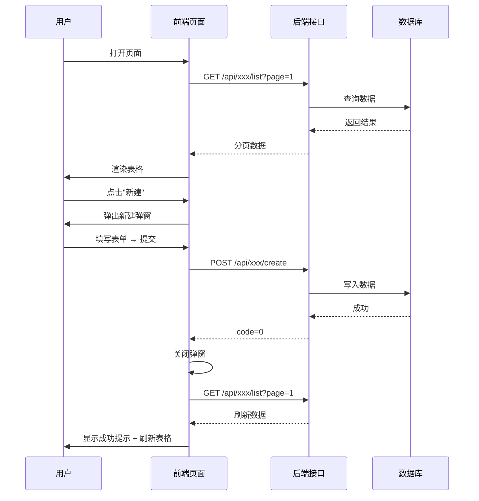

# Enterprise Requirement Implementation Skill

> 🎯 企业级真实需求开发落地 Skill
> 📌 定位:基于 PRD、原型、前端代码、后端代码、数据库现状和企业研发规范,生成可评审、可开发、可测试、可上线、可回滚的真实需求技术实施文档
> 📌 核心原则:最小侵入 · 兼容优先 · 复用优先 · 可灰度 · 可回滚
> 🔗 全链路视角:PRD 深度分析 · 前端交互 · 原型驱动 · 前后端协同 · 质量评分

> **核心价值**:不是单纯"写文档",而是解决真实研发中的 6 个问题:
> 1. 需求理解不一致
> 2. 原型交互遗漏接口
> 3. 前后端字段不一致
> 4. 技术方案脱离存量系统
> 5. 测试用例覆盖不完整
> 6. 上线回滚没有准备

---

## 触发方式

当用户提出以下意图时激活此 skill:

- "生成 [需求名称] 后端技术实现文档"
- "帮我写一个技术设计文档"
- "输出技术方案"
- "生成后端实现方案"
- "生成 [需求名称] 企业级技术实现文档"

---

## 执行步骤

### Step 0: 识别任务模式(强制)

根据用户输入资料完整度,自动判断当前任务模式:

| 模式 | 资料等级 | 触发条件 | 输出目标 |
|------|----------|----------|----------|
| 需求澄清模式 | L1 | 只有一句需求描述 | 输出问题清单和假设前提 |
| 方案评审模式 | L2 | 有 PRD + 原型/页面说明 + 已知业务规则 | 输出可评审技术方案 |
| 开发落地模式 | L3 | 有 PRD + 原型 + 前端源码/API + 后端项目结构 + 现有表结构 | 输出可开发文档 |
| 上线交付模式 | L4 | 有 L3 全部 + 数据库DDL + 线上接口文档 + 权限模型 + 发布流程 | 输出完整研发交付包 |

> 🔴 **如果资料不足,不允许伪装成完整开发文档,必须在文档中标注当前资料等级与风险。**

### Step 1: 收集需求信息

向用户确认以下信息(如用户已提供则跳过):

| 信息项 | 说明 | 是否必须 | 对应等级 |
|--------|------|----------|----------|
| 需求名称 | 本次需求名称 | ✅ 必须 | L1+ |
| 所属系统 | 目标系统名称 | ✅ 必须 | L1+ |
| PRD 文档 | 产品需求文档(含业务规则、字段定义、状态流转) | ✅ 必须 | L2+ |
| 原型图 | 前端原型/线框图/交互稿(Axure/Figma/墨刀等) | ✅ 必须 | L2+ |
| 前端源码地址 | 前端项目 Git 地址或本地路径 | ⚠️ 强烈建议 | L3+ |
| 前端部署地址 | 前端运行 URL(用于查看实际效果) | ⚠️ 强烈建议 | L3+ |
| 后端项目路径 | 后端项目本地路径 | ⚠️ 强烈建议 | L3+ |
| 现有数据库表结构 | 现有表 DDL 或表结构说明 | ⚠️ 强烈建议 | L3+ |
| 现有接口规范 | 统一返回结构、错误码、分页规范等 | ⚠️ 建议 | L3+ |
| 权限模型 | 权限编码规范、数据权限规则 | 可选 | L4 |
| 发布流程 | 上线流程、灰度策略、回滚规范 | 可选 | L4 |

> ⚠️ **如果用户只提供了部分资料,不要跳过,先基于已有资料生成,缺失部分在"假设前提"中标注。**

> 🔴 **如果用户提供了前端源码地址(或前端本地运行 URL)+ 原型图,必须执行 Step 3.5 前端代码深度分析,确保接口描述与实际前端代码 100% 对齐。**

### Step 2: PRD 深度分析(强制)

> 📋 **在生成文档前,必须先对 PRD 进行逐条拆解分析,不得跳过**

#### 2.1 PRD 信息提取清单

| 分析维度 | 提取内容 | 输出位置 |
|----------|----------|----------|
| 业务目标 | 需求要解决什么问题、预期价值 | 文档第 3 章 |
| 用户角色 | 涉及哪些角色、各自的权限范围 | 文档第 3 章 |
| 功能列表 | 逐条拆解 PRD 中的功能点 | 文档第 3 章 |
| 业务规则 | 校验规则、计算逻辑、状态机 | 文档第 6/8 章 |
| 字段定义 | 每个字段的类型、长度、必填、枚举值 | 文档第 6 章 |
| 数据流转 | 数据从哪来、到哪去、中间经过哪些环节 | 文档第 6/8 章 |
| 异常场景 | PRD 中提到的异常分支 | 文档第 8 章 |
| 非功能需求 | 性能、安全、审计等要求 | 文档第 6.6 章 |

#### 2.2 PRD 分析输出模板

> **在文档开头(第 2 章之前)插入 PRD 分析摘要:**

```markdown
## 1.5 PRD 深度分析摘要

### 功能拆解

| # | PRD 功能点 | 优先级 | 涉及模块 | 后端工作量 | 前端工作量 |
|---|-----------|:------:|----------|:----------:|:----------:|
| 1 | [功能描述] | P0 | [模块] | [人日] | [人日] |
| 2 | [功能描述] | P1 | [模块] | [人日] | [人日] |

### 业务规则提取

| # | 规则描述 | 触发条件 | 处理方式 | 异常分支 |
|---|---------|---------|---------|---------|
| 1 | [规则] | [条件] | [处理] | [异常] |

### 状态机分析

> [如有状态流转,绘制状态机图]

### 字段字典

| 字段名 | 类型 | 长度 | 必填 | 枚举值 | 默认值 | 说明 |
|--------|------|------|:----:|--------|--------|------|
| [字段] | [类型] | [长度] | 是/否 | [枚举] | [默认] | [说明] |
```

### Step 3: 前端交互分析(强制)

> 🖥️ **必须基于原型图分析前端页面交互,明确前后端边界**

#### 3.1 页面交互分析清单

| 分析维度 | 提取内容 | 输出位置 |
|----------|----------|----------|
| 页面清单 | 原型中包含哪些页面/弹窗/抽屉 | 文档第 6.5 章 |
| 页面元素 | 每个页面的表单、表格、按钮、筛选条件 | 文档第 6.5 章 |
| 交互动作 | 点击、提交、刷新、分页、导出等操作 | 文档第 6.5 章 |
| 数据加载 | 页面初始化加载哪些数据、懒加载策略 | 文档第 6.5 章 |
| 表单校验 | 前端校验规则(必填、格式、联动) | 文档第 6.5 章 |
| 数据展示 | 表格列、排序、筛选、分页方式 | 文档第 6.5 章 |
| 权限控制 | 哪些按钮/字段根据角色显示/隐藏 | 文档第 6.5 章 |

#### 3.2 页面-接口映射表

> **每个页面必须对应到具体的接口调用:**

```markdown
### 页面-接口映射

#### 页面 1:[页面名称]

| 页面元素 | 交互动作 | 调用接口 | 方法 | 触发时机 |
|----------|---------|---------|------|---------|
| [元素] | [动作] | [接口路径] | [GET/POST] | [时机] |
| 搜索框 | 输入回车 | /api/xxx/list | GET | 用户搜索 |
| 导出按钮 | 点击 | /api/xxx/export | GET | 用户点击 |

#### 页面 2:[页面名称]
...
```

#### 3.3 接口数量核对(🔴 强制)

> ⚠️ **这是最关键的一步:必须逐页对照原型,确保原型上每一个交互动作都有对应的接口,一个都不能漏。**

**核对方法:**

1. **打开原型图**,从第一个页面开始,逐个页面遍历
2. **对每个页面**,列出所有需要后端支持的交互动作:
   - 页面打开时加载数据的 → 列表查询接口
   - 搜索/筛选 → 查询接口(确认是否需要独立接口或复用列表接口)
   - 新增/编辑/删除 → CRUD 接口
   - 弹窗/抽屉打开时加载下拉选项、字典数据 → 下拉数据接口
   - 导出 → 导出接口
   - 批量操作 → 批量接口
   - 详情页 → 详情查询接口
   - 状态变更(审核通过/拒绝等) → 状态更新接口
   - 文件上传 → 上传接口
   - 分页切换 → 列表查询接口(确认是否需要独立接口)

3. **统计每个页面的接口数量**,汇总到总表

**输出模板:**

```markdown
### 接口数量总览

| # | 页面名称 | 接口数量 | 接口列表 |
|---|---------|:--------:|----------|
| 1 | 列表页 | 4 | 列表查询、详情查询、删除、导出 |
| 2 | 新增弹窗 | 2 | 新增、下拉数据 |
| 3 | 编辑弹窗 | 2 | 编辑、详情回显 |
| 4 | 详情页 | 3 | 详情查询、状态变更、操作日志 |
| **合计** | **4 个页面** | **11 个接口** | |
```

**核对清单:**

```markdown
### 逐页核对清单

#### 页面 1:列表页

| # | 原型交互 | 对应接口 | 是否已设计 | 备注 |
|---|---------|---------|:----------:|------|
| 1 | 页面加载数据 | GET /api/xxx/list | ✅ | |
| 2 | 搜索 | GET /api/xxx/list (参数扩展) | ✅ | 复用列表接口 |
| 3 | 导出 | GET /api/xxx/export | ✅ | |
| 4 | 删除 | DELETE /api/xxx/{id} | ✅ | |

#### 页面 2:新增弹窗

| # | 原型交互 | 对应接口 | 是否已设计 | 备注 |
|---|---------|---------|:----------:|------|
| 1 | 打开弹窗加载下拉 | GET /api/xxx/dict | ✅ | |
| 2 | 提交新增 | POST /api/xxx/create | ✅ | |

...

### 核对结论

> ✅ 原型共 4 个页面,共 11 个交互动作,已设计 11 个接口,**无遗漏**。
> 或
> ⚠️ 原型共 4 个页面,共 11 个交互动作,已设计 10 个接口,**遗漏 1 个**:[说明遗漏的接口]。
```

#### 3.4 前端交互流程图

> **对复杂交互场景,绘制前端与后端的交互时序:**

```markdown
### 交互时序图


```

### Step 3.5: 前端代码深度分析(🔴 提供源码地址时强制执行)

> 🖥️ **当用户提供前端源码地址 + 前端部署地址 + 原型图时,必须执行此步骤,确保接口描述与实际前端代码 100% 对齐**

#### 3.5.1 前端代码分析流程

**1. 读取前端项目结构**

```bash
# 进入前端项目目录
cd [前端项目路径]

# 查看项目结构
ls -la

# 查看 package.json 确认技术栈
cat package.json

# 查看 src 目录结构
find src -type f -name "*.vue" -o -name "*.ts" -o -name "*.tsx" -o -name "*.js" | head -50
```

**2. 定位 API 调用文件**

```bash
# 查找 API 请求相关文件
find src -type f \( -name "*api*" -o -name "*service*" -o -name "*request*" \) | grep -E "\.(ts|js|vue)$"

# 查看 API 基础配置
cat src/api/config.ts  # 或类似文件
cat src/utils/request.ts  # 或类似文件
```

**3. 分析现有接口规范**

| 分析项 | 提取内容 | 说明 |
|--------|----------|------|
| 基础 URL | baseURL / baseUrl | 前端请求的基础路径 |
| 请求拦截器 | interceptors.request | 统一添加的 headers、token |
| 响应拦截器 | interceptors.response | 统一处理逻辑(code 判断、错误提示) |
| 请求方法封装 | get/post/put/delete | 项目使用的 HTTP 客户端(axios/fetch) |
| 分页参数 | page/pageNum/currentPage | 分页参数的命名规范 |
| 分页大小 | pageSize/size/limit | 每页大小的参数名 |
| 返回数据结构 | { code, data, message } | 后端返回的统一结构 |
| 成功状态码 | code === 0 / code === 200 | 判断请求成功的状态码 |
| 文件上传 | FormData/multipart | 文件上传的实现方式 |
| 导出下载 | blob/download | 文件导出的实现方式 |

**4. 逐页分析接口调用**

```bash
# 对每个页面文件,查找其中的 API 调用
grep -rn "api\." src/views/  # Vue 项目
grep -rn "useRequest\|useSwr\|fetch\|axios" src/  # React 项目
```

**对每个页面提取:**

| 页面路径 | 页面名称 | API 调用 | 请求方法 | 请求参数 | 响应处理 |
|----------|----------|----------|----------|----------|----------|
| src/views/user/list.vue | 用户列表 | userApi.getList | GET | { page, size, keyword } | data.list, data.total |
| src/views/user/form.vue | 用户编辑 | userApi.save | POST | { id, name, phone } | 成功后返回列表页 |

**5. 交叉验证原型 vs 代码**

| 验证项 | 原型描述 | 代码实现 | 是否一致 | 备注 |
|--------|----------|----------|:--------:|------|
| 列表查询 | 分页 + 搜索 | GET /api/user/list?page=&size=&keyword= | ✅ | |
| 新增用户 | 弹窗表单 | POST /api/user/create | ✅ | |
| 导出 Excel | 导出按钮 | GET /api/user/export?keyword= | ✅ | blob 下载 |
| 批量删除 | 多选批量操作 | DELETE /api/user/batch | ⚠️ | 原型有但代码未实现 |

#### 3.5.2 接口描述输出规范

> **基于前端代码分析结果,生成精确的接口描述:**

```markdown
### 接口详细设计

#### 接口 1:用户列表查询

| 属性 | 值 |
|------|-----|
| 接口路径 | `GET /api/user/list` |
| 前端页面 | `src/views/user/list.vue` → 用户列表页 |
| 触发时机 | 页面加载、搜索、切换分页 |
| 请求参数 | ```json { "page": 1, "size": 20, "keyword": "张", "status": 1 } ``` |
| 响应结构 | ```json { "code": 0, "data": { "list": [...], "total": 100, "page": 1, "size": 20 }, "message": "success" } ``` |
| 分页规范 | 复用项目统一分页:page(当前页)+ size(每页条数) |
| 前端处理 | 将 data.list 渲染为表格,data.total 用于分页组件 |

#### 接口 2:新增用户

| 属性 | 值 |
|------|-----|
| 接口路径 | `POST /api/user/create` |
| 前端页面 | `src/views/user/form.vue` → 新增弹窗 |
| 触发时机 | 用户填写表单后点击"确定" |
| 请求参数 | ```json { "name": "张三", "phone": "13800138000", "email": "zhangsan@example.com", "deptId": 10 } ``` |
| 响应结构 | ```json { "code": 0, "data": { "id": 123 }, "message": "创建成功" } ``` |
| 前端处理 | 成功后关闭弹窗,刷新列表页,显示成功提示 |
| 表单校验 | 前端已校验:name 必填、phone 格式校验、email 格式校验 |
```

#### 3.5.3 接口差异报告

> **如果原型描述与前端代码实现存在差异,必须输出差异报告:**

```markdown
### 原型 vs 代码差异报告

| # | 页面 | 原型描述 | 代码实现 | 差异类型 | 建议 |
|---|------|----------|----------|----------|------|
| 1 | 用户列表 | 支持批量删除 | 代码中无批量删除接口 | 代码缺失 | 补充批量删除接口 |
| 2 | 用户详情 | 显示操作日志 | 代码中无日志查询 | 代码缺失 | 补充操作日志接口 |
| 3 | 用户编辑 | 支持修改密码 | 代码中无密码修改 | 原型多余 | 从原型中移除 |
```

#### 3.5.4 前端代码分析检查清单

> **完成前端代码分析后,逐项确认:**

- [ ] 已读取前端项目 package.json,确认技术栈(Vue/React/Angular)
- [ ] 已找到 API 请求配置文件,确认 baseURL 和请求拦截器
- [ ] 已找到响应拦截器,确认统一返回结构(code/data/message)
- [ ] 已逐页分析所有 API 调用,提取完整接口列表
- [ ] 已交叉验证原型 vs 代码,输出差异报告
- [ ] 已确认分页参数命名规范(page/pageNum/currentPage)
- [ ] 已确认分页大小参数名(pageSize/size/limit)
- [ ] 已确认文件上传/导出下载的实现方式
- [ ] 已确认接口描述与前端代码 100% 对齐

### Step 3.6:后端代码现状分析(提供后端项目路径时强制执行)

> 🏗️ **当用户提供后端项目路径时,必须执行后端代码现状分析,确保方案贴合存量项目实际**

#### 3.6.1 项目结构识别

执行命令扫描后端项目:

```bash
# 进入后端项目目录
cd [后端项目路径]

# 查看项目结构
find src -type d -maxdepth 8 | head -50

# 查看 pom.xml 或 build.gradle 确认构建工具和依赖
cat pom.xml  # 或 build.gradle

# 查看公共能力模块
find src -type d -name "common" -o -name "config" -o -name "security" | head -10
```

**必须识别:**

| 识别项 | 说明 |
|--------|------|
| 项目类型 | 单体 / 多模块 |
| 构建工具 | Maven / Gradle |
| 持久层 | MyBatis / MyBatis-Plus / JPA |
| Controller 规范 | 命名规范、注解风格 |
| Service 规范 | 接口+实现分离 / 仅实现类 |
| 对象模型 | Entity / DTO / VO / Query / Converter |
| 统一返回 | 是否存在统一返回结构 |
| 统一异常 | 是否存在全局异常处理 |
| 统一分页 | 分页参数和返回结构 |
| 权限体系 | 注解方式、权限编码规范 |
| 操作日志 | 是否存在 @Log 等注解 |
| 字典能力 | 是否存在字典表/枚举表 |
| 文件上传 | 是否存在上传能力 |
| 导出能力 | 是否存在导出能力 |
| 分布式锁 | 是否存在 Redis 锁工具 |
| 幂等能力 | 是否存在幂等工具 |
| 任务调度 | 是否存在定时任务框架 |

#### 3.6.2 复用能力扫描

| 能力 | 是否存在 | 位置 | 本需求是否复用 | 说明 |
|------|----------|------|----------------|------|
| 统一返回结构 | 待扫描 | 待填写 | ✅ 是 | 禁止新定义返回格式 |
| 统一异常处理 | 待扫描 | 待填写 | ✅ 是 | 复用全局异常处理 |
| 操作日志 | 待扫描 | 待填写 | 视需求 | 涉及新增/编辑/删除时优先复用 |
| 权限注解 | 待扫描 | 待填写 | ✅ 是 | 接口必须接入权限体系 |
| 数据权限 | 待扫描 | 待填写 | 视需求 | 涉及部门/用户范围时必须分析 |
| 字典能力 | 待扫描 | 待填写 | ✅ 是 | 枚举值优先复用字典表 |
| 文件上传 | 待扫描 | 待填写 | 视需求 | 上传/导入需求必须复用 |
| 导出能力 | 待扫描 | 待填写 | 视需求 | 导出需求必须复用 |
| 分页组件 | 待扫描 | 待填写 | ✅ 是 | 复用统一分页 |

#### 3.6.3 相似模块分析

查找存量项目中已有的相似模块,分析可复用内容:

| 现有模块 | 与本需求相似度 | 可复用内容 | 不可复用内容 | 说明 |
|----------|----------------|------------|--------------|------|
| 待分析 | 待评估 | 待识别 | 待识别 | |

#### 3.6.4 类设计约束

> **新增类必须符合存量项目命名和分层规范,禁止凭空引入全新架构风格。**

输出必须包含:
- 包结构树(与存量项目风格一致)
- 新增类清单(类名、类型、职责、对应接口)
- 修改类清单(类名、改动类型、改动内容、风险等级)
- 复用类清单(类名、复用方式)
- 调用链说明(Controller → Service → Manager → Mapper → DB)
- 类与接口映射
- 类与数据库表映射

### Step 3.7:数据库现状分析(提供数据库信息时强制执行)

> 🗄️ **当用户提供现有表结构或数据库说明时,必须进行数据库现状分析**

#### 3.7.1 现有表复用分析

| 分析项 | 说明 |
|--------|------|
| 现有表复用 | 是否已有类似业务表,能否复用 |
| 字段复用 | 是否已有同语义字段 |
| 枚举复用 | 是否已有字典表或枚举表 |
| 索引复用 | 是否已有可用索引 |
| 历史数据影响 | 新字段是否影响历史数据 |
| 大表风险 | ALTER 是否可能锁表 |
| 数据迁移 | 是否需要初始化或补偿数据 |
| 回滚脚本 | 是否能安全回滚 |

#### 3.7.2 输出要求

必须输出:
- 表变更总览表(表名、改动类型、影响历史数据、是否需要迁移、是否可回滚、风险等级)
- 新增表 DDL(完整 CREATE TABLE)
- 修改表 ALTER SQL(完整 ALTER TABLE)
- 字段说明表(字段名、类型、是否必填、默认值、说明)
- 索引说明表(索引名、字段、用途)
- 数据迁移脚本(如需)
- 回滚脚本(必须)
- 大表变更风险说明(如适用)

### Step 3.8:差异报告(强制)

> ⚠️ **必须输出以下差异报告,没有差异也要明确写"无差异"**

#### PRD vs 原型差异

| # | PRD 描述 | 原型体现 | 差异类型 | 建议 |
|---|----------|----------|----------|------|
| 待分析 | 待分析 | 待分析 | 待分析 | 待分析 |

#### 原型 vs 前端代码差异

| # | 原型交互 | 前端代码实现 | 差异类型 | 建议 |
|---|----------|--------------|----------|------|
| 待分析 | 待分析 | 待分析 | 待分析 | 待分析 |

#### 前端代码 vs 后端接口差异

| # | 前端调用 | 后端接口 | 差异类型 | 建议 |
|---|----------|----------|----------|------|
| 待分析 | 待分析 | 待分析 | 待分析 | 待分析 |

#### 技术方案 vs 存量系统差异

| # | 方案设计 | 存量系统现状 | 差异类型 | 建议 |
|---|----------|--------------|----------|------|
| 待分析 | 待分析 | 待分析 | 待分析 | 待分析 |

### Step 4: 读取文档模板

读取模板文件:

```bash
cat /Users/lizhenwei/docs/后端技术实现文档模板.md
```

> ⚠️ **模板是文档结构的唯一权威来源**。生成文档时必须严格按模板的章节编号(§1~§13 + 附录A/B)逐一输出,不得省略任何章节。

### Step 5: 生成文档

基于模板、PRD 分析和前端交互分析,生成完整的技术实现文档。

**🔴 强制章节完整性检查(生成后必须逐项确认):**

| 章节 | 标题 | 不得省略 |
|------|------|----------|
| §1 | 文档基本信息 | ✅ |
| §1.5 | PRD 深度分析摘要 | ✅ |
| §2 | AI 与研发边界规则 | ✅ |
| §3 | 需求目标 | ✅ |
| §4 | 现状分析 | ✅ |
| §5 | 改动范围与影响分析 | ✅ |
| **§6.3** | **模块与类设计** | ✅ **必须包含:包结构树 + 新增类表 + 现有类改动表 + 调用链说明** |
| **§6.4** | **数据库设计** | ✅ **必须包含:表改动总览 + 完整DDL + 字段说明 + 索引设计 + 数据迁移方案** |
| **§6.5** | **接口设计** | ✅ **必须包含:每个接口的URL/Method/JSON示例/参数表/错误码/幂等/权限** |
| §6.6 | 非功能设计 | ✅ |
| **§7** | **兼容性策略** | ✅ **必须包含:接口兼容 + 数据兼容 + 逻辑兼容** |
| **§8** | **核心流程设计** | ✅ **必须包含:主流程 + 异常流程 + 幂等设计 + 事务设计** |
| **§9** | **测试设计** | ✅ **必须包含:测试范围 + 测试分层 + Apifox目录 + 用例设计 + CI** |
| **§10** | **风险点与处理方案** | ✅ **必须包含:风险清单表(至少3项)** |
| **§11** | **上线与回滚方案** | ✅ **必须包含:上线步骤 + 回滚方案** |
| **§12** | **验收标准** | ✅ **必须包含:功能/接口/数据/非功能验收清单** |
| §13 | 假设前提 | ✅ |
| 附录A | 方案审查清单 | ✅ |

**🔴 关键章节最低内容要求(不得一句话带过):**

- **§6.3 模块与类设计**:包结构树(完整目录层级)+ 新增类表格(每类一行)+ 现有类改动表格 + 调用链说明
- **§6.4 数据库设计**:每个表的完整 DDL(CREATE/ALTER TABLE)+ 字段说明表 + 索引说明表 + 数据迁移方案
- **§6.5 接口设计**:每个接口独立描述(URL/Method/JSON请求示例/JSON响应示例/参数表/错误码/幂等/权限)
- **§7 兼容性策略**:接口兼容 + 数据兼容 + 逻辑兼容(各至少2-3条具体策略)
- **§8 核心流程设计**:主流程步骤 + 异常流程 + 幂等设计 + 事务设计表
- **§9 测试设计**:测试范围清单 + 测试分层表 + Apifox目录规划 + 单接口用例 + 场景用例 + CI自动化
- **§10 风险点**:至少 3 个风险点,每项含风险描述+等级+处理方案
- **§11 上线回滚**:上线步骤(5+步)+ 回滚方案(4+条)
- **§12 验收标准**:功能/接口/数据/非功能各 4 项验收清单

**必须遵守的规则:**

1. 所有改动必须明确标注为:**新增 / 修改 / 复用**
2. 数据库设计必须详细到表、字段、索引、DDL
3. 类设计必须详细到模块、类名、职责
4. 接口设计必须详细到 URL、方法、入参、出参、兼容性
5. **每个接口必须标注对应的前端页面和交互动作**
6. **必须包含页面-接口映射表**
7. **必须包含接口数量核对清单(逐页对照原型,确保无遗漏)**
8. **必须包含前端交互时序图(复杂场景)**
9. 必须先写"现状分析"和"影响范围分析",再给方案
10. 禁止擅自重构现有系统
11. 禁止引入不必要的新中间件/新框架
12. 若信息不足,做合理假设但必须单独列出"假设前提"
13. 输出必须务实、具体、可执行,不允许空泛
14. **🔴 不得省略模板中任何章节,每个章节必须有实质性内容**
15. **🔴 生成完成后,对照上方"强制章节完整性检查"表,确认所有章节已输出且内容充实**

### Step 6: 保存文档

将生成的文档保存到指定目录:

```
/Users/lizhenwei/docs/tech/[需求名称]-企业级技术实现文档.md
```

如用户指定了其他路径,按用户要求保存。

### Step 7: 输出审查清单

文档生成后,逐项完成附录 A 的审查清单,确保方案质量。

### Step 8: 质量评分(强制)

> 📊 **文档生成完成后,必须输出质量评分,评分低于 80 分不得标记为可开发文档**

## 文档质量评分

| 评分维度 | 权重 | 得分 | 说明 |
|----------|:----:|:----:|------|
| 需求理解完整度 | 15 | 待评分 | PRD 是否完整拆解,功能/规则/字段/状态机是否齐全 |
| 前端交互覆盖度 | 15 | 待评分 | 是否逐页覆盖原型交互,接口数量核对是否零遗漏 |
| 接口设计完整度 | 15 | 待评分 | 是否接口零遗漏,每个接口是否有完整描述 |
| 数据库设计可执行性 | 15 | 待评分 | DDL、索引、迁移、回滚是否完整 |
| 后端类设计落地性 | 10 | 待评分 | 是否贴合存量项目结构,是否复用公共能力 |
| 兼容性与风险控制 | 10 | 待评分 | 是否最小侵入、可灰度、可回滚 |
| 测试设计完整度 | 10 | 待评分 | 是否包含接口、场景、回归、权限测试 |
| 上线验收完整度 | 10 | 待评分 | 是否具备上线、回滚、验收清单 |
| **总分** | **100** | **待评分** | **90+ 可进入开发,80-89 可进入评审,<80 不得标记为可开发** |

---

## 模板文件位置

| 文件 | 路径 |
|------|------|
| 文档模板 | `/Users/lizhenwei/docs/后端技术实现文档模板.md` |
| 生成目录 | `/Users/lizhenwei/docs/tech/` |

---

## 输出要求

- 使用 Markdown 格式
- 所有表格必须完整填写
- 所有代码块必须语法高亮
- 流程图使用时序图（Mermaid）
- 数据库 DDL 必须可直接执行
- 接口示例必须是合法的 JSON
- **每个接口必须标注前端页面来源**
- **必须包含页面-接口映射表**
- **必须包含接口数量核对清单（逐页对照原型，零遗漏）**
- **必须标注资料等级（L1/L2/L3/L4）**
- **必须包含质量评分表，低于 80 分不得标记为可开发**
- **必须包含差异报告（PRD vs 原型、原型 vs 代码、代码 vs 接口、方案 vs 存量）**
- **必须包含后端现状分析（复用能力扫描、相似模块分析）**
- **必须包含数据库现状分析（表复用、字段复用、索引影响、回滚脚本）**

---

## 企业级真实开发强制规则

> 🔴 **以下规则在所有模式下生效,AI 不得违反**

1. 不允许只基于 PRD 直接生成最终开发文档,必须标注资料等级(L1/L2/L3/L4)。
2. 不允许跳过原型交互核对。
3. 不允许跳过页面-接口映射。
4. 不允许跳过接口数量核对。
5. 不允许只设计新增接口,必须识别可复用接口。
6. 不允许只写 DDL,必须包含字段说明、索引说明、迁移脚本、回滚脚本。
7. 不允许只写 Controller,必须包含完整调用链。
8. 不允许引入项目不存在的新框架、新中间件、新架构模式,除非明确说明原因和替代方案。
9. 不允许忽略权限、数据权限、操作日志、审计、异常码。
10. 不允许忽略测试、上线、回滚、验收。
11. 所有假设必须进入"假设前提"章节。
12. 所有不确定点必须进入"待确认问题"章节。
13. 所有风险必须进入"风险清单"章节。
14. 文档完成后必须输出质量评分。
15. 评分低于 80 分,不得标记为可开发文档。

---

## 快速 Prompt

当用户说"生成技术文档"时,可直接使用以下 Prompt:

```
你是一名企业级资深后端架构师、前端交互分析师、测试设计专家和研发交付负责人。

当前任务:基于存量 Spring Boot + MySQL 项目,为一个真实企业需求生成可评审、可开发、可测试、可上线、可回滚的技术实现文档。

请先读取模板:/Users/lizhenwei/docs/后端技术实现文档模板.md

你必须按照以下流程执行:

1. 识别输入资料完整度,判断当前属于 L1 / L2 / L3 / L4。如果资料不足,不得伪装成完整开发文档,必须明确假设前提和风险。
2. 对 PRD 进行逐条拆解,提取业务目标、用户角色、功能点、业务规则、字段定义、状态机、异常场景、非功能需求。
3. 基于原型图或页面说明,逐页分析页面、弹窗、抽屉、按钮、表单、表格、筛选、分页、导出、上传、状态变更等交互。
4. 输出页面-接口映射表。
5. 逐页统计接口数量,确保原型交互零遗漏。
6. 如果提供前端源码,必须分析 package.json、请求封装、API 文件、页面 API 调用、分页规范、上传下载、响应结构。
7. 如果提供后端源码,必须分析项目结构、统一返回、统一异常、权限、日志、数据权限、字典、上传、导出等可复用能力。
8. 如果提供数据库现状,必须分析已有表、字段、索引、字典、历史数据影响。
9. 必须输出 PRD vs 原型、原型 vs 前端代码、前端代码 vs 后端接口、技术方案 vs 存量系统的差异报告。
10. 必须先写现状分析和影响范围分析,再写技术方案。
11. 所有改动必须标注新增、修改、复用。
12. 接口设计必须包含 URL、Method、前端页面来源、触发动作、权限编码、请求参数、请求示例、响应示例、错误码、幂等、兼容策略。
13. 数据库设计必须包含完整 DDL、字段说明、索引设计、迁移脚本、回滚脚本。
14. 模块与类设计必须包含包结构树、新增类、修改类、复用类、调用链说明。
15. 必须包含权限、数据权限、日志、审计、埋点设计。
16. 必须包含测试设计、Apifox 目录、接口用例、场景用例、权限用例、回归用例、CI 建议。
17. 必须包含上线方案、回滚方案、验收标准、风险清单、待确认问题。
18. 文档最后必须输出质量评分,评分低于 80 分不得标记为可开发。
19. 输出必须务实、具体、可执行,不允许空泛。

🔴 强制章节:
- §6.3 模块与类设计:包结构树 + 新增类表 + 现有类改动表 + 调用链
- §6.4 数据库设计:完整 DDL + 字段说明 + 索引设计 + 数据迁移 + 回滚脚本
- §6.5 接口设计:每个接口必须有 URL/Method/JSON示例/参数表/错误码/幂等/权限
- §7 兼容性策略:接口/数据/逻辑三维度
- §8 核心流程设计:主流程 + 异常流程 + 幂等 + 事务
- §9 测试设计:测试分层 + Apifox目录 + 用例设计 + CI
- §10 风险点:至少 3 项
- §11 上线回滚:上线步骤 + 回滚方案
- §12 验收标准:功能/接口/数据/非功能清单
- 不得省略任何模板章节,每个章节必须有实质性内容

以下是 PRD 文档:
[粘贴 PRD]

以下是原型图:
[粘贴原型图链接或描述]

以下是前端源码地址(如有):
[粘贴路径]

以下是后端项目路径(如有):
[粘贴路径]

以下是数据库现状(如有):
[粘贴 DDL 或说明]

现有项目信息:
[粘贴项目上下文]

请开始输出。
```
