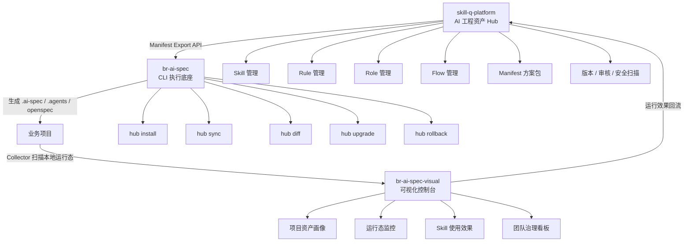
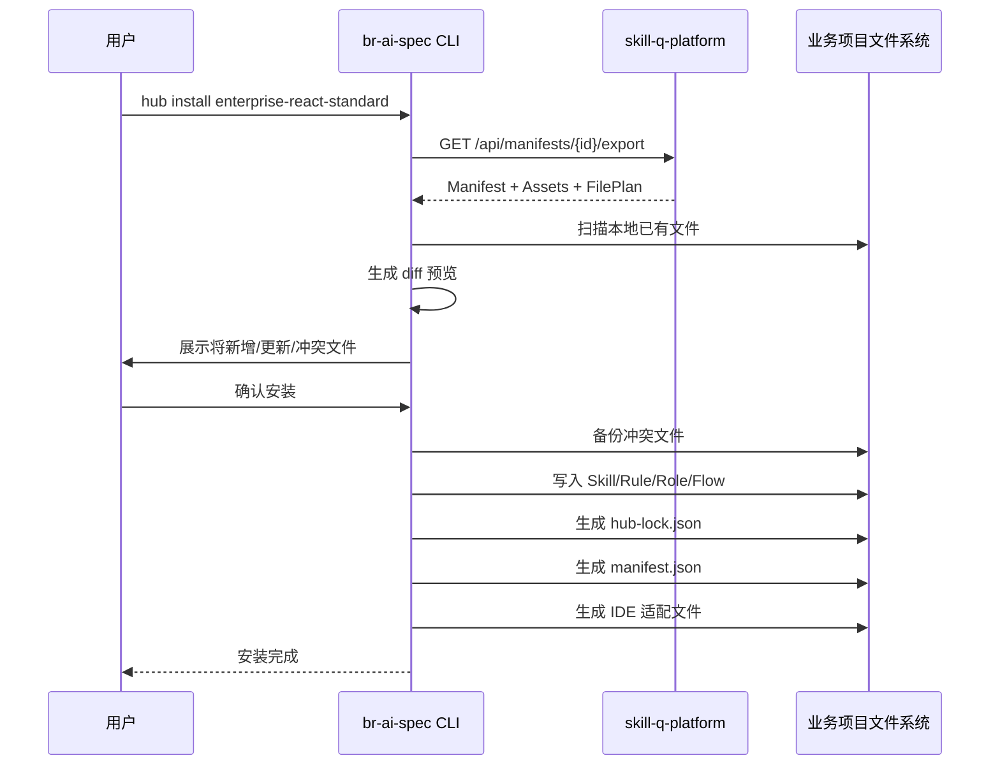

# 三仓协同与 Manifest 方案包技术实现文档

> 适用项目：`skill-q-platform`、`br-ai-spec`、`br-ai-spec-visual`  
> 文档定位：用于指导三仓协同改造、Manifest 方案包能力落地、Hub 资产分发、CLI 安装同步、Visual 运行态回流。  
> 推荐读者：前端负责人、架构师、全栈开发、AI 工程平台开发者、团队技术负责人。  
> 版本：v1.0.0  
> 日期：24 April 2026

---

## 1. 背景与目标

当前三个项目已经具备 AI 工程化平台雏形：

| 项目 | 当前能力 | 目标定位 |
|---|---|---|
| `skill-q-platform` | Skill / Rule 管理、上传、搜索、编辑、评分 | AI 工程资产 Hub / Registry / 能力市场 |
| `br-ai-spec` | 项目级 AI 规范执行、初始化、规则安装、IDE 适配 | CLI 执行底座 / 项目接入器 / 资产消费方 |
| `br-ai-spec-visual` | 项目运行态可视化、Collector 上报、WebSocket 实时数据 | 控制台 / 观测面 / 团队治理面板 |

当前问题不是单个项目能力不足，而是三者之间缺少统一主线：

```text
资产创建 → 资产审核 → 方案组合 → 一键安装 → 项目执行 → 运行态采集 → 效果回流 → 资产优化
```

因此，本次技术实现文档的核心目标是：

1. 将 `skill-q-platform` 从 Skill / Rule 分享平台升级为 AI 工程资产 Hub。
2. 在 Hub 中新增 `Manifest 方案包` 能力。
3. 让 `br-ai-spec` 支持从 Hub 安装、同步、升级、回滚方案包。
4. 让 `br-ai-spec-visual` 展示项目安装的资产、版本、运行状态和质量指标。
5. 建立从资产管理到执行观测的完整闭环。

---

## 2. 总体架构设计

### 2.1 三仓协同架构



### 2.2 核心闭环

```text
skill-q-platform 创建资产
        ↓
Manifest 组合 Skill / Rule / Role / Flow
        ↓
br-ai-spec 拉取 Manifest 并安装到业务项目
        ↓
业务项目基于 .ai-spec / .agents / openspec 执行 AI 研发流程
        ↓
br-ai-spec-visual 采集运行态和项目资产画像
        ↓
运行效果回流到 skill-q-platform
        ↓
Hub 根据真实效果优化资产推荐、评分和治理策略
```

---

## 3. 产品边界与职责划分

### 3.1 `skill-q-platform` 职责

`skill-q-platform` 是 AI 工程资产源头，负责资产的创建、管理、审核、版本化和分发。

核心职责：

1. 管理 Skill、Rule、Role、Flow、Scenario、Template、Checklist、Adapter。
2. 管理 Manifest 方案包。
3. 提供 Manifest Export API。
4. 提供资产详情、版本、审核、安全扫描能力。
5. 接收 Visual 回流的资产使用效果。
6. 为团队提供标准方案包市场。

不应该承担：

1. 不直接执行业务项目中的 AI 开发流程。
2. 不直接修改业务项目文件。
3. 不承载项目运行态日志详情。
4. 不重复实现 `br-ai-spec` 的本地安装逻辑。

### 3.2 `br-ai-spec` 职责

`br-ai-spec` 是项目级执行底座，负责将 Hub 中的资产安装到业务项目，并在本地生成 AI 规范执行环境。

核心职责：

1. 初始化业务项目 AI 规范目录。
2. 从 Hub 安装 Manifest 方案包。
3. 同步 Skill / Rule / Role / Flow 等资产。
4. 生成 `.agents`、`.ai-spec`、`openspec`、IDE 命令文件。
5. 生成 `hub-lock.json` 锁定资产来源与版本。
6. 提供 diff、upgrade、rollback、uninstall 能力。

不应该承担：

1. 不作为资产主数据平台。
2. 不维护复杂的资产审核流程。
3. 不作为团队运行态可视化平台。

### 3.3 `br-ai-spec-visual` 职责

`br-ai-spec-visual` 是项目运行态与团队治理控制台。

核心职责：

1. 展示项目接入状态。
2. 展示项目安装的 Manifest 和资产版本。
3. 展示 AI 研发运行态，包括 Runs、Changes、OpenSpec 状态。
4. 展示 Skill / Rule 使用效果。
5. 展示团队治理风险，例如规则过期、未审核资产、高风险资产。
6. 将运行效果回流给 `skill-q-platform`。

不应该承担：

1. 不作为资产创建主平台。
2. 不重复管理 Hub 中的资产版本。
3. 不直接修改业务项目本地文件。

---

## 4. 核心概念定义

### 4.1 Asset 资产

统一资产模型，所有可复用的 AI 工程能力均归为 Asset。

```ts
export type AssetKind =
  | 'skill'
  | 'rule'
  | 'role'
  | 'flow'
  | 'scenario'
  | 'manifest'
  | 'template'
  | 'checklist'
  | 'adapter';
```

### 4.2 Skill

Skill 是具备明确目标、输入、输出、执行步骤和约束的 AI 能力单元。

示例：

```text
需求澄清 Skill
代码实现 Skill
测试用例生成 Skill
接口文档生成 Skill
埋点方案审查 Skill
UI 还原度评审 Skill
```

### 4.3 Rule

Rule 是团队级或项目级约束，例如编码规范、目录规范、接口规范、提交规范。

示例：

```text
React 编码规范
Vue3 组件规范
TypeScript 类型规范
接口错误处理规范
埋点命名规范
```

### 4.4 Role

Role 是 AI 在流程中的职责角色。

示例：

```text
需求分析师
前端架构师
前端实现工程师
代码审查专家
测试专家
上线风险官
```

### 4.5 Flow

Flow 是多个 Role / Skill / Rule 组合后的流程。

示例：

```text
PRD 到开发流程
Bug 修复流程
组件库新增组件流程
接口联调流程
上线前检查流程
```

### 4.6 Manifest

Manifest 是本次改造的核心。

Manifest 表示一个完整的 AI 工程方案包，它不是单个 Skill，也不是单条 Rule，而是一组可被安装、版本化、审计和同步的工程能力集合。

Manifest 解决的问题：

1. 团队如何一键分发 AI 研发规范。
2. 不同技术栈如何使用不同方案。
3. 如何让业务项目知道自己安装了哪些 AI 能力。
4. 如何升级、回滚、审计和统计方案包。

---

## 5. Manifest 数据模型设计

### 5.1 Manifest 基础结构

```ts
export interface ManifestPackage {
  id: string;
  name: string;
  displayName: string;
  description?: string;
  version: string;
  status: ManifestStatus;
  visibility: ManifestVisibility;
  ownerId: string;
  ownerName?: string;
  tags: string[];
  techStacks: TechStack[];
  ideTargets: IdeTarget[];
  scenarioTypes: ScenarioType[];
  riskLevel: RiskLevel;
  installMode: InstallMode;
  assets: ManifestAssetRef[];
  files: ManifestFilePlan[];
  installScripts?: ManifestInstallScript[];
  qualityGates?: QualityGate[];
  metadata?: Record<string, unknown>;
  createdAt: string;
  updatedAt: string;
  publishedAt?: string;
}
```

### 5.2 枚举定义

```ts
export type ManifestStatus =
  | 'draft'
  | 'submitted'
  | 'approved'
  | 'rejected'
  | 'published'
  | 'deprecated'
  | 'archived';

export type ManifestVisibility =
  | 'private'
  | 'team'
  | 'organization'
  | 'public';

export type TechStack =
  | 'react'
  | 'vue'
  | 'next'
  | 'node'
  | 'java'
  | 'mini-program'
  | 'react-native'
  | 'general';

export type IdeTarget =
  | 'cursor'
  | 'claude-code'
  | 'qwen-code'
  | 'openclaw'
  | 'vscode'
  | 'general';

export type ScenarioType =
  | 'new-feature'
  | 'bugfix'
  | 'refactor'
  | 'component-library'
  | 'tracking-system'
  | 'testing'
  | 'documentation'
  | 'release';

export type RiskLevel = 'low' | 'medium' | 'high' | 'critical';

export type InstallMode =
  | 'light'
  | 'standard'
  | 'strict'
  | 'audit-only';
```

### 5.3 ManifestAssetRef

```ts
export interface ManifestAssetRef {
  kind: AssetKind;
  assetId: string;
  version: string;
  required: boolean;
  installPath?: string;
  checksum?: string;
  order?: number;
  config?: Record<string, unknown>;
}
```

### 5.4 ManifestFilePlan

用于安装前预览和安装后 diff。

```ts
export interface ManifestFilePlan {
  path: string;
  action: 'create' | 'update' | 'merge' | 'skip';
  sourceAssetId?: string;
  conflictStrategy: 'overwrite' | 'merge' | 'backup' | 'manual';
  required: boolean;
  description?: string;
}
```

### 5.5 QualityGate

```ts
export interface QualityGate {
  id: string;
  name: string;
  type: 'lint' | 'test' | 'review' | 'security' | 'spec-check' | 'custom';
  required: boolean;
  command?: string;
  description?: string;
}
```

### 5.6 Manifest 示例

```json
{
  "id": "enterprise-react-standard",
  "name": "enterprise-react-standard",
  "displayName": "企业级 React 标准研发方案包",
  "description": "适用于 React 中后台项目的 AI 规范开发方案，包含需求、架构、实现、测试、审查等全流程能力。",
  "version": "1.0.0",
  "status": "published",
  "visibility": "organization",
  "ownerId": "team-frontend-platform",
  "ownerName": "前端平台组",
  "tags": ["React", "AI Coding", "规范研发", "企业标准"],
  "techStacks": ["react"],
  "ideTargets": ["cursor", "claude-code", "qwen-code", "openclaw"],
  "scenarioTypes": ["new-feature", "bugfix", "refactor", "testing"],
  "riskLevel": "medium",
  "installMode": "standard",
  "assets": [
    {
      "kind": "role",
      "assetId": "requirement-analyst",
      "version": "1.0.0",
      "required": true,
      "order": 1
    },
    {
      "kind": "role",
      "assetId": "frontend-architect",
      "version": "1.0.0",
      "required": true,
      "order": 2
    },
    {
      "kind": "skill",
      "assetId": "execute-task",
      "version": "1.2.0",
      "required": true,
      "installPath": ".agents/skills/execute-task"
    },
    {
      "kind": "rule",
      "assetId": "react-coding-standard",
      "version": "1.1.0",
      "required": true,
      "installPath": ".agents/rules/react-coding-standard.md"
    }
  ],
  "files": [
    {
      "path": ".agents/registry/manifest.json",
      "action": "create",
      "conflictStrategy": "backup",
      "required": true,
      "description": "写入当前方案包信息"
    },
    {
      "path": ".agents/registry/hub-lock.json",
      "action": "create",
      "conflictStrategy": "overwrite",
      "required": true,
      "description": "锁定 Hub 来源和资产版本"
    },
    {
      "path": ".cursor/rules",
      "action": "merge",
      "conflictStrategy": "manual",
      "required": false,
      "description": "写入 Cursor IDE 规则"
    }
  ],
  "qualityGates": [
    {
      "id": "spec-check",
      "name": "OpenSpec 规范检查",
      "type": "spec-check",
      "required": true,
      "command": "npx @ex/ai-spec-auto check"
    }
  ],
  "createdAt": "2026-04-24T00:00:00.000Z",
  "updatedAt": "2026-04-24T00:00:00.000Z",
  "publishedAt": "2026-04-24T00:00:00.000Z"
}
```

---

## 6. 数据库设计

以下设计以 MySQL 为例，可根据现有技术栈调整为 PostgreSQL。

### 6.1 asset 表

```sql
CREATE TABLE `asset` (
  `id` BIGINT NOT NULL AUTO_INCREMENT,
  `asset_id` VARCHAR(128) NOT NULL COMMENT '资产唯一标识，例如 execute-task',
  `kind` VARCHAR(32) NOT NULL COMMENT '资产类型 skill/rule/role/flow/scenario/template/checklist/adapter',
  `name` VARCHAR(128) NOT NULL COMMENT '资产名称',
  `display_name` VARCHAR(255) NOT NULL COMMENT '展示名称',
  `description` TEXT NULL COMMENT '资产描述',
  `owner_id` VARCHAR(128) NULL COMMENT '负责人ID',
  `owner_name` VARCHAR(128) NULL COMMENT '负责人名称',
  `status` VARCHAR(32) NOT NULL DEFAULT 'draft' COMMENT 'draft/submitted/approved/rejected/published/deprecated/archived',
  `visibility` VARCHAR(32) NOT NULL DEFAULT 'private' COMMENT 'private/team/organization/public',
  `risk_level` VARCHAR(32) NOT NULL DEFAULT 'low' COMMENT 'low/medium/high/critical',
  `tags` JSON NULL COMMENT '标签数组',
  `tech_stacks` JSON NULL COMMENT '适用技术栈',
  `ide_targets` JSON NULL COMMENT '适用IDE',
  `metadata` JSON NULL COMMENT '扩展信息',
  `created_at` DATETIME NOT NULL DEFAULT CURRENT_TIMESTAMP,
  `updated_at` DATETIME NOT NULL DEFAULT CURRENT_TIMESTAMP ON UPDATE CURRENT_TIMESTAMP,
  PRIMARY KEY (`id`),
  UNIQUE KEY `uk_asset_id` (`asset_id`),
  KEY `idx_kind_status` (`kind`, `status`),
  KEY `idx_owner_id` (`owner_id`)
) ENGINE=InnoDB DEFAULT CHARSET=utf8mb4 COMMENT='AI工程资产主表';
```

### 6.2 asset_version 表

```sql
CREATE TABLE `asset_version` (
  `id` BIGINT NOT NULL AUTO_INCREMENT,
  `asset_id` VARCHAR(128) NOT NULL COMMENT '资产唯一标识',
  `version` VARCHAR(64) NOT NULL COMMENT '版本号',
  `content` LONGTEXT NULL COMMENT '资产内容，Markdown/JSON/YAML 均可',
  `content_format` VARCHAR(32) NOT NULL DEFAULT 'markdown' COMMENT 'markdown/json/yaml/text',
  `checksum` VARCHAR(128) NOT NULL COMMENT '内容校验值',
  `changelog` TEXT NULL COMMENT '版本变更说明',
  `status` VARCHAR(32) NOT NULL DEFAULT 'draft' COMMENT 'draft/submitted/approved/published/deprecated',
  `created_by` VARCHAR(128) NULL COMMENT '创建人',
  `created_at` DATETIME NOT NULL DEFAULT CURRENT_TIMESTAMP,
  `published_at` DATETIME NULL,
  PRIMARY KEY (`id`),
  UNIQUE KEY `uk_asset_version` (`asset_id`, `version`),
  KEY `idx_asset_id` (`asset_id`)
) ENGINE=InnoDB DEFAULT CHARSET=utf8mb4 COMMENT='资产版本表';
```

### 6.3 manifest_package 表

```sql
CREATE TABLE `manifest_package` (
  `id` BIGINT NOT NULL AUTO_INCREMENT,
  `manifest_id` VARCHAR(128) NOT NULL COMMENT '方案包唯一标识',
  `name` VARCHAR(128) NOT NULL COMMENT '方案包名称',
  `display_name` VARCHAR(255) NOT NULL COMMENT '展示名称',
  `description` TEXT NULL COMMENT '方案包描述',
  `version` VARCHAR(64) NOT NULL COMMENT '当前版本',
  `status` VARCHAR(32) NOT NULL DEFAULT 'draft' COMMENT 'draft/submitted/approved/rejected/published/deprecated/archived',
  `visibility` VARCHAR(32) NOT NULL DEFAULT 'private' COMMENT 'private/team/organization/public',
  `owner_id` VARCHAR(128) NULL COMMENT '负责人ID',
  `owner_name` VARCHAR(128) NULL COMMENT '负责人名称',
  `risk_level` VARCHAR(32) NOT NULL DEFAULT 'low' COMMENT '风险等级',
  `install_mode` VARCHAR(32) NOT NULL DEFAULT 'standard' COMMENT 'light/standard/strict/audit-only',
  `tags` JSON NULL COMMENT '标签',
  `tech_stacks` JSON NULL COMMENT '适用技术栈',
  `ide_targets` JSON NULL COMMENT '适用IDE',
  `scenario_types` JSON NULL COMMENT '适用场景',
  `metadata` JSON NULL COMMENT '扩展信息',
  `created_at` DATETIME NOT NULL DEFAULT CURRENT_TIMESTAMP,
  `updated_at` DATETIME NOT NULL DEFAULT CURRENT_TIMESTAMP ON UPDATE CURRENT_TIMESTAMP,
  `published_at` DATETIME NULL,
  PRIMARY KEY (`id`),
  UNIQUE KEY `uk_manifest_id` (`manifest_id`),
  KEY `idx_status` (`status`),
  KEY `idx_owner_id` (`owner_id`)
) ENGINE=InnoDB DEFAULT CHARSET=utf8mb4 COMMENT='Manifest方案包表';
```

### 6.4 manifest_asset 表

```sql
CREATE TABLE `manifest_asset` (
  `id` BIGINT NOT NULL AUTO_INCREMENT,
  `manifest_id` VARCHAR(128) NOT NULL COMMENT '方案包ID',
  `asset_id` VARCHAR(128) NOT NULL COMMENT '资产ID',
  `asset_kind` VARCHAR(32) NOT NULL COMMENT '资产类型',
  `asset_version` VARCHAR(64) NOT NULL COMMENT '资产版本',
  `required` TINYINT(1) NOT NULL DEFAULT 1 COMMENT '是否必装',
  `install_path` VARCHAR(512) NULL COMMENT '安装路径',
  `checksum` VARCHAR(128) NULL COMMENT '资产校验值',
  `sort_order` INT NOT NULL DEFAULT 0 COMMENT '安装顺序',
  `config` JSON NULL COMMENT '资产安装配置',
  `created_at` DATETIME NOT NULL DEFAULT CURRENT_TIMESTAMP,
  PRIMARY KEY (`id`),
  UNIQUE KEY `uk_manifest_asset` (`manifest_id`, `asset_id`, `asset_version`),
  KEY `idx_manifest_id` (`manifest_id`),
  KEY `idx_asset_id` (`asset_id`)
) ENGINE=InnoDB DEFAULT CHARSET=utf8mb4 COMMENT='Manifest资产关联表';
```

### 6.5 manifest_file_plan 表

```sql
CREATE TABLE `manifest_file_plan` (
  `id` BIGINT NOT NULL AUTO_INCREMENT,
  `manifest_id` VARCHAR(128) NOT NULL COMMENT '方案包ID',
  `path` VARCHAR(512) NOT NULL COMMENT '目标文件路径',
  `action` VARCHAR(32) NOT NULL COMMENT 'create/update/merge/skip',
  `source_asset_id` VARCHAR(128) NULL COMMENT '来源资产ID',
  `conflict_strategy` VARCHAR(32) NOT NULL DEFAULT 'backup' COMMENT 'overwrite/merge/backup/manual',
  `required` TINYINT(1) NOT NULL DEFAULT 1 COMMENT '是否必需',
  `description` VARCHAR(512) NULL COMMENT '说明',
  `created_at` DATETIME NOT NULL DEFAULT CURRENT_TIMESTAMP,
  PRIMARY KEY (`id`),
  KEY `idx_manifest_id` (`manifest_id`)
) ENGINE=InnoDB DEFAULT CHARSET=utf8mb4 COMMENT='Manifest文件安装计划表';
```

### 6.6 asset_audit 表

```sql
CREATE TABLE `asset_audit` (
  `id` BIGINT NOT NULL AUTO_INCREMENT,
  `target_type` VARCHAR(32) NOT NULL COMMENT 'asset/manifest',
  `target_id` VARCHAR(128) NOT NULL COMMENT '目标ID',
  `target_version` VARCHAR(64) NULL COMMENT '目标版本',
  `audit_type` VARCHAR(32) NOT NULL COMMENT 'manual/security/format/auto',
  `status` VARCHAR(32) NOT NULL COMMENT 'passed/failed/warning/pending',
  `risk_level` VARCHAR(32) NOT NULL DEFAULT 'low',
  `message` TEXT NULL COMMENT '审计结论',
  `details` JSON NULL COMMENT '审计详情',
  `auditor_id` VARCHAR(128) NULL COMMENT '审核人ID',
  `auditor_name` VARCHAR(128) NULL COMMENT '审核人名称',
  `created_at` DATETIME NOT NULL DEFAULT CURRENT_TIMESTAMP,
  PRIMARY KEY (`id`),
  KEY `idx_target` (`target_type`, `target_id`),
  KEY `idx_status` (`status`)
) ENGINE=InnoDB DEFAULT CHARSET=utf8mb4 COMMENT='资产审计记录表';
```

### 6.7 project_asset_install 表

记录 Visual 或 CLI 回传的项目安装情况。

```sql
CREATE TABLE `project_asset_install` (
  `id` BIGINT NOT NULL AUTO_INCREMENT,
  `project_id` VARCHAR(128) NOT NULL COMMENT '项目ID',
  `project_name` VARCHAR(255) NULL COMMENT '项目名称',
  `repo_url` VARCHAR(512) NULL COMMENT '仓库地址',
  `manifest_id` VARCHAR(128) NULL COMMENT '安装的方案包ID',
  `manifest_version` VARCHAR(64) NULL COMMENT '方案包版本',
  `asset_id` VARCHAR(128) NOT NULL COMMENT '资产ID',
  `asset_kind` VARCHAR(32) NOT NULL COMMENT '资产类型',
  `asset_version` VARCHAR(64) NOT NULL COMMENT '资产版本',
  `install_source` VARCHAR(64) NOT NULL DEFAULT 'hub' COMMENT 'hub/local/manual',
  `checksum` VARCHAR(128) NULL COMMENT '本地校验值',
  `status` VARCHAR(32) NOT NULL DEFAULT 'active' COMMENT 'active/outdated/modified/missing/deprecated',
  `installed_at` DATETIME NULL,
  `last_seen_at` DATETIME NULL,
  PRIMARY KEY (`id`),
  UNIQUE KEY `uk_project_asset` (`project_id`, `asset_id`, `asset_version`),
  KEY `idx_project_id` (`project_id`),
  KEY `idx_manifest_id` (`manifest_id`),
  KEY `idx_status` (`status`)
) ENGINE=InnoDB DEFAULT CHARSET=utf8mb4 COMMENT='项目资产安装状态表';
```

### 6.8 asset_usage_event 表

```sql
CREATE TABLE `asset_usage_event` (
  `id` BIGINT NOT NULL AUTO_INCREMENT,
  `event_id` VARCHAR(128) NOT NULL COMMENT '事件ID',
  `project_id` VARCHAR(128) NOT NULL COMMENT '项目ID',
  `run_id` VARCHAR(128) NULL COMMENT '运行ID',
  `asset_id` VARCHAR(128) NOT NULL COMMENT '资产ID',
  `asset_kind` VARCHAR(32) NOT NULL COMMENT '资产类型',
  `asset_version` VARCHAR(64) NULL COMMENT '资产版本',
  `event_type` VARCHAR(64) NOT NULL COMMENT 'used/succeeded/failed/skipped/deprecated_warning',
  `duration_ms` BIGINT NULL COMMENT '耗时',
  `result` VARCHAR(32) NULL COMMENT 'success/failure/partial',
  `error_code` VARCHAR(128) NULL COMMENT '错误码',
  `error_message` TEXT NULL COMMENT '错误信息',
  `metadata` JSON NULL COMMENT '扩展数据',
  `created_at` DATETIME NOT NULL DEFAULT CURRENT_TIMESTAMP,
  PRIMARY KEY (`id`),
  UNIQUE KEY `uk_event_id` (`event_id`),
  KEY `idx_asset` (`asset_id`, `asset_kind`),
  KEY `idx_project_id` (`project_id`),
  KEY `idx_run_id` (`run_id`)
) ENGINE=InnoDB DEFAULT CHARSET=utf8mb4 COMMENT='资产使用事件表';
```

---

## 7. Hub API 设计

### 7.1 API 设计原则

1. Hub API 负责资产查询、资产详情、Manifest 导出、审计结果和回流接收。
2. CLI 不直接读取数据库，只通过 API 获取资产。
3. 所有导出接口必须包含版本和 checksum。
4. 所有安装类接口必须支持 dry-run。
5. Visual 回流接口必须支持幂等。

### 7.2 查询资产列表

```http
GET /api/assets?kind=skill&keyword=react&status=published&page=1&pageSize=20
```

响应：

```json
{
  "code": 0,
  "message": "成功",
  "data": {
    "list": [
      {
        "assetId": "execute-task",
        "kind": "skill",
        "displayName": "任务执行 Skill",
        "description": "用于根据任务文档执行开发任务",
        "version": "1.2.0",
        "status": "published",
        "riskLevel": "medium",
        "tags": ["开发", "执行", "AI Coding"]
      }
    ],
    "total": 1
  }
}
```

### 7.3 获取资产详情

```http
GET /api/assets/{assetId}?version=1.2.0
```

响应：

```json
{
  "code": 0,
  "message": "成功",
  "data": {
    "assetId": "execute-task",
    "kind": "skill",
    "displayName": "任务执行 Skill",
    "version": "1.2.0",
    "contentFormat": "markdown",
    "content": "# Execute Task Skill\n...",
    "checksum": "sha256:xxx",
    "status": "published",
    "riskLevel": "medium"
  }
}
```

### 7.4 查询 Manifest 列表

```http
GET /api/manifests?techStack=react&scenarioType=new-feature&status=published&page=1&pageSize=20
```

响应：

```json
{
  "code": 0,
  "message": "成功",
  "data": {
    "list": [
      {
        "manifestId": "enterprise-react-standard",
        "displayName": "企业级 React 标准研发方案包",
        "version": "1.0.0",
        "status": "published",
        "riskLevel": "medium",
        "installMode": "standard",
        "techStacks": ["react"],
        "assetCount": 16
      }
    ],
    "total": 1
  }
}
```

### 7.5 获取 Manifest 详情

```http
GET /api/manifests/{manifestId}?version=1.0.0
```

响应返回完整 Manifest，但不一定包含所有资产内容。

```json
{
  "code": 0,
  "message": "成功",
  "data": {
    "manifestId": "enterprise-react-standard",
    "displayName": "企业级 React 标准研发方案包",
    "version": "1.0.0",
    "status": "published",
    "assets": [
      {
        "kind": "skill",
        "assetId": "execute-task",
        "version": "1.2.0",
        "required": true,
        "checksum": "sha256:xxx"
      }
    ],
    "files": [
      {
        "path": ".agents/registry/hub-lock.json",
        "action": "create",
        "conflictStrategy": "overwrite",
        "required": true
      }
    ]
  }
}
```

### 7.6 Manifest Export API

该接口供 `br-ai-spec` CLI 使用，返回可直接安装的完整数据。

```http
GET /api/manifests/{manifestId}/export?version=1.0.0&targetIde=cursor&installMode=standard
```

响应：

```json
{
  "code": 0,
  "message": "成功",
  "data": {
    "manifest": {
      "manifestId": "enterprise-react-standard",
      "displayName": "企业级 React 标准研发方案包",
      "version": "1.0.0",
      "checksum": "sha256:manifest-checksum"
    },
    "assets": [
      {
        "kind": "skill",
        "assetId": "execute-task",
        "version": "1.2.0",
        "installPath": ".agents/skills/execute-task/SKILL.md",
        "contentFormat": "markdown",
        "content": "# Execute Task Skill\n...",
        "checksum": "sha256:asset-checksum"
      }
    ],
    "filePlan": [
      {
        "path": ".agents/skills/execute-task/SKILL.md",
        "action": "create",
        "conflictStrategy": "backup",
        "required": true
      }
    ],
    "qualityGates": [
      {
        "id": "spec-check",
        "name": "OpenSpec 规范检查",
        "type": "spec-check",
        "required": true,
        "command": "npx @ex/ai-spec-auto check"
      }
    ]
  }
}
```

### 7.7 安装预览 API

```http
POST /api/manifests/{manifestId}/install-preview
Content-Type: application/json
```

请求：

```json
{
  "projectName": "admin-web",
  "techStack": "react",
  "ideTarget": "cursor",
  "currentAssets": [
    {
      "kind": "skill",
      "assetId": "execute-task",
      "version": "1.0.0",
      "checksum": "sha256:old"
    }
  ]
}
```

响应：

```json
{
  "code": 0,
  "message": "成功",
  "data": {
    "summary": {
      "createCount": 8,
      "updateCount": 3,
      "skipCount": 2,
      "conflictCount": 1
    },
    "changes": [
      {
        "path": ".agents/skills/execute-task/SKILL.md",
        "action": "update",
        "fromVersion": "1.0.0",
        "toVersion": "1.2.0",
        "conflict": false
      }
    ]
  }
}
```

### 7.8 Visual 回流项目资产安装状态

```http
POST /api/runtime/project-assets/report
Content-Type: application/json
```

请求：

```json
{
  "projectId": "admin-web",
  "projectName": "Admin 管理后台",
  "repoUrl": "https://github.com/example/admin-web",
  "manifestId": "enterprise-react-standard",
  "manifestVersion": "1.0.0",
  "reportedAt": "2026-04-24T00:00:00.000Z",
  "assets": [
    {
      "kind": "skill",
      "assetId": "execute-task",
      "version": "1.2.0",
      "checksum": "sha256:xxx",
      "status": "active"
    }
  ]
}
```

响应：

```json
{
  "code": 0,
  "message": "成功",
  "data": {
    "accepted": true
  }
}
```

### 7.9 Visual 回流资产使用事件

```http
POST /api/runtime/asset-usage/events
Content-Type: application/json
```

请求：

```json
{
  "events": [
    {
      "eventId": "evt_001",
      "projectId": "admin-web",
      "runId": "run_001",
      "assetId": "execute-task",
      "assetKind": "skill",
      "assetVersion": "1.2.0",
      "eventType": "succeeded",
      "durationMs": 12000,
      "result": "success",
      "metadata": {
        "taskType": "new-feature"
      },
      "createdAt": "2026-04-24T00:00:00.000Z"
    }
  ]
}
```

响应：

```json
{
  "code": 0,
  "message": "成功",
  "data": {
    "received": 1,
    "ignored": 0
  }
}
```

---

## 8. `br-ai-spec` CLI 改造设计

### 8.1 新增命令列表

```bash
npx @ex/ai-spec-auto hub login
npx @ex/ai-spec-auto hub search react
npx @ex/ai-spec-auto hub manifest list
npx @ex/ai-spec-auto hub manifest info enterprise-react-standard
npx @ex/ai-spec-auto hub install enterprise-react-standard
npx @ex/ai-spec-auto hub install enterprise-react-standard --dry-run
npx @ex/ai-spec-auto hub sync
npx @ex/ai-spec-auto hub diff
npx @ex/ai-spec-auto hub upgrade
npx @ex/ai-spec-auto hub rollback enterprise-react-standard@1.0.0
```

### 8.2 hub install 流程



### 8.3 hub-lock.json 设计

安装成功后，在业务项目中生成：

```text
.agents/registry/hub-lock.json
```

内容：

```json
{
  "hub": {
    "baseUrl": "https://skill-q.internal",
    "name": "Skill Q Platform"
  },
  "project": {
    "id": "admin-web",
    "name": "Admin 管理后台",
    "repoUrl": "https://github.com/example/admin-web"
  },
  "manifest": {
    "id": "enterprise-react-standard",
    "displayName": "企业级 React 标准研发方案包",
    "version": "1.0.0",
    "checksum": "sha256:manifest-checksum",
    "installedAt": "2026-04-24T00:00:00.000Z"
  },
  "assets": [
    {
      "kind": "skill",
      "assetId": "execute-task",
      "version": "1.2.0",
      "path": ".agents/skills/execute-task/SKILL.md",
      "checksum": "sha256:asset-checksum",
      "source": "hub"
    }
  ]
}
```

### 8.4 manifest.json 设计

```text
.agents/registry/manifest.json
```

内容：

```json
{
  "manifestId": "enterprise-react-standard",
  "version": "1.0.0",
  "displayName": "企业级 React 标准研发方案包",
  "installMode": "standard",
  "techStacks": ["react"],
  "ideTargets": ["cursor", "claude-code", "qwen-code"],
  "entryRole": "requirement-analyst",
  "roles": ["requirement-analyst", "frontend-architect", "frontend-implementer"],
  "skills": ["execute-task", "generate-test-cases"],
  "rules": ["react-coding-standard", "api-error-handling-standard"],
  "flows": ["prd-to-delivery-flow"]
}
```

### 8.5 安装冲突策略

| 策略 | 含义 | 使用场景 |
|---|---|---|
| `overwrite` | 直接覆盖 | 自动生成文件、锁文件 |
| `backup` | 覆盖前备份 | Skill / Rule 文件 |
| `merge` | 尝试合并 | IDE 配置、rules 目录 |
| `manual` | 提示人工处理 | 复杂配置冲突 |
| `skip` | 跳过 | 已存在且 checksum 一致 |

备份目录：

```text
.ai-spec/backups/20260424-120000/
```

### 8.6 hub diff 输出示例

```text
当前项目：Admin 管理后台
当前方案包：enterprise-react-standard@1.0.0
Hub 最新版本：enterprise-react-standard@1.1.0

变更摘要：
- 新增 Skill：1 个
- 更新 Rule：2 个
- 废弃 Skill：1 个
- 本地修改冲突：1 个

详细变更：
[更新] .agents/rules/react-coding-standard.md  1.1.0 → 1.2.0
[新增] .agents/skills/ui-review/SKILL.md
[冲突] .cursor/rules/project-rule.mdc，需要人工确认
```

### 8.7 TypeScript 核心接口设计

```ts
export interface HubClientOptions {
  baseUrl: string;
  token?: string;
  timeout?: number;
}

export class HubClient {
  constructor(private options: HubClientOptions) {}

  async getManifestExport(params: {
    manifestId: string;
    version?: string;
    targetIde?: string;
    installMode?: string;
  }): Promise<ManifestExportResponse> {
    // 请求 Hub Manifest Export API
  }

  async reportInstallStatus(payload: ProjectAssetReportPayload): Promise<void> {
    // 可选：CLI 主动上报安装状态
  }
}
```

```ts
export interface InstallContext {
  cwd: string;
  manifestId: string;
  version?: string;
  dryRun?: boolean;
  targetIde?: string;
  installMode?: InstallMode;
  force?: boolean;
}

export class ManifestInstaller {
  async install(ctx: InstallContext): Promise<InstallResult> {
    // 1. 拉取 Manifest
    // 2. 扫描本地文件
    // 3. 生成安装计划
    // 4. dry-run 输出预览
    // 5. 写入文件
    // 6. 写入 hub-lock.json
    // 7. 生成安装结果
  }
}
```

---

## 9. `skill-q-platform` 前端页面改造

### 9.1 新增导航结构

建议导航改为：

```text
首页
资产中心
  - Skill
  - Rule
  - Role
  - Flow
  - Template
方案包
  - 方案包市场
  - 我的方案包
  - 创建方案包
  - 安装记录
治理中心
  - 审核任务
  - 安全扫描
  - 风险资产
运行反馈
  - 使用排行
  - 成功率分析
  - 项目接入情况
系统设置
```

### 9.2 Manifest 列表页

字段：

| 字段 | 说明 |
|---|---|
| 方案包名称 | displayName |
| 版本 | version |
| 状态 | draft / published / deprecated |
| 技术栈 | React / Vue / Next |
| 适用 IDE | Cursor / Claude Code / Qwen / OpenClaw |
| 资产数量 | assets.length |
| 风险等级 | low / medium / high |
| 安装次数 | installCount |
| 成功率 | successRate |
| 最近更新 | updatedAt |

操作：

```text
查看详情
编辑
发布
复制安装命令
导出 JSON
查看安装记录
废弃
```

### 9.3 Manifest 创建页面

表单分区：

```text
基础信息
- 方案包 ID
- 展示名称
- 描述
- 标签
- 技术栈
- 适用 IDE
- 适用场景
- 安装模式

选择资产
- Skill
- Rule
- Role
- Flow
- Template
- Checklist

安装计划
- 生成哪些目录
- 写入哪些文件
- 冲突策略

质量门禁
- spec-check
- lint
- test
- review
- security

发布设置
- 可见范围
- 审核人
- 发布说明
```

### 9.4 Manifest 详情页

详情页必须展示：

```text
方案包基础信息
资产组成
安装命令
安装前预览说明
版本历史
审核记录
安全扫描结果
安装项目列表
运行效果统计
```

安装命令示例：

```bash
npx @ex/ai-spec-auto hub install enterprise-react-standard --hub https://skill-q.internal --target-ide cursor
```

### 9.5 安全扫描页面

展示字段：

```text
扫描对象
扫描类型
扫描状态
风险等级
敏感行为
外部访问
文件写入
凭证泄露
格式错误
扫描时间
处理建议
```

---

## 10. `br-ai-spec-visual` 改造设计

### 10.1 新增项目资产画像页

页面路径建议：

```text
/projects/:projectId/assets
```

展示内容：

```text
项目名称
仓库地址
当前 Manifest
Manifest 版本
安装模式
接入时间
最后上报时间
资产总数
过期资产数
本地修改资产数
高风险资产数
未审核资产数
```

资产表格字段：

| 字段 | 说明 |
|---|---|
| 资产名称 | displayName |
| 类型 | Skill / Rule / Role |
| 当前版本 | localVersion |
| Hub 最新版本 | latestVersion |
| 状态 | active / outdated / modified / deprecated |
| 风险等级 | low / medium / high |
| 来源 | hub / local / manual |
| 最近使用 | lastUsedAt |

### 10.2 新增 Skill 使用效果页

页面路径建议：

```text
/assets/:assetId/usage
```

指标：

```text
安装项目数
调用次数
成功次数
失败次数
成功率
平均耗时
平均返工次数
最近 7 天调用趋势
常见失败原因
推荐等级
```

### 10.3 新增团队治理看板

页面路径建议：

```text
/governance
```

展示模块：

```text
项目接入率
标准 Manifest 覆盖率
规则过期项目
高风险资产项目
未审核资产项目
OpenSpec 缺失项目
最近失败 Run
最常用 Skill
低成功率 Skill
```

### 10.4 Collector 扫描增强

Collector 需要新增扫描：

```text
.agents/registry/hub-lock.json
.agents/registry/manifest.json
.agents/skills/**/SKILL.md
.agents/rules/**/*.md
.ai-spec/runs/**
.omx/logs/**
openspec/**
```

采集结果：

```ts
export interface ProjectAssetSnapshot {
  projectId: string;
  projectName?: string;
  repoUrl?: string;
  manifest?: {
    id: string;
    version: string;
    checksum?: string;
  };
  assets: Array<{
    kind: AssetKind;
    assetId: string;
    version: string;
    path: string;
    checksum?: string;
    status: 'active' | 'outdated' | 'modified' | 'missing' | 'deprecated';
  }>;
  reportedAt: string;
}
```

---

## 11. 权限与安全设计

### 11.1 角色权限

| 角色 | 权限 |
|---|---|
| 普通开发者 | 查看公开资产、安装公开方案包、提交评分 |
| 资产贡献者 | 创建 Skill / Rule / Role，提交审核 |
| 审核人 | 审核资产、审核 Manifest、查看扫描结果 |
| 团队管理员 | 管理团队方案包、设置默认方案、查看团队治理数据 |
| 系统管理员 | 管理全部资产、用户、权限、系统配置 |

### 11.2 资产发布门禁

资产发布前必须满足：

```text
格式校验通过
敏感信息扫描通过
风险等级已确认
至少一名审核人通过
版本号合法
变更说明完整
```

### 11.3 高风险行为识别

Skill / Script 中如出现以下内容，需要提升风险等级：

```text
删除文件
批量覆盖
执行 shell
访问外部网络
读取环境变量
读取凭证文件
修改 Git 配置
上传代码或日志
```

### 11.4 安装侧安全策略

`br-ai-spec` 安装 Manifest 时：

1. 默认不执行远程脚本。
2. 默认只写入声明过的文件路径。
3. 对覆盖操作必须生成备份。
4. 高风险方案包必须二次确认。
5. `audit-only` 模式只检查，不写入。

---

## 12. 运行态回流指标设计

### 12.1 Manifest 指标

```text
安装项目数
活跃项目数
升级率
回滚次数
冲突次数
过期项目数
平均安装耗时
```

### 12.2 Skill 指标

```text
安装项目数
调用次数
成功率
失败率
平均耗时
返工率
人工介入次数
常见失败原因
```

### 12.3 Rule 指标

```text
被安装项目数
触发次数
违规次数
自动修复次数
阻断次数
忽略次数
```

### 12.4 项目治理指标

```text
是否安装标准 Manifest
是否存在过期资产
是否存在未审核资产
是否存在本地篡改资产
是否存在高风险资产
最近一次成功 Run 时间
最近一次失败 Run 原因
```

---

## 13. 里程碑规划

### 13.1 V1：Hub 资产中心与 Manifest 基础能力

周期建议：2-3 周。

目标：

```text
skill-q-platform 可以创建 Manifest
br-ai-spec 可以从 Hub 安装 Manifest
visual 可以展示项目安装的 Manifest
```

任务：

| 编号 | 任务 | 项目 | 优先级 |
|---|---|---|---|
| V1-01 | 新增 asset / asset_version 表 | skill-q-platform | P0 |
| V1-02 | 新增 manifest_package / manifest_asset 表 | skill-q-platform | P0 |
| V1-03 | 新增 Manifest CRUD API | skill-q-platform | P0 |
| V1-04 | 新增 Manifest Export API | skill-q-platform | P0 |
| V1-05 | 新增 Manifest 列表和详情页 | skill-q-platform | P0 |
| V1-06 | CLI 新增 hub install --dry-run | br-ai-spec | P0 |
| V1-07 | CLI 新增 hub install 正式安装 | br-ai-spec | P0 |
| V1-08 | 生成 hub-lock.json | br-ai-spec | P0 |
| V1-09 | Collector 读取 hub-lock.json | br-ai-spec-visual | P0 |
| V1-10 | Visual 展示项目 Manifest | br-ai-spec-visual | P1 |

验收标准：

```text
1. 可以在 Hub 创建一个 React 标准方案包。
2. 可以通过 CLI 安装该方案包到业务项目。
3. 业务项目生成 .agents/registry/hub-lock.json。
4. Visual 能看到该项目安装了哪个 Manifest。
5. 安装前可以 dry-run 预览文件变化。
```

### 13.2 V2：方案包市场与版本同步

周期建议：3-4 周。

目标：

```text
方案包可以版本化、升级、回滚和安装前 diff。
```

任务：

| 编号 | 任务 | 项目 | 优先级 |
|---|---|---|---|
| V2-01 | Manifest 版本历史 | skill-q-platform | P0 |
| V2-02 | Manifest 审核流 | skill-q-platform | P0 |
| V2-03 | 安装记录管理 | skill-q-platform | P1 |
| V2-04 | CLI hub diff | br-ai-spec | P0 |
| V2-05 | CLI hub sync | br-ai-spec | P0 |
| V2-06 | CLI hub upgrade | br-ai-spec | P0 |
| V2-07 | CLI hub rollback | br-ai-spec | P1 |
| V2-08 | Visual 资产过期提醒 | br-ai-spec-visual | P0 |
| V2-09 | Visual 本地修改检测 | br-ai-spec-visual | P1 |

验收标准：

```text
1. Manifest 发布新版本后，业务项目可以检测到更新。
2. CLI 可以展示本地版本和 Hub 最新版本差异。
3. CLI 可以升级方案包。
4. CLI 可以回滚到历史版本。
5. Visual 可以展示哪些项目资产已过期。
```

### 13.3 V3：运行效果回流与治理看板

周期建议：4-6 周。

目标：

```text
形成资产真实使用效果统计和团队治理闭环。
```

任务：

| 编号 | 任务 | 项目 | 优先级 |
|---|---|---|---|
| V3-01 | 资产使用事件表 | skill-q-platform | P0 |
| V3-02 | Visual 回流资产使用事件 | br-ai-spec-visual | P0 |
| V3-03 | Skill 成功率分析 | skill-q-platform | P0 |
| V3-04 | Manifest 安装项目统计 | skill-q-platform | P0 |
| V3-05 | 团队治理看板 | br-ai-spec-visual | P0 |
| V3-06 | 低质量资产识别 | skill-q-platform | P1 |
| V3-07 | 推荐方案包能力 | skill-q-platform | P2 |

验收标准：

```text
1. Hub 可以看到某个 Skill 被多少项目安装。
2. Hub 可以看到某个 Skill 的调用成功率。
3. Visual 可以看到团队中哪些项目规则过期。
4. Visual 可以看到哪些项目使用了未审核资产。
5. Hub 可以根据运行数据调整资产推荐等级。
```

---

## 14. 推荐首个试点方案

建议第一个试点不要选择过大系统，选择一个你熟悉、可控、能体现价值的前端中后台项目。

### 14.1 推荐试点：React 中后台标准研发方案包

Manifest ID：

```text
enterprise-react-standard
```

包含资产：

```text
Roles：
- requirement-analyst
- frontend-architect
- frontend-implementer
- code-reviewer
- test-designer

Skills：
- clarify-requirement
- generate-technical-design
- execute-task
- generate-test-cases
- review-code
- generate-api-doc

Rules：
- react-coding-standard
- typescript-standard
- api-error-handling-standard
- component-structure-standard
- git-commit-standard

Flows：
- prd-to-delivery-flow
- bugfix-to-verification-flow
```

### 14.2 试点演示链路

```text
1. 在 skill-q-platform 创建 enterprise-react-standard 方案包。
2. 发布方案包。
3. 在业务项目执行：
   npx @ex/ai-spec-auto hub install enterprise-react-standard --target-ide cursor
4. 查看安装前 dry-run 预览。
5. 确认安装。
6. 业务项目生成 .agents / .ai-spec / openspec 文件。
7. 执行一次需求开发流程。
8. Collector 上报运行态。
9. br-ai-spec-visual 展示项目资产画像。
10. skill-q-platform 展示该方案包安装记录。
```

---

## 15. 前端技术实现建议

### 15.1 `skill-q-platform` 前端模块结构

```text
src/
  modules/
    assets/
      pages/
        AssetListPage.tsx
        AssetDetailPage.tsx
        AssetEditorPage.tsx
      components/
        AssetCard.tsx
        AssetVersionTable.tsx
        AssetAuditPanel.tsx
      services/
        assetApi.ts
      types/
        asset.ts

    manifests/
      pages/
        ManifestListPage.tsx
        ManifestDetailPage.tsx
        ManifestCreatePage.tsx
        ManifestEditPage.tsx
      components/
        ManifestBasicForm.tsx
        ManifestAssetSelector.tsx
        ManifestFilePlanEditor.tsx
        ManifestQualityGateEditor.tsx
        ManifestInstallCommand.tsx
      services/
        manifestApi.ts
      types/
        manifest.ts

    governance/
      pages/
        AuditTaskPage.tsx
        SecurityScanPage.tsx
        RiskAssetPage.tsx

    runtime/
      pages/
        AssetUsagePage.tsx
        ManifestInstallStatsPage.tsx
```

### 15.2 API service 示例

```ts
import request from '@/utils/request';

export interface QueryManifestParams {
  keyword?: string;
  techStack?: string;
  scenarioType?: string;
  status?: string;
  page?: number;
  pageSize?: number;
}

export async function queryManifests(params: QueryManifestParams) {
  return request.get('/api/manifests', { params });
}

export async function getManifestDetail(manifestId: string, version?: string) {
  return request.get(`/api/manifests/${manifestId}`, {
    params: { version },
  });
}

export async function exportManifest(manifestId: string, params?: {
  version?: string;
  targetIde?: string;
  installMode?: string;
}) {
  return request.get(`/api/manifests/${manifestId}/export`, {
    params,
  });
}
```

### 15.3 表单校验建议

Manifest 创建表单必须校验：

```text
manifestId 只能包含小写字母、数字和中划线
displayName 必填
version 必须符合 semver
至少选择一个 techStack
至少选择一个 ideTarget
至少选择一个 asset
所有 required asset 必须存在可发布版本
发布前必须通过安全扫描
```

---

## 16. 后端服务结构建议

如果 `skill-q-platform` 使用 Next.js，可按以下结构组织：

```text
src/
  app/
    api/
      assets/
        route.ts
        [assetId]/
          route.ts
      manifests/
        route.ts
        [manifestId]/
          route.ts
          export/
            route.ts
          install-preview/
            route.ts
      runtime/
        project-assets/
          report/
            route.ts
        asset-usage/
          events/
            route.ts

  server/
    assets/
      asset.service.ts
      asset.repository.ts
      asset.validator.ts
    manifests/
      manifest.service.ts
      manifest.repository.ts
      manifest-exporter.ts
      manifest-validator.ts
    audit/
      audit.service.ts
      security-scanner.ts
    runtime/
      project-asset.service.ts
      asset-usage.service.ts
```

### 16.1 Manifest Export Service 示例

```ts
export class ManifestExportService {
  constructor(
    private manifestRepository: ManifestRepository,
    private assetRepository: AssetRepository,
  ) {}

  async exportManifest(params: {
    manifestId: string;
    version?: string;
    targetIde?: string;
    installMode?: string;
  }) {
    const manifest = await this.manifestRepository.findPublishedManifest(
      params.manifestId,
      params.version,
    );

    if (!manifest) {
      throw new Error('方案包不存在或未发布');
    }

    const assets = await this.assetRepository.findAssetsByManifest(
      manifest.manifestId,
      manifest.version,
    );

    const filteredAssets = this.filterAssetsByTargetIde(
      assets,
      params.targetIde,
    );

    return {
      manifest: this.buildManifestMeta(manifest),
      assets: filteredAssets.map((asset) => this.toExportAsset(asset)),
      filePlan: await this.buildFilePlan(manifest, filteredAssets),
      qualityGates: await this.buildQualityGates(manifest),
    };
  }

  private filterAssetsByTargetIde(assets: any[], targetIde?: string) {
    if (!targetIde) return assets;
    return assets.filter((asset) => {
      if (!asset.ideTargets || asset.ideTargets.length === 0) return true;
      return asset.ideTargets.includes(targetIde) || asset.ideTargets.includes('general');
    });
  }

  private buildManifestMeta(manifest: any) {
    return {
      manifestId: manifest.manifestId,
      displayName: manifest.displayName,
      version: manifest.version,
      checksum: manifest.checksum,
    };
  }

  private toExportAsset(asset: any) {
    return {
      kind: asset.kind,
      assetId: asset.assetId,
      version: asset.version,
      installPath: asset.installPath,
      contentFormat: asset.contentFormat,
      content: asset.content,
      checksum: asset.checksum,
    };
  }
}
```

---

## 17. 安装流程伪代码

```ts
async function installManifest(ctx: InstallContext) {
  const hubClient = new HubClient({
    baseUrl: ctx.hubUrl,
    token: ctx.token,
  });

  const exportData = await hubClient.getManifestExport({
    manifestId: ctx.manifestId,
    version: ctx.version,
    targetIde: ctx.targetIde,
    installMode: ctx.installMode,
  });

  const localSnapshot = await scanLocalProject(ctx.cwd);

  const installPlan = buildInstallPlan({
    exportData,
    localSnapshot,
    force: ctx.force,
  });

  printInstallPreview(installPlan);

  if (ctx.dryRun) {
    return {
      success: true,
      dryRun: true,
      installPlan,
    };
  }

  await backupConflictFiles(ctx.cwd, installPlan);
  await writeAssetsToFileSystem(ctx.cwd, installPlan);
  await writeHubLockFile(ctx.cwd, exportData);
  await writeLocalManifestFile(ctx.cwd, exportData);
  await generateIdeFiles(ctx.cwd, exportData, ctx.targetIde);

  return {
    success: true,
    dryRun: false,
    installedManifest: exportData.manifest,
  };
}
```

---

## 18. 验收测试用例

### 18.1 Hub 创建 Manifest

| 用例 | 操作 | 期望结果 |
|---|---|---|
| 创建空 Manifest | 填写基础信息，不选资产 | 不允许发布 |
| 创建 React Manifest | 选择 React 技术栈和多个资产 | 保存成功 |
| 发布未审核 Manifest | 点击发布 | 提示需要审核 |
| 发布已审核 Manifest | 审核通过后发布 | 状态变为 published |

### 18.2 CLI 安装 Manifest

| 用例 | 命令 | 期望结果 |
|---|---|---|
| dry-run 安装 | `hub install xxx --dry-run` | 只展示文件变化，不写入文件 |
| 正常安装 | `hub install xxx` | 生成 `.agents/registry/hub-lock.json` |
| 重复安装 | 再次执行安装 | checksum 一致的文件跳过 |
| 冲突安装 | 本地已有修改文件 | 生成冲突提示或备份 |
| 高风险安装 | 安装 high 风险方案 | 二次确认 |

### 18.3 Visual 展示项目资产

| 用例 | 操作 | 期望结果 |
|---|---|---|
| Collector 扫描项目 | 读取 hub-lock.json | 获取 Manifest 和资产列表 |
| 上报项目资产 | 调用 report API | Hub 记录安装状态 |
| 展示资产画像 | 打开项目详情 | 展示 Manifest、资产、版本、状态 |
| 检测过期资产 | Hub 有新版本 | Visual 显示 outdated |

### 18.4 回流使用事件

| 用例 | 操作 | 期望结果 |
|---|---|---|
| 上报成功事件 | 发送 succeeded | Skill 成功次数 +1 |
| 上报失败事件 | 发送 failed | Skill 失败次数 +1 |
| 重复事件 | eventId 相同 | 幂等忽略 |
| 统计成功率 | 多次上报后查看 | 成功率正确计算 |

---

## 19. 风险与规避

### 19.1 风险：Manifest 模型过重

表现：

```text
一开始设计过多字段，导致开发周期过长。
```

规避：

```text
V1 只保留基础字段、资产引用、文件计划、导出 API。
审计、推荐、复杂质量门禁放到 V2 / V3。
```

### 19.2 风险：CLI 覆盖用户文件

规避：

```text
默认 dry-run。
默认 backup。
高风险操作二次确认。
生成 .ai-spec/backups。
```

### 19.3 风险：Hub 与本地资产版本不一致

规避：

```text
生成 hub-lock.json。
所有资产带 checksum。
Visual 扫描本地 checksum。
CLI 提供 hub diff。
```

### 19.4 风险：Visual 和 Hub 职责重复

规避：

```text
Hub 管资产主数据。
Visual 管项目运行态。
Visual 只回流统计数据，不修改 Hub 资产定义。
```

### 19.5 风险：用户不知道该装哪个方案

规避：

```text
方案包必须标注技术栈、IDE、场景、风险等级。
提供推荐方案：React 标准版、Vue3 组件库版、埋点系统版。
```

---

## 20. 最小可行闭环 MVP

建议你第一阶段只做下面这条链路：

```text
Hub 创建一个 Manifest
        ↓
CLI dry-run 安装预览
        ↓
CLI 正式安装
        ↓
生成 hub-lock.json
        ↓
Visual 读取并展示 Manifest
        ↓
Hub 记录项目安装状态
```

MVP 不做：

```text
复杂推荐
复杂评分
自动安全修复
多租户复杂权限
复杂流程编排
```

MVP 必做：

```text
Manifest 数据模型
Manifest Export API
hub install
hub-lock.json
Collector 扫描
项目资产画像
```

---

## 21. 推荐开发顺序

### 第 1 步：统一类型定义

先在三个项目中创建相同的类型定义：

```text
AssetKind
ManifestPackage
ManifestAssetRef
ManifestFilePlan
HubLockFile
ProjectAssetSnapshot
```

建议抽成一个共享包，后续可以叫：

```text
@br-ai-spec/shared-types
```

### 第 2 步：Hub 数据库和 API

优先实现：

```text
asset
asset_version
manifest_package
manifest_asset
manifest_file_plan
/api/manifests
/api/manifests/:id
/api/manifests/:id/export
```

### 第 3 步：CLI 安装

优先实现：

```text
hub install --dry-run
hub install
hub diff
hub-lock.json
```

### 第 4 步：Visual 展示

优先实现：

```text
Collector 读取 hub-lock.json
项目资产画像页
过期状态展示
```

### 第 5 步：运行态回流

最后实现：

```text
asset_usage_event
Skill 成功率
Manifest 安装统计
团队治理看板
```

---

## 22. 给 Codex / AI Agent 的开发任务拆解

### 22.1 任务包一：Hub Manifest 后端

```text
目标：为 skill-q-platform 增加 Manifest 方案包后端能力。

需要完成：
1. 新增 manifest_package 表。
2. 新增 manifest_asset 表。
3. 新增 manifest_file_plan 表。
4. 新增 Manifest CRUD API。
5. 新增 Manifest Export API。
6. 新增 Manifest 数据校验逻辑。
7. 新增单元测试。

约束：
1. 不破坏现有 Skill / Rule 功能。
2. API 返回结构统一为 code/message/data。
3. 所有接口要有错误处理。
4. Manifest 发布状态必须校验资产是否存在。
```

### 22.2 任务包二：Hub Manifest 前端

```text
目标：为 skill-q-platform 增加 Manifest 方案包管理页面。

需要完成：
1. 新增 Manifest 列表页。
2. 新增 Manifest 创建页。
3. 新增 Manifest 详情页。
4. 支持选择 Skill / Rule / Role 等资产。
5. 支持展示安装命令。
6. 支持导出 Manifest JSON。

约束：
1. 不影响现有页面导航。
2. 表单错误提示必须使用中文。
3. 所有空状态、加载状态、异常状态都要处理。
```

### 22.3 任务包三：br-ai-spec CLI Hub Install

```text
目标：为 br-ai-spec 增加从 Hub 安装 Manifest 的能力。

需要完成：
1. 新增 hub install 命令。
2. 支持 --dry-run。
3. 请求 Hub Manifest Export API。
4. 生成安装计划。
5. 写入 Skill / Rule / Role 文件。
6. 生成 .agents/registry/hub-lock.json。
7. 生成 .agents/registry/manifest.json。
8. 对冲突文件进行备份。

约束：
1. 默认不覆盖用户文件。
2. 所有命令行提示必须是中文。
3. 高风险安装必须二次确认。
4. 失败时必须输出明确错误原因。
```

### 22.4 任务包四：Visual 项目资产画像

```text
目标：为 br-ai-spec-visual 增加项目资产画像能力。

需要完成：
1. Collector 读取 .agents/registry/hub-lock.json。
2. Collector 读取 .agents/registry/manifest.json。
3. 新增项目资产上报接口。
4. 新增项目资产画像页面。
5. 展示 Manifest、资产列表、版本、状态。
6. 支持过期、修改、废弃等状态展示。

约束：
1. 不影响现有 Runs / Changes 页面。
2. 数据缺失时页面不能报错。
3. 所有状态文案使用中文。
```

---

## 23. 最终交付物清单

### 23.1 `skill-q-platform`

```text
数据库表：
- asset
- asset_version
- manifest_package
- manifest_asset
- manifest_file_plan
- asset_audit
- project_asset_install
- asset_usage_event

API：
- GET /api/assets
- GET /api/assets/:assetId
- GET /api/manifests
- POST /api/manifests
- GET /api/manifests/:manifestId
- PUT /api/manifests/:manifestId
- GET /api/manifests/:manifestId/export
- POST /api/manifests/:manifestId/install-preview
- POST /api/runtime/project-assets/report
- POST /api/runtime/asset-usage/events

页面：
- Manifest 列表页
- Manifest 创建页
- Manifest 详情页
- 安装记录页
- 安全扫描页
- 资产使用统计页
```

### 23.2 `br-ai-spec`

```text
CLI 命令：
- hub login
- hub search
- hub manifest list
- hub manifest info
- hub install
- hub sync
- hub diff
- hub upgrade
- hub rollback

生成文件：
- .agents/registry/hub-lock.json
- .agents/registry/manifest.json
- .agents/skills/**
- .agents/rules/**
- .ai-spec/backups/**
```

### 23.3 `br-ai-spec-visual`

```text
Collector：
- 扫描 hub-lock.json
- 扫描 manifest.json
- 扫描本地资产 checksum
- 上报项目资产状态
- 上报资产使用事件

页面：
- 项目资产画像页
- Skill 使用效果页
- 团队治理看板
```

---

## 24. 总结

本次改造的核心不是继续堆 Skill，也不是只做一个漂亮的资源站，而是让三个项目形成一个完整的 AI 工程闭环：

```text
skill-q-platform 管资产
br-ai-spec 装资产、跑流程
br-ai-spec-visual 看运行态、做治理
```

其中最关键的抓手是：

```text
Manifest 方案包
```

Manifest 是连接三仓的核心协议，也是让平台从“工具集合”升级为“工程体系”的关键。

优先落地顺序必须是：

```text
Manifest 数据模型
Manifest Export API
CLI hub install
hub-lock.json
Visual 项目资产画像
运行态回流
```

只要这条链路跑通，你的三个项目就会从三个独立仓库，变成一套真正可以对团队交付的 AI Native 工程操作系统。
