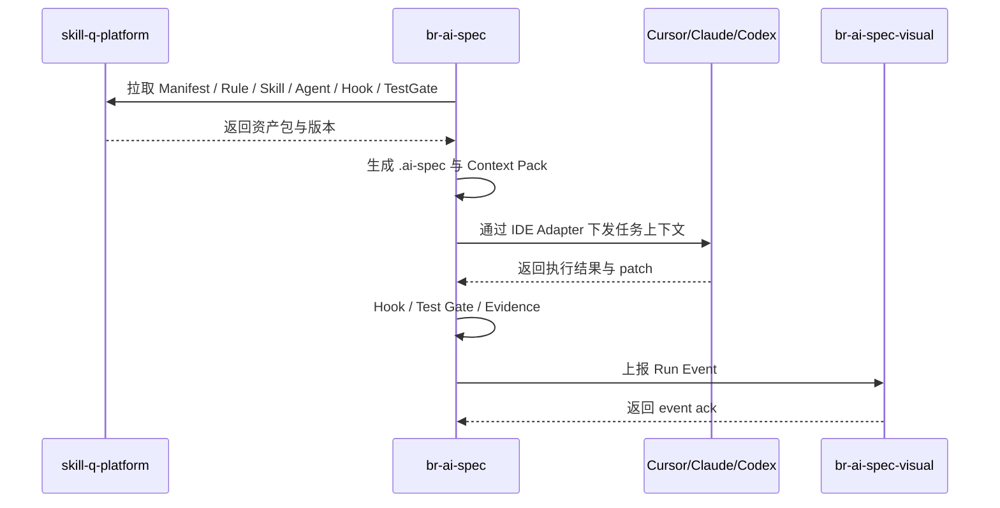

# 三仓 V0.1 改造实施方案

涉及仓库：

1. `br-ai-spec`：本地控制器。
2. `skill-q-platform`：资产治理中心。
3. `br-ai-spec-visual`：运行观测中心。

实施原则：先契约，后实现；先本地闭环，后平台治理；先 Mock Visual，后完整观测。

---

## 1. 总体推进策略

```text
阶段 1：协议冻结
阶段 2：br-ai-spec 本地闭环
阶段 3：skill-q-platform 最小资产管理
阶段 4：br-ai-spec-visual 最小 Run 观测
阶段 5：三仓联调
阶段 6：中台金融系统样板链路验证
```

---

## 2. 三仓对接关系



---

## 3. br-ai-spec 改造方案

### 3.1 定位

本地 AI 研发控制器，负责在业务项目内完成协议目录生成、OpenSpec、Context Pack、Task DAG、worktree、执行调度、测试验收、证据落盘和 Visual 上报。

### 3.2 建议模块

```text
src/
├── cli/
├── config/
├── project-scanner/
├── openspec/
├── context/
├── assets/
├── agents/
├── task-dag/
├── scheduler/
├── worktree/
├── patch/
├── merge/
├── hooks/
├── test-gates/
├── evidence/
├── visual-client/
├── resume/
└── shared/
```

### 3.3 CLI 命令

| 命令 | 作用 | V0.1 必须 |
|---|---|---:|
| `br-spec init` | 初始化项目协议目录 | 是 |
| `br-spec plan` | 需求规划、OpenSpec、Task DAG | 是 |
| `br-spec run` | 执行 Task DAG | 是 |
| `br-spec verify` | 执行测试门禁 | 是 |
| `br-spec report` | 生成交付报告 | 是 |
| `br-spec resume` | 断点续跑 | 是 |
| `br-spec clean` | 清理本地运行态 | 是 |
| `br-spec worktree` | 管理 worktree | 是 |
| `br-spec sync` | 从 Hub 同步资产 | 可选，V0.1 可本地模拟 |

### 3.4 br-spec init 产物

```text
openspec/
.ai-spec/project.config.json
.ai-spec/manifest.lock.json
.ai-spec/context-policy.json
.ai-spec/evidence-policy.json
.ai-spec/memory/
.ai-spec-local/
```

### 3.5 br-spec plan 产物

```text
openspec/changes/{changeId}/
.ai-spec-local/runs/{runId}/run.bundle.json
.ai-spec-local/runs/{runId}/task-dag.json
.ai-spec-local/runs/{runId}/evidence-index.json
```

### 3.6 br-spec run 关键步骤

1. 读取 task-dag.json。
2. 创建 change branch。
3. Dependency Analyzer 计算可执行节点。
4. Lock Manager 检查 writeSet / lockKeys。
5. Worktree Manager 为可执行 Task 创建 worktree。
6. Executor Pool 分配执行 Agent。
7. 每个 Executor 生成 patch-bundle。
8. Merge Agent 合并到 change branch。
9. 写入 run.log.jsonl。
10. 上报 Visual。

---

## 4. skill-q-platform 改造方案

### 4.1 V0.1 目标

V0.1 不追求复杂资产市场，只实现最小资产治理闭环：

```text
资产创建 → 草稿 → 审核 → 发布 → CLI 同步 → 执行记录回传
```

### 4.2 新增资产类型

| 资产 | 说明 |
|---|---|
| Manifest | 规范包总索引 |
| Rule | 编码规则 |
| Skill | 可复用任务能力 |
| Agent Profile | 专家角色定义 |
| Hook Spec | 门禁规则 |
| Test Gate | 测试门禁 |
| Context Policy | 上下文策略 |
| Evidence Policy | 证据策略 |

### 4.3 最小数据模型

```sql
CREATE TABLE asset_manifest (
  id BIGINT PRIMARY KEY AUTO_INCREMENT,
  manifest_key VARCHAR(128) NOT NULL,
  name VARCHAR(255) NOT NULL,
  version VARCHAR(64) NOT NULL,
  stack_tags JSON,
  asset_refs JSON,
  status VARCHAR(32) NOT NULL DEFAULT 'draft',
  created_by VARCHAR(128),
  created_at DATETIME DEFAULT CURRENT_TIMESTAMP,
  updated_at DATETIME DEFAULT CURRENT_TIMESTAMP ON UPDATE CURRENT_TIMESTAMP,
  UNIQUE KEY uk_manifest_key_version (manifest_key, version)
);

CREATE TABLE asset_item (
  id BIGINT PRIMARY KEY AUTO_INCREMENT,
  asset_key VARCHAR(128) NOT NULL,
  asset_type VARCHAR(64) NOT NULL,
  name VARCHAR(255) NOT NULL,
  version VARCHAR(64) NOT NULL,
  content_json JSON NOT NULL,
  summary TEXT,
  status VARCHAR(32) NOT NULL DEFAULT 'draft',
  created_by VARCHAR(128),
  created_at DATETIME DEFAULT CURRENT_TIMESTAMP,
  updated_at DATETIME DEFAULT CURRENT_TIMESTAMP ON UPDATE CURRENT_TIMESTAMP,
  UNIQUE KEY uk_asset_key_version (asset_key, version)
);
```

### 4.4 API

| 接口 | 方法 | 说明 |
|---|---|---|
| `/api/assets/manifests` | GET | 查询 Manifest |
| `/api/assets/manifests` | POST | 创建 Manifest |
| `/api/assets/items` | GET | 查询资产 |
| `/api/assets/items` | POST | 创建资产 |
| `/api/assets/items/{id}/publish` | POST | 发布资产 |
| `/api/assets/bundles/{manifestKey}` | GET | 获取 CLI 同步资产包 |

---

## 5. br-ai-spec-visual 改造方案

### 5.1 V0.1 页面

| 页面 | 说明 |
|---|---|
| Run 列表 | 查看所有任务运行 |
| Run 详情 | 查看当前任务状态 |
| Task DAG | 查看任务依赖和进度 |
| Agent Trace | 查看 Agent 执行轨迹 |
| Worktree 面板 | 查看 worktree 状态 |
| Test Result | 查看测试结果 |
| Evidence Viewer | 查看证据索引和报告 |
| Merge Report | 查看合并记录 |

### 5.2 Run Event API

```http
POST /api/runs/events
Content-Type: application/json
```

请求：

```json
{
  "runId": "run_20260428_001",
  "eventType": "task.completed",
  "timestamp": "2026-04-28T10:00:00+08:00",
  "payload": {}
}
```

### 5.3 最小数据表

```sql
CREATE TABLE ai_run (
  id BIGINT PRIMARY KEY AUTO_INCREMENT,
  run_id VARCHAR(128) NOT NULL UNIQUE,
  change_id VARCHAR(128),
  title VARCHAR(255),
  status VARCHAR(32),
  task_level VARCHAR(16),
  repo_name VARCHAR(255),
  branch_name VARCHAR(255),
  created_at DATETIME DEFAULT CURRENT_TIMESTAMP,
  updated_at DATETIME DEFAULT CURRENT_TIMESTAMP ON UPDATE CURRENT_TIMESTAMP
);

CREATE TABLE ai_run_event (
  id BIGINT PRIMARY KEY AUTO_INCREMENT,
  run_id VARCHAR(128) NOT NULL,
  event_type VARCHAR(128) NOT NULL,
  payload_json JSON,
  created_at DATETIME DEFAULT CURRENT_TIMESTAMP,
  INDEX idx_run_id (run_id),
  INDEX idx_event_type (event_type)
);
```

---

## 6. 三仓联调契约

### 6.1 br-ai-spec → skill-q-platform

```text
GET /api/assets/bundles/{manifestKey}?version=latest
```

用途：拉取资产包。

### 6.2 br-ai-spec → br-ai-spec-visual

```text
POST /api/runs/events
POST /api/runs/snapshots
```

用途：上报运行事件与状态快照。

### 6.3 skill-q-platform → br-ai-spec-visual

V0.1 不强依赖。后续可展示“某个资产版本被多少次 Run 使用”。

---

## 7. 开发优先级

### P0：br-ai-spec 本地闭环

- JSON Schema。
- init / plan / run / verify / report。
- OpenSpec Builder。
- Context Pack。
- Task DAG。
- worktree 管理。

### P1：skill-q-platform 最小资产治理

- Manifest CRUD。
- Rule / Skill / Agent Profile CRUD。
- Bundle API。

### P2：br-ai-spec-visual 最小观测

- Run Event 接收。
- Run 列表与详情。
- Task DAG 展示。
- Evidence 展示。

### P3：联调

- br-ai-spec 同步 Hub 资产。
- br-ai-spec 上报 Visual。
- 样板需求验证。

---

## 8. 评审重点

1. 三仓职责是否过于分散？
2. br-ai-spec 是否承担过多逻辑？
3. Hub V0.1 是否需要审核流？
4. Visual 是否可先做 Mock 页面？
5. 三仓接口是否需要 OpenAPI 文档？
6. 是否需要先支持本地文件资产，后支持 Hub？
