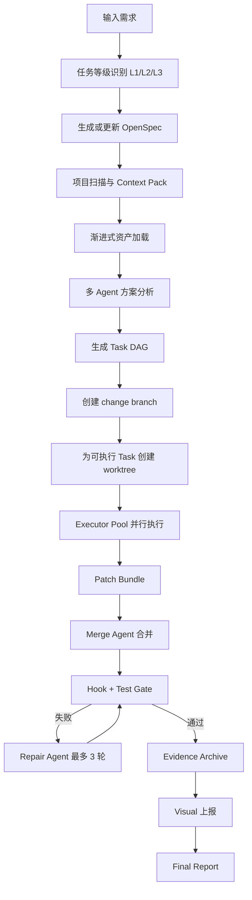

# V0.1 技术架构设计文档

文档状态：评审版  
核心关键词：Graph-Governed Multi-Agent、OpenSpec、Context Pack、Git Worktree、Executor Pool、Evidence、Visual

---

## 1. 架构总览

V0.1 采用“资产治理中心 + 本地控制器 + AI IDE 执行器 + 运行观测中心”的架构。

```mermaid
flowchart LR
  subgraph Hub[skill-q-platform 资产治理中心]
    M[Manifest]
    R[Rule]
    S[Skill]
    A[Agent Profile]
    H[Hook Spec]
    T[Test Gate]
  end

  subgraph Local[br-ai-spec 本地控制器]
    CLI[CLI]
    CP[Context Pack Builder]
    OS[OpenSpec Loader]
    DAG[Task DAG Planner]
    SCH[Executor Scheduler]
    WT[Worktree Manager]
    MG[Merge Agent]
    VG[Verify Engine]
    EV[Evidence Writer]
  end

  subgraph IDE[AI IDE 执行器]
    Cursor[Cursor]
    Claude[Claude Code]
    Codex[Codex]
  end

  subgraph Visual[br-ai-spec-visual 运行观测]
    Run[Run Dashboard]
    Trace[Agent Trace]
    Evidence[Evidence Viewer]
    Metrics[Quality Metrics]
  end

  Hub -->|资产同步| Local
  Local -->|IDE Adapter| IDE
  IDE -->|执行结果 / patch| Local
  Local -->|Run Event| Visual
```



---

## 2. 三仓职责边界

### 2.1 br-ai-spec：本地控制器

负责在业务项目本地执行：

1. 初始化 `openspec/`、`.ai-spec/`、`.ai-spec-local/`。
2. 生成 Context Pack。
3. 管理 OpenSpec 读取与压缩。
4. 生成 Task DAG。
5. 创建 change branch 和 task worktree。
6. 调度 Executor Pool。
7. 执行 Hook 和 Test Gate。
8. 生成 Evidence 和 Final Report。
9. 向 Visual 上报事件。

### 2.2 skill-q-platform：资产治理中心

负责企业 AI 资产管理：

1. Manifest 规范包。
2. Rule 编码规则。
3. Skill 任务技能。
4. Agent Profile 专家角色。
5. Hook Spec 门禁规则。
6. Test Gate 测试门禁。
7. Context Policy 上下文策略。
8. Evidence Policy 证据策略。
9. 审核、版本、发布、分发。

### 2.3 br-ai-spec-visual：运行观测中心

负责展示：

1. Run 状态。
2. Task DAG 进度。
3. Agent 执行轨迹。
4. worktree 状态。
5. patch 合并结果。
6. 测试与验收结果。
7. 失败与自修复记录。
8. 质量指标趋势。

---

## 3. 业务项目最小侵入目录

业务项目根目录只新增三个顶层目录：

```text
业务项目根目录
├── openspec/
├── .ai-spec/
├── .ai-spec-local/
└── 业务源码保持原样
```

### 3.1 openspec

作为需求规格事实源，建议入 Git。

```text
openspec/
├── project.md
├── specs/
├── changes/
└── archive/
```

### 3.2 .ai-spec

作为 AI 规范与执行协议目录，建议入 Git。

```text
.ai-spec/
├── manifest.lock.json
├── project.config.json
├── context-policy.json
├── evidence-policy.json
├── agents/
├── rules/
├── skills/
├── hooks/
├── test-gates/
├── memory/
└── indexes/
```

### 3.3 .ai-spec-local

作为运行态目录，不入 Git。

```text
.ai-spec-local/
├── runs/
│   └── {runId}/
│       ├── run.bundle.json
│       ├── run.log.jsonl
│       ├── task-dag.json
│       ├── worktree-index.json
│       ├── evidence-index.json
│       ├── merge-report.md
│       ├── final-report.md
│       └── artifacts/
├── cache/
└── tmp/
```

`.gitignore` 必须包含：

```gitignore
.ai-spec-local/
```

---

## 4. 核心执行链路



---

## 5. Graph-Governed Multi-Agent

最终模式不是纯状态机，也不是纯多 Agent，而是图约束下的多 Agent 协作：

```text
Graph 管流程
Agent 管专业判断
Executor 管实际修改
Hook 管强约束
Test 管真实性
Evidence 管审计
Visual 管观测
```

### 5.1 Agent 分层

| 层级 | Agent | 职责 | 是否改代码 |
|---|---|---|---:|
| 决策层 | Orchestrator Agent | 拆解、调度、裁决 | 否 |
| 分析层 | Product Agent | 需求边界、验收标准 | 否 |
| 分析层 | Architect Agent | 架构、模块边界 | 否 |
| 分析层 | Frontend Expert Agent | 前端方案 | 否 |
| 分析层 | Backend Expert Agent | 后端方案 | 否 |
| 分析层 | Database Agent | 表、索引、迁移 | 否 |
| 分析层 | QA Agent | 测试设计 | 否 |
| 分析层 | Security Agent | 权限、安全、敏感字段 | 否 |
| 执行层 | Executor Agent | 按 Task 修改代码 | 是 |
| 修复层 | Repair Agent | 限定范围自修复 | 是 |
| 归档层 | Docs Agent | 文档和证据 | 否 |

核心规则：专家 Agent 不直接改代码，Executor Agent 根据结构化 Task 包执行，Repair Agent 只能在失败范围内做有限修复。

---

## 6. Task DAG 与并行执行

### 6.1 Task 节点最小字段

```json
{
  "taskId": "task_backend_product_config_api",
  "title": "实现产品配置后端接口",
  "dependsOn": ["task_contract_product_config_api"],
  "readSet": ["backend/src/main/java/**"],
  "writeSet": ["backend/src/main/java/**/ProductConfig*.java"],
  "lockKeys": ["api:/product-config", "module:product-config"],
  "executorType": "backend-executor",
  "parallelizable": true,
  "acceptanceRefs": ["AC-001", "AC-002"]
}
```

### 6.2 并行规则

允许并行必须同时满足：

1. `writeSet` 无交集。
2. `lockKeys` 无冲突。
3. `dependsOn` 已完成。
4. API Contract 已冻结。
5. 风险等级允许并行。
6. 合并后可统一验证。

不能只按“是否修改同一个文件”判断是否并行，因为不同文件也可能共享接口契约、Vuex 模块、Redis Key、MQ Topic、权限码或数据库表。

---

## 7. Git worktree 执行隔离

### 7.1 分支模型

```text
main / develop
  └── ai/change/product-config-20260428
        ├── ai/task/product-config-db-schema
        ├── ai/task/product-config-backend-api
        ├── ai/task/product-config-frontend-page
        └── ai/task/product-config-tests
```

### 7.2 worktree 模型

```text
~/.br-spec/worktrees/{repoHash}/{runId}/
├── task-db-schema/
├── task-backend-api/
├── task-frontend-page/
└── task-tests/
```

### 7.3 粒度裁决

worktree 粒度不是 Agent，也不是 Step，而是：

> 一个可独立交付、可独立验证、可独立合并的 Task。

---

## 8. OpenSpec 读取与压缩

OpenSpec 放在项目根目录：

```text
openspec/
├── specs/
├── changes/
└── archive/
```

不允许把完整 OpenSpec 全量喂给模型。必须通过索引和视图读取：

```text
.ai-spec/indexes/openspec-index.json
.ai-spec-local/runs/{runId}/openspec-view.md
```

阶段读取策略：

| 阶段 | 读取内容 |
|---|---|
| plan | project.md、相关 spec 摘要、当前 change 草案 |
| design | proposal、design、相关 spec delta |
| run | 当前 Task 对应的 spec 片段 |
| verify | acceptance、test scenarios |
| report | 完整 change 与执行结果 |

---

## 9. Context Pack 设计

核心文件：

```text
.ai-spec-local/runs/{runId}/run.bundle.json
```

设计原则：

1. 不生成过多散文件。
2. 大文件放 artifacts，通过 evidence-index 引用。
3. Context Pack 只保留当前任务必要上下文。
4. 阶段切换、Token 超阈值、测试失败、关键决策后触发压缩。
5. 压缩摘要必须保留：已确认事实、已做决策、禁止修改范围、失败原因、下一步动作。

---

## 10. Hook 与 Test Gate

### 10.1 Hook

| Hook | 作用 |
|---|---|
| Scope Guard | 禁止修改 writeSet 外文件 |
| Dangerous File Guard | 禁止删除高风险文件 |
| Secret Guard | 禁止读取或输出敏感配置 |
| Diff Guard | 检查过度修改 |
| Evidence Gate | 证据缺失禁止完成 |
| Repair Limit Guard | 自修复超过 3 轮后停止 |

### 10.2 Test Gate

| Gate | 说明 |
|---|---|
| lint | 前后端静态检查 |
| typecheck | TypeScript / Java 编译校验 |
| unit-test | 单元测试 |
| api-test | 接口测试 |
| integration-test | 集成测试 |
| e2e-test | 端到端测试 |
| acceptance | 验收清单 |

---

## 11. Visual 上报事件

最小事件模型：

```text
run.created
run.planned
task.created
task.started
task.completed
task.failed
worktree.created
patch.generated
patch.merged
verify.started
verify.failed
repair.started
repair.completed
evidence.generated
run.completed
```

---

## 12. 架构风险与缓解

| 风险 | 缓解 |
|---|---|
| Task DAG 生成不准 | 人工确认 Gate + 可编辑任务清单 |
| worktree 过多 | Task 合并策略 + 自动 clean |
| OpenSpec 太重 | openspec-view + 摘要索引 |
| 多 Agent 成本高 | L1 不启用完整多 Agent，L2/L3 启用 |
| Visual 依赖阻塞 | V0.1 允许本地 JSON mock 上报 |
| 业务项目侵入 | 限制新增目录，源码不改结构 |
