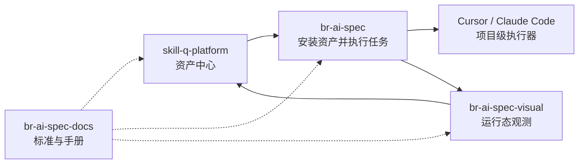

# 多仓库职责边界说明

## 1. 为什么需要多仓库补充执行包

原 P0-P5 是平台整体路线，但不代表所有阶段都应该在 `br-ai-spec` 一个仓库完成。当前 `br-ai-spec` 已执行过 P0-P5，Visual 和 Hub 没有被修改，这是正常现象，但需要通过多仓库任务包完成后续落地。

## 2. 正确边界

| 能力 | 归属仓库 | 说明 |
| --- | --- | --- |
| CLI 初始化 | br-ai-spec | 负责项目初始化、目录治理、本地运行态目录 |
| Harness Runtime | br-ai-spec | 负责执行边界、Hook、测试、修复、Evidence |
| Cursor / Claude Adapter | br-ai-spec | 负责生成 IDE 适配文件 |
| Run Event 产生 | br-ai-spec | 负责产生结构化事件 |
| Run Event 展示 | br-ai-spec-visual | 负责 Timeline 和指标展示 |
| Asset 管理 | skill-q-platform | 负责资产模型、审核、发布、版本、回滚 |
| Asset 安装 | br-ai-spec | 负责从 Hub 安装到项目 |
| 资产质量分析 | br-ai-spec-visual + skill-q-platform | Visual 统计，Hub 记录质量结果 |
| 标准与说明 | br-ai-spec-docs | 负责沉淀规范和操作手册 |

## 3. 最终链路

