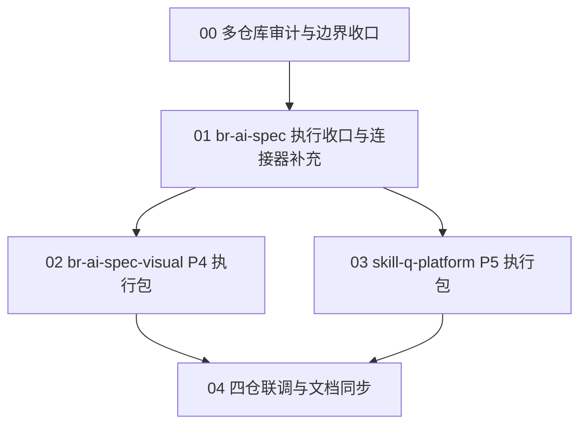

# 阶段依赖关系说明

```mermaid
flowchart TD
  A[00 多仓库审计与边界收口] --> B[01 br-ai-spec 执行收口与连接器补充]
  B --> C[02 br-ai-spec-visual P4 执行包]
  B --> D[03 skill-q-platform P5 执行包]
  C --> E[04 四仓联调与文档同步]
  D --> E
```

必须先冻结 br-ai-spec 当前成果和跨仓库协议，再推进 Visual 与 Hub，最后联调。
