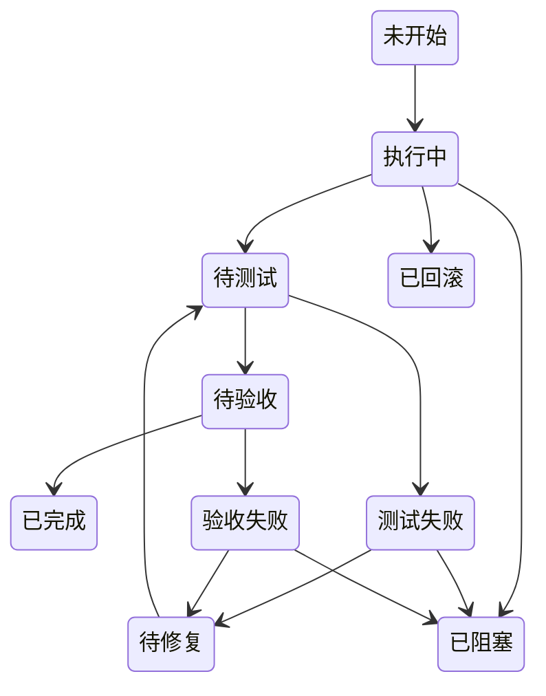

# 阶段状态流转规范

状态枚举：未开始 / 执行中 / 待测试 / 测试失败 / 待修复 / 待验收 / 验收失败 / 已完成 / 已阻塞 / 已回滚

```mermaid
stateDiagram-v2
  未开始 --> 执行中
  执行中 --> 待测试
  待测试 --> 待验收
  待验收 --> 已完成
  待测试 --> 测试失败
  测试失败 --> 待修复
  待修复 --> 待测试
  待验收 --> 验收失败
  验收失败 --> 待修复
  执行中 --> 已阻塞
  测试失败 --> 已阻塞
  验收失败 --> 已阻塞
  执行中 --> 已回滚
```
