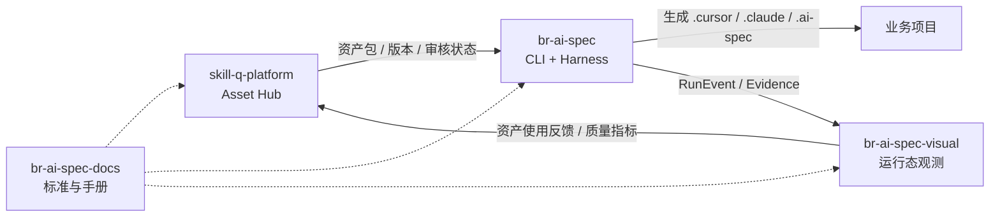

# 四仓最终关系图

```mermaid
flowchart LR
  Hub[skill-q-platform<br/>Asset Hub] -->|资产包 / 版本 / 审核状态| Spec[br-ai-spec<br/>CLI + Harness]
  Spec -->|生成 .cursor / .claude / .ai-spec| Project[业务项目]
  Spec -->|RunEvent / Evidence| Visual[br-ai-spec-visual<br/>运行态观测]
  Visual -->|资产使用反馈 / 质量指标| Hub
  Docs[br-ai-spec-docs<br/>标准与手册] -.-> Hub
  Docs -.-> Spec
  Docs -.-> Visual
```
