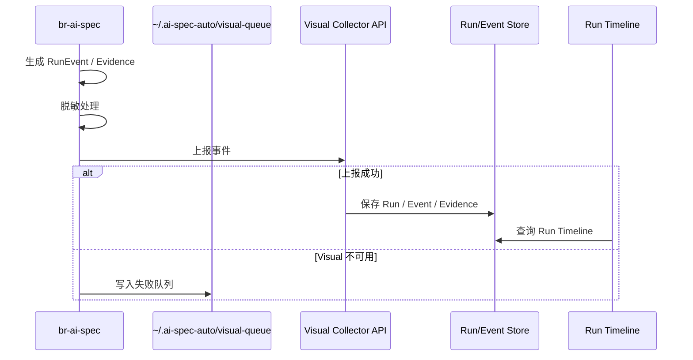

# P4 运行态观测链路图

```mermaid
sequenceDiagram
  participant CLI as br-ai-spec
  participant Queue as ~/.ai-spec-auto/visual-queue
  participant API as Visual Collector API
  participant DB as Run/Event Store
  participant UI as Run Timeline
  CLI->>CLI: 生成 RunEvent / Evidence
  CLI->>CLI: 脱敏处理
  CLI->>API: 上报事件
  alt 上报成功
    API->>DB: 保存 Run / Event / Evidence
    UI->>DB: 查询 Run Timeline
  else Visual 不可用
    CLI->>Queue: 写入失败队列
  end
```
