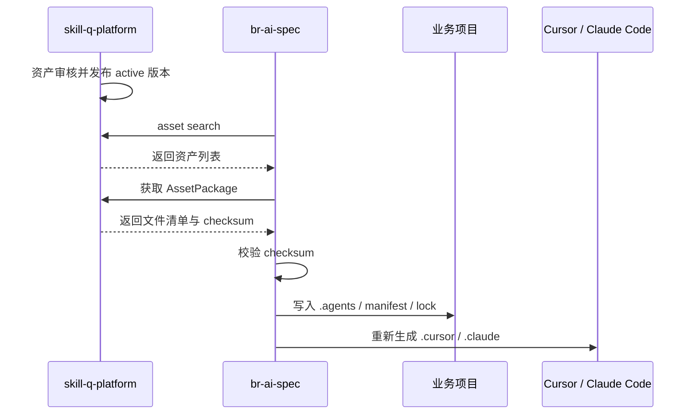

# P5 资产安装链路图

```mermaid
sequenceDiagram
  participant Hub as skill-q-platform
  participant CLI as br-ai-spec
  participant Repo as 业务项目
  participant IDE as Cursor / Claude Code
  Hub->>Hub: 资产审核并发布 active 版本
  CLI->>Hub: asset search
  Hub-->>CLI: 返回资产列表
  CLI->>Hub: 获取 AssetPackage
  Hub-->>CLI: 返回文件清单与 checksum
  CLI->>CLI: 校验 checksum
  CLI->>Repo: 写入 .agents / manifest / lock
  CLI->>IDE: 重新生成 .cursor / .claude
```
