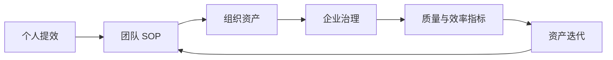

# 项目价值与痛点分析报告

## 1. 研发团队使用 AI 编码的现状

当前 AI 编程正在从个人提效工具进入团队协作工具阶段。企业研发的核心诉求不是“能不能生成代码”，而是生成过程是否符合项目规范、是否可测试、是否可验收、是否可追溯、是否可复用、是否安全。

## 2. 当前 AI 编码存在的问题与影响

| 问题 | 严重程度 | 影响范围 | 不解决的后果 |
| --- | --- | --- | --- |
| AI 开发不可控 | 高 | 所有使用 AI 的项目 | 生成代码质量不稳定，安全风险上升 |
| Prompt 分散 | 高 | 个人和团队 | 经验无法复用，新人无法继承 |
| Cursor / Claude / Codex 各自为战 | 中高 | 使用多 IDE 的团队 | 规则重复维护，结果不一致 |
| 缺少统一项目级规范 | 高 | 存量项目 | AI 不懂架构边界和代码风格 |
| 缺少自动测试与验收闭环 | 高 | 交付质量 | 缺陷后移，Review 成本上升 |
| 缺少 Review 和 Repair 机制 | 中高 | 开发流程 | AI 失败后只能人工接管 |
| 缺少过程审计 | 高 | 企业治理 | 无法追踪谁让 AI 做了什么 |
| 缺少资产沉淀 | 高 | 组织能力 | 经验不能复用和版本化 |
| 缺少跨项目复用 | 中高 | 多项目团队 | 重复造规则和提示词 |
| 缺少企业级治理 | 高 | 公司级推广 | 无法规模化使用 |
| 新人上手项目慢 | 中 | 项目维护 | 项目知识依赖老人 |
| 公司无法衡量 AI 开发真实价值 | 高 | 管理决策 | 无法判断投入是否有效 |

## 3. 不解决会带来的风险

1. AI 工具使用规模越大，Review 和安全风险越大。
2. 团队经验持续沉没在个人聊天记录中。
3. 多 IDE 使用方式割裂，造成重复配置和结果不一致。
4. 企业无法量化 AI 投入产出，难以做资源决策。
5. 规范不进入机器可读资产，AI 仍然靠临时提示词执行。

## 4. 痛点到能力映射

| 痛点 | 平台能力 | 解决方式 |
| --- | --- | --- |
| AI 开发不可控 | Harness Runtime | 控制上下文、权限、Hook、测试和修复边界 |
| Prompt 分散 | Rule / Skill / Command / Memory | 将经验变成项目资产 |
| 工具割裂 | IDE Adapter | 从同一 Manifest 生成不同 IDE 适配文件 |
| 缺少项目级规范 | Spec Center + Memory Center | 把规范和上下文放到项目可读位置 |
| 测试遗漏 | Test Plan + Hook Engine | 让测试成为完成前门禁 |
| Review 成本高 | Review Checklist + Evidence | 让 Review 看到依据和结果 |
| 过程不可审计 | Run Event + Audit | 记录关键事件和证据 |
| 资产不可复用 | Asset Hub + Lock | 资产版本化、审核、分发、回滚 |

## 5. 对个人开发者的价值

| 价值项 | 当前痛点 | 平台能力 | 个人收益 | 衡量指标 |
| --- | --- | --- | --- | --- |
| 减少重复写 Prompt | 每次靠临时对话描述需求和项目规范 | Rule、Skill、Command、Memory 项目化 | 少写重复提示词，AI 更快进入项目状态 | 重复 Prompt 数量下降、任务启动时间下降 |
| 让 AI 更懂项目 | 上下文散落在聊天和个人经验里 | 项目级 Memory、Manifest、Cursor/Claude 双适配 | AI 输出更贴近项目架构和风格 | AI 代码采纳率、首次通过率 |
| 降低需求理解偏差 | 需求直接丢给 AI 容易误解范围 | Spec / Test Plan / DoD 先行 | 减少返工，提升交付确定性 | 需求返工次数、Review 问题数 |
| 降低测试遗漏 | AI 常只改代码不补测试 | Hook + Test Plan + post-test 门禁 | 减少遗漏用例和低质量提交 | 测试覆盖项、构建通过率 |
| 形成个人可复用开发资产 | 个人技巧不可复用、不可迁移 | 个人 Skill、命令模板、经验提案 | 跨项目复用方法论 | 个人资产复用次数 |
| 帮助新人快速理解项目规范 | 新人不知道项目规则和上下文入口 | AGENTS.md、CLAUDE.md、.cursor/rules、.memory | 缩短熟悉项目时间 | 新人上手时间 |
| 降低跨项目切换成本 | 不同项目规则入口不同 | 统一目录、统一命令、统一资产结构 | 切换项目更快 | 项目接入耗时 |
| 提升个人交付确定性 | AI 输出质量靠运气 | 测试、验收、修复闭环 | 交付更稳定 | 任务完成率 |

## 6. 对团队开发者的价值

| 价值项 | 当前团队问题 | 平台能力 | 团队收益 | 衡量指标 |
| --- | --- | --- | --- | --- |
| 统一团队 AI 开发方式 | 成员各用各的提示词和工具习惯 | 统一资产 Manifest 与 IDE Adapter | 减少协作摩擦和风格差异 | 规范覆盖率、规则命中率 |
| 统一项目规范入口 | 规范散落在 README、Wiki、聊天记录中 | .agents / .memory / openspec / .harness | AI 与人都读同一套规则 | 规范引用次数、规则失配次数 |
| 统一 Cursor / Claude Code 使用方式 | 两个 IDE 规则不一致 | 同源生成 .cursor 与 .claude 文件 | 降低工具切换成本 | 双 IDE 一致性检查通过率 |
| 统一测试和验收标准 | 不同成员验收口径不一致 | Test Plan / DoD / Review Checklist | 减少低级问题进入 Review | 首次测试通过率 |
| 减少 Prompt 和经验割裂 | 经验留在个人聊天里 | Skill / Rule / Workflow 沉淀 | 团队能力可继承 | 资产复用率 |
| 降低代码风格不一致 | AI 按不同提示生成不同风格 | 项目级 Rule 和 Hook | 代码风格一致 | lint 通过率 |
| 降低 Review 成本 | AI 产物质量不稳定 | Review Checklist、Evidence Report | 减少 Review 返工 | Review 问题数 |
| 形成团队级 AI 开发 SOP | 没有固定流程 | Spec → Test → Review → Repair | 流程可复制 | 任务完成率 |

## 7. 对公司和企业研发体系的价值

| 价值项 | 企业级痛点 | 平台能力 | 公司收益 | 衡量指标 |
| --- | --- | --- | --- | --- |
| 降低 AI 开发不可控风险 | AI 可直接改代码但过程不可追踪 | Harness Runtime、Hook、Evidence、Audit | 降低大规模使用 AI 的失控风险 | 审计覆盖率、Hook 阻塞率 |
| 降低 AI 生成代码质量风险 | AI 代码可能不符合规范、未测试 | Test & Verification、Review、Repair | 提升交付质量 | 首次测试通过率、回归缺陷数 |
| 降低安全和合规风险 | 密钥、源码、隐私信息可能外泄 | Security Policy、脱敏、源码不出域、本地运行态 | 满足企业安全边界 | 敏感信息拦截次数、策略命中率 |
| 降低人员经验流失风险 | 人员离开后项目经验断层 | Memory、ADR、Rule、Skill 留存 | 经验可被继承 | 知识资产完整度、新人上手时间 |
| 沉淀公司级研发规范资产 | 规范和经验难以沉淀为组织资产 | Asset Hub、版本、审核、灰度、回滚 | 形成公司级 AI 工程资产库 | 公司级资产复用率 |
| 建立企业级 AI 工程治理体系 | AI 使用缺少统一治理 | RBAC、Audit、Policy、Visual | 可管理可审计 | 审计覆盖率 |
| 提升跨项目复用能力 | 每个项目重复建设规则 | Asset Package、Config Layer | 降低重复成本 | 跨项目资产复用率 |
| 支撑 AI Native 工程化转型 | AI 工具使用停留在个人效率层面 | 平台化、治理化、可观测化 | 推动研发体系升级 | 接入项目数、团队覆盖率 |

## 8. 价值闭环

## 9. 价值优先级与阶段释放

| 阶段 | 个人价值 | 团队价值 | 公司价值 |
| --- | --- | --- | --- |
| P0 | 少写 Prompt、AI 更懂项目 | 双 IDE 使用方式统一 | 证明规范驱动 AI 开发可控 |
| P1 | 跨项目切换更低成本 | 多项目复制规范 | 降低重复建设 |
| P2 | 专业 Agent 帮助 Review / 修复 | 角色协作更清晰 | 降低复杂任务风险 |
| P3 | 权限和规则更明确 | 资产发布和例外有流程 | 企业级治理可落地 |
| P4 | 能看到自己任务表现 | 团队质量可复盘 | AI 价值可量化 |
| P5 | 复用组织资产 | 团队最佳实践复用 | 公司资产市场形成 |
