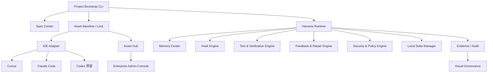
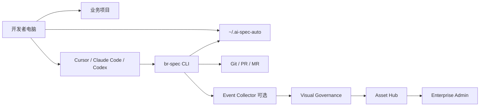

# 总体架构设计说明书

## 1. 架构目标

1. 支持个人本地最小闭环。
2. 支持团队多项目复制。
3. 支持企业权限、审计、安全和资产治理。
4. 支持 Cursor、Claude Code、Codex 等执行器适配。
5. 保证业务项目低入侵，运行态和敏感态不污染 Git。
6. 支持 P0-P5 渐进式演进。

## 2. 架构原则

| 原则 | 说明 |
|---|---|
| 控制面与执行面分离 | Harness 管边界，IDE / Agent 做执行 |
| 项目资产与运行态分离 | 项目内放规范资产，用户目录放运行态 |
| 协议优先 | 先定义 Manifest / Lock / Adapter Protocol |
| 安全默认 | 密钥、原始 Prompt、敏感日志不提交 |
| 可观测 | 每次运行形成 Run Event 和 Evidence |
| 可回滚 | 资产、配置、适配输出可回滚 |

## 3. 逻辑架构

## 4. 物理架构

| 位置 | 内容 |
|---|---|
| 业务项目仓库 | `.ai-spec/`、`.agents/`、`.cursor/`、`.claude/`、`.memory/`、`.harness/` |
| 用户电脑 | `~/.ai-spec-auto/projects/{projectId}/` |
| 企业平台 | Visual、Asset Hub、Admin Console |
| Git / CI | 代码评审、构建、测试、发布流程 |

## 5. 部署架构

## 6. 模块边界

| 模块 | 输入 | 输出 | 边界 |
| --- | --- | --- | --- |
| Project Bootstrap CLI | 项目路径、配置 | 目录、配置、报告 | 只负责初始化和命令入口 |
| Spec Center | 需求、历史 Spec | Spec、Test Plan、DoD | 不直接运行代码 |
| Harness Runtime | 任务、资产、上下文 | 执行状态、门禁结果 | 不替代 AI 模型 |
| IDE Adapter | Manifest、Rule、Memory | Cursor / Claude / Codex 文件 | 不维护业务逻辑 |
| Memory Center | 项目文档、ADR、运行反馈 | 分层 Memory | 长期写入需治理 |
| Hook Engine | Hook 配置、命令 | Hook 结果 | 不能降低测试标准 |
| Agent Runtime | Agent Profile、任务 | Agent 输出 | 受权限和上下文控制 |
| Test Engine | 测试命令、Test Plan | 测试结果 | 不伪造结果 |
| Security Policy | 策略、工具请求 | 允许/拒绝 | 默认安全 |
| Local State | run、cache、logs | 本地运行态 | 不提交 Git |
| Visual | Run Event、指标 | 看板和复盘 | 不存完整源码 |
| Asset Hub | 资产包 | 版本、审核、分发 | 不无审核发布 |

## 7. 核心流转

| 流程 | 说明 |
|---|---|
| 数据流 | 需求 → Spec → Manifest / Memory → IDE Adapter → AI 执行 → Hook / Test → Evidence → Visual / Metrics |
| 控制流 | Harness 检查 Spec、组装上下文、校验权限、触发 Hook、运行测试、控制 Repair、归档 Evidence |
| Agent 协作流 | Requirement / Architect / Implementer / Test / Security / Repair Agent 在 Harness 控制下协作 |
| Hook 流 | pre-task → pre-edit → post-edit → pre-test → post-test → review → repair → archive |
| Memory 流 | 全局 / 企业 / 团队 / 项目 / 模块 / Agent / Run 分层，长期写入需治理 |
| Evidence 流 | runId、projectId、taskId、changedFiles、testResults、hookResults、repairResults、finalStatus |

## 8. 安全边界

1. 项目源码默认不上传。
2. 原始 Prompt、密钥、敏感日志不提交 Git。
3. AI 修改文件需受 allowedFileScopes 限制。
4. 危险命令受命令白名单控制。
5. 运行态放入 `~/.ai-spec-auto/`。
6. 上报 Visual 前必须脱敏。

## 9. 三种使用模式

| 模式 | 说明 | 适用阶段 |
|---|---|---|
| 个人本地使用 | 只使用 CLI、Cursor、Claude Code、本地状态目录 | P0 |
| 团队协作使用 | 多项目复制、团队规则、统一验收 | P1-P2 |
| 企业治理使用 | 权限、审计、灰度、Visual、Hub、Admin | P3-P5 |
