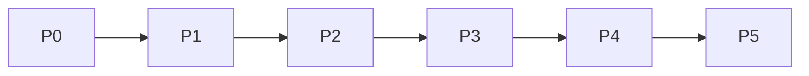

# P0-P5 路线图与里程碑计划

## 1. 阶段总览

| 阶段 | 阶段名称 | 核心目标 | 推荐周期 |
| --- | --- | --- | --- |
| P0 | Cursor + Claude Code 双 IDE 项目级最小闭环 | 验证单项目规范驱动 AI 开发闭环 | 3-5 周 |
| P1 | 多项目标准化与 Adapter Protocol | 让多项目可复制接入，固化适配协议和资产包标准 | 3-4 周 |
| P2 | 受控多 Agent 协作 | 引入专业 Agent，但由 Harness 控制边界 | 4-6 周 |
| P3 | 企业级治理、权限、审计、灰度、回滚 | 从团队工具升级为企业可治理平台 | 6-8 周 |
| P4 | Visual 可观测、质量度量、运行复盘 | 让 AI 开发过程可视、可度量、可复盘 | 4-6 周 |
| P5 | Asset Hub、组织级资产复用、资产市场 | 沉淀组织级 Rule / Skill / Agent / Workflow 资产 | 长期演进 |

## 2. 阶段明细

| 阶段 | 范围 | 不做什么 | 交付物 | 验收标准 | 主要风险 | 退出条件 |
| --- | --- | --- | --- | --- | --- | --- |
| P0 | CLI、目录治理、Manifest、Lock、Cursor Adapter、Claude Adapter、Local State、Spec/Test/DoD、Hook/Test/Repair/Evidence | Codex 完整适配、完整多 Agent Runtime、企业多租户、资产市场、自动上线 | br-spec init、项目目录、~/.ai-spec-auto、双 IDE 文件、Evidence Report | 完成一次真实 AI 开发任务闭环 | 目录过多、双 IDE 语义不一致、测试命令不标准 | P0 试点项目闭环完成 |
| P1 | 多项目 Scanner、Adapter Protocol、Asset Package、Config Layer、资产锁定和回滚 | 企业级审核、复杂多 Agent、Visual 大屏 | Scanner、协议文档、资产包、配置分层 | 至少 3 类项目可接入 | 项目差异过大 | 多项目接入验证通过 |
| P2 | Agent Profile、权限模型、上下文边界、协作协议、Review/Repair Agent | 自由创建 Agent、自动上线、长期 Memory 自动写入 | 受控多 Agent Runtime | Agent 输出有证据、权限受控 | Agent 过多导致复杂度上升 | 真实任务中完成协作 |
| P3 | RBAC、资产审核、发布、灰度、回滚、审计、安全策略 | 训练私有大模型、替代 Git / CI/CD | Admin Console、Policy Engine、Audit Log | 权限、审计、灰度、回滚可用 | 组织流程复杂 | 企业试点可治理资产 |
| P4 | Run Timeline、Hook/Test/Repair/Agent 可视化、指标统计、风险看板 | 上传完整源码、替代 DevOps / Sentry | Event Gateway、Dashboard、Metrics | 每次 AI 任务可还原关键链路 | 指标口径不清 | 管理层能看到质量趋势 |
| P5 | Rule/Skill/Agent/Workflow/Hook/Command 资产中心、搜索、安装、评分、反馈 | 无审核开放市场 | Asset Hub、资产市场、质量评分 | 资产可搜索、可安装、可审核、可评分 | 资产数量多但质量低 | 多团队复用公司资产 |

## 3. 阶段依赖关系

## 4. 资源投入建议

| 阶段 | 核心人员 | 投入强度 | 上手难度变化 | 释放价值 |
| --- | --- | --- | --- | --- |
| P0 | 负责人、架构师、工具开发、测试、试点开发者 | 中高 | 个人低-中 | 双 IDE 单项目闭环 |
| P1 | 架构师、工具开发、试点团队 | 中 | 团队中 | 多项目复制 |
| P2 | 架构师、Agent 设计、测试、安全 | 中高 | 团队中高 | 复杂任务质量提升 |
| P3 | 后端、权限、安全、DevOps、平台产品 | 高 | 企业高 | 企业治理可落地 |
| P4 | 前端、后端、数据指标、研发效能 | 中高 | 管理使用中 | 可观测和复盘 |
| P5 | 平台团队、资产运营、审核人员 | 长期 | 企业高 | 资产市场和组织复用 |
