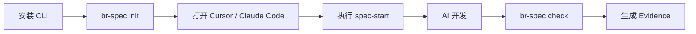

# 上手难度与推广策略分析

## 1. 难度分级

| 难度等级 | 含义 |
|---|---|
| 低 | 可通过文档和命令快速完成 |
| 中 | 需要一定配置和团队协同 |
| 高 | 需要平台支持、权限接入或组织流程配合 |
| 很高 | 涉及组织级改造、治理制度和多系统集成 |

## 2. 个人开发者上手难度

| 项目 | 难度等级 | 说明 | 降低难度方案 |
| --- | --- | --- | --- |
| 需要理解的概念 | 中 | Spec、Rule、Memory、Hook、Evidence | 提供 10 分钟快速开始 |
| 安装工具 | 低 | 安装 CLI、Cursor 或 Claude Code | 一键安装脚本 |
| 执行命令 | 低 | `br-spec init`、`br-spec check` | 命令少而固定 |
| 学习文件 | 中 | AGENTS.md、CLAUDE.md、.cursor/rules、.memory | 自动生成注释和入口说明 |
| 改变习惯 | 中 | 从直接问 AI 改为先走 Spec 和 DoD | 通过 slash command 降低成本 |
| 预计上手时间 | 低-中 | 30 分钟到半天 | 示例项目和模板 |
| 最大阻碍 | 中 | 觉得流程变多 | 用测试通过率和返工减少证明价值 |
| 降低门槛 | 低 | 默认配置、少概念、少命令 | P0 不暴露复杂治理能力 |

## 3. 团队开发者上手难度

| 项目 | 难度等级 | 说明 | 降低难度方案 |
| --- | --- | --- | --- |
| 统一规范 | 中 | 需要整理团队规则 | 先迁移高频规则 |
| 多个项目推广 | 中 | 项目技术栈不同 | Scanner + 模板化接入 |
| 维护团队规则 | 中 | 规则需要负责人 | 设置 Rule Owner |
| 处理项目差异 | 中高 | 不同项目可覆盖规则 | 企业默认 + 项目覆盖 |
| Code Review 和验收 | 中 | 需要统一 Checklist 和 DoD | 模板化 Review Checklist |
| 团队培训 | 中 | 需要推广新 SOP | 工作坊 + 试点复盘 |
| 预计上手周期 | 中 | 1-2 周试点 | 先 1-2 个项目 |
| 最大阻碍 | 中高 | 习惯不统一、收益未量化 | 用 P0 指标证明 |
| 降低门槛 | 中 | 提供团队模板、示例项目、自动报告 | 减少人工配置 |

## 4. 企业开发者上手难度

| 项目 | 难度等级 | 说明 | 降低难度方案 |
| --- | --- | --- | --- |
| 权限体系接入 | 高 | 需要 RBAC / 企业账号体系 | P3 才引入，先本地闭环 |
| 资产审核流程 | 高 | 需要定义 Owner、Reviewer、发布流程 | 先轻审核，再流程化 |
| 多项目治理 | 高 | 需要项目分组和例外规则 | 团队级模板和项目覆盖 |
| 安全合规 | 很高 | 源码不出域、脱敏、密钥保护 | 默认本地运行态和脱敏上报 |
| 私有化部署 | 高 | Visual、Hub、Admin 需要部署运维 | 容器化和最小依赖 |
| 组织推广 | 很高 | 跨团队协同和制度变化 | 分阶段试点，不强推 |
| 数据安全 | 高 | 原始 Prompt、源码、日志不能外泄 | 安全策略和审计 |
| 系统集成 | 高 | Git、CI/CD、测试平台、DevOps | 只集成，不替代 |
| 预计推广周期 | 高 | 3-6 个月起 | 阶段路线和试点指标 |
| 最大阻碍 | 很高 | 组织认知、治理流程、平台维护 | 领导支持 + 清晰 ROI |
| 降低门槛 | 高 | 模板化、权限分层、灰度推广 | 从团队试点到企业推广 |

## 5. 用户类型上手路径

| 用户类型 | 上手难度 | 预计上手时间 | 主要阻碍 | 降低门槛方案 |
| --- | --- | --- | --- | --- |
| 个人开发者 | 低-中 | 30 分钟-半天 | 概念理解和习惯变化 | 快速开始、默认配置、命令化 |
| 前端团队开发者 | 中 | 1-2 周 | 团队规则统一 | React / Vue 模板 |
| 后端团队开发者 | 中 | 1-2 周 | 接口、数据库、测试命令差异 | 后端模板和 Test Plan |
| 测试工程师 | 中 | 1 周 | 测试标准如何进入 AI 流程 | Test Plan 和 Hook 模板 |
| 技术负责人 | 中 | 半天-1 周 | 如何看价值和风险 | 指标看板和 Evidence |
| 架构师 | 中 | 1 周 | 架构规则资产化 | ADR、Rule、Review Checklist |
| 平台管理员 | 高 | 2-4 周 | 权限、部署、Hub、Visual | P3 后标准化部署手册 |
| 企业安全 / 审计角色 | 高-很高 | 2-6 周 | 安全策略和审计边界 | 安全策略模板和脱敏机制 |

## 6. 推广策略

| 阶段 | 推广策略 |
|---|---|
| P0 | 选 1-2 个真实项目，做小范围闭环验证 |
| P1 | 复制到多个同类型项目，形成模板 |
| P2 | 引入专业 Agent，验证质量提升 |
| P3 | 纳入企业治理，建立审核和权限 |
| P4 | 用指标和看板向管理层汇报效果 |
| P5 | 形成资产市场和组织级复用 |

## 7. 最小接入路径

