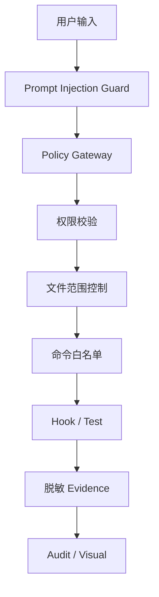

# 风险评估与应对方案

## 1. 风险总览

| 风险类型 | 风险描述 | 影响 | 概率 | 应对策略 | 兜底方案 |
| --- | --- | --- | --- | --- | --- |
| 技术风险 | Adapter 与 IDE 版本变化不兼容 | 中高 | 中 | Adapter Protocol 隔离差异，增加兼容测试 | 回退到上一个 Adapter 版本 |
| 产品风险 | 功能过多导致定位不清 | 高 | 中 | P0 严格只做最小闭环 | 冻结非 P0 范围 |
| 使用风险 | 开发者觉得流程增加负担 | 中 | 高 | 命令化、模板化、低概念暴露 | 提供轻量模式 |
| 安全风险 | 源码、密钥、Prompt 泄露 | 很高 | 中 | 本地运行态、脱敏、禁止提交敏感数据 | 阻断并审计 |
| 合规风险 | 审计记录不足 | 高 | 中 | P0 Evidence，P3 Audit | 暂停推广 |
| 推广风险 | 团队不愿采用 | 中高 | 中 | 试点数据证明价值 | 选示范项目 |
| 组织协同风险 | 架构、测试、安全未参与 | 中高 | 中 | 明确角色职责 | 缩小试点范围 |
| 维护风险 | Rule / Skill 过期 | 中 | 高 | 资产 Owner 和评分机制 | 废弃旧资产 |
| 成本超支 | 过早做完整平台 | 高 | 中 | 按 P0-P5 分阶段 | 停止 P3+ 投入 |
| 上手过高 | 概念过多 | 中高 | 高 | 分层文档和默认配置 | 只保留核心命令 |
| AI 幻觉 | 生成错误代码或解释 | 高 | 高 | Test / Review / Hook / Evidence | 人工门禁 |
| 资产污染 | 错误 Rule 影响多个项目 | 高 | 中 | 审核、灰度、回滚 | 回滚资产版本 |
| Memory 污染 | 错误经验进入长期 Memory | 高 | 中 | 长期 Memory 需 Review | 撤销 Memory 提案 |
| 过度平台化 | 平台复杂度大于收益 | 高 | 中 | P0 只验证闭环 | 回退轻量模式 |
| 供应商绑定 | 绑定单一 IDE 或模型 | 高 | 中 | Adapter Protocol 和 Manifest | 切换执行器 |

## 2. 风险矩阵

详见 `diagrams/21-风险矩阵图.md`。

## 3. 关键风险说明

### 3.1 AI 幻觉风险

AI 可能误解需求、生成错误代码、漏掉测试或误判结果。应对方式是让 AI 输出必须经过 Spec、Hook、Test、Review 和 Evidence，而不是只相信自然语言解释。

### 3.2 Memory 污染风险

如果 Agent 将错误经验写入长期 Memory，后续任务会被持续污染。应对方式是短期 Memory 可自动写，长期 Memory 必须提案和人工确认。

### 3.3 资产污染风险

错误 Rule / Skill 一旦被多个项目使用，会造成批量影响。应对方式是资产审核、灰度、版本锁定和快速回滚。

### 3.4 过度平台化风险

如果 P0 就建设完整企业平台，会延迟验证核心价值。应对方式是 P0 只做双 IDE 单项目闭环，P3/P4/P5 后置。

### 3.5 供应商绑定风险

如果只服务某个 IDE，平台会随工具变化被动。应对方式是 Manifest + Adapter Protocol，同一资产可生成不同执行器配置。

## 4. 安全防护分层

## 5. 回滚机制

| 回滚对象 | 回滚方式 |
|---|---|
| Adapter 输出 | 根据 `ai-spec.lock` 重新生成上一个版本 |
| Rule / Skill | 回滚资产版本 |
| Memory | 撤销 Memory 提案或恢复上个提交 |
| Hook 配置 | 恢复默认 Hook 或关闭非阻塞 Hook |
| Visual 上报 | 暂停 Collector，本地保留 Evidence |
| 企业策略 | 按灰度范围回退 |

## 6. 阶段暂停条件

1. P0 真实项目无法完成一次闭环。
2. 双 IDE 输出语义不一致且无法校正。
3. 测试无法执行或结果无法记录。
4. 出现敏感信息写入 Git 的风险。
5. 开发者反馈上手成本明显高于收益。
6. 企业安全负责人认为策略不满足推广条件。
