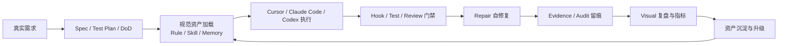

# 项目整体价值闭环图

```mermaid
flowchart LR
    A[真实需求] --> B[Spec / Test Plan / DoD]
    B --> C[规范资产加载<br/>Rule / Skill / Memory]
    C --> D[Cursor / Claude Code / Codex 执行]
    D --> E[Hook / Test / Review 门禁]
    E --> F[Repair 自修复]
    F --> G[Evidence / Audit 留痕]
    G --> H[Visual 复盘与指标]
    H --> I[资产沉淀与升级]
    I --> C
```
该图表达项目的核心价值闭环：不是让 AI 一次性写完代码，而是让需求、规范、执行、检查、修复、证据、复盘和资产沉淀形成持续循环。
