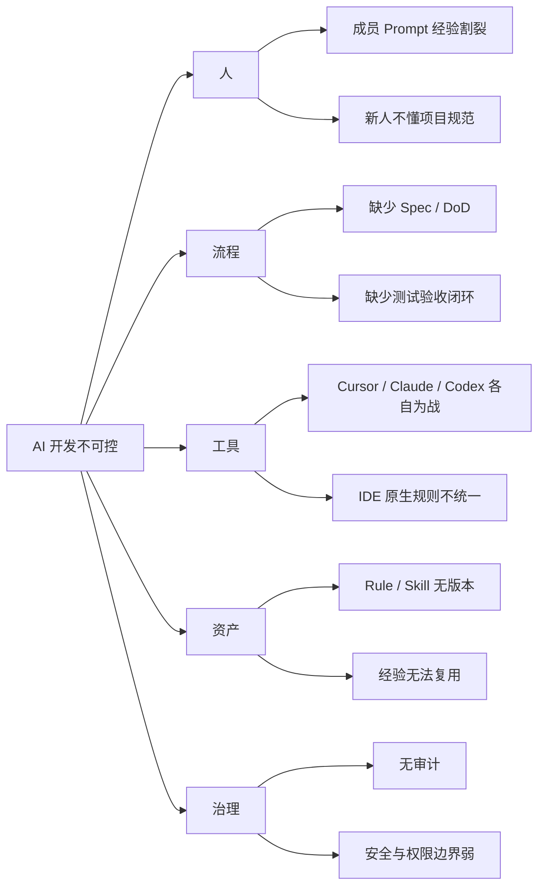

# 当前痛点鱼骨图

```mermaid
flowchart LR
    P[AI 开发不可控] --> A[人]
    P --> B[流程]
    P --> C[工具]
    P --> D[资产]
    P --> E[治理]
    A --> A1[成员 Prompt 经验割裂]
    A --> A2[新人不懂项目规范]
    B --> B1[缺少 Spec / DoD]
    B --> B2[缺少测试验收闭环]
    C --> C1[Cursor / Claude / Codex 各自为战]
    C --> C2[IDE 原生规则不统一]
    D --> D1[Rule / Skill 无版本]
    D --> D2[经验无法复用]
    E --> E1[无审计]
    E --> E2[安全与权限边界弱]
```
鱼骨图用于向管理层说明问题不是单点工具问题，而是人员、流程、工具、资产和治理共同导致的系统性问题。
