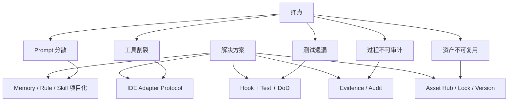

# 痛点到解决方案映射图

```mermaid
flowchart TB
    A[痛点] --> A1[Prompt 分散]
    A --> A2[工具割裂]
    A --> A3[测试遗漏]
    A --> A4[过程不可审计]
    A --> A5[资产不可复用]
    B[解决方案] --> B1[Memory / Rule / Skill 项目化]
    B --> B2[IDE Adapter Protocol]
    B --> B3[Hook + Test + DoD]
    B --> B4[Evidence / Audit]
    B --> B5[Asset Hub / Lock / Version]
    A1 --> B1
    A2 --> B2
    A3 --> B3
    A4 --> B4
    A5 --> B5
```
该图将问题和平台能力一一映射，避免汇报时被理解为“又做一个 AI 工具”。
