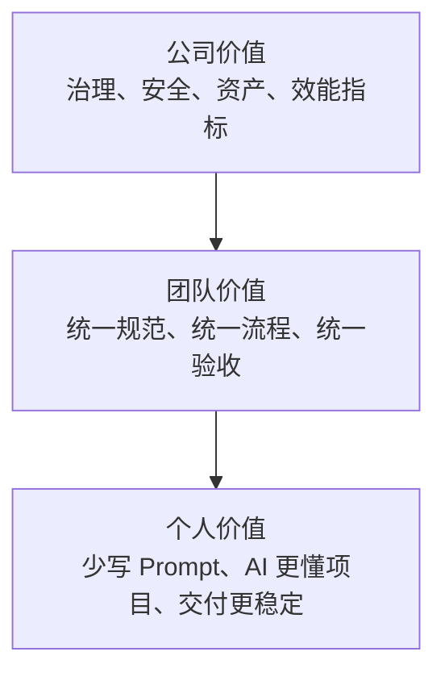

# 个人团队公司价值分层图

```mermaid
flowchart TB
    C[公司价值<br/>治理、安全、资产、效能指标] --> T[团队价值<br/>统一规范、统一流程、统一验收]
    T --> P[个人价值<br/>少写 Prompt、AI 更懂项目、交付更稳定]
```
价值分层图说明平台价值不是只服务个人效率，而是从个人效率逐层上升到团队 SOP 和公司级治理。
