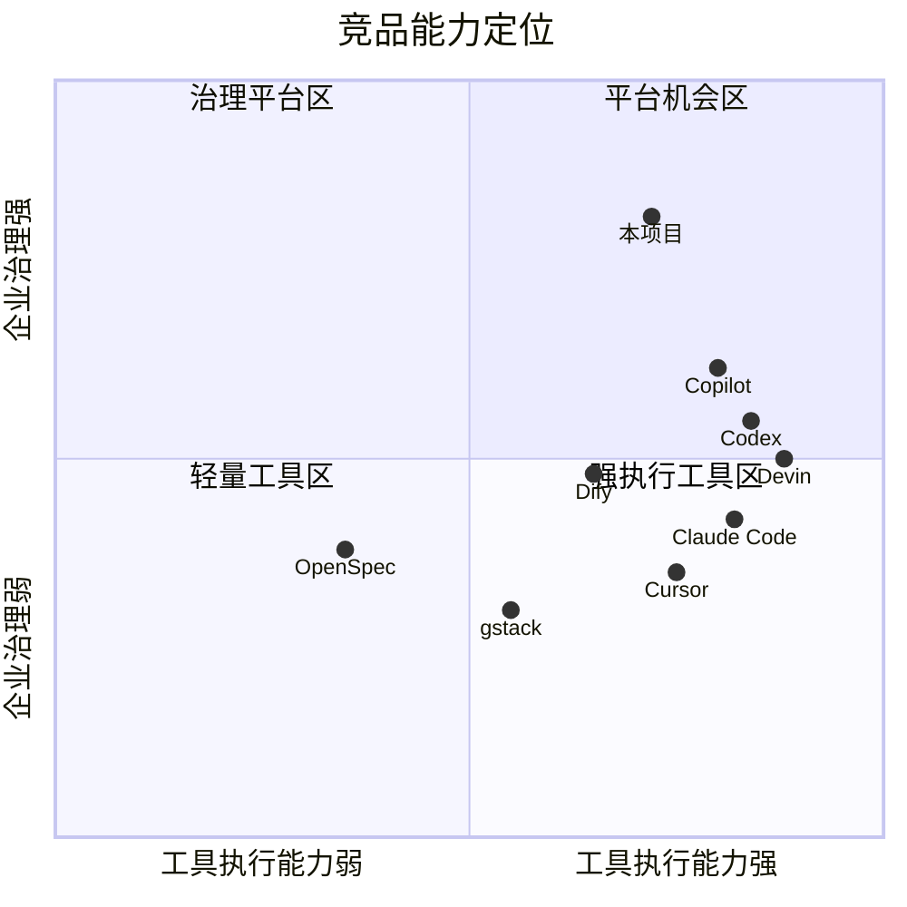

# 竞品能力对比矩阵

```mermaid
quadrantChart
    title 竞品能力定位
    x-axis 工具执行能力弱 --> 工具执行能力强
    y-axis 企业治理弱 --> 企业治理强
    quadrant-1 平台机会区
    quadrant-2 治理平台区
    quadrant-3 轻量工具区
    quadrant-4 强执行工具区
    Cursor: [0.75, 0.35]
    Claude Code: [0.82, 0.42]
    Codex: [0.84, 0.55]
    Devin: [0.88, 0.50]
    Copilot: [0.80, 0.62]
    OpenSpec: [0.35, 0.38]
    gstack: [0.55, 0.30]
    Dify: [0.65, 0.48]
    本项目: [0.72, 0.82]
```
该图不是精确评分，而是汇报用定位图：主流工具执行力强，但跨 IDE 规范治理、资产版本、审计、灰度、回滚仍是平台机会。
