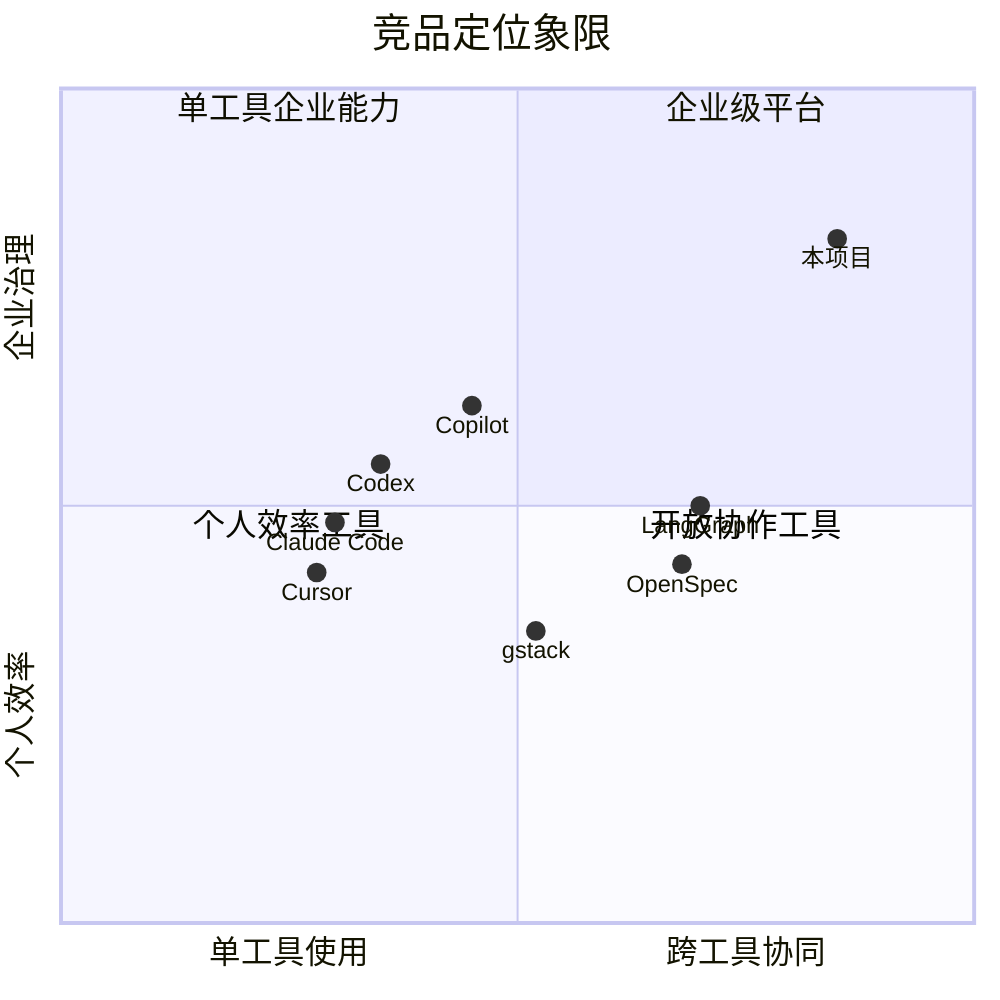

# 竞品定位象限图

```mermaid
quadrantChart
    title 竞品定位象限
    x-axis 单工具使用 --> 跨工具协同
    y-axis 个人效率 --> 企业治理
    quadrant-1 企业级平台
    quadrant-2 单工具企业能力
    quadrant-3 个人效率工具
    quadrant-4 开放协作工具
    Cursor: [0.28, 0.42]
    Claude Code: [0.30, 0.48]
    Codex: [0.35, 0.55]
    Copilot: [0.45, 0.62]
    OpenSpec: [0.68, 0.43]
    gstack: [0.52, 0.35]
    LangGraph: [0.70, 0.50]
    本项目: [0.85, 0.82]
```
本项目定位为跨 IDE、跨项目、面向企业治理的规范底座，而不是替代某个 IDE。
