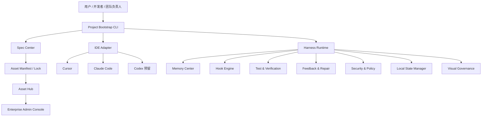

# 总体逻辑架构图

```mermaid
flowchart TB
    U[用户 / 开发者 / 团队负责人] --> CLI[Project Bootstrap CLI]
    CLI --> SC[Spec Center]
    CLI --> AD[IDE Adapter]
    CLI --> HR[Harness Runtime]
    SC --> AM[Asset Manifest / Lock]
    AD --> CUR[Cursor]
    AD --> CLA[Claude Code]
    AD --> COD[Codex 预留]
    HR --> ME[Memory Center]
    HR --> HE[Hook Engine]
    HR --> TE[Test & Verification]
    HR --> FR[Feedback & Repair]
    HR --> SP[Security & Policy]
    HR --> LS[Local State Manager]
    HR --> VG[Visual Governance]
    AM --> AH[Asset Hub]
    AH --> EA[Enterprise Admin Console]
```
该图用于架构汇报，说明平台由本地 CLI / Harness、IDE 适配、资产治理和可观测四层组成。
