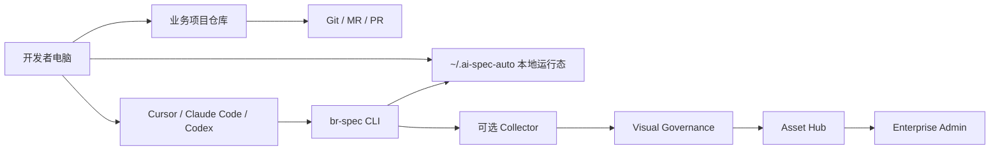

# 部署架构图

```mermaid
flowchart LR
    Dev[开发者电脑] --> Repo[业务项目仓库]
    Dev --> Local[~/.ai-spec-auto 本地运行态]
    Repo --> Git[Git / MR / PR]
    Dev --> IDE[Cursor / Claude Code / Codex]
    IDE --> CLI[br-spec CLI]
    CLI --> Local
    CLI --> Collector[可选 Collector]
    Collector --> Visual[Visual Governance]
    Visual --> Hub[Asset Hub]
    Hub --> Admin[Enterprise Admin]
```
部署架构强调低入侵：P0 可以纯本地运行，企业阶段再接入 Visual、Hub 和 Admin。
