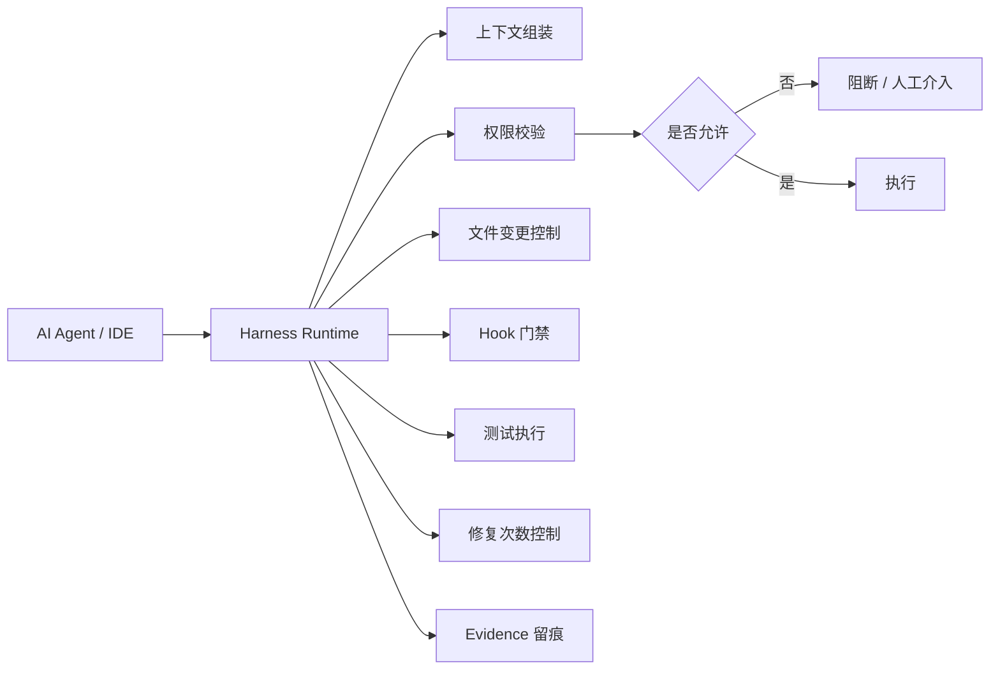

# Harness 控制边界图

```mermaid
flowchart LR
    A[AI Agent / IDE] --> B[Harness Runtime]
    B --> C[上下文组装]
    B --> D[权限校验]
    B --> E[文件变更控制]
    B --> F[Hook 门禁]
    B --> G[测试执行]
    B --> H[修复次数控制]
    B --> I[Evidence 留痕]
    D --> J{是否允许}
    J -- 否 --> K[阻断 / 人工介入]
    J -- 是 --> L[执行]
```
Harness 不替代模型推理，而是控制模型进入工程世界的边界。
