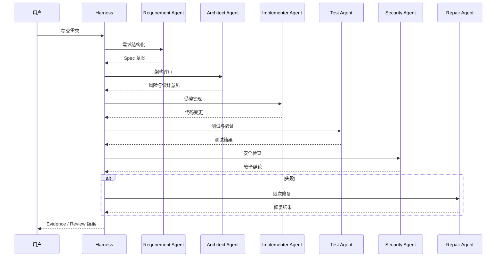

# Agent 协作流程图

```mermaid
sequenceDiagram
    participant User as 用户
    participant Harness as Harness
    participant Req as Requirement Agent
    participant Arch as Architect Agent
    participant Dev as Implementer Agent
    participant Test as Test Agent
    participant Sec as Security Agent
    participant Repair as Repair Agent
    User->>Harness: 提交需求
    Harness->>Req: 需求结构化
    Req-->>Harness: Spec 草案
    Harness->>Arch: 架构评审
    Arch-->>Harness: 风险与设计意见
    Harness->>Dev: 受控实现
    Dev-->>Harness: 代码变更
    Harness->>Test: 测试与验证
    Test-->>Harness: 测试结果
    Harness->>Sec: 安全检查
    Sec-->>Harness: 安全结论
    alt 失败
        Harness->>Repair: 限次修复
        Repair-->>Harness: 修复结果
    end
    Harness-->>User: Evidence / Review 结果
```
多 Agent 负责专业分工，Harness 负责调度边界和门禁。
