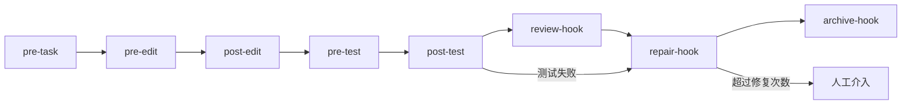

# Hook 生命周期图

```mermaid
flowchart LR
    A[pre-task] --> B[pre-edit]
    B --> C[post-edit]
    C --> D[pre-test]
    D --> E[post-test]
    E --> F[review-hook]
    F --> G[repair-hook]
    G --> H[archive-hook]
    E -- 测试失败 --> G
    G -- 超过修复次数 --> I[人工介入]
```
Hook 生命周期把开发过程拆成可检查节点，避免 AI 直接从需求跳到完成。
