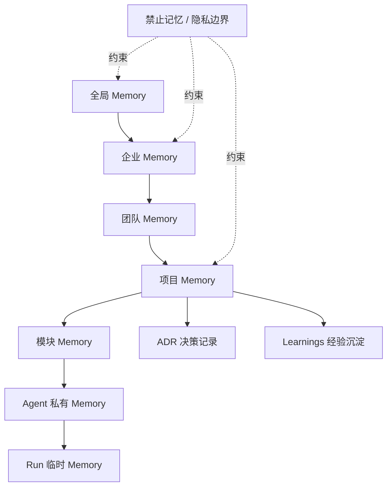

# Memory 分层图

```mermaid
flowchart TB
    G[全局 Memory] --> E[企业 Memory]
    E --> T[团队 Memory]
    T --> P[项目 Memory]
    P --> M[模块 Memory]
    M --> A[Agent 私有 Memory]
    A --> R[Run 临时 Memory]
    P --> ADR[ADR 决策记录]
    P --> L[Learnings 经验沉淀]
    X[禁止记忆 / 隐私边界] -.约束.-> G
    X -.约束.-> E
    X -.约束.-> P
```
Memory 不是聊天记录，而是需要治理的上下文资产。
