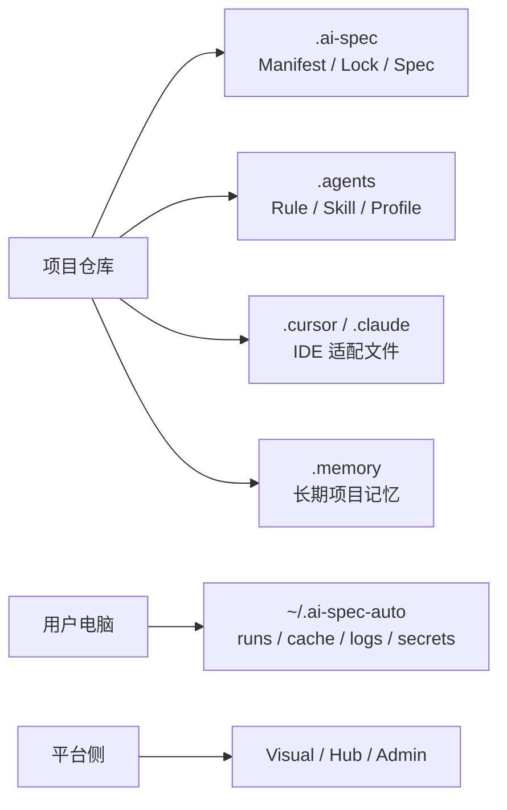

# 项目目录治理图

```mermaid
flowchart LR
    Repo[项目仓库] --> A[.ai-spec<br/>Manifest / Lock / Spec]
    Repo --> B[.agents<br/>Rule / Skill / Profile]
    Repo --> C[.cursor / .claude<br/>IDE 适配文件]
    Repo --> D[.memory<br/>长期项目记忆]
    Home[用户电脑] --> E[~/.ai-spec-auto<br/>runs / cache / logs / secrets]
    Cloud[平台侧] --> F[Visual / Hub / Admin]
```
项目内只放共享资产，用户目录放运行态和敏感态，平台侧放治理和观测。
