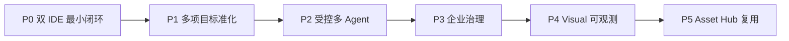

# P0-P5 阶段路线图

```mermaid
flowchart LR
    P0[P0 双 IDE 最小闭环] --> P1[P1 多项目标准化]
    P1 --> P2[P2 受控多 Agent]
    P2 --> P3[P3 企业治理]
    P3 --> P4[P4 Visual 可观测]
    P4 --> P5[P5 Asset Hub 复用]
```
路线图从最小可用闭环开始，逐步扩展到多项目、多 Agent、企业治理、可观测和资产复用。
