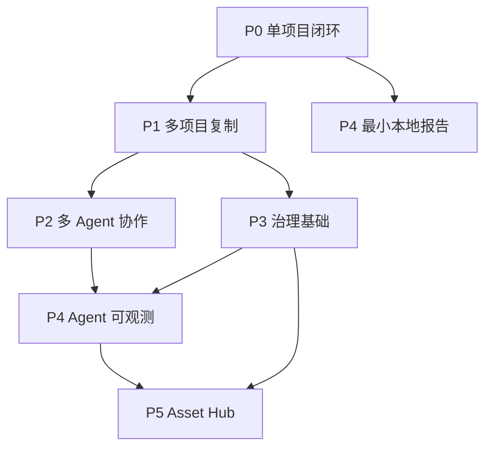

# 阶段依赖关系图

```mermaid
flowchart TB
    P0[P0 单项目闭环] --> P1[P1 多项目复制]
    P0 --> P4a[P4 最小本地报告]
    P1 --> P2[P2 多 Agent 协作]
    P1 --> P3[P3 治理基础]
    P2 --> P4[P4 Agent 可观测]
    P3 --> P4
    P3 --> P5[P5 Asset Hub]
    P4 --> P5
```
P4 的最小报告可以在 P0 出现，但完整可观测依赖 P2/P3 的事件与治理模型。
