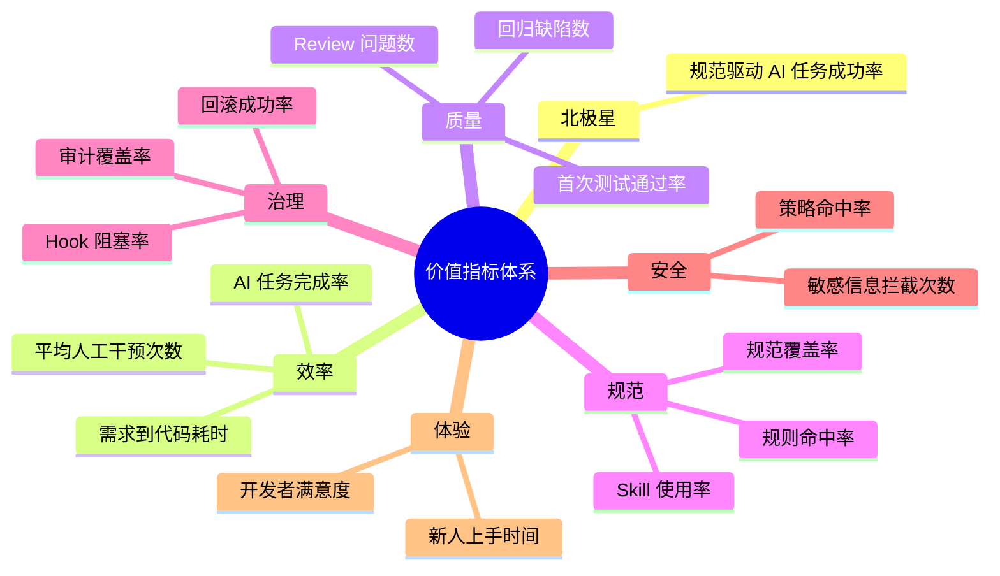

# 指标体系树

```mermaid
mindmap
  root((价值指标体系))
    北极星
      规范驱动 AI 任务成功率
    效率
      需求到代码耗时
      AI 任务完成率
      平均人工干预次数
    质量
      首次测试通过率
      Review 问题数
      回归缺陷数
    规范
      规则命中率
      规范覆盖率
      Skill 使用率
    治理
      审计覆盖率
      Hook 阻塞率
      回滚成功率
    安全
      策略命中率
      敏感信息拦截次数
    体验
      开发者满意度
      新人上手时间
```
指标体系覆盖效率、质量、规范、治理、安全和体验，不只看“代码写得快不快”。
