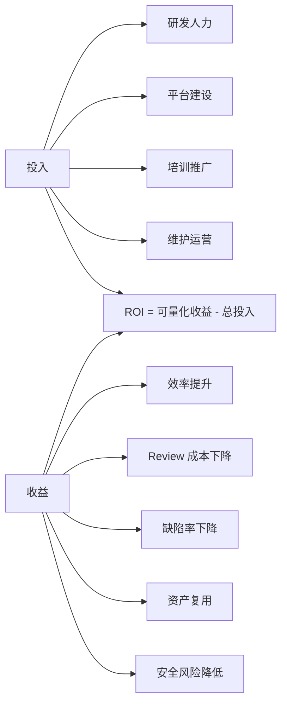

# ROI 模型图

```mermaid
flowchart LR
    A[投入] --> A1[研发人力]
    A --> A2[平台建设]
    A --> A3[培训推广]
    A --> A4[维护运营]
    B[收益] --> B1[效率提升]
    B --> B2[Review 成本下降]
    B --> B3[缺陷率下降]
    B --> B4[资产复用]
    B --> B5[安全风险降低]
    A --> C[ROI = 可量化收益 - 总投入]
    B --> C
```
ROI 模型不能只看直接工时收益，还应纳入质量、复用和风险降低。
