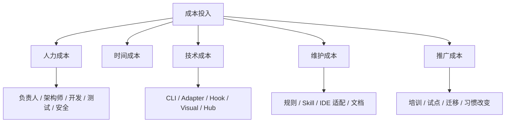

# 成本投入模型图

```mermaid
flowchart TB
    C[成本投入] --> H[人力成本]
    C --> T[时间成本]
    C --> Tech[技术成本]
    C --> M[维护成本]
    C --> P[推广成本]
    H --> H1[负责人 / 架构师 / 开发 / 测试 / 安全]
    Tech --> Tech1[CLI / Adapter / Hook / Visual / Hub]
    M --> M1[规则 / Skill / IDE 适配 / 文档]
    P --> P1[培训 / 试点 / 迁移 / 习惯改变]
```
该图帮助领导理解成本不是单纯开发人力，而是建设、维护、推广和治理的综合投入。
