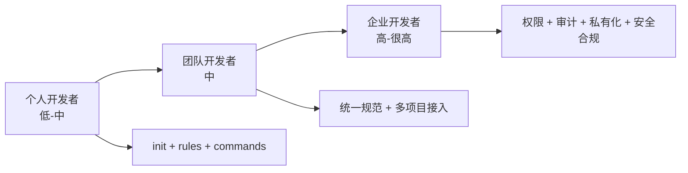

# 上手难度阶梯图

```mermaid
flowchart LR
    A[个人开发者<br/>低-中] --> B[团队开发者<br/>中]
    B --> C[企业开发者<br/>高-很高]
    A --> A1[init + rules + commands]
    B --> B1[统一规范 + 多项目接入]
    C --> C1[权限 + 审计 + 私有化 + 安全合规]
```
上手难度随组织规模增加而上升，因此必须分阶段推广。
