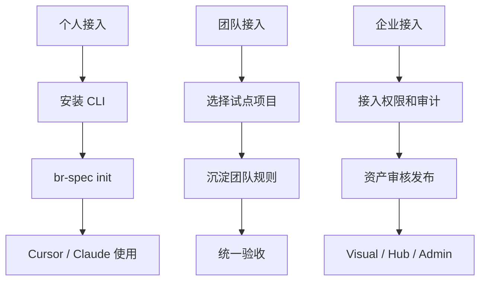

# 用户接入路径图

```mermaid
flowchart TB
    A[个人接入] --> A1[安装 CLI]
    A1 --> A2[br-spec init]
    A2 --> A3[Cursor / Claude 使用]
    B[团队接入] --> B1[选择试点项目]
    B1 --> B2[沉淀团队规则]
    B2 --> B3[统一验收]
    C[企业接入] --> C1[接入权限和审计]
    C1 --> C2[资产审核发布]
    C2 --> C3[Visual / Hub / Admin]
```
接入路径需要从个人最小闭环开始，再扩展到团队和企业治理。
