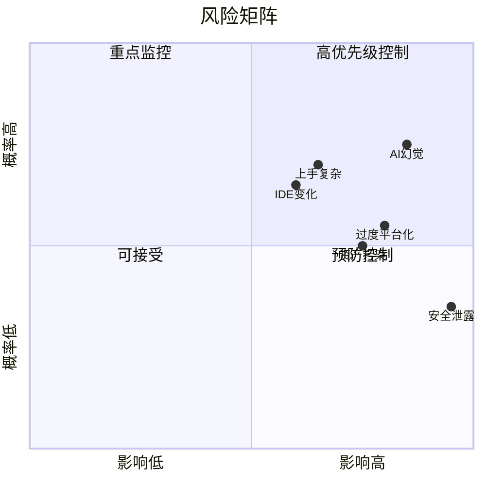

# 风险矩阵图

```mermaid
quadrantChart
    title 风险矩阵
    x-axis 影响低 --> 影响高
    y-axis 概率低 --> 概率高
    quadrant-1 高优先级控制
    quadrant-2 重点监控
    quadrant-3 可接受
    quadrant-4 预防控制
    AI幻觉: [0.85, 0.75]
    上手复杂: [0.65, 0.70]
    过度平台化: [0.80, 0.55]
    安全泄露: [0.95, 0.35]
    IDE变化: [0.60, 0.65]
    资产污染: [0.75, 0.50]
```
该图用于风险评审，突出 AI 幻觉、上手复杂、过度平台化和安全泄露是重点风险。
