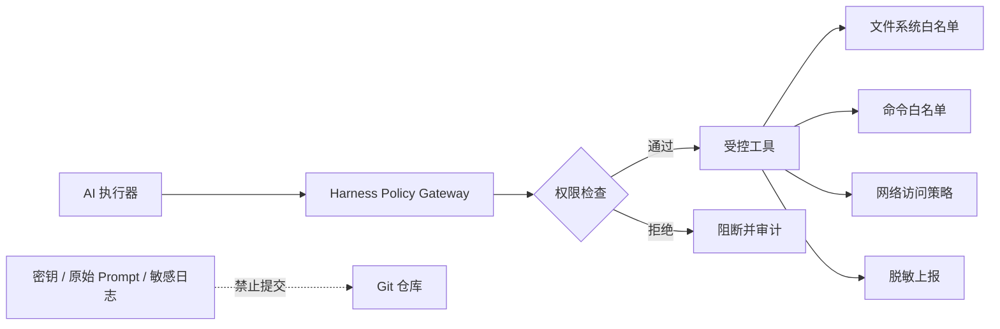

# 安全边界图

```mermaid
flowchart LR
    A[AI 执行器] --> B[Harness Policy Gateway]
    B --> C{权限检查}
    C -- 通过 --> D[受控工具]
    C -- 拒绝 --> E[阻断并审计]
    D --> F[文件系统白名单]
    D --> G[命令白名单]
    D --> H[网络访问策略]
    D --> I[脱敏上报]
    J[密钥 / 原始 Prompt / 敏感日志] -.禁止提交.-> K[Git 仓库]
```
安全边界要求 AI 只能通过受控通道访问工具、文件和外部服务。
