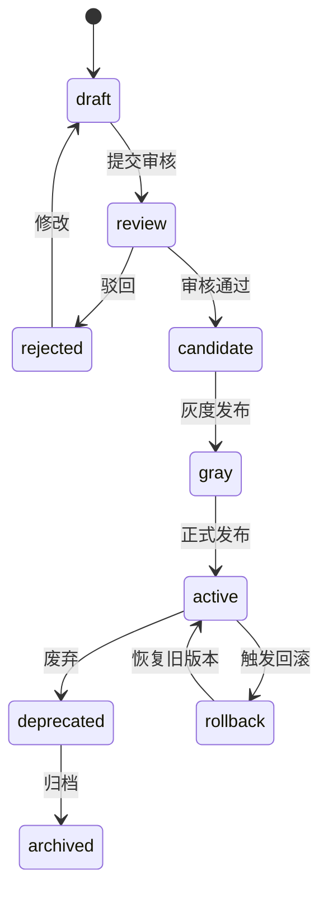

# 资产生命周期图

```mermaid
stateDiagram-v2
    [*] --> draft
    draft --> review: 提交审核
    review --> rejected: 驳回
    rejected --> draft: 修改
    review --> candidate: 审核通过
    candidate --> gray: 灰度发布
    gray --> active: 正式发布
    active --> deprecated: 废弃
    deprecated --> archived: 归档
    active --> rollback: 触发回滚
    rollback --> active: 恢复旧版本
```
资产生命周期支持审核、灰度、正式发布、废弃、归档和回滚。
