# AI 工程资产 Hub × br-ai-spec × br-ai-spec-visual
## 项目介绍与需求说明文档（V1~V3 最终版）

> 文档定位：本文档用于**对外/对内介绍项目**，帮助阅读者快速理解该项目**是什么、解决什么问题、包含哪些核心能力、三个仓库如何联动、系统如何实现、为什么值得做、未来如何演进**。  
> 适用对象：管理者、产品经理、架构师、研发负责人、开发人员、试点团队成员。  
> 文档性质：**项目介绍文档 + 需求说明文档 + 方案概述文档** 的合并版。若后续需要用于研发落地，可再拆分为 PRD、技术设计、接口文档、测试文档等。

---

## 目录

1. [文档说明](#1-文档说明)
2. [项目概述](#2-项目概述)
3. [为什么要做这个项目](#3-为什么要做这个项目)
4. [项目目标与边界](#4-项目目标与边界)
5. [整体解决方案概览](#5-整体解决方案概览)
6. [三仓定位与职责边界](#6-三仓定位与职责边界)
7. [核心用户与使用场景](#7-核心用户与使用场景)
8. [核心能力设计](#8-核心能力设计)
9. [V1~V3 路线图与能力演进](#9-v1v3-路线图与能力演进)
10. [核心业务流程](#10-核心业务流程)
11. [时序图与联动方式](#11-时序图与联动方式)
12. [系统架构设计图](#12-系统架构设计图)
13. [数据流与关键对象](#13-数据流与关键对象)
14. [页面与交互设计说明](#14-页面与交互设计说明)
15. [实现思路与关键技术点](#15-实现思路与关键技术点)
16. [部署与运行方式](#16-部署与运行方式)
17. [项目价值与收益](#17-项目价值与收益)
18. [风险、约束与非目标](#18-风险约束与非目标)
19. [试点与推广建议](#19-试点与推广建议)
20. [总结](#20-总结)

---

## 1. 文档说明

### 1.1 文档名称建议

如果从专业命名上看，本文档比“需求说明文档”更准确的名称可以是：

- **《项目介绍与解决方案说明书》**
- **《产品需求与整体方案说明文档》**
- **《AI 工程资产平台项目概述文档》**

但为了兼顾你当前的使用目的，本文档仍采用：

> **《项目介绍与需求说明文档》**

### 1.2 本文档回答的问题

本文档重点回答以下问题：

1. 这个项目到底是什么？
2. 它解决了什么痛点？
3. 它由哪些部分组成？
4. `skill-q-platform`、`br-ai-spec`、`br-ai-spec-visual` 分别负责什么？
5. 三者如何联动？
6. 整套方案是如何工作的？
7. 为什么这套方案值得做？
8. V1、V2、V3 分别做什么？

---

## 2. 项目概述

### 2.1 项目一句话介绍

这是一个面向团队的 **AI 工程资产操作系统**，用于把原本分散的 AI 提示词、Skill、Rule、角色、开发流程和工程规范，沉淀为可管理、可安装、可执行、可追踪、可观测、可回流优化的工程资产体系。

### 2.2 项目核心组成

本项目由三个核心仓库组成：

| 仓库 | 定位 | 作用 |
|---|---|---|
| `skill-q-platform` | AI 工程资产 Hub | 负责管理 Skill、Rule、Role、Flow、Scenario、Manifest 等工程资产，以及审核、版本、发布、安装记录、运行反馈回流 |
| `br-ai-spec` | CLI 执行底座 | 负责从 Hub 拉取方案包（Manifest），安装到业务项目中，并生成本地工程资产与锁文件 |
| `br-ai-spec-visual` | 运行态可视化控制台 | 负责展示项目接入情况、已安装方案包、资产状态、运行态数据、治理看板 |

### 2.3 项目希望建立的能力闭环

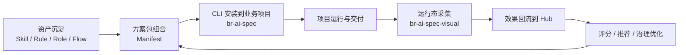

---

## 3. 为什么要做这个项目

### 3.1 当前常见问题

在团队引入 AI 编程后，通常会遇到以下问题：

1. **能力分散**：提示词、规范、Skill 分散在群聊、文档、个人经验中，无法统一复用。
2. **交付不稳定**：不同人使用 AI 的方式不同，输出质量差异大。
3. **缺少治理**：哪些 Skill 好用、哪些 Rule 过时、哪些团队未规范接入，无法追踪。
4. **缺少安装与落地能力**：有资产，但不能一键接入到实际业务项目。
5. **缺少观测**：项目用了什么 AI 能力、用了哪个版本、效果如何，没有统一可视化。
6. **缺少闭环**：资产生产、资产使用、运行反馈之间断裂，无法持续优化。

### 3.2 本项目要解决的核心问题

本项目不是再做一个单纯的 Skill 展示网站，而是要解决：

> **如何把 AI 工程能力从“个人经验”升级为“团队资产”，并形成“沉淀—安装—执行—观测—回流”的全链路闭环。**

---

## 4. 项目目标与边界

### 4.1 项目目标

#### 目标一：统一工程资产

把 Skill、Rule、Role、Flow、Scenario、Manifest 统一纳入 Hub 管理，成为标准化资产。

#### 目标二：实现标准化安装

通过 `br-ai-spec` CLI 将方案包一键安装到业务项目，生成本地工程规范和配置。

#### 目标三：实现运行态可视化

通过 `br-ai-spec-visual` 展示哪些项目接入了 Hub、安装了哪些资产、使用了哪个版本。

#### 目标四：形成反馈闭环

把运行效果、失败原因、版本差异等数据回流到 Hub，支撑治理和推荐。

### 4.2 非目标（当前阶段不做）

- 不做 AI 模型训练平台
- 不做通用代码托管平台
- 不替代 Git / CI / 代码审查平台
- 不直接承载业务系统功能开发
- 不做面向 C 端的泛社区内容平台

---

## 5. 整体解决方案概览

### 5.1 方案总体说明

整套方案可以理解为一个三层架构：

1. **上层：资产中心（Hub）**  
   负责定义和管理“能用什么”。
2. **中层：执行底座（CLI）**  
   负责把能力“装进去、跑起来”。
3. **下层：观测控制台（Visual）**  
   负责查看“装了什么、运行如何、是否健康”。

### 5.2 三层结构图

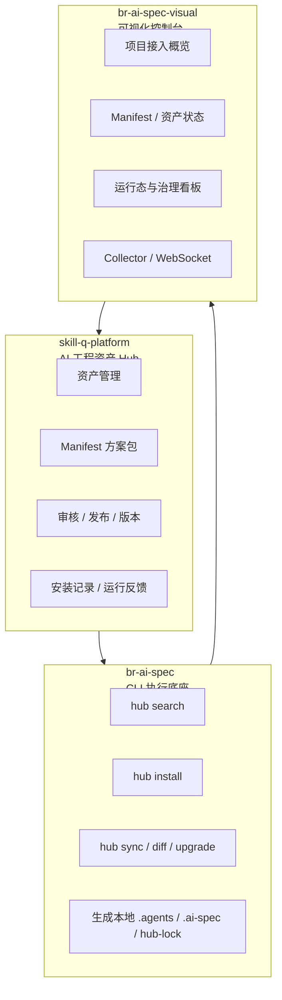

---

## 6. 三仓定位与职责边界

### 6.1 三仓分工

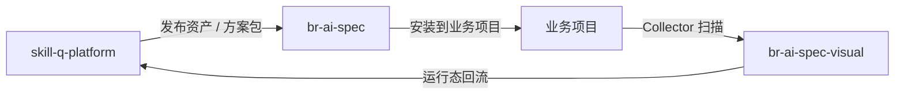

### 6.2 职责矩阵

| 能力 | skill-q-platform | br-ai-spec | br-ai-spec-visual |
|---|---|---|---|
| Skill / Rule 管理 | ✅ | ❌ | ❌ |
| Manifest 方案包管理 | ✅ | ❌ | ❌ |
| 资产审核发布 | ✅ | ❌ | ❌ |
| 本地安装执行 | ❌ | ✅ | ❌ |
| 生成本地锁文件 | ❌ | ✅ | ❌ |
| 扫描项目资产状态 | ❌ | ❌ | ✅ |
| 展示项目接入情况 | ❌ | ❌ | ✅ |
| 运行数据回流 | 接收 | 上报 | 采集/展示 |
| 治理看板 | 部分 | ❌ | ✅ |

### 6.3 边界约束

- `skill-q-platform` **不负责**执行项目开发任务。
- `br-ai-spec` **不负责**资产社区化管理和复杂页面运营。
- `br-ai-spec-visual` **不重新定义**资产模型，只消费 Hub 与本地锁文件。

---

## 7. 核心用户与使用场景

### 7.1 核心用户

| 用户角色 | 关注点 |
|---|---|
| 平台管理员 | 统一能力建设、平台推广、版本治理 |
| 架构师 / 技术负责人 | 团队规范统一、项目接入、资产沉淀 |
| 前端 / 后端开发者 | 一键接入规范、提高 AI 协作效率 |
| 项目负责人 | 了解项目是否按规范接入与执行 |
| 审核人 | 审核 Skill / Rule / Manifest 的质量和风险 |

### 7.2 典型使用场景

#### 场景一：平台侧沉淀标准方案包

平台团队在 Hub 中创建一套“React 标准研发方案包”，把前端规范、测试规范、执行 Skill、评审 Rule 等统一打包，供团队安装使用。

#### 场景二：业务项目快速接入

某业务项目希望采用团队标准 AI 开发规范，只需通过 `br-ai-spec hub install react-standard` 即可安装方案包。

#### 场景三：管理者查看接入情况

管理者打开 Visual，可以快速查看哪些项目已接入、接入的是哪个 Manifest、是否存在版本过期或本地修改。

#### 场景四：基于运行数据持续优化资产

如果某个 Skill 失败率较高，Hub 可以基于回流数据发现问题，并推动修复、版本升级或替换。

---

## 8. 核心能力设计

### 8.1 统一资产管理

Hub 统一管理以下对象：

- Skill
- Rule
- Role
- Flow
- Scenario
- Manifest
- Version
- Audit
- Install Record
- Runtime Feedback

### 8.2 Manifest 方案包

Manifest 是整套系统的核心，它不是单个 Skill，而是：

> **把多个工程资产组合成一个可安装、可发布、可升级、可回滚的方案包。**

Manifest 解决的核心问题：

- 单个资产难以单独被团队稳定使用
- 团队真正需要的是“整套可落地方案”
- 需要有版本、依赖、安装路径、适用技术栈等完整信息

### 8.3 CLI 安装能力

CLI 负责：

- 搜索方案包
- 安装方案包
- 预览差异
- 同步升级
- 回滚版本
- 生成锁文件 `hub-lock.json`
- 上报安装结果

### 8.4 可视化与治理能力

Visual 负责：

- 展示项目当前使用的 Manifest
- 展示资产版本状态
- 标记过期资产 / 本地修改 / 风险资产
- 展示团队接入率和治理风险
- 承接运行态回流数据

---

## 9. V1~V3 路线图与能力演进

### 9.1 总体演进思路

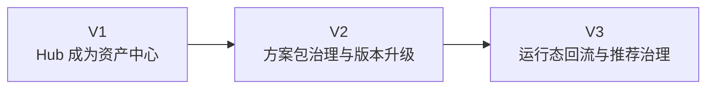

### 9.2 V1：资产中心 + 安装闭环

#### V1 目标

让 Hub 成为 `br-ai-spec` 的资产源头，完成第一个闭环：

```text
Hub 创建 Manifest → CLI 安装 Manifest → 本地生成锁文件 → Visual 展示 Manifest → Hub 记录安装情况
```

#### V1 核心能力

- Asset / Manifest 数据模型
- Manifest Builder
- Manifest Export API
- CLI `hub install / search / sync / diff`
- `hub-lock.json`
- Visual 项目资产画像页

### 9.3 V2：方案包治理、升级、回滚、审核

#### V2 目标

让系统具备企业级治理能力。

#### V2 核心能力

- Manifest 审核流
- 版本管理
- 升级 / 回滚
- 安装前 Diff 预览
- 本地修改保护
- 权限体系
- 治理看板 V1

### 9.4 V3：运行态回流、评分、推荐、治理增强

#### V3 目标

形成真正的数据驱动闭环，让平台知道“什么能力真的好用”。

#### V3 核心能力

- Runtime Event 协议
- Skill / Manifest 效果分析
- 失败原因分析
- 评分与推荐
- 项目风险画像
- 治理看板 V2

### 9.5 V1~V3 能力对比表

| 阶段 | 目标 | 关键词 |
|---|---|---|
| V1 | 跑通最小闭环 | 资产、Manifest、安装、展示 |
| V2 | 强化治理能力 | 审核、版本、升级、回滚、权限 |
| V3 | 实现数据闭环 | 回流、评分、推荐、风险治理 |

---

## 10. 核心业务流程

### 10.1 Manifest 创建与发布流程

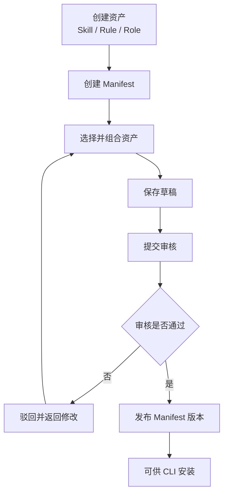

### 10.2 业务项目接入流程

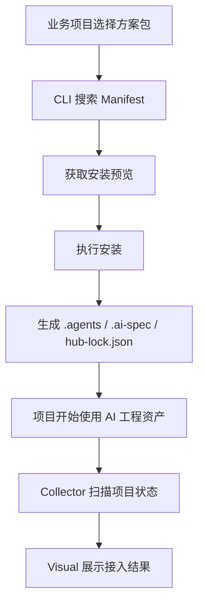

### 10.3 运行数据回流流程

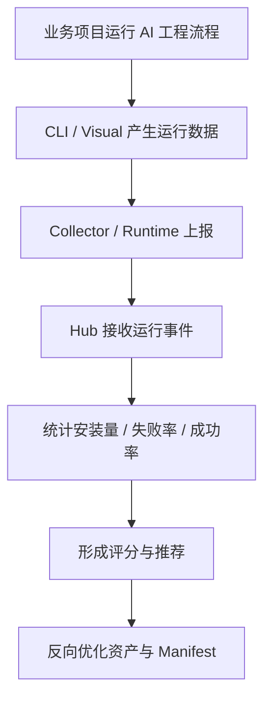

---

## 11. 时序图与联动方式

### 11.1 Manifest 安装时序图

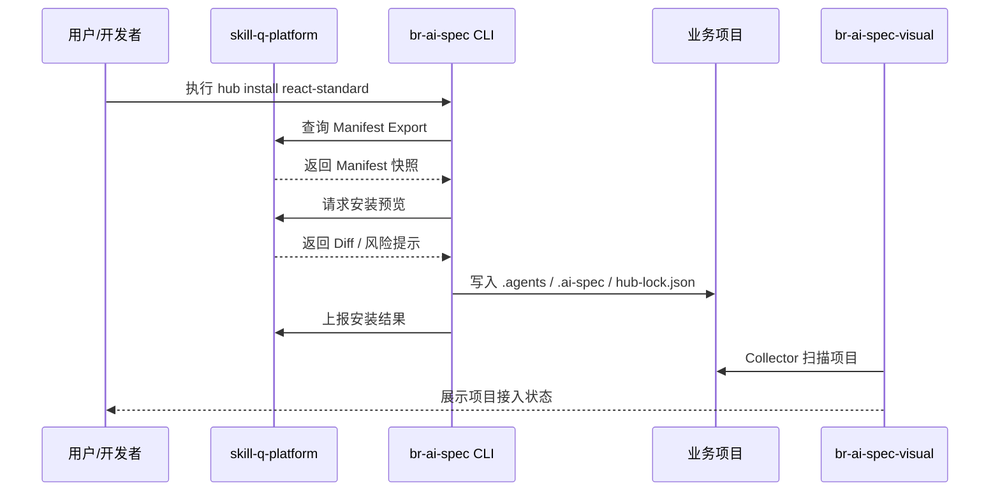

### 11.2 运行态回流时序图

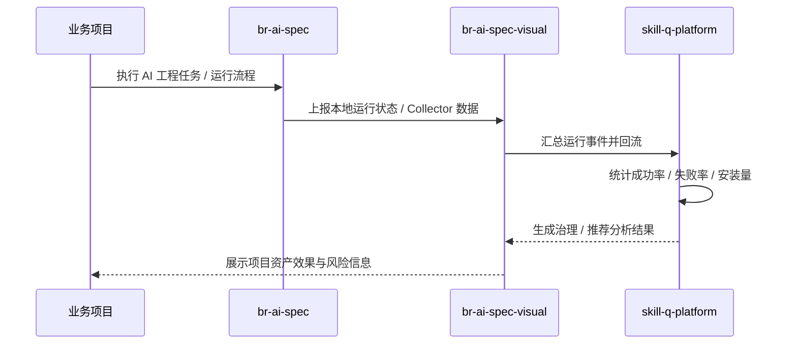

### 11.3 升级与回滚时序图（V2）

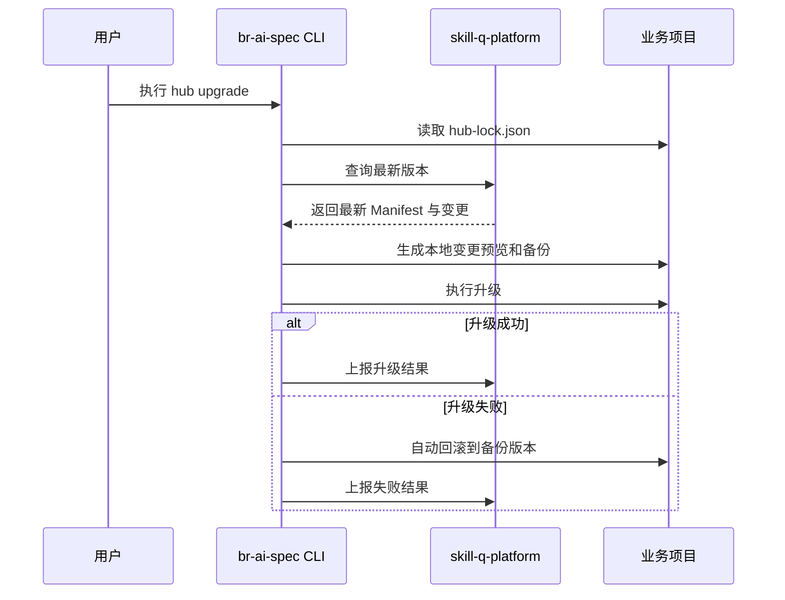

---

## 12. 系统架构设计图

### 12.1 总体架构图

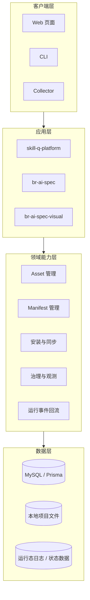

### 12.2 业务项目接入后的系统关系图

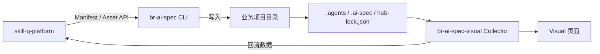

### 12.3 关键模块架构图

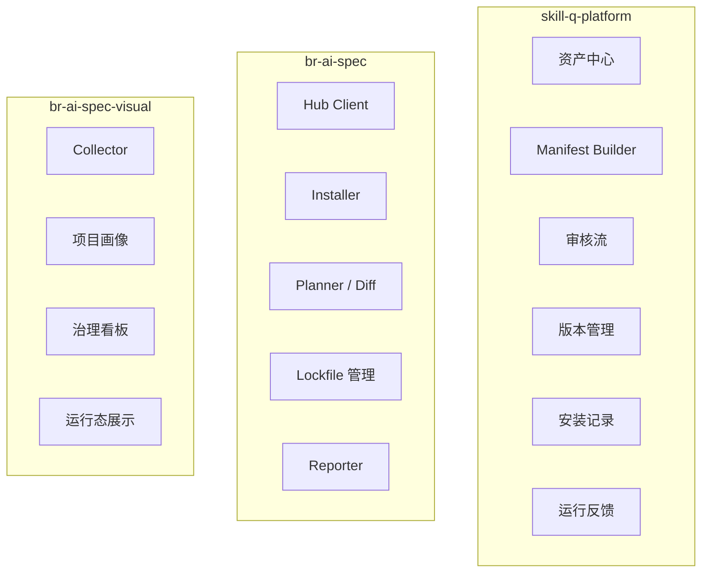

---

## 13. 数据流与关键对象

### 13.1 关键对象说明

| 对象 | 说明 |
|---|---|
| Asset | 单个工程资产，如 Skill、Rule、Role |
| Manifest | 由多个 Asset 组合形成的可安装方案包 |
| Install Record | 一次安装或升级操作的记录 |
| Runtime Event | 运行过程中的结构化事件 |
| hub-lock.json | 本地项目安装清单与版本锁文件 |

### 13.2 数据流图

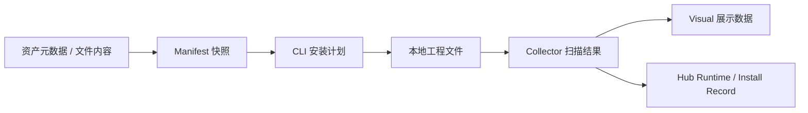

### 13.3 本地锁文件价值

`hub-lock.json` 的作用：

1. 记录项目使用了哪个 Hub、哪个 Manifest、哪个版本
2. 记录已安装的资产列表
3. 支持差异比对、升级、回滚
4. 为 Visual 扫描与展示提供基础数据

---

## 14. 页面与交互设计说明

> 要求：项目所有页面使用 **ui-ux-pro-max** 方法进行设计与开发，保持企业级 AI 工程平台的一致风格。

### 14.1 设计原则

- 企业级、清晰、克制、可信
- 信息结构明确
- 支持中后台高密度信息展示
- 状态可视、路径清晰、操作闭环完整
- 所有文案采用中文

### 14.2 Hub 主要页面

| 页面 | 作用 |
|---|---|
| 资产列表页 | 统一查看 Skill / Rule / Role / Flow |
| 资产详情页 | 查看资产详情、版本、风险、依赖 |
| Manifest 列表页 | 查看方案包 |
| Manifest Builder | 组合资产生成方案包 |
| Manifest 发布页 | 审核并发布版本 |
| 安装指引页 | 展示 CLI 安装命令 |
| 安装记录页 | 查看哪些项目已安装 |
| 分析页（V3） | 展示安装量、成功率、失败率 |

### 14.3 Visual 主要页面

| 页面 | 作用 |
|---|---|
| 工作区首页 | 查看整体接入情况 |
| 项目资产画像页 | 查看某项目安装了什么 Manifest / 资产 |
| 资产差异页 | 查看本地与 Hub 的差异 |
| 治理看板 | 查看团队接入率、风险、版本分布 |
| 运行态页面 | 查看 Skill / Manifest 使用效果 |

### 14.4 典型页面结构

#### Manifest Builder 页面结构

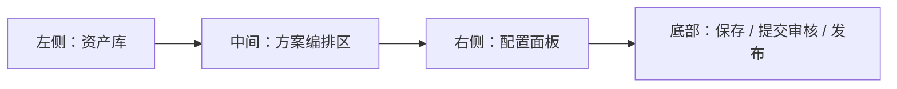

#### 项目资产画像页面结构

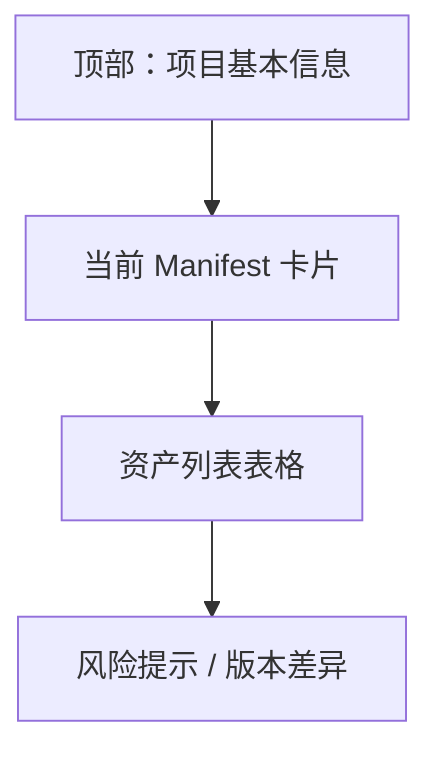

---

## 15. 实现思路与关键技术点

### 15.1 Hub 实现思路

Hub 采用 Web 应用 + 后端 API 的方式，负责：

- 资产元数据维护
- Manifest 组合与导出
- 审核与发布
- 安装预览
- 安装记录与运行态数据接收

### 15.2 CLI 实现思路

CLI 作为本地执行器，负责：

1. 向 Hub 查询 Manifest
2. 获取安装预览
3. 生成安装计划
4. 将文件写入业务项目
5. 生成 `hub-lock.json`
6. 支持升级、回滚与差异检查

### 15.3 Visual 实现思路

Visual 通过 Collector 扫描本地项目目录与锁文件，形成项目画像，并与 Hub 联动，展示团队使用情况与治理状态。

### 15.4 为什么采用“三仓协同”而不是单仓实现

原因有三：

1. **职责清晰**：资产管理、CLI 执行、观测控制天然是不同职责。
2. **演进独立**：三部分可以独立迭代，互不强耦合。
3. **复用性强**：CLI 可以服务多个 Visual；Hub 可以服务多个项目类型。

### 15.5 关键技术点

| 技术点 | 说明 |
|---|---|
| Manifest 快照导出 | 确保 CLI 获取的是稳定、可安装的方案包 |
| Install Preview | 安装前预览变更和风险 |
| hub-lock.json | 本地锁定版本、支持 diff / upgrade / rollback |
| Collector 扫描 | 自动识别项目接入状态 |
| Runtime Event | 记录运行反馈并支撑 V3 推荐治理 |
| ui-ux-pro-max | 统一前端页面设计与交互规范 |

---

## 16. 部署与运行方式

### 16.1 运行形态

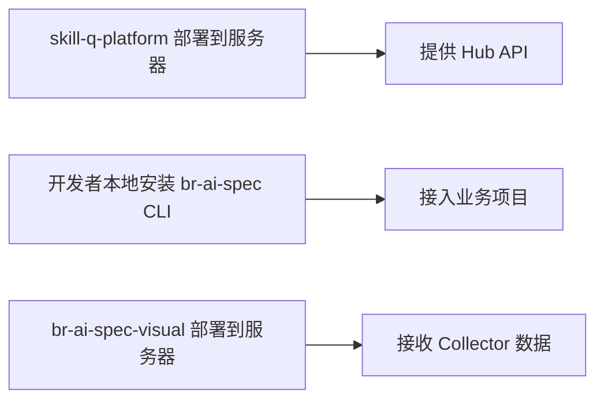

### 16.2 使用方式概览

#### 平台侧

1. 创建资产
2. 创建 Manifest
3. 审核并发布

#### 业务侧

1. 选择 Manifest
2. CLI 安装
3. 项目执行与运行
4. Visual 查看接入情况

#### 管理侧

1. 查看团队覆盖率
2. 查看资产效果
3. 查看风险与版本治理情况

---

## 17. 项目价值与收益

### 17.1 对研发团队的价值

- AI 工程能力标准化
- 提高多项目复用效率
- 降低新人接入成本
- 降低 AI 使用的不确定性

### 17.2 对管理者的价值

- 可视化了解团队接入情况
- 了解哪些规范真实落地
- 发现高风险项目和高风险资产
- 形成团队级治理抓手

### 17.3 对平台建设的价值

- 形成工程资产沉淀体系
- 形成可迭代的能力市场
- 打通资产生产、消费、反馈闭环
- 为未来 AI Native 工程体系奠定基础

### 17.4 价值总结图

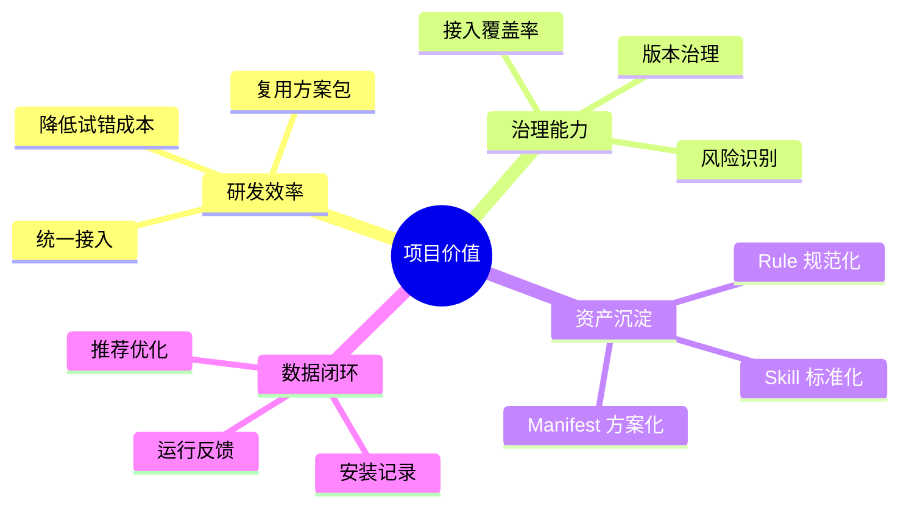

---

## 18. 风险、约束与非目标

### 18.1 风险点

| 风险 | 说明 |
|---|---|
| 资产质量不高 | Skill / Rule 若缺少审核，可能影响交付质量 |
| 安装侵入性 | CLI 写入本地项目，需要良好的预览和回滚机制 |
| 运行数据隐私 | 回流时必须严格控制数据内容，不上传源码和敏感信息 |
| 治理推动成本 | 平台能力建立后，团队是否接入仍需要组织推动 |

### 18.2 应对方式

- 引入审核流和风险分级
- 安装前 Diff 预览
- 提供升级 / 回滚能力
- 采用结构化事件回流，不上传敏感内容
- 通过试点逐步推广

### 18.3 非目标再次说明

当前阶段不做：

- 复杂的模型训练与调参体系
- 通用型代码 IDE 替代方案
- 泛内容社区平台

---

## 19. 试点与推广建议

### 19.1 建议试点方式

第一阶段建议选择：

- 1 个内部前端中后台项目
- 1 套 React / TypeScript 标准研发方案包
- 1 个核心团队作为试点

### 19.2 试点目标

- 跑通 V1 最小闭环
- 验证 CLI 安装可用性
- 验证 Visual 展示可用性
- 验证 Hub 管理与发布能力

### 19.3 推广路径

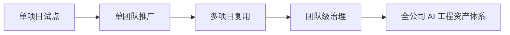

### 19.4 试点评估指标建议

| 指标 | 说明 |
|---|---|
| 接入项目数 | 有多少项目已接入方案包 |
| 安装成功率 | Manifest 安装是否稳定 |
| 升级成功率 | V2 升级流程是否可用 |
| 覆盖率 | 团队内项目接入比例 |
| 运行成功率 | Skill / Flow 执行成功率 |
| 风险数 | 本地修改、过期版本、高风险资产数量 |

---

## 20. 总结

本项目的本质，不是单独做一个 Skill 平台，也不是单独做一个 CLI 工具，而是在构建一套：

> **面向团队的 AI 工程资产操作系统。**

它通过 `skill-q-platform`、`br-ai-spec`、`br-ai-spec-visual` 三者协同，建立起：

- 资产沉淀能力
- 方案包安装能力
- 项目接入能力
- 可视化观测能力
- 数据回流与治理能力

最终目标是把 AI 编程从“每个人各凭经验地用”，升级为：

> **团队可管理、可推广、可追踪、可持续优化的工程能力体系。**

---

## 附录 A：一句话对外介绍模板

### 面向管理者

这是一个将团队 AI 编程能力标准化、产品化、可视化的工程平台，能够统一管理规范与能力包，并支持项目一键接入、运行观测和持续治理。

### 面向研发团队

这是一个把 Skill、Rule、角色和开发规范打包成方案包，并通过 CLI 安装到业务项目、通过 Visual 进行观测和治理的 AI 工程资产体系。

### 面向新同学

你可以把它理解为：

- Hub：能力仓库
- CLI：安装器
- Visual：控制台

三者一起构成一套完整的 AI 工程协作平台。

---

## 附录 B：最小闭环示意

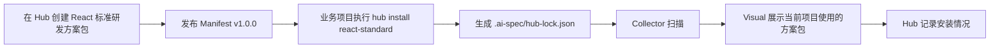

