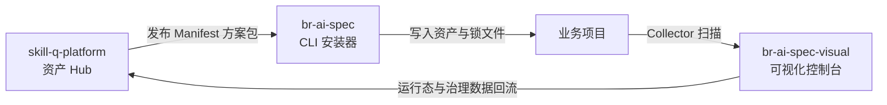
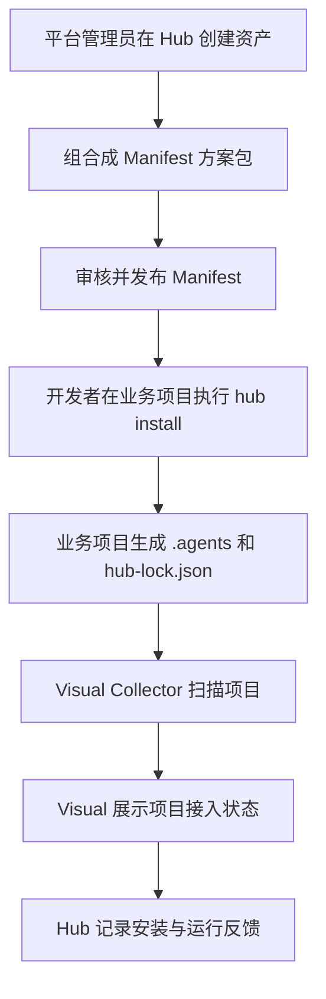

# 团队成员精简版项目介绍文档

> 适用对象：首次接触本项目的团队成员、研发同学、测试同学、产品同学、项目负责人。  
> 阅读目标：用较短时间理解这个项目是什么、为什么做、由哪些仓库组成、日常开发和使用时应该关注什么。

---

## 1. 项目一句话介绍

本项目是一套面向团队的 **AI 工程资产操作系统**，用于把团队里的 Skill、Rule、角色、流程、研发规范和 AI 协作方式，沉淀成可管理、可安装、可观测、可治理的工程资产体系。

简单理解：

```text
skill-q-platform 负责管理资产
br-ai-spec 负责把资产安装到项目
br-ai-spec-visual 负责查看项目用了什么、运行得怎么样
```

---

## 2. 为什么要做这个项目

团队在使用 AI 辅助研发时，容易出现以下问题：

1. 每个人都有自己的提示词、规则和使用习惯，难以统一。
2. AI 输出质量不稳定，缺少团队级规范约束。
3. 好用的 Skill / Rule 没有统一沉淀，复用成本高。
4. 业务项目接入 AI 规范时，没有统一安装和升级方式。
5. 管理者不知道哪些项目已经接入、用了哪些方案、是否过期。
6. 没有运行效果回流，无法判断哪些资产真的有效。

本项目要解决的核心问题是：

> 把 AI 编程从“个人经验”升级为“团队资产”，再进一步变成可持续治理的工程体系。

---

## 3. 三个仓库分别做什么

| 仓库 | 定位 | 主要职责 |
|---|---|---|
| `skill-q-platform` | AI 工程资产 Hub | 管理 Skill、Rule、Role、Flow、Scenario、Manifest、版本、审核、发布、安装记录、运行反馈 |
| `br-ai-spec` | CLI 执行底座 | 从 Hub 拉取 Manifest，安装到业务项目，生成 `.agents`、`.ai-spec`、`hub-lock.json`，支持同步、差异检查、升级、回滚 |
| `br-ai-spec-visual` | 可视化控制台 | 展示项目接入状态、Manifest 使用情况、资产版本、运行态数据、团队治理看板 |

---

## 4. 三仓协作关系



---

## 5. 核心概念说明

### 5.1 Asset：工程资产

Asset 是单个可复用能力，例如：

- Skill：某个 AI 能力，例如需求分析、代码评审、测试生成。
- Rule：团队规范，例如前端编码规范、接口规范、测试规范。
- Role：角色定义，例如需求分析师、前端实现专家、代码守卫。
- Flow：流程定义，例如从需求到开发、从修复到验证。
- Template：模板，例如 PRD 模板、接口文档模板、测试用例模板。

### 5.2 Manifest：方案包

Manifest 是项目的核心概念。

它不是单个 Skill，而是一组资产的组合，表示一套可以安装到项目里的完整方案。

例如：

```text
React 标准研发方案包
├── React 编码规范
├── TypeScript 规范
├── 接口联调规范
├── 前端实现 Skill
├── 代码审查 Skill
├── 测试用例生成 Skill
└── 项目交付流程 Flow
```

### 5.3 hub-lock.json：本地锁文件

`hub-lock.json` 记录当前业务项目安装了哪个 Manifest、哪个版本、哪些资产。

它用于：

1. 判断项目是否接入 Hub。
2. 判断本地资产是否过期。
3. 支持后续升级、回滚、差异检查。
4. 供 Visual 扫描和展示。

---

## 6. 最小使用闭环



---

## 7. 项目分阶段目标

### V1：跑通资产安装闭环

目标是先让系统能完整跑起来：

```text
Hub 创建方案包
CLI 安装方案包
业务项目生成锁文件
Visual 展示项目接入状态
Hub 记录安装结果
```

V1 不追求复杂推荐，重点是稳定可用。

### V2：增强治理能力

V2 重点解决企业级使用问题：

- 审核流
- 版本管理
- 安装前 Diff
- 升级
- 回滚
- 权限控制
- 治理看板

### V3：形成运行反馈闭环

V3 重点让平台知道哪些能力真的好用：

- 运行态回流
- Skill 成功率
- Manifest 健康度
- 失败原因分析
- 推荐中心
- 项目风险画像

---

## 8. 不同角色应该关注什么

### 平台管理员

关注：

- 资产是否规范
- Manifest 是否审核发布
- 团队默认方案包是否合理
- 哪些资产需要废弃或升级

### 架构师 / 技术负责人

关注：

- 方案包是否符合团队工程规范
- 项目接入是否统一
- 资产版本是否一致
- 是否存在风险资产或过期资产

### 开发者

关注：

- 如何安装标准方案包
- 如何使用本地生成的 AI 工程资产
- 如何检查同步状态
- 如何处理升级或本地冲突

### 测试同学

关注：

- Manifest 安装是否成功
- CLI 安装、同步、升级、回滚是否稳定
- Visual 是否能正确展示项目状态
- 运行态数据是否准确回流

### 产品 / 项目负责人

关注：

- 这个系统是否提升了团队交付一致性
- 哪些项目已接入
- 接入后是否有真实使用效果
- 是否能沉淀可复用的团队能力

---

## 9. 常见问题

### 9.1 这个项目是不是一个 Skill 网站？

不是。

`skill-q-platform` 虽然管理 Skill，但它的目标不是单纯做 Skill 展示网站，而是做 AI 工程资产 Hub。

### 9.2 Manifest 为什么重要？

因为团队真正需要的不是单个 Skill，而是一整套能安装、能升级、能治理的方案。

Manifest 把零散资产变成可落地方案。

### 9.3 br-ai-spec 和 Visual 有什么区别？

`br-ai-spec` 负责执行和安装，偏本地项目侧。

`br-ai-spec-visual` 负责查看和治理，偏平台可视化侧。

### 9.4 为什么需要 hub-lock.json？

它是业务项目和 Hub 之间的版本凭证。

没有它，就无法知道项目安装了什么，也无法做升级、回滚和可视化治理。

---

## 10. 团队协作建议

1. 新增资产前，先判断是 Skill、Rule、Role、Flow 还是 Template。
2. 不要把所有能力都做成 Skill，规范类内容优先做成 Rule。
3. 每个 Manifest 必须有明确适用场景，例如 React 项目、Vue 项目、组件库项目。
4. CLI 修改必须保证幂等和可回滚。
5. Visual 不允许重新定义 Manifest 结构，只能消费 Hub 和锁文件。
6. 页面开发必须遵循 `ui-ux-pro-max` 生成的设计系统。
7. 所有页面文案、CLI 输出、错误提示必须使用中文。
8. 不允许上传源码、绝对路径、用户名、密钥等敏感信息。

---

## 11. 你需要记住的三句话

```text
Hub 管资产。
CLI 装资产。
Visual 看资产。
```

```text
Manifest 是核心。
hub-lock.json 是凭证。
运行态回流是护城河。
```

```text
这个项目的目标不是做一个工具，而是建立团队级 AI 工程资产体系。
```
