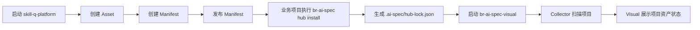

# 快速上手文档

> 适用对象：准备实际运行、开发、测试或接入本项目的团队成员。  
> 文档目标：帮助团队成员快速完成本地启动、方案包创建、CLI 安装、Visual 查看和基础联调。

---

## 1. 快速理解整体流程

本项目的最小闭环是：

```text
skill-q-platform 创建并发布 Manifest
br-ai-spec 安装 Manifest 到业务项目
br-ai-spec-visual 扫描业务项目并展示接入状态
```

流程图如下：



---

## 2. 前置环境

建议准备以下环境：

| 环境 | 建议版本 |
|---|---|
| Node.js | 18 或以上 |
| 包管理器 | pnpm / npm / yarn 均可，建议团队统一 |
| 数据库 | MySQL 8.x |
| Git | 最新稳定版本 |
| 操作系统 | macOS / Linux / Windows 均可 |
| AI 开发工具 | Codex / Cursor / Claude Code / OpenClaw |

如果使用页面开发能力，需要安装 `ui-ux-pro-max`：

```bash
npm install -g uipro-cli
```

---

## 3. 拉取三个仓库

```bash
git clone https://github.com/Colouful/skill-q-platform.git
git clone https://github.com/Colouful/br-ai-spec.git
git clone https://github.com/Colouful/br-ai-spec-visual.git
```

建议目录结构：

```text
workspace/
├── skill-q-platform
├── br-ai-spec
├── br-ai-spec-visual
└── demo-project
```

---

## 4. 启动 skill-q-platform

> 作用：作为 AI 工程资产 Hub，负责创建资产和 Manifest。

### 4.1 安装依赖

```bash
cd skill-q-platform
pnpm install
```

如果项目使用 npm：

```bash
npm install
```

### 4.2 配置环境变量

创建 `.env`：

```bash
cp .env.example .env
```

重点检查数据库连接：

```env
DATABASE_URL="mysql://用户名:密码@localhost:3306/skill_q_platform"
```

### 4.3 初始化数据库

```bash
pnpm prisma generate
pnpm prisma db push
```

如果项目已有迁移命令，以项目 `package.json` 中定义的命令为准。

### 4.4 启动服务

```bash
pnpm dev
```

默认访问：

```text
http://localhost:3000
```

---

## 5. 使用 ui-ux-pro-max 初始化页面设计系统

在 `skill-q-platform` 中执行：

```bash
uipro init --ai codex
```

建议生成以下设计系统文件：

```text
design-system/
├── MASTER.md
└── pages/
    ├── asset-list.md
    ├── asset-detail.md
    ├── manifest-list.md
    ├── manifest-builder.md
    ├── manifest-publish.md
    ├── install-guide.md
    └── install-records.md
```

页面开发要求：

1. 页面风格为企业级 AI 工程平台。
2. 所有按钮、提示、错误信息必须使用中文。
3. 必须包含加载、空状态、错误状态、无权限状态。
4. 表格、筛选、状态标签、详情抽屉需要统一风格。
5. 不允许每个页面单独设计一套视觉体系。

---

## 6. 创建第一个 Asset

在 `skill-q-platform` 中创建基础资产。

### 6.1 建议先创建 Rule

示例：

```text
名称：前端编码规范
标识：frontend-coding-standard
类型：rule
版本：1.0.0
状态：published
适用技术栈：React / TypeScript
风险等级：L1
```

### 6.2 再创建 Skill

示例：

```text
名称：前端任务实现 Skill
标识：frontend-implement-skill
类型：skill
版本：1.0.0
状态：published
适用场景：根据需求文档完成前端功能开发
风险等级：L1
```

### 6.3 再创建 Role

示例：

```text
名称：前端实现专家
标识：frontend-implementer
类型：role
版本：1.0.0
状态：published
```

---

## 7. 创建第一个 Manifest

Manifest 是方案包，建议先创建一个最小版本。

### 7.1 示例 Manifest 信息

```text
名称：React 标准研发方案包
标识：react-standard
版本：1.0.0
适用技术栈：React / TypeScript / Next.js
适用 IDE：Codex / Cursor / Claude Code / OpenClaw
安装模式：standard
状态：published
```

### 7.2 加入资产

在 Manifest Builder 中加入：

```text
frontend-coding-standard
frontend-implement-skill
frontend-implementer
```

### 7.3 发布 Manifest

发布后，需要确保 Export API 能返回完整快照。

示例访问：

```text
GET http://localhost:3000/api/hub/manifests/react-standard/export?version=1.0.0
```

预期返回：

```json
{
  "code": 0,
  "message": "查询成功",
  "data": {
    "schemaVersion": "1.0.0",
    "manifest": {
      "slug": "react-standard",
      "version": "1.0.0"
    },
    "assets": []
  }
}
```

---

## 8. 准备一个业务项目

创建或进入一个业务项目：

```bash
mkdir demo-project
cd demo-project
npm init -y
```

业务项目可以是 React、Vue、Next.js 或普通前端项目。

---

## 9. 使用 br-ai-spec 安装 Manifest

> 作用：从 Hub 拉取方案包，安装到业务项目。

### 9.1 安装或链接 br-ai-spec

进入 `br-ai-spec` 仓库：

```bash
cd ../br-ai-spec
pnpm install
```

如果需要本地调试 CLI，可以使用：

```bash
npm link
```

然后进入业务项目：

```bash
cd ../demo-project
```

### 9.2 搜索方案包

```bash
npx @ex/ai-spec-auto hub search react --hub http://localhost:3000
```

预期输出：

```text
正在搜索 Hub 资产...

找到相关方案包：
1. React 标准研发方案包
   标识：react-standard
   版本：1.0.0
```

### 9.3 预览安装

```bash
npx @ex/ai-spec-auto hub install react-standard --hub http://localhost:3000 --dry-run
```

预期效果：

```text
正在生成安装预览...
本次操作将新增若干资产文件。
当前为预览模式，不会写入文件。
```

### 9.4 正式安装

```bash
npx @ex/ai-spec-auto hub install react-standard --hub http://localhost:3000 --mode standard
```

安装成功后，业务项目中应该出现：

```text
demo-project/
├── .agents/
│   └── registry/
├── .ai-spec/
│   └── hub-lock.json
└── package.json
```

---

## 10. 检查本地锁文件

查看：

```bash
cat .ai-spec/hub-lock.json
```

应该包含：

```json
{
  "schemaVersion": "1.0.0",
  "hub": {
    "url": "http://localhost:3000"
  },
  "manifest": {
    "slug": "react-standard",
    "version": "1.0.0"
  },
  "assets": []
}
```

如果没有生成 `hub-lock.json`，说明安装闭环没有跑通，需要优先排查 CLI 安装逻辑。

---

## 11. 常用 br-ai-spec 命令

### 11.1 查看当前接入状态

```bash
npx @ex/ai-spec-auto hub status
```

### 11.2 检查与 Hub 的差异

```bash
npx @ex/ai-spec-auto hub diff
```

### 11.3 同步 Hub 信息

```bash
npx @ex/ai-spec-auto hub sync
```

### 11.4 升级 Manifest

```bash
npx @ex/ai-spec-auto hub upgrade
```

### 11.5 回滚 Manifest

```bash
npx @ex/ai-spec-auto hub rollback --to 1.0.0
```

### 11.6 健康诊断

```bash
npx @ex/ai-spec-auto hub doctor
```

---

## 12. 启动 br-ai-spec-visual

> 作用：查看业务项目接入状态和治理信息。

### 12.1 安装依赖

```bash
cd ../br-ai-spec-visual
pnpm install
```

### 12.2 配置环境变量

```bash
cp .env.example .env
```

根据项目实际要求配置数据库、端口和 Hub 地址。

示例：

```env
DATABASE_URL="mysql://用户名:密码@localhost:3306/br_ai_spec_visual"
HUB_BASE_URL="http://localhost:3000"
```

### 12.3 初始化数据库

```bash
pnpm prisma generate
pnpm prisma db push
```

### 12.4 初始化 ui-ux-pro-max 设计系统

```bash
uipro init --ai codex
```

建议生成：

```text
design-system/
├── MASTER.md
└── pages/
    ├── project-assets.md
    ├── manifest-usage.md
    ├── runtime-feedback.md
    └── governance-dashboard.md
```

### 12.5 启动服务

```bash
pnpm dev
```

默认访问：

```text
http://localhost:3001
```

---

## 13. 使用 Collector 扫描业务项目

在 Visual 中配置业务项目路径，或者使用 Collector 命令扫描业务项目。

示例：

```bash
pnpm collector scan ../demo-project
```

如果项目命令不同，以 `br-ai-spec-visual` 的 `package.json` 为准。

扫描目标：

```text
demo-project/.ai-spec/hub-lock.json
demo-project/.agents/registry
```

扫描成功后，Visual 应展示：

```text
项目名称：demo-project
当前方案包：React 标准研发方案包
Manifest 标识：react-standard
Manifest 版本：1.0.0
资产数量：若干
状态：正常
```

---

## 14. 验证最小闭环是否成功

最小闭环验收清单：

| 检查项 | 预期结果 |
|---|---|
| Hub 能创建 Asset | 成功 |
| Hub 能创建 Manifest | 成功 |
| Manifest 能发布 | 成功 |
| Export API 能返回 Manifest 快照 | 成功 |
| CLI 能搜索 Manifest | 成功 |
| CLI 能 dry-run 预览安装 | 成功 |
| CLI 能正式安装 | 成功 |
| 本地生成 `.ai-spec/hub-lock.json` | 成功 |
| Hub 能记录安装结果 | 成功 |
| Visual 能扫描业务项目 | 成功 |
| Visual 能展示项目 Manifest | 成功 |

---

## 15. 开发联调建议

### 15.1 推荐启动顺序

```text
1. 启动 MySQL
2. 启动 skill-q-platform
3. 创建并发布 Manifest
4. 调试 br-ai-spec CLI 安装
5. 启动 br-ai-spec-visual
6. 扫描业务项目
7. 查看 Visual 展示结果
```

### 15.2 推荐分支策略

```text
feature/hub-manifest
feature/br-ai-spec-hub-cli
feature/visual-project-assets
feature/runtime-feedback
```

### 15.3 推荐接口联调顺序

```text
Asset API
Manifest API
Manifest Export API
Install Preview API
Install Report API
Visual Collector API
Runtime Report API
```

---

## 16. 常见问题排查

### 16.1 CLI 搜不到 Manifest

检查：

1. `skill-q-platform` 是否启动。
2. `--hub` 地址是否正确。
3. Manifest 是否已发布。
4. Export API 是否能正常访问。

### 16.2 安装后没有 hub-lock.json

检查：

1. CLI 是否有写入权限。
2. 安装流程是否中断。
3. 是否使用了 `--dry-run`。
4. `.ai-spec` 目录是否创建成功。

### 16.3 Visual 展示为空

检查：

1. Collector 是否扫描了正确项目目录。
2. 业务项目是否存在 `.ai-spec/hub-lock.json`。
3. Visual 数据库是否写入成功。
4. 项目 hash 是否一致。

### 16.4 本地资产被覆盖

检查：

1. 安装策略是否启用了强制覆盖。
2. 是否正确检测了本地 checksum。
3. 是否缺少安装前 Diff 预览。
4. 是否需要执行 rollback。

---

## 17. 团队使用规范

1. 所有新资产必须有清晰名称、标识、版本、描述和适用场景。
2. 不允许直接发布未审核的 Manifest。
3. 不允许上传密钥、源码、绝对路径和用户名。
4. CLI 输出必须中文化。
5. 页面文案必须中文化。
6. 页面设计必须遵循 `ui-ux-pro-max` 生成的设计系统。
7. Visual 不允许私自定义 Manifest 字段，应消费 Hub 的标准结构。
8. 任何安装、升级、回滚功能必须可重复执行且可恢复。

---

## 18. 第一次上手推荐路径

如果你是第一次接触，只需要按下面 7 步走：

```text
1. 启动 skill-q-platform
2. 创建一个 Rule
3. 创建一个 Skill
4. 创建并发布 react-standard Manifest
5. 在 demo-project 中执行 hub install
6. 确认生成 .ai-spec/hub-lock.json
7. 启动 Visual 并扫描 demo-project
```

完成以上步骤，就说明你已经跑通了项目最核心的能力闭环。
