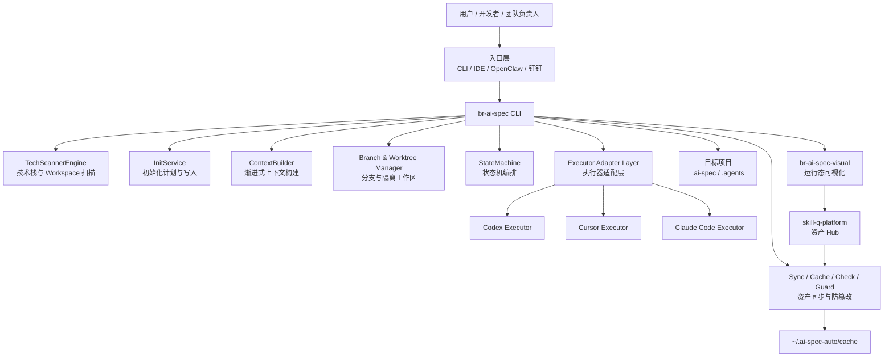
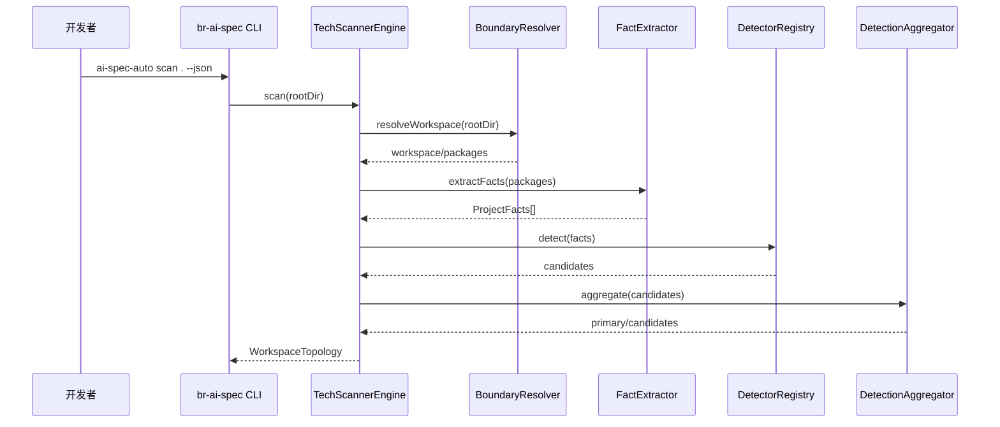
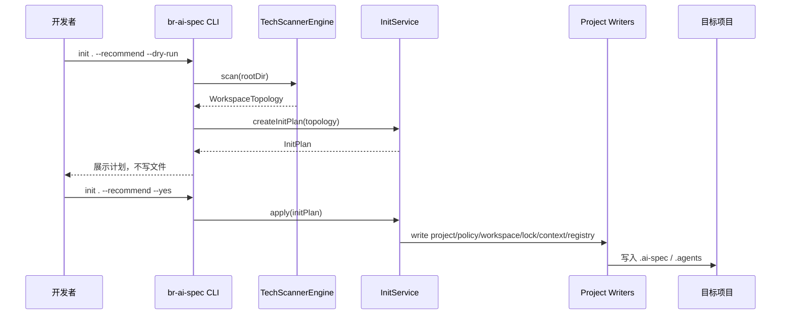
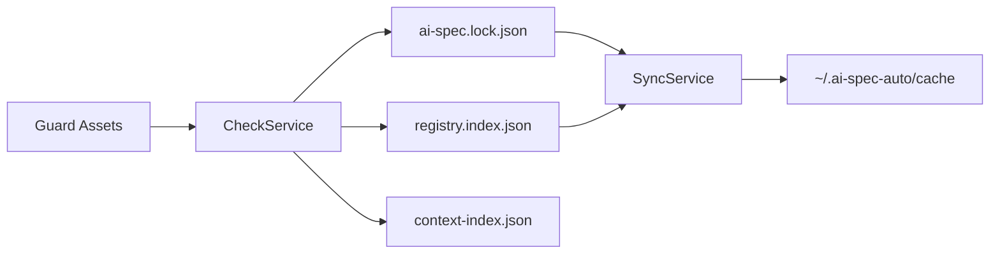
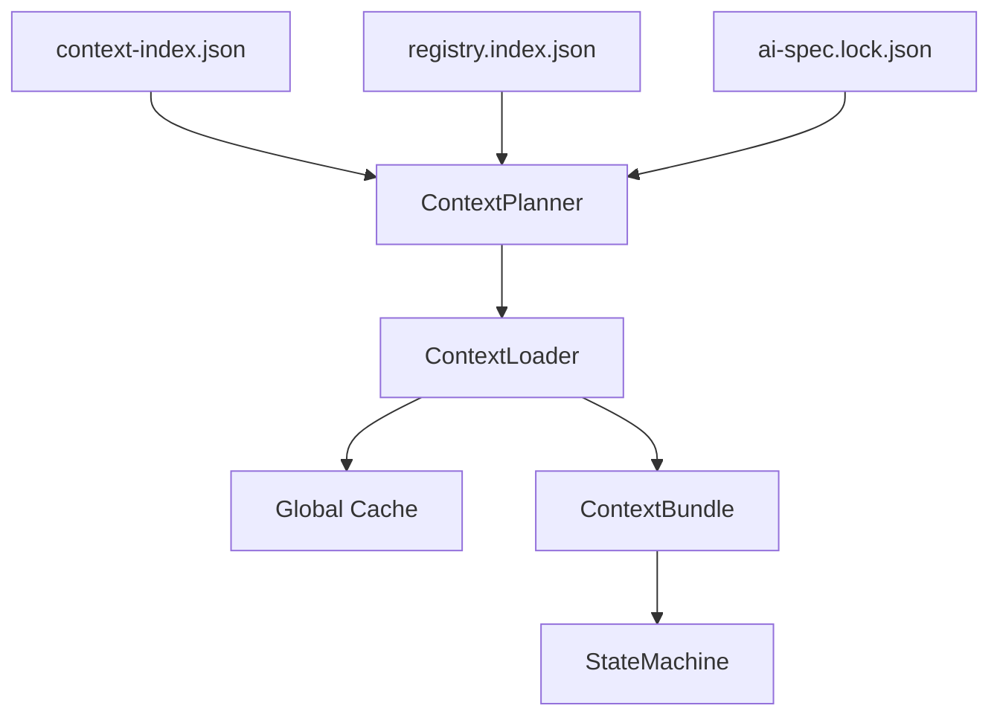
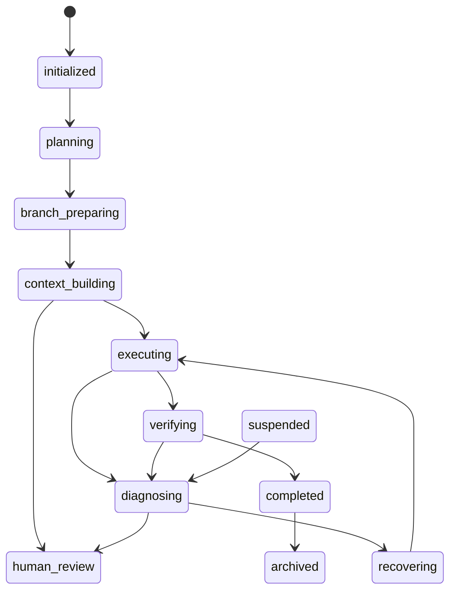

# br-ai-spec 架构文档

> 文档用途：作为扣子知识库 `ai-spec-core-architecture` 的核心文档，也可作为 `br-ai-spec` 后续开发、评审、Codex/Cursor/Claude Code 执行的架构事实源。

---

## 1. 系统定位

`br-ai-spec` 是 AI 工程资产操作系统中的本地工程执行引擎，负责把 Hub 中的工程资产安全、可控、可追踪地应用到目标项目中。

它不是单纯 CLI，也不是一个 Prompt 集合，而是连接以下能力的本地工程底座：

1. 技术栈扫描。
2. 项目初始化。
3. Manifest 推荐与安装。
4. 本地全局资产缓存。
5. 项目轻量索引与锁文件。
6. 渐进式上下文构建。
7. Git 分支与 Worktree 隔离。
8. 状态机编排。
9. 熔断与异常逃逸。
10. 多执行器适配。
11. 运行事件与治理数据回流。

---

## 2. 三项目协同边界

```text
skill-q-platform
  ↓ 资产事实源 / Manifest / Agent Profile / 审核发布
br-ai-spec
  ↓ 本地执行引擎 / 项目初始化 / 状态机 / Worktree / 执行器适配
br-ai-spec-visual
  ↓ 运行态可视化 / 团队治理 / 指标报表 / 运行事件分析
```

### 2.1 skill-q-platform

`skill-q-platform` 是资产 Hub，负责资产生命周期管理。

职责：

1. 管理 Rule / Skill / Role / Flow / Manifest / Agent Profile。
2. 管理资产版本、checksum、依赖关系。
3. 管理草稿、审核、发布、废弃、归档。
4. 提供 Manifest Recommend API。
5. 提供 Manifest Export API。
6. 提供 Asset Content API。
7. 提供 Agent Profile Export API。
8. 接收安装记录与运行反馈。

禁止：

1. 不直接修改业务项目代码。
2. 不直接执行本地需求开发。
3. 不持有用户项目源码。
4. 不绕过 `br-ai-spec` 状态机直接调用执行器。

### 2.2 br-ai-spec

`br-ai-spec` 是本地执行引擎。

职责：

1. 识别 Workspace / Repo / Package。
2. 识别 React / Vue / Next.js / Spring Boot / Spring MVC / Spring Cloud / NestJS / FastAPI / Go / Rust 等技术栈。
3. 生成 InitPlan。
4. 写入 `.ai-spec/project.json`。
5. 写入 `.ai-spec/workspace.json`。
6. 写入 `.ai-spec/policy.json`。
7. 写入 `.ai-spec/ai-spec.lock.json`。
8. 写入 `.ai-spec/context-index.json`。
9. 写入 `.agents/registry.index.json`。
10. 同步 Hub 资产到 `~/.ai-spec-auto/cache`。
11. 构建 ContextBundle。
12. 创建 Git branch / worktree。
13. 执行状态机流转。
14. 调用 Codex / Cursor / Claude Code 执行器。
15. 处理熔断与异常逃逸。
16. 记录 run / incident / history。
17. 向 Visual 上报结构化运行摘要。

禁止：

1. 不修改 Hub 已发布资产正文。
2. 不绕过 lock 文件使用未审核资产。
3. 不上传目标项目源码。
4. 不将某个执行器写死为唯一执行器。

### 2.3 br-ai-spec-visual

`br-ai-spec-visual` 是运行态与治理平台。

职责：

1. 展示项目画像。
2. 展示 Workspace / Repo / Package 拓扑。
3. 展示 Manifest 安装覆盖率。
4. 展示 Rule / Skill / Agent Profile 使用情况。
5. 展示 Run 状态。
6. 展示 History。
7. 展示 Incident。
8. 展示 Token 预算。
9. 展示团队报表与项目报表。
10. 向 Hub 回流资产效果指标。

禁止：

1. 不重新定义 Asset / Manifest 模型。
2. 不直接修改目标项目代码。
3. 不直接发布 Hub 资产。
4. 不展示目标项目源码正文。

---

## 3. 全局架构图



---

## 4. 最高架构原则

### 4.1 Hub 是资产事实源

1. 标准资产以 Hub 为事实源。
2. 项目内不保存完整公共资产正文。
3. 项目内只保存轻量索引和锁文件。
4. 本地全局缓存保存 Hub 资产副本。

### 4.2 已发布标准资产不可变

1. published 资产不可直接修改。
2. 修改必须发布新版本。
3. 项目差异通过 Project Overlay 表达。
4. 不允许在项目内直接编辑标准资产正文。

### 4.3 扫描阶段绝对只读

扫描、识别、推荐阶段只允许读取文件，不允许写入：

1. 不修改 `package.json`。
2. 不修改 `pom.xml`。
3. 不修改 `tsconfig.json`。
4. 不修改源代码。
5. 不安装依赖。
6. 不执行构建。
7. 不执行测试。

### 4.4 初始化写入必须显式确认

1. `init --recommend --dry-run` 只生成计划，不写入文件。
2. `init --recommend --yes` 才允许写入 `.ai-spec` 和 `.agents`。
3. 已存在配置必须合并，不得直接覆盖用户字段。

### 4.5 执行需求默认隔离分支

1. `/spec-start` 默认创建 Git branch。
2. 默认创建 Git worktree。
3. 原始工作区不得被 AI 修改。
4. dirty 工作区默认 `block`。

### 4.6 执行器必须可插拔

1. Codex、Cursor、Claude Code 是并列执行器。
2. 状态机只能依赖 `IExecutorProvider`。
3. 不允许绑定某个唯一 IDE。

### 4.7 上下文必须渐进式加载

1. 不一次性加载全部资产。
2. 使用 `context-index.json` 和 `registry.index.json` 按阶段加载。
3. planning 加载 Role / Flow。
4. implementation 加载 Rule / Skill / Agent Profile。
5. verification 加载验证规则。
6. diagnosing 加载诊断资产。

### 4.8 不上传目标项目源码

Visual / Hub 只接收结构化摘要，不接收：

1. 源码正文。
2. 完整 Prompt。
3. 完整 Response。
4. 绝对路径。
5. 用户名。
6. 密钥。
7. `.env` 文件内容。

### 4.9 状态机必须具备逃逸机制

遇到异常时不能直接崩溃，必须进入：

1. diagnosing。
2. recovering。
3. suspended。
4. human_review。
5. failed。

---

## 5. 核心目录结构

```text
br-ai-spec/
├── bin/
│   ├── cli.js
│   ├── scan.js
│   ├── init-command.js
│   ├── sync-command.js
│   ├── check-command.js
│   ├── guard-command.js
│   ├── context-command.js
│   ├── worktree-command.js
│   └── spec-command.js
├── src/
│   ├── config/
│   ├── scanner/
│   ├── init/
│   ├── project/
│   ├── cache/
│   ├── hub/
│   ├── sync/
│   ├── check/
│   ├── security/
│   ├── context/
│   ├── git/
│   ├── run/
│   ├── state-machine/
│   ├── incident/
│   └── executor/
├── tests/
└── docs/
```

---

## 6. 核心流程

### 6.1 scan 流程



### 6.2 init 流程



### 6.3 sync/check/guard 流程



### 6.4 context 流程



### 6.5 spec-start 流程



---

## 7. 核心文件契约

### 7.1 `.ai-spec/project.json`

```json
{
  "schemaVersion": "1.0.0",
  "projectId": "proj_xxx",
  "projectName": "demo",
  "projectType": "single",
  "relativePath": ".",
  "techProfile": {
    "domain": "frontend",
    "language": ["TypeScript"],
    "frameworks": ["React", "Vite"],
    "buildTool": "Vite",
    "confidence": 92,
    "reasons": []
  },
  "manifest": {
    "slug": "frontend-react-vite-standard",
    "version": "1.0.0",
    "checksum": "sha256:xxx"
  },
  "defaultExecutor": "cursor",
  "createdAt": "2026-01-01T00:00:00.000Z",
  "updatedAt": "2026-01-01T00:00:00.000Z"
}
```

### 7.2 `.ai-spec/policy.json`

```json
{
  "schemaVersion": "1.0.0",
  "execution": {
    "mode": "local-assisted",
    "defaultExecutor": "cursor",
    "fallbackExecutors": ["claude-code", "codex"],
    "executorSelectionStrategy": "policy-first"
  },
  "branchPolicy": {
    "autoCreateBranch": true,
    "autoCreateWorktree": true,
    "baseBranch": "develop",
    "branchPrefix": "ai",
    "worktreeRoot": "../.ai-worktrees",
    "dirtyStrategy": "block",
    "cleanupAfterMerge": false
  },
  "privacyPolicy": {
    "uploadSourceCode": false,
    "uploadAbsolutePath": false,
    "uploadUserName": false,
    "uploadRawPrompt": false,
    "uploadRawResponse": false,
    "uploadFileContent": false,
    "allowRelativePath": true,
    "allowFailureSummary": true,
    "allowTestSummary": true
  }
}
```

### 7.3 `.ai-spec/ai-spec.lock.json`

```json
{
  "schemaVersion": "1.0.0",
  "projectId": "proj_xxx",
  "workspaceId": "workspace_xxx",
  "hub": {
    "url": ""
  },
  "manifest": {
    "slug": "frontend-react-vite-standard",
    "version": "1.0.0",
    "checksum": "sha256:xxx",
    "installedAt": "2026-01-01T00:00:00.000Z"
  },
  "assets": [],
  "overlays": [],
  "sharedContracts": []
}
```

### 7.4 `.agents/registry.index.json`

```json
{
  "schemaVersion": "1.0.0",
  "projectId": "proj_xxx",
  "source": "hub",
  "manifest": {
    "slug": "frontend-react-vite-standard",
    "version": "1.0.0"
  },
  "assets": {
    "rules": [],
    "skills": [],
    "agentProfiles": []
  }
}
```

### 7.5 `.ai-spec/context-index.json`

```json
{
  "schemaVersion": "1.0.0",
  "projectId": "proj_xxx",
  "contextStrategy": "progressive",
  "stageLoadRules": [
    {
      "stage": "planning",
      "loadKinds": ["role", "flow"],
      "maxAssets": 5
    },
    {
      "stage": "implementation",
      "loadKinds": ["rule", "skill", "agent-profile"],
      "maxAssets": 8
    },
    {
      "stage": "verification",
      "loadKinds": ["rule", "flow"],
      "maxAssets": 6
    },
    {
      "stage": "diagnosing",
      "loadKinds": ["rule", "skill", "agent-profile"],
      "requiredAgents": ["diagnostic-agent"],
      "maxAssets": 6
    }
  ],
  "sharedContracts": []
}
```

---

## 8. 命令清单

```bash
ai-spec-auto scan .
ai-spec-auto scan . --json
ai-spec-auto scan . --explain

ai-spec-auto init . --recommend --dry-run
ai-spec-auto init . --recommend --yes
ai-spec-auto init . --manifest frontend-react-vite-standard --yes

ai-spec-auto sync .
ai-spec-auto check .
ai-spec-auto guard assets

ai-spec-auto context . --stage planning --json
ai-spec-auto context . --stage implementation --json

ai-spec-auto worktree dirty .
ai-spec-auto worktree plan . --summary "新增用户列表"
ai-spec-auto worktree create . --summary "新增用户列表"

ai-spec-auto spec-start "新增用户列表"
ai-spec-auto spec-start "新增用户列表" --dry-run
ai-spec-auto spec-start "新增用户列表" --no-worktree
ai-spec-auto spec-status <runId>
ai-spec-auto spec-continue <runId>
```

---

## 9. 模块职责

### 9.1 ConfigLoader

负责合并配置来源：

1. CLI 参数。
2. 当前 run 配置。
3. `.ai-spec/policy.json`。
4. `.ai-spec/project.json`。
5. `.ai-spec/workspace.json`。
6. Agent Profile。
7. `~/.ai-spec-auto/config.json`。
8. 系统默认值。

### 9.2 TechScannerEngine

负责识别项目拓扑和技术栈。

核心层次：

1. BoundaryResolver。
2. FactExtractor。
3. DetectorRegistry。
4. DetectionAggregator。

### 9.3 InitService

负责生成 InitPlan 和应用初始化。

### 9.4 SyncService

负责根据 lock 和 registry 同步资产缓存。

### 9.5 AssetTamperChecker

负责检测资产篡改、checksum 不一致、registry 越权保存正文等问题。

### 9.6 ContextBuilder

负责根据阶段构建 ContextBundle。

### 9.7 Git / Worktree

负责分支隔离和工作区隔离。

### 9.8 StateMachine

负责需求流转编排。

### 9.9 Executor Adapter

负责统一接入 Codex、Cursor、Claude Code。

---

## 10. 隐私与安全规范

必须默认关闭：

```json
{
  "uploadSourceCode": false,
  "uploadRawPrompt": false,
  "uploadRawResponse": false,
  "uploadAbsolutePath": false,
  "uploadUserName": false,
  "uploadFileContent": false
}
```

禁止上传：

1. 源码正文。
2. `.env`。
3. 密钥。
4. 私有配置。
5. 完整 Prompt。
6. 完整 Response。
7. 绝对路径。
8. 用户名。

允许上报：

1. runId。
2. stage。
3. state。
4. asset slug。
5. manifest slug。
6. 检查结果摘要。
7. 测试摘要。
8. 失败分类。
9. token 预算摘要。

---

## 11. 执行器适配原则

```ts
interface IExecutorProvider {
  name: 'codex' | 'cursor' | 'claude-code';
  checkAvailability(context: ExecutorContext): Promise<AvailabilityResult>;
  prepare(context: ExecutorContext): Promise<PrepareResult>;
  execute(request: ExecutorExecutionRequest): Promise<ExecutorExecutionResult>;
  verify?(request: ExecutorVerifyRequest): Promise<ExecutorVerifyResult>;
  cleanup?(context: ExecutorContext): Promise<void>;
}
```

原则：

1. 状态机不直接调用具体 IDE。
2. 具体执行器只通过 Provider 接入。
3. CLI 参数优先级最高。
4. Agent Profile 推荐优先于 policy。
5. policy 默认值优先于 global config。
6. 所有执行结果必须标准化。

---

## 12. 验收标准

### 12.1 功能验收

- [ ] scan 阶段只读。
- [ ] init dry-run 不写文件。
- [ ] init yes 写入轻量索引。
- [ ] lock / registry / context-index 结构稳定。
- [ ] sync 支持空 assets。
- [ ] check 能发现隐私违规。
- [ ] guard assets 可用于 CI。
- [ ] context 按阶段加载。
- [ ] worktree 默认不污染原始工作区。
- [ ] state machine 阻断非法状态流转。
- [ ] executor 可插拔。

### 12.2 安全验收

- [ ] 不上传源码。
- [ ] 不上传 rawPrompt。
- [ ] 不上传 rawResponse。
- [ ] 不上传绝对路径。
- [ ] 不修改 Hub 已发布资产。
- [ ] 不绕过 lock 文件。

### 12.3 工程验收

- [ ] 所有新增模块有测试。
- [ ] 所有 CLI 输出中文。
- [ ] 所有核心数据结构稳定。
- [ ] 所有 JSON 可解析。
- [ ] 所有错误有中文提示和 code。

---

## 13. 知识库使用建议

建议将本文放入扣子知识库：

```text
知识库名称：ai-spec-core-architecture
文档名称：br-ai-spec 架构文档
用途：供 AI Asset Factory Agent 理解 br-ai-spec 本地执行引擎、三项目边界、状态机、上下文、Worktree、执行器适配等核心机制。
```
