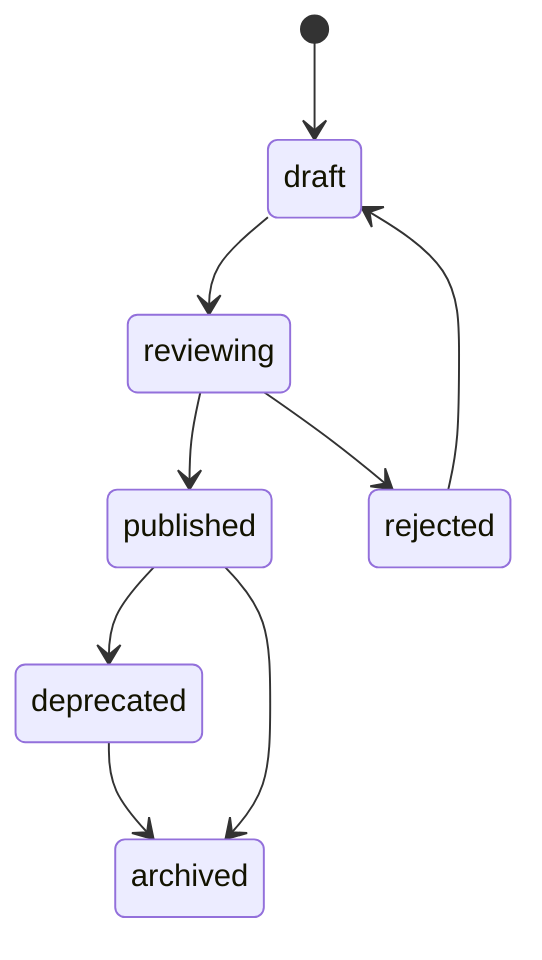

# Manifest 规范文档

> 文档用途：作为扣子知识库 `hub-asset-schema` 与 `ai-spec-core-architecture` 的 Manifest 事实源，用于生成、审核、导入和安装 Hub Manifest 草稿。

---

## 1. Manifest 定位

Manifest 是 AI 工程资产操作系统中的“安装清单”和“资产组合包”。

它不是单个 Rule，也不是单个 Skill，而是面向某类技术栈和项目场景，组合以下资产的声明式清单：

1. Rule。
2. Skill。
3. Role。
4. Flow。
5. Scenario。
6. Agent Profile。
7. Contract。
8. Source Pack。
9. Tech Profile。

Manifest 由 `skill-q-platform` 管理，由 `br-ai-spec` 安装和消费，由 `br-ai-spec-visual` 观察使用效果。

---

## 2. 核心原则

### 2.1 Manifest 是安装入口

项目执行：

```bash
ai-spec-auto init . --recommend
```

实际是通过技术栈扫描结果推荐 Manifest，再由 Manifest 决定安装哪些资产索引。

### 2.2 Manifest 不保存资产正文

Manifest 可以引用资产，但不应该内嵌完整 Rule / Skill 正文。

原因：

1. 便于资产去重。
2. 便于版本升级。
3. 便于 checksum 校验。
4. 便于单个资产复用。
5. 便于防篡改。

### 2.3 published Manifest 不可变

发布后的 Manifest 不允许直接修改。

修改方式：

1. 创建新 draft。
2. 修改 draft。
3. 审核通过。
4. 发布新版本。
5. 旧版本可 deprecated 或 archived。

### 2.4 安装时必须锁版本

项目安装 Manifest 后，必须写入：

```text
.ai-spec/ai-spec.lock.json
```

锁定：

1. Manifest slug。
2. Manifest version。
3. Manifest checksum。
4. Asset slug。
5. Asset version。
6. Asset checksum。

---

## 3. 命名规范

### 3.1 slug 规则

slug 必须：

1. 小写字母。
2. 数字。
3. 中横线。
4. 不使用空格。
5. 不使用中文。
6. 不使用下划线。

示例：

```text
frontend-react-vite-standard
frontend-react-nextjs-standard
backend-java-springboot-standard
backend-node-nestjs-standard
backend-python-fastapi-standard
backend-rust-axum-standard
fullstack-workspace-standard
```

### 3.2 版本规范

使用 SemVer：

```text
1.0.0
1.1.0
2.0.0
```

规则：

1. patch：文案、示例、兼容性小修。
2. minor：新增资产、增强规则，兼容旧项目。
3. major：破坏性变更。

### 3.3 scope 规范

支持：

```text
platform
department
team
project
personal
```

推荐：

1. 平台公共规范使用 `platform`。
2. 团队差异规范使用 `team`。
3. 项目特殊规范使用 `project`。
4. 个人实验资产使用 `personal`，不允许直接发布到团队默认 Manifest。

---

## 4. Manifest Schema

```json
{
  "schemaVersion": "1.0.0",
  "kind": "manifest",
  "slug": "frontend-react-vite-standard",
  "name": "React Vite 前端标准资产清单",
  "description": "适用于 React + Vite + TypeScript 前端项目的企业级 AI 工程资产安装清单。",
  "version": "1.0.0",
  "status": "draft",
  "scope": "platform",
  "owner": {
    "team": "AI 工程平台组",
    "maintainers": []
  },
  "applicableTechStacks": [
    {
      "domain": "frontend",
      "language": ["TypeScript", "JavaScript"],
      "frameworks": ["React", "Vite"],
      "projectKinds": ["application", "monorepo"]
    }
  ],
  "compatibility": {
    "brAiSpecVersion": ">=1.0.0",
    "hubVersion": ">=1.0.0",
    "visualVersion": ">=1.0.0"
  },
  "assetRefs": [
    {
      "kind": "rule",
      "slug": "frontend-react-component-rule",
      "version": "1.0.0",
      "required": true,
      "checksum": "sha256:xxx",
      "loadStages": ["implementation", "review"],
      "telemetryTags": ["react-component"]
    }
  ],
  "agentProfileRef": {
    "slug": "frontend-cursor-agent-profile",
    "version": "1.0.0",
    "required": true,
    "checksum": "sha256:xxx"
  },
  "installPolicy": {
    "defaultExecutor": "cursor",
    "fallbackExecutors": ["claude-code", "codex"],
    "contextStrategy": "progressive",
    "requiresReview": true,
    "allowProjectOverlay": true,
    "autoSync": false
  },
  "upgradePolicy": {
    "allowAutoPatch": true,
    "allowAutoMinor": false,
    "allowAutoMajor": false,
    "requiresReviewForBreakingChange": true
  },
  "rollbackPolicy": {
    "supported": true,
    "strategy": "lockfile-rollback"
  },
  "quality": {
    "score": 90,
    "checks": [],
    "warnings": []
  },
  "createdAt": "2026-01-01T00:00:00.000Z",
  "updatedAt": "2026-01-01T00:00:00.000Z"
}
```

---

## 5. 字段说明

### 5.1 基础字段

| 字段 | 类型 | 必填 | 说明 |
|---|---|---:|---|
| schemaVersion | string | 是 | Schema 版本 |
| kind | string | 是 | 固定为 `manifest` |
| slug | string | 是 | 唯一标识 |
| name | string | 是 | 中文名称 |
| description | string | 是 | 描述 |
| version | string | 是 | SemVer 版本 |
| status | string | 是 | draft / published / deprecated / archived |
| scope | string | 是 | platform / department / team / project / personal |

### 5.2 assetRefs

`assetRefs` 是 Manifest 的核心。

字段：

| 字段 | 类型 | 必填 | 说明 |
|---|---|---:|---|
| kind | string | 是 | rule / skill / role / flow / contract |
| slug | string | 是 | 资产 slug |
| version | string | 是 | 资产版本 |
| required | boolean | 是 | 是否必需 |
| checksum | string | 是 | 资产校验值 |
| loadStages | array | 是 | 加载阶段 |
| telemetryTags | array | 否 | 可观测标签 |

### 5.3 installPolicy

安装策略决定 `br-ai-spec` 如何消费 Manifest。

推荐默认值：

```json
{
  "defaultExecutor": "cursor",
  "fallbackExecutors": ["claude-code", "codex"],
  "contextStrategy": "progressive",
  "requiresReview": true,
  "allowProjectOverlay": true,
  "autoSync": false
}
```

规则：

1. 不允许把某一个执行器写死为唯一执行器。
2. `contextStrategy` 必须默认 `progressive`。
3. `requiresReview` 对平台级 Manifest 默认 true。
4. `allowProjectOverlay` 默认 true。

---

## 6. 生命周期



### 6.1 draft

草稿状态，可编辑。

### 6.2 reviewing

审核中，禁止随意修改。

### 6.3 published

已发布，不可修改正文。

### 6.4 deprecated

已废弃，不推荐新项目使用。

### 6.5 archived

归档，只保留历史。

---

## 7. 框架映射规则

| 技术栈 | Manifest slug |
|---|---|
| React + Vite | frontend-react-vite-standard |
| React + Webpack | frontend-react-standard |
| Next.js | frontend-react-nextjs-standard |
| Vue + Vite | frontend-vue-vite-standard |
| Spring Boot | backend-java-springboot-standard |
| Spring MVC | backend-java-springmvc-legacy-standard |
| Spring Cloud | backend-java-springcloud-standard |
| NestJS | backend-node-nestjs-standard |
| Express | backend-node-express-standard |
| Koa | backend-node-koa-standard |
| FastAPI | backend-python-fastapi-standard |
| Django | backend-python-django-standard |
| Flask | backend-python-flask-standard |
| Go Gin | backend-go-standard |
| Go Fiber | backend-go-fiber-standard |
| Echo | backend-go-echo-standard |
| Axum | backend-rust-axum-standard |
| Actix Web | backend-rust-actix-standard |
| Rocket | backend-rust-rocket-standard |
| Monorepo | fullstack-workspace-standard |

无法识别时：

```json
{
  "slug": "unknown",
  "requiresReview": true,
  "reason": "未识别到明确框架，需要人工确认 Manifest"
}
```

---

## 8. Manifest Export Payload

Hub 导出给 `br-ai-spec` 的结构：

```json
{
  "schemaVersion": "1.0.0",
  "manifest": {
    "slug": "frontend-react-vite-standard",
    "version": "1.0.0",
    "checksum": "sha256:xxx"
  },
  "assets": [
    {
      "kind": "rule",
      "slug": "frontend-react-component-rule",
      "version": "1.0.0",
      "checksum": "sha256:xxx",
      "contentUrl": "/api/hub/assets/frontend-react-component-rule/versions/1.0.0/content",
      "required": true,
      "loadStages": ["implementation", "review"]
    }
  ],
  "agentProfile": {
    "slug": "frontend-cursor-agent-profile",
    "version": "1.0.0",
    "checksum": "sha256:xxx",
    "contentUrl": "/api/hub/agent-profiles/frontend-cursor-agent-profile/versions/1.0.0/export"
  },
  "installPolicy": {
    "defaultExecutor": "cursor",
    "fallbackExecutors": ["claude-code", "codex"],
    "contextStrategy": "progressive"
  }
}
```

---

## 9. 安装结果

`br-ai-spec` 安装 Manifest 后写入：

```text
.ai-spec/project.json
.ai-spec/workspace.json
.ai-spec/policy.json
.ai-spec/ai-spec.lock.json
.ai-spec/context-index.json
.agents/registry.index.json
```

---

## 10. 校验规则

Manifest 发布前必须校验：

- [ ] slug 合法。
- [ ] version 合法。
- [ ] status 为 draft 或 reviewing。
- [ ] assetRefs 非空。
- [ ] assetRefs 中引用资产必须存在。
- [ ] published Manifest 只能引用 published 资产。
- [ ] 所有 required 资产必须有 checksum。
- [ ] installPolicy.defaultExecutor 合法。
- [ ] fallbackExecutors 至少包含一个备用执行器。
- [ ] contextStrategy 必须是 progressive。
- [ ] Agent Profile 必须禁止 upload-source、deploy、push、merge。
- [ ] 质量评分 >= 80 才能进入发布审核。

---

## 11. 错误码

| code | 说明 | 处理建议 |
|---|---|---|
| MANIFEST_SLUG_INVALID | Manifest slug 非法 | 修改为小写中横线 |
| MANIFEST_VERSION_INVALID | version 非 SemVer | 使用 1.0.0 格式 |
| MANIFEST_ASSET_EMPTY | assetRefs 为空 | 至少引用一个资产 |
| MANIFEST_ASSET_NOT_FOUND | 引用资产不存在 | 先创建资产 |
| MANIFEST_ASSET_NOT_PUBLISHED | 引用资产未发布 | 先发布资产或改为 draft Manifest |
| MANIFEST_CHECKSUM_MISSING | checksum 缺失 | 重新计算 checksum |
| MANIFEST_EXECUTOR_INVALID | 执行器非法 | 使用 cursor / claude-code / codex |
| MANIFEST_CONTEXT_STRATEGY_INVALID | 上下文策略非法 | 使用 progressive |
| MANIFEST_SCORE_TOO_LOW | 质量分低于 80 | 补充字段或修复风险 |

---

## 12. 示例 Manifest

```json
{
  "schemaVersion": "1.0.0",
  "kind": "manifest",
  "slug": "backend-python-fastapi-standard",
  "name": "FastAPI 后端标准资产清单",
  "description": "适用于 Python + FastAPI 后端项目的企业级 AI 工程资产安装清单。",
  "version": "1.0.0",
  "status": "draft",
  "scope": "platform",
  "applicableTechStacks": [
    {
      "domain": "backend",
      "language": ["Python"],
      "frameworks": ["FastAPI"],
      "projectKinds": ["application", "monorepo"]
    }
  ],
  "assetRefs": [
    {
      "kind": "rule",
      "slug": "backend-python-fastapi-router-rule",
      "version": "1.0.0",
      "required": true,
      "checksum": "sha256:xxx",
      "loadStages": ["implementation", "review"],
      "telemetryTags": ["python-fastapi", "api-contract"]
    }
  ],
  "installPolicy": {
    "defaultExecutor": "cursor",
    "fallbackExecutors": ["claude-code", "codex"],
    "contextStrategy": "progressive",
    "requiresReview": true,
    "allowProjectOverlay": true
  },
  "quality": {
    "score": 90,
    "checks": ["字段完整", "执行器策略完整", "上下文策略正确"],
    "warnings": []
  }
}
```

---

## 13. 知识库使用建议

建议将本文放入扣子知识库：

```text
知识库名称：hub-asset-schema
文档名称：Manifest 规范文档
用途：供 AI Asset Factory Agent 生成 Manifest 草稿、校验 Manifest 质量、输出 Hub 导入 JSON。
```
