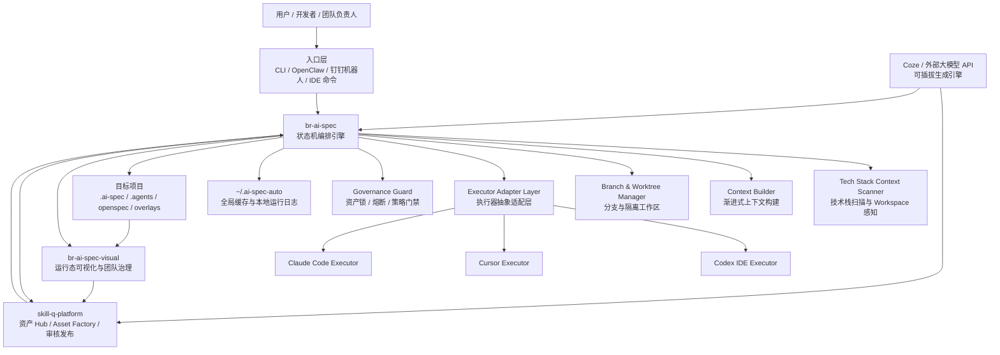
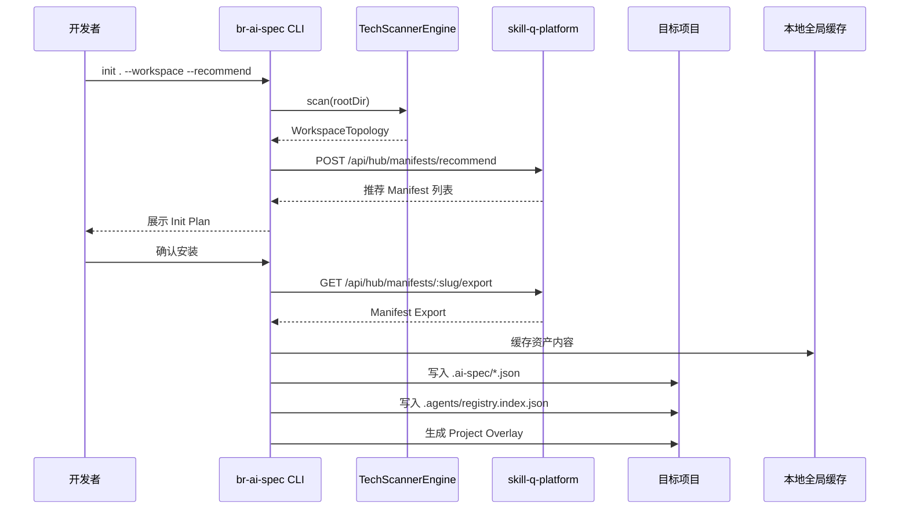
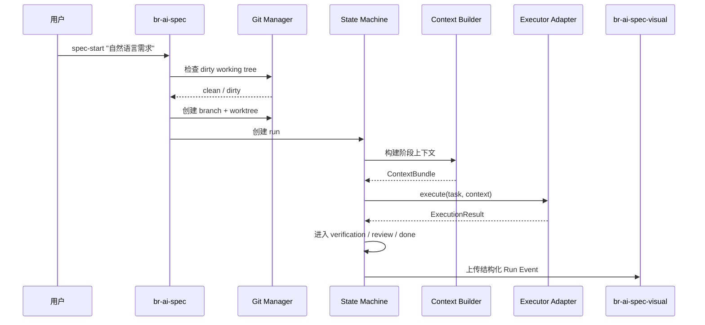
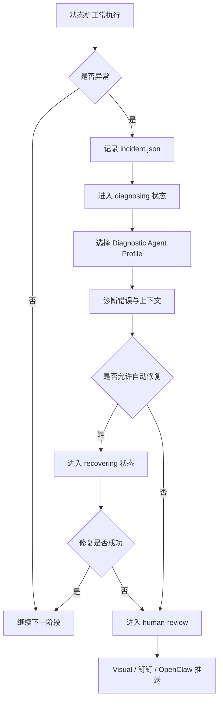
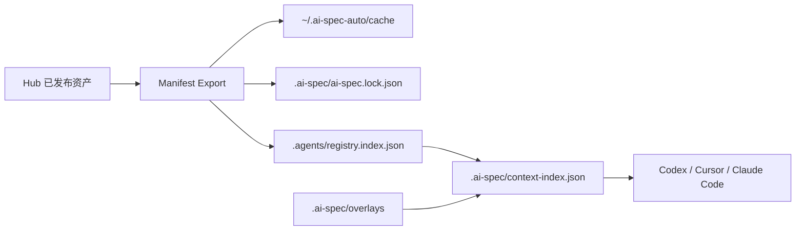
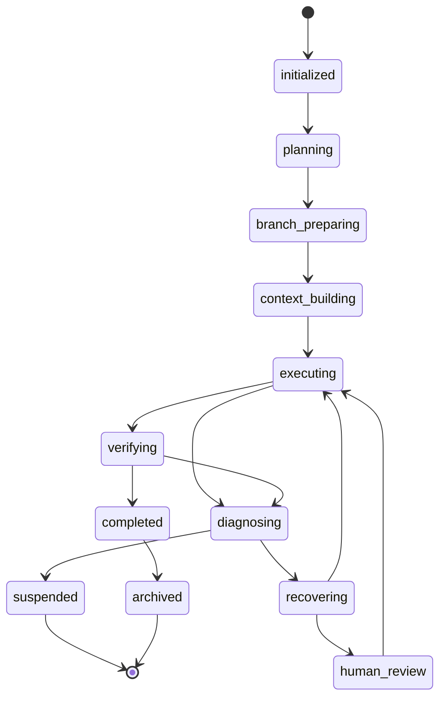

# AI 工程资产操作系统：指令级 PRD 与技术蓝图

> 适用仓库：`br-ai-spec`、`skill-q-platform`、`br-ai-spec-visual`
> 适用执行终端：`Codex IDE`、`Cursor`、`Claude Code`
> 文档用途：直接交给 Cursor / Claude Code / Codex Agent 执行开发
> 当前章节：**一、全局架构与技术栈**

---

# 一、全局架构与技术栈

## 1.1 系统最终定位

本系统不是单一 CLI 工具，也不是单一 Skill 平台，而是一套企业级 AI 工程资产操作系统。

系统由三大核心项目组成：

| 项目                  | 定位          | 核心职责                                                                    |
| ------------------- | ----------- | ----------------------------------------------------------------------- |
| `skill-q-platform`  | AI 工程资产 Hub | 管理平台资产、团队资产、Agent Profile、Tech Profile、Manifest、Asset Factory、审核发布、版本分发 |
| `br-ai-spec`        | 本地工程执行引擎    | 负责项目初始化、技术栈扫描、资产同步、上下文构建、状态机编排、分支隔离、执行器适配                               |
| `br-ai-spec-visual` | 运行态可视化与治理平台 | 展示项目画像、运行过程、需求历史、资产质量、团队报表、异常熔断、治理指标                                    |

系统必须支持以下核心目标：

```text
1. 多技术栈识别：React / Vue / Next.js / Java Spring Boot / Spring MVC / Spring Cloud / Python / Go 等。
2. 多资产类型管理：Rule / Skill / Role / Flow / Scenario / Manifest / Agent Profile / Tech Profile / Source Pack。
3. 多执行器适配：Codex IDE / Cursor / Claude Code 必须作为并列的可插拔执行器。
4. 多模式运行：人工辅助开发模式、本地自动开发模式、远程任务调度模式。
5. 多仓库与 Monorepo 支持：Workspace / Repo / Package 三层模型。
6. 安全隔离：默认自动创建 Git 分支与 Worktree，不污染当前工作区。
7. 渐进式上下文加载：只加载当前任务需要的 Rule / Skill / Role / Flow。
8. 资产防篡改：Hub 发布资产不可变，项目内通过 lock 文件和 checksum 校验。
9. 项目差异化：标准资产不可修改，项目差异通过 Overlay 机制表达。
10. 运行数据回流：Visual 采集结构化运行数据，不上传目标项目内部源码。
```

---

## 1.2 最高架构原则

以下约束是全局最高优先级，所有实现不得违背。

### 1.2.1 Hub 是资产事实源

```text
Hub 保存标准资产、团队资产、版本、checksum、依赖、发布状态、审核记录。
项目内不保存完整公共资产原件，只保存轻量索引和锁文件。
本地全局缓存保存 Hub 资产副本。
```

### 1.2.2 标准资产不可变

```text
已发布的 Rule / Skill / Role / Flow / Manifest / Agent Profile 不允许直接编辑。
修改必须发布新版本。
项目差异不得修改标准资产正文，只能通过 Project Overlay 表达。
```

### 1.2.3 扫描阶段绝对只读

```text
scan / detect / recommend 阶段只允许读取项目文件。
不得修改 package.json、pom.xml、tsconfig.json、源代码或任何业务配置。
只有 apply / init-confirmed / install-confirmed 阶段才允许写入 .ai-spec 与 .agents 轻量索引。
```

### 1.2.4 执行需求必须隔离分支

```text
/spec-start 默认创建新 Git branch。
默认创建 Git worktree。
如果工作区存在未提交修改，必须进入 dirty working tree 策略处理，不允许静默覆盖。
```

### 1.2.5 执行器必须可插拔

```text
Codex IDE、Cursor、Claude Code 是并列执行器。
状态机不得直接绑定某一个 IDE 或模型。
所有 IDE 终端必须通过 IExecutorProvider 契约接入。
```

### 1.2.6 上下文必须渐进式加载

```text
不允许一次性读取全部 Rule / Skill / History / OpenSpec。
必须通过 context-index.json 和 registry.index.json 按任务阶段加载。
```

### 1.2.7 不上传目标项目内部代码

```text
Visual / Hub 只接收结构化元数据、运行状态、失败分类、资产使用情况、测试摘要。
不得默认上传源代码、完整 prompt、完整 response、绝对路径、用户名、密钥。
```

### 1.2.8 状态机必须具备逃逸机制

```text
状态机遇到编译失败、测试失败、模型输出异常、重复修改、上下文超预算时，不允许直接崩溃。
必须进入 diagnosing / recovering / suspended / human-review 状态。
```

---

## 1.3 总体系统架构图



---

## 1.4 三项目职责边界

## 1.4.1 `skill-q-platform`

`skill-q-platform` 是资产事实源，负责资产生产、资产审核、资产分发。

### 必须负责

```text
1. 管理平台级、部门级、团队级、项目级、个人草稿资产。
2. 管理 Rule / Skill / Role / Flow / Scenario / Manifest / Agent Profile / Tech Profile / Source Pack。
3. 管理 Asset Factory 生成任务。
4. 管理资产审核、发布、废弃、归档。
5. 管理版本、checksum、依赖、兼容性。
6. 提供 Manifest Export API。
7. 提供 Asset Sync API。
8. 提供 Manifest Recommend API。
9. 接收安装记录与运行反馈。
10. 提供资产质量、资产使用、团队覆盖率统计接口。
```

### 禁止负责

```text
1. 不直接修改业务项目代码。
2. 不直接执行本地需求开发。
3. 不持有用户项目源码。
4. 不绕过 br-ai-spec 状态机直接调用 IDE 执行器开发代码。
```

---

## 1.4.2 `br-ai-spec`

`br-ai-spec` 是本地工程执行引擎，负责把 Hub 资产落到项目，并驱动需求开发流程。

### 必须负责

```text
1. project-init 项目初始化。
2. Workspace / Repo / Package 扫描。
3. 技术栈识别与 Manifest 推荐。
4. 生成 .ai-spec/project.json。
5. 生成 .ai-spec/workspace.json。
6. 生成 .ai-spec/ai-spec.lock.json。
7. 生成 .ai-spec/context-index.json。
8. 生成 .agents/registry.index.json。
9. 同步 Hub 资产到 ~/.ai-spec-auto/cache。
10. 生成项目 Overlay。
11. /spec-start 需求启动。
12. 自动创建 branch / worktree。
13. 处理 dirty working tree。
14. 状态机编排。
15. 渐进式上下文构建。
16. 调用 Codex / Cursor / Claude Code 执行器。
17. 熔断与异常逃逸。
18. 记录 history / runs。
19. 上传结构化运行摘要到 Visual。
```

### 禁止负责

```text
1. 不直接修改 Hub 已发布资产正文。
2. 不绕过 lock 文件使用未审核资产。
3. 不上传目标项目内部源码。
4. 不把某个执行器写死为唯一执行器。
```

---

## 1.4.3 `br-ai-spec-visual`

`br-ai-spec-visual` 是运行态与治理平台，负责看见过程、看见质量、看见团队情况。

### 必须负责

```text
1. 展示 Workspace / Repo / Package 拓扑。
2. 展示项目技术画像。
3. 展示 Manifest 安装覆盖率。
4. 展示 Rule / Skill / Agent 使用情况。
5. 展示运行 Run 状态。
6. 展示小需求 History。
7. 展示 OpenSpec 变更状态。
8. 展示熔断、失败、自动修复、人工审批记录。
9. 展示 Token 预算与消耗。
10. 展示团队报表、项目报表、资产质量报表。
11. 接收 br-ai-spec 上传的结构化运行事件。
12. 向 Hub 回流资产使用效果与质量指标。
```

### 禁止负责

```text
1. 不重新定义 Asset / Manifest 模型。
2. 不直接修改目标项目代码。
3. 不直接发布 Hub 资产。
4. 不展示目标项目源码内容。
```

---

## 1.5 核心业务流转

## 1.5.1 项目初始化流转



---

## 1.5.2 需求启动流转



---

## 1.5.3 异常逃逸流转



---

## 1.6 执行器抽象适配层

## 1.6.1 设计目标

执行器抽象适配层是本系统的关键边界。状态机不直接依赖 Codex、Cursor、Claude Code，而是依赖统一接口。

目标：

```text
1. Codex IDE、Cursor、Claude Code 三者并列。
2. 后续可接入 OpenClaw、Coze Workflow、Qwen Code、私有 IDE 执行器。
3. 每个执行器有独立能力声明。
4. 状态机根据 policy、任务类型、技术栈、运行模式动态选择执行器。
5. 所有执行器必须遵守同一输入输出协议。
```

---

## 1.6.2 执行器逻辑位置

```text
br-ai-spec/
├── src/
│   ├── executor/
│   │   ├── types.ts
│   │   ├── executor-registry.ts
│   │   ├── executor-selector.ts
│   │   ├── providers/
│   │   │   ├── codex/
│   │   │   │   ├── codex-provider.ts
│   │   │   │   └── codex-config.ts
│   │   │   ├── cursor/
│   │   │   │   ├── cursor-provider.ts
│   │   │   │   └── cursor-config.ts
│   │   │   └── claude-code/
│   │   │       ├── claude-code-provider.ts
│   │   │       └── claude-code-config.ts
│   │   └── sandbox/
│   │       ├── worktree-runner.ts
│   │       └── process-runner.ts
```

---

## 1.6.3 执行器动态选择规则

执行器来源优先级：

```text
1. CLI 参数指定
2. .ai-spec/policy.json 指定
3. Manifest / Agent Profile 推荐
4. 全局用户配置 ~/.ai-spec-auto/config.json
5. 系统默认执行器
```

示例：

```bash
npx @ex/ai-spec-auto spec-start "新增用户列表" --executor codex
```

项目策略：

```json
{
  "execution": {
    "mode": "local-assisted",
    "defaultExecutor": "cursor",
    "fallbackExecutors": ["claude-code", "codex"]
  }
}
```

Agent Profile 推荐：

```json
{
  "kind": "agent-profile",
  "slug": "backend-implementer-agent",
  "executor": "claude-code",
  "fallbackExecutors": ["codex"]
}
```

---

## 1.6.4 三类执行模式

### 模式一：人工辅助开发

```json
{
  "mode": "local-assisted",
  "executor": "cursor",
  "approvalPolicy": {
    "beforeCodeChange": false,
    "beforeCommit": true,
    "beforePush": true
  }
}
```

适用：

```text
开发者本地开发
Cursor / Claude Code 辅助编码
中低风险需求
需要开发者随时介入
```

---

### 模式二：本地自动开发

```json
{
  "mode": "local-auto",
  "executor": "codex",
  "approvalPolicy": {
    "beforeCodeChange": false,
    "beforeCommit": true,
    "beforePush": true
  },
  "failurePolicy": {
    "autoFixOnTestFailure": true,
    "maxAutoFixAttempts": 2
  }
}
```

适用：

```text
本地自动执行开发流程
仍由用户最终确认提交
适合低风险重复性需求
```

---

### 模式三：远程任务调度

```json
{
  "mode": "remote-orchestrated",
  "executor": "codex",
  "entry": "openclaw",
  "approvalPolicy": {
    "beforeCommit": true,
    "beforePush": true,
    "beforeMerge": true
  },
  "notify": {
    "channels": ["dingtalk", "openclaw"]
  }
}
```

适用：

```text
OpenClaw / 钉钉机器人触发任务
服务器或远程沙箱执行
自动测试
自动生成报告
推送结果给用户确认
```

---

## 1.6.5 执行器能力矩阵

| 能力       | Codex IDE | Cursor | Claude Code |
| -------- | --------: | -----: | ----------: |
| 读取代码上下文  |         ✅ |      ✅ |           ✅ |
| 修改代码     |         ✅ |      ✅ |           ✅ |
| 执行 Shell |         ✅ |    视环境 |           ✅ |
| 长任务自动执行  |         ✅ |      中 |           ✅ |
| IDE 内交互  |         中 |      ✅ |           中 |
| 批量结构化任务  |         ✅ |      中 |           ✅ |
| 复杂推理     |         ✅ |      中 |           ✅ |
| 本地人工辅助   |         中 |      ✅ |           ✅ |
| 远程调度     |         ✅ |      弱 |           ✅ |
| 推荐默认场景   |     自动化执行 | IDE 协作 |      深度代码改造 |

注意：

```text
执行器能力必须由 provider.capabilities 声明，不允许硬编码判断。
```

---

## 1.6.6 执行器选择算法

```text
输入：
- execution.mode
- user specified executor
- target package tech stack
- task risk level
- agent profile recommended executor
- executor availability
- token budget
- local environment capability

输出：
- selected executor
- fallback executor list
- selection reasons
```

伪代码：

```ts
function selectExecutor(input: ExecutorSelectionInput): ExecutorSelectionResult {
  if (input.cliExecutor) {
    return ensureAvailableOrThrow(input.cliExecutor);
  }

  const agentPreferred = input.agentProfile?.executor;
  if (agentPreferred && isAvailable(agentPreferred)) {
    return {
      executor: agentPreferred,
      reason: '由 Agent Profile 指定',
      fallbackExecutors: input.agentProfile.fallbackExecutors ?? []
    };
  }

  const policyDefault = input.policy.execution.defaultExecutor;
  if (policyDefault && isAvailable(policyDefault)) {
    return {
      executor: policyDefault,
      reason: '由项目 policy 指定',
      fallbackExecutors: input.policy.execution.fallbackExecutors
    };
  }

  if (input.mode === 'local-assisted') {
    return prefer(['cursor', 'claude-code', 'codex']);
  }

  if (input.mode === 'remote-orchestrated') {
    return prefer(['codex', 'claude-code']);
  }

  return prefer(['codex', 'claude-code', 'cursor']);
}
```

---

## 1.7 核心运行时模块

## 1.7.1 Tech Stack Context Scanner

该扫描引擎是 `project-init`、Manifest 推荐、Workspace 感知、Context 构建的地基。

采用四层模型：

```text
VFS 物理边界层
↓
Fact Extractor 特征提取层
↓
Detector Registry 插件化探测层
↓
Confidence Aggregator 置信度聚合层
```

这套四层架构来自并采纳了已上传的扫描引擎设计稿中的核心思想：通过 VFS 边界、Fact 提取、插件化 Detector 和置信度仲裁，解决 Monorepo 迷航、依赖提升、性能卡顿等问题。

### 必须支持的 Detector

```text
NextJsDetector
ReactViteDetector
VueViteDetector
SpringBootDetector
SpringMvcLegacyDetector
SpringCloudDetector
FastApiDetector
DjangoDetector
GoGinDetector
GoGrpcDetector
```

### 必须输出

```text
WorkspaceTopology
PackageDetectionReport[]
recommendedManifest
confidence
reasons
tags
```

---

## 1.7.2 Context Builder

负责根据当前任务阶段按需组装上下文。

输入：

```text
runId
stage
target packages
manifest
context-index.json
registry.index.json
project overlay
shared contracts
```

输出：

```text
ContextBundle
```

Context 分层：

```text
L0：命令入口与状态机阶段
L1：项目画像和 Workspace Topology
L2：Manifest / Registry Index
L3：相关 Rule / Skill / Role / Flow 全文
L4：项目 Overlay
L5：目标代码上下文摘要
L6：OpenSpec / History 相关摘要
```

禁止：

```text
不允许全量加载所有 .agents 内容。
不允许全量加载全部 history。
不允许读取未授权 package 之外的源码。
```

---

## 1.7.3 Branch & Worktree Manager

负责需求执行隔离。

默认策略：

```text
/spec-start 自动创建新分支
/spec-start 自动创建 worktree
dirty working tree 默认 block
```

支持策略：

```text
block
wip-commit
patch-snapshot
ignore
```

---

## 1.7.4 Governance Guard

负责治理约束：

```text
资产 checksum 校验
lock 文件一致性校验
标准资产防篡改
Rule 冲突检查
Token Budget
最大重试次数
状态机非法流转检查
执行器超时
高风险动作审批
```

---

## 1.7.5 Escape Hatch

状态机异常逃逸机制。

触发条件：

```text
构建失败超过阈值
测试失败超过阈值
同一文件重复修改超过阈值
模型输出不符合契约
执行器超时
Token 超预算
Rule 冲突
Manifest 缺失
上下文包构建失败
```

进入状态：

```text
diagnosing
recovering
suspended
human-review
```

---

## 1.8 核心资产分层

## 1.8.1 Hub 标准资产

```text
Platform Rule
Platform Skill
Platform Role
Platform Flow
Platform Manifest
Platform Agent Profile
```

特征：

```text
发布后不可变
通过新版本演进
由管理员或授权负责人发布
```

---

## 1.8.2 团队资产

```text
Team Rule
Team Skill
Team Agent Profile
Team Manifest
```

特征：

```text
可继承平台资产
可覆盖部分行为
需团队负责人审核
```

---

## 1.8.3 项目 Overlay

存放位置：

```text
.ai-spec/overlays/
```

用途：

```text
表达项目差异
不修改标准 Rule
不污染 Hub 标准资产
```

示例：

```text
统一返回体类型
接口错误码枚举
Controller 包路径
Service 命名习惯
前端组件库实际封装路径
测试命令
构建命令
```

---

## 1.8.4 本地全局缓存

存放位置：

```text
~/.ai-spec-auto/cache/
```

用途：

```text
缓存 Hub 资产正文
缓存 Manifest Export
缓存扫描结果
缓存执行器临时上下文
缓存原始运行日志
```

---

## 1.9 物理资产流转



---

## 1.10 多技术栈支持策略

采用：

```text
语言统筹 + 框架细分 + 场景交付 + Manifest 组合
```

分层：

```text
Domain
└── Language
    └── Framework
        └── Architecture
            └── Scenario
                └── Manifest
```

示例：

```text
backend
└── Java
    └── Spring Boot
        └── REST API
            └── backend-java-springboot-api-standard
```

首期必须支持：

```text
frontend-react-vite-standard
frontend-react-nextjs-standard
frontend-vue-vite-standard
backend-java-springboot-standard
backend-java-springboot-api-standard
backend-java-springmvc-legacy-standard
```

后续扩展：

```text
backend-java-springcloud-standard
backend-python-fastapi-standard
backend-go-gin-standard
```

---

## 1.11 Workspace / Repo / Package 模型

必须支持三层模型：

```text
Workspace：一个业务工作区
Repo：一个 Git 仓库
Package：一个可独立识别技术栈和安装 Manifest 的工程单元
```

示例：

```text
workspace/
├── frontend-repo/
│   └── apps/web
└── backend-repo/
    └── services/api
```

对应逻辑：

```text
workspace root 执行 init
扫描多个 repo
每个 repo 识别 git remote
每个 package 识别技术栈
每个 package 推荐 Manifest
/spec-start 可指定一个或多个 scope
```

---

## 1.12 需求资产分层

## 1.12.1 OpenSpec

适用：

```text
新功能
跨模块
架构变更
前后端联动
高风险需求
```

存放：

```text
openspec/changes/<change-id>/
```

---

## 1.12.2 History

适用：

```text
小需求
单点修复
低风险变更
轻量 patch
```

存放：

```text
.ai-spec/history/<yyyy-mm>/<patch-id>/
```

上传 Visual：

```text
上传结构化摘要
不上传源码
不上传完整 prompt / response
```

---

## 1.12.3 Runs

适用：

```text
每次 /spec-start 或 /spec-update 的执行记录
```

存放：

```text
.ai-spec/runs/<run-id>/
```

本地全量日志：

```text
~/.ai-spec-auto/runs/<project-id>/<run-id>/
```

---

## 1.13 Agent Profile 作为 Hub 资产

Agent Profile 是子代理执行配置，不等于 Role。

| 类型            | 说明            |
| ------------- | ------------- |
| Role          | 描述职责          |
| Skill         | 描述能力步骤        |
| Rule          | 描述约束          |
| Flow          | 描述流程          |
| Agent Profile | 描述一个可执行代理如何运行 |

Agent Profile 必须支持：

```text
executor
fallbackExecutors
allowedTools
deniedTools
contextScope
tokenBudget
approvalPolicy
outputContract
riskLevel
```

示例执行代理：

```text
backend-implementer-agent
frontend-implementer-agent
diagnostic-agent
api-contract-designer-agent
integration-test-agent
```

---

## 1.14 Asset Factory 总体定位

Asset Factory 负责生成公共资产与项目 Overlay。

分工：

```text
Hub Asset Factory：
生成公共 Rule / Skill / Role / Flow / Manifest / Agent Profile。

Local Asset Factory Runner：
读取本地项目结构，生成 Project Overlay。

Coze / 外部大模型：
作为 AssetGenerationProvider，可插拔。
```

Hub 不应依赖某一个模型平台。

必须支持：

```text
OpenAIProvider
QwenProvider
ClaudeProvider
CozeProvider
LocalModelProvider
```

Coze 可用于：

```text
资产生成 Agent
工作流编排
知识库问答
自然语言需求解析
```

但不得作为：

```text
Hub 事实源
Manifest 事实源
状态机主控
权限主控
Visual 指标主控
```

---

## 1.15 关键技术栈与依赖

## 1.15.1 全局语言与运行时

| 类型                 | 推荐                                   |
| ------------------ | ------------------------------------ |
| Runtime            | Node.js >= 20                        |
| Language           | TypeScript                           |
| Package Manager    | pnpm                                 |
| CLI Framework      | commander 或 cac                      |
| Schema Validation  | zod                                  |
| File Scan          | fast-glob                            |
| YAML Parser        | yaml                                 |
| XML Parser         | fast-xml-parser                      |
| Git 操作             | simple-git + child_process fallback  |
| Hash               | Node crypto                          |
| Logging            | pino                                 |
| Test Runner        | vitest                               |
| E2E                | playwright                           |
| DB ORM             | Prisma                               |
| Database           | MySQL 8.x                            |
| Frontend Framework | Next.js / React                      |
| UI                 | Tailwind CSS + shadcn/ui 或现有项目 UI 体系 |
| Charts             | ECharts / Recharts                   |
| WebSocket          | ws / Socket.IO，按项目现状选                |

---

## 1.15.2 `br-ai-spec` 推荐依赖

```json
{
  "dependencies": {
    "commander": "^12.0.0",
    "fast-glob": "^3.3.0",
    "fast-xml-parser": "^4.4.0",
    "yaml": "^2.4.0",
    "zod": "^3.23.0",
    "simple-git": "^3.24.0",
    "pino": "^9.0.0",
    "execa": "^9.0.0"
  },
  "devDependencies": {
    "typescript": "^5.5.0",
    "vitest": "^2.0.0",
    "@types/node": "^20.0.0"
  }
}
```

---

## 1.15.3 `skill-q-platform` 推荐依赖

```json
{
  "dependencies": {
    "next": "^14.0.0",
    "react": "^18.0.0",
    "react-dom": "^18.0.0",
    "@prisma/client": "^5.0.0",
    "zod": "^3.23.0",
    "pino": "^9.0.0",
    "fast-xml-parser": "^4.4.0",
    "yaml": "^2.4.0"
  },
  "devDependencies": {
    "prisma": "^5.0.0",
    "typescript": "^5.5.0",
    "vitest": "^2.0.0",
    "playwright": "^1.45.0"
  }
}
```

---

## 1.15.4 `br-ai-spec-visual` 推荐依赖

```json
{
  "dependencies": {
    "next": "^14.0.0",
    "react": "^18.0.0",
    "react-dom": "^18.0.0",
    "@prisma/client": "^5.0.0",
    "zod": "^3.23.0",
    "recharts": "^2.12.0",
    "echarts": "^5.5.0",
    "pino": "^9.0.0"
  },
  "devDependencies": {
    "prisma": "^5.0.0",
    "typescript": "^5.5.0",
    "vitest": "^2.0.0",
    "playwright": "^1.45.0"
  }
}
```

---

## 1.16 配置来源优先级

配置解析优先级：

```text
1. CLI 参数
2. 当前 run 配置
3. .ai-spec/policy.json
4. .ai-spec/project.json
5. .ai-spec/workspace.json
6. Hub Manifest / Agent Profile
7. ~/.ai-spec-auto/config.json
8. 系统默认值
```

示例：

```bash
npx @ex/ai-spec-auto spec-start "新增用户列表" --executor codex --mode local-auto
```

高于：

```json
{
  "execution": {
    "defaultExecutor": "cursor"
  }
}
```

---

## 1.17 全局状态流转概览



状态含义：

| 状态               | 含义                        |
| ---------------- | ------------------------- |
| initialized      | run 已创建                   |
| planning         | 分析自然语言需求，选择 Flow / Target |
| branch_preparing | 创建 branch / worktree      |
| context_building | 构建渐进式上下文包                 |
| executing        | 调用执行器执行                   |
| verifying        | 构建 / 测试 / 截图 / API 校验     |
| diagnosing       | 异常诊断                      |
| recovering       | 自动修复                      |
| human_review     | 等待人工审批                    |
| suspended        | 熔断挂起                      |
| completed        | 执行完成                      |
| archived         | 归档                        |

---

## 1.18 第一部分实现边界

本章节定义的是全局架构和技术栈。后续章节必须围绕以下固定结论继续展开：

```text
1. 三项目边界不允许混淆。
2. Codex IDE / Cursor / Claude Code 统一通过 Executor Adapter Layer 接入。
3. Hub 作为资产事实源，发布资产不可变。
4. 项目内保存轻量索引、锁文件、Overlay，不保存全部公共资产正文。
5. 本地全局缓存保存资产正文和原始执行日志。
6. project-init 基于扫描引擎做“阅读理解”，不是让用户从零选择。
7. /spec-start 默认创建 branch + worktree。
8. 状态机必须具备熔断和 Escape Hatch。
9. Visual 只接收结构化元数据，不接收目标项目内部源码。
10. Agent Profile 是 Hub 资产，执行器是运行时 Provider。
```

---

继续输出第二部分：**物理工程结构与目录树**。
