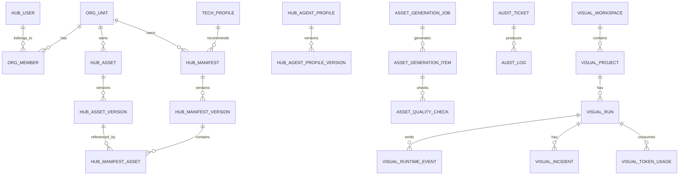

# 三、核心数据模型与数据库设计

> 本章节定义三类数据模型：
>
> 1. `skill-q-platform` 的 Hub 数据库模型。
> 2. `br-ai-spec` 写入目标项目与本地全局缓存的配置文件模型。
> 3. `br-ai-spec-visual` 的运行态与治理数据模型。
>
> 数据库默认采用：`MySQL 8.x + Prisma`。
> 本章节以 **MySQL SQL DDL + TypeScript Entity + JSON 配置模板** 三种形式给出，便于 Cursor / Claude Code / Codex 直接落地。

---

# 3.1 全局数据建模原则

## 3.1.1 命名规范

数据库表名使用：

```text
snake_case
```

TypeScript 类型使用：

```text
PascalCase / camelCase
```

示例：

```text
hub_asset_version      -> HubAssetVersion
asset_slug             -> assetSlug
created_at             -> createdAt
```

---

## 3.1.2 通用字段约定

所有核心业务表建议包含以下字段：

```sql
`id` varchar(64) NOT NULL,
`created_at` datetime NOT NULL DEFAULT CURRENT_TIMESTAMP,
`updated_at` datetime NOT NULL DEFAULT CURRENT_TIMESTAMP ON UPDATE CURRENT_TIMESTAMP,
```

如需软删除，增加：

```sql
`deleted_at` datetime DEFAULT NULL,
```

如需审计，增加：

```sql
`created_by` varchar(128) DEFAULT NULL,
`updated_by` varchar(128) DEFAULT NULL,
```

---

## 3.1.3 状态字段约定

资产状态统一使用：

```text
draft        草稿
reviewing    审核中
published    已发布
deprecated   已弃用
archived     已归档
rejected     已驳回
```

运行状态统一使用：

```text
pending
running
succeeded
failed
suspended
cancelled
human_review
```

---

## 3.1.4 资产不可变原则

Hub 中已发布资产版本不可修改正文。

允许操作：

```text
发布新版本
标记 deprecated
标记 archived
创建团队 Fork
创建 Project Overlay
```

不允许操作：

```text
直接覆盖 published 版本正文
直接修改 published checksum
直接修改 published dependency graph
```

---

## 3.1.5 敏感数据原则

以下内容不允许进入 Hub / Visual 数据库：

```text
目标项目源码正文
用户本机绝对路径
用户名
密钥
Token
数据库连接串
完整 prompt
完整 response
内部业务文档原文
```

允许进入 Hub / Visual 的数据：

```text
项目 hash
相对路径
技术栈识别结果
Manifest 版本
资产 slug / version / checksum
运行阶段
失败原因分类
耗时
测试摘要
是否通过
```

---

# 3.2 枚举字典

## 3.2.1 AssetKind

```ts
export type AssetKind =
  | 'rule'
  | 'skill'
  | 'role'
  | 'flow'
  | 'scenario'
  | 'manifest'
  | 'agent-profile'
  | 'tech-profile'
  | 'source-pack'
  | 'contract'
  | 'template';
```

---

## 3.2.2 AssetScope

```ts
export type AssetScope =
  | 'platform'
  | 'department'
  | 'team'
  | 'project'
  | 'personal';
```

说明：

| Scope        | 说明     |
| ------------ | ------ |
| `platform`   | 平台公共资产 |
| `department` | 部门资产   |
| `team`       | 团队资产   |
| `project`    | 项目资产   |
| `personal`   | 个人草稿资产 |

---

## 3.2.3 AssetStatus

```ts
export type AssetStatus =
  | 'draft'
  | 'reviewing'
  | 'published'
  | 'deprecated'
  | 'archived'
  | 'rejected';
```

---

## 3.2.4 ExecutorType

```ts
export type ExecutorType =
  | 'codex'
  | 'cursor'
  | 'claude-code'
  | 'openclaw'
  | 'coze'
  | 'custom';
```

其中本阶段 P0 必须支持：

```text
codex
cursor
claude-code
```

---

## 3.2.5 ExecutionMode

```ts
export type ExecutionMode =
  | 'local-assisted'
  | 'local-auto'
  | 'remote-orchestrated';
```

---

## 3.2.6 DirtyStrategy

```ts
export type DirtyStrategy =
  | 'block'
  | 'wip-commit'
  | 'patch-snapshot'
  | 'ignore';
```

默认值必须为：

```text
block
```

---

## 3.2.7 RunState

```ts
export type RunState =
  | 'initialized'
  | 'planning'
  | 'branch_preparing'
  | 'context_building'
  | 'executing'
  | 'verifying'
  | 'diagnosing'
  | 'recovering'
  | 'human_review'
  | 'suspended'
  | 'completed'
  | 'archived'
  | 'failed'
  | 'cancelled';
```

---

## 3.2.8 RuntimeEventType

```ts
export type RuntimeEventType =
  | 'project_initialized'
  | 'manifest_installed'
  | 'manifest_synced'
  | 'manifest_upgraded'
  | 'manifest_rollback'
  | 'asset_cache_hit'
  | 'asset_cache_miss'
  | 'spec_started'
  | 'spec_planned'
  | 'branch_created'
  | 'worktree_created'
  | 'context_built'
  | 'executor_selected'
  | 'executor_started'
  | 'executor_completed'
  | 'executor_failed'
  | 'stage_started'
  | 'stage_completed'
  | 'stage_failed'
  | 'test_started'
  | 'test_completed'
  | 'test_failed'
  | 'circuit_breaker_triggered'
  | 'diagnose_started'
  | 'diagnose_completed'
  | 'auto_fix_started'
  | 'auto_fix_completed'
  | 'human_review_required'
  | 'run_completed'
  | 'run_failed'
  | 'history_uploaded';
```

---

# 3.3 `skill-q-platform` 数据库设计

`skill-q-platform` 是资产 Hub，必须管理：

```text
组织结构
用户权限
Tech Profile
Asset
Asset Version
Manifest
Manifest Version
Manifest Asset
Agent Profile
Source Pack
Asset Factory Job
审核流
安装记录
运行反馈
LLM / Coze Provider
```

---

# 3.3.1 组织结构表

## 3.3.1.1 `org_unit`

用于表示公司、部门、团队。

```sql
CREATE TABLE `org_unit` (
  `id` varchar(64) NOT NULL,
  `parent_id` varchar(64) DEFAULT NULL,
  `name` varchar(128) NOT NULL,
  `code` varchar(128) NOT NULL,
  `type` enum('company','department','team') NOT NULL,
  `description` text DEFAULT NULL,
  `status` enum('active','disabled') NOT NULL DEFAULT 'active',
  `created_by` varchar(128) DEFAULT NULL,
  `updated_by` varchar(128) DEFAULT NULL,
  `created_at` datetime NOT NULL DEFAULT CURRENT_TIMESTAMP,
  `updated_at` datetime NOT NULL DEFAULT CURRENT_TIMESTAMP ON UPDATE CURRENT_TIMESTAMP,
  PRIMARY KEY (`id`),
  UNIQUE KEY `uk_org_unit_code` (`code`),
  KEY `idx_org_unit_parent` (`parent_id`),
  KEY `idx_org_unit_type` (`type`)
) ENGINE=InnoDB DEFAULT CHARSET=utf8mb4;
```

---

## 3.3.1.2 `hub_user`

```sql
CREATE TABLE `hub_user` (
  `id` varchar(64) NOT NULL,
  `username` varchar(128) NOT NULL,
  `display_name` varchar(128) DEFAULT NULL,
  `email` varchar(255) DEFAULT NULL,
  `avatar_url` varchar(512) DEFAULT NULL,
  `status` enum('active','disabled') NOT NULL DEFAULT 'active',
  `created_at` datetime NOT NULL DEFAULT CURRENT_TIMESTAMP,
  `updated_at` datetime NOT NULL DEFAULT CURRENT_TIMESTAMP ON UPDATE CURRENT_TIMESTAMP,
  PRIMARY KEY (`id`),
  UNIQUE KEY `uk_hub_user_username` (`username`),
  KEY `idx_hub_user_email` (`email`)
) ENGINE=InnoDB DEFAULT CHARSET=utf8mb4;
```

---

## 3.3.1.3 `org_member`

```sql
CREATE TABLE `org_member` (
  `id` varchar(64) NOT NULL,
  `org_id` varchar(64) NOT NULL,
  `user_id` varchar(64) NOT NULL,
  `role` enum('member','team_lead','department_admin','platform_admin') NOT NULL DEFAULT 'member',
  `created_at` datetime NOT NULL DEFAULT CURRENT_TIMESTAMP,
  PRIMARY KEY (`id`),
  UNIQUE KEY `uk_org_member` (`org_id`,`user_id`),
  KEY `idx_org_member_user` (`user_id`),
  KEY `idx_org_member_role` (`role`)
) ENGINE=InnoDB DEFAULT CHARSET=utf8mb4;
```

---

# 3.3.2 Tech Profile 技术画像

## 3.3.2.1 `tech_profile`

```sql
CREATE TABLE `tech_profile` (
  `id` varchar(64) NOT NULL,
  `code` varchar(128) NOT NULL,
  `name` varchar(128) NOT NULL,
  `domain` enum('frontend','backend','mobile','fullstack','devops','data','unknown') NOT NULL,
  `language` varchar(64) DEFAULT NULL,
  `frameworks` json DEFAULT NULL,
  `architecture` json DEFAULT NULL,
  `build_tools` json DEFAULT NULL,
  `orm` json DEFAULT NULL,
  `databases` json DEFAULT NULL,
  `package_managers` json DEFAULT NULL,
  `scenarios` json DEFAULT NULL,
  `description` text DEFAULT NULL,
  `status` enum('active','disabled') NOT NULL DEFAULT 'active',
  `created_by` varchar(128) DEFAULT NULL,
  `updated_by` varchar(128) DEFAULT NULL,
  `created_at` datetime NOT NULL DEFAULT CURRENT_TIMESTAMP,
  `updated_at` datetime NOT NULL DEFAULT CURRENT_TIMESTAMP ON UPDATE CURRENT_TIMESTAMP,
  PRIMARY KEY (`id`),
  UNIQUE KEY `uk_tech_profile_code` (`code`),
  KEY `idx_tech_profile_domain` (`domain`),
  KEY `idx_tech_profile_language` (`language`)
) ENGINE=InnoDB DEFAULT CHARSET=utf8mb4;
```

---

## 3.3.2.2 TechProfile Entity

```ts
export interface TechProfile {
  id: string;
  code: string;
  name: string;
  domain: 'frontend' | 'backend' | 'mobile' | 'fullstack' | 'devops' | 'data' | 'unknown';
  language?: string;
  frameworks?: string[];
  architecture?: string[];
  buildTools?: string[];
  orm?: string[];
  databases?: string[];
  packageManagers?: string[];
  scenarios?: string[];
  description?: string;
  status: 'active' | 'disabled';
  createdBy?: string;
  updatedBy?: string;
  createdAt: string;
  updatedAt: string;
}
```

---

# 3.3.3 Hub Asset

## 3.3.3.1 `hub_asset`

资产主表，只保存资产身份，不保存版本正文。

```sql
CREATE TABLE `hub_asset` (
  `id` varchar(64) NOT NULL,
  `slug` varchar(160) NOT NULL,
  `name` varchar(255) NOT NULL,
  `kind` enum('rule','skill','role','flow','scenario','agent-profile','source-pack','contract','template') NOT NULL,
  `scope` enum('platform','department','team','project','personal') NOT NULL DEFAULT 'platform',
  `owner_org_id` varchar(64) DEFAULT NULL,
  `owner_user_id` varchar(64) DEFAULT NULL,
  `description` text DEFAULT NULL,
  `status` enum('draft','reviewing','published','deprecated','archived','rejected') NOT NULL DEFAULT 'draft',
  `current_version` varchar(64) DEFAULT NULL,
  `risk_level` enum('L0','L1','L2','L3','L4') NOT NULL DEFAULT 'L1',
  `tags` json DEFAULT NULL,
  `created_by` varchar(128) DEFAULT NULL,
  `updated_by` varchar(128) DEFAULT NULL,
  `created_at` datetime NOT NULL DEFAULT CURRENT_TIMESTAMP,
  `updated_at` datetime NOT NULL DEFAULT CURRENT_TIMESTAMP ON UPDATE CURRENT_TIMESTAMP,
  `deleted_at` datetime DEFAULT NULL,
  PRIMARY KEY (`id`),
  UNIQUE KEY `uk_hub_asset_slug_scope_owner` (`slug`,`scope`,`owner_org_id`),
  KEY `idx_hub_asset_kind` (`kind`),
  KEY `idx_hub_asset_scope` (`scope`),
  KEY `idx_hub_asset_status` (`status`),
  KEY `idx_hub_asset_owner_org` (`owner_org_id`)
) ENGINE=InnoDB DEFAULT CHARSET=utf8mb4;
```

---

## 3.3.3.2 `hub_asset_version`

资产版本表，保存资产正文、checksum、依赖关系。

```sql
CREATE TABLE `hub_asset_version` (
  `id` varchar(64) NOT NULL,
  `asset_id` varchar(64) NOT NULL,
  `asset_slug` varchar(160) NOT NULL,
  `version` varchar(64) NOT NULL,
  `content` longtext NOT NULL,
  `content_format` enum('markdown','json','yaml','text') NOT NULL DEFAULT 'markdown',
  `checksum` varchar(128) NOT NULL,
  `dependencies` json DEFAULT NULL,
  `compatibility` json DEFAULT NULL,
  `input_contract` json DEFAULT NULL,
  `output_contract` json DEFAULT NULL,
  `quality_score` int DEFAULT NULL,
  `quality_report` json DEFAULT NULL,
  `status` enum('draft','reviewing','published','deprecated','archived','rejected') NOT NULL DEFAULT 'draft',
  `immutable` tinyint(1) NOT NULL DEFAULT 0,
  `published_at` datetime DEFAULT NULL,
  `created_by` varchar(128) DEFAULT NULL,
  `updated_by` varchar(128) DEFAULT NULL,
  `created_at` datetime NOT NULL DEFAULT CURRENT_TIMESTAMP,
  `updated_at` datetime NOT NULL DEFAULT CURRENT_TIMESTAMP ON UPDATE CURRENT_TIMESTAMP,
  PRIMARY KEY (`id`),
  UNIQUE KEY `uk_asset_version` (`asset_id`,`version`),
  KEY `idx_asset_version_slug` (`asset_slug`),
  KEY `idx_asset_version_status` (`status`),
  KEY `idx_asset_version_checksum` (`checksum`)
) ENGINE=InnoDB DEFAULT CHARSET=utf8mb4;
```

---

## 3.3.3.3 HubAsset Entity

```ts
export interface HubAsset {
  id: string;
  slug: string;
  name: string;
  kind:
    | 'rule'
    | 'skill'
    | 'role'
    | 'flow'
    | 'scenario'
    | 'agent-profile'
    | 'source-pack'
    | 'contract'
    | 'template';
  scope: 'platform' | 'department' | 'team' | 'project' | 'personal';
  ownerOrgId?: string;
  ownerUserId?: string;
  description?: string;
  status: AssetStatus;
  currentVersion?: string;
  riskLevel: 'L0' | 'L1' | 'L2' | 'L3' | 'L4';
  tags?: string[];
  createdBy?: string;
  updatedBy?: string;
  createdAt: string;
  updatedAt: string;
  deletedAt?: string;
}
```

---

## 3.3.3.4 HubAssetVersion Entity

```ts
export interface HubAssetVersion {
  id: string;
  assetId: string;
  assetSlug: string;
  version: string;
  content: string;
  contentFormat: 'markdown' | 'json' | 'yaml' | 'text';
  checksum: string;
  dependencies?: AssetDependency[];
  compatibility?: AssetCompatibility;
  inputContract?: Record<string, unknown>;
  outputContract?: Record<string, unknown>;
  qualityScore?: number;
  qualityReport?: AssetQualityReport;
  status: AssetStatus;
  immutable: boolean;
  publishedAt?: string;
  createdBy?: string;
  updatedBy?: string;
  createdAt: string;
  updatedAt: string;
}

export interface AssetDependency {
  kind: AssetKind;
  slug: string;
  versionRange?: string;
  required: boolean;
}

export interface AssetCompatibility {
  domains?: string[];
  languages?: string[];
  frameworks?: string[];
  architectures?: string[];
  scenarios?: string[];
  buildTools?: string[];
  packageManagers?: string[];
}
```

---

# 3.3.4 Manifest

## 3.3.4.1 `hub_manifest`

```sql
CREATE TABLE `hub_manifest` (
  `id` varchar(64) NOT NULL,
  `slug` varchar(160) NOT NULL,
  `name` varchar(255) NOT NULL,
  `description` text DEFAULT NULL,
  `scope` enum('platform','department','team','project','personal') NOT NULL DEFAULT 'platform',
  `owner_org_id` varchar(64) DEFAULT NULL,
  `owner_user_id` varchar(64) DEFAULT NULL,
  `domain` varchar(64) DEFAULT NULL,
  `language` varchar(64) DEFAULT NULL,
  `frameworks` json DEFAULT NULL,
  `scenarios` json DEFAULT NULL,
  `status` enum('draft','reviewing','published','deprecated','archived','rejected') NOT NULL DEFAULT 'draft',
  `current_version` varchar(64) DEFAULT NULL,
  `created_by` varchar(128) DEFAULT NULL,
  `updated_by` varchar(128) DEFAULT NULL,
  `created_at` datetime NOT NULL DEFAULT CURRENT_TIMESTAMP,
  `updated_at` datetime NOT NULL DEFAULT CURRENT_TIMESTAMP ON UPDATE CURRENT_TIMESTAMP,
  `deleted_at` datetime DEFAULT NULL,
  PRIMARY KEY (`id`),
  UNIQUE KEY `uk_manifest_slug_scope_owner` (`slug`,`scope`,`owner_org_id`),
  KEY `idx_manifest_domain` (`domain`),
  KEY `idx_manifest_language` (`language`),
  KEY `idx_manifest_status` (`status`)
) ENGINE=InnoDB DEFAULT CHARSET=utf8mb4;
```

---

## 3.3.4.2 `hub_manifest_version`

```sql
CREATE TABLE `hub_manifest_version` (
  `id` varchar(64) NOT NULL,
  `manifest_id` varchar(64) NOT NULL,
  `manifest_slug` varchar(160) NOT NULL,
  `version` varchar(64) NOT NULL,
  `schema_version` varchar(64) NOT NULL DEFAULT '1.0.0',
  `content` json NOT NULL,
  `checksum` varchar(128) NOT NULL,
  `install_policy` json DEFAULT NULL,
  `compatibility` json DEFAULT NULL,
  `quality_score` int DEFAULT NULL,
  `status` enum('draft','reviewing','published','deprecated','archived','rejected') NOT NULL DEFAULT 'draft',
  `immutable` tinyint(1) NOT NULL DEFAULT 0,
  `published_at` datetime DEFAULT NULL,
  `created_by` varchar(128) DEFAULT NULL,
  `updated_by` varchar(128) DEFAULT NULL,
  `created_at` datetime NOT NULL DEFAULT CURRENT_TIMESTAMP,
  `updated_at` datetime NOT NULL DEFAULT CURRENT_TIMESTAMP ON UPDATE CURRENT_TIMESTAMP,
  PRIMARY KEY (`id`),
  UNIQUE KEY `uk_manifest_version` (`manifest_id`,`version`),
  KEY `idx_manifest_version_slug` (`manifest_slug`),
  KEY `idx_manifest_version_status` (`status`),
  KEY `idx_manifest_version_checksum` (`checksum`)
) ENGINE=InnoDB DEFAULT CHARSET=utf8mb4;
```

---

## 3.3.4.3 `hub_manifest_asset`

Manifest 与资产版本的绑定关系。

```sql
CREATE TABLE `hub_manifest_asset` (
  `id` varchar(64) NOT NULL,
  `manifest_version_id` varchar(64) NOT NULL,
  `asset_id` varchar(64) NOT NULL,
  `asset_version_id` varchar(64) NOT NULL,
  `asset_kind` enum('rule','skill','role','flow','scenario','agent-profile','source-pack','contract','template') NOT NULL,
  `asset_slug` varchar(160) NOT NULL,
  `asset_version` varchar(64) NOT NULL,
  `required` tinyint(1) NOT NULL DEFAULT 1,
  `load_when` json DEFAULT NULL,
  `sort_order` int NOT NULL DEFAULT 0,
  `created_at` datetime NOT NULL DEFAULT CURRENT_TIMESTAMP,
  PRIMARY KEY (`id`),
  UNIQUE KEY `uk_manifest_asset` (`manifest_version_id`,`asset_slug`,`asset_version`),
  KEY `idx_manifest_asset_kind` (`asset_kind`),
  KEY `idx_manifest_asset_slug` (`asset_slug`)
) ENGINE=InnoDB DEFAULT CHARSET=utf8mb4;
```

---

## 3.3.4.4 Manifest Export JSON

`br-ai-spec` 安装时从 Hub 拉取的标准结构：

```json
{
  "schemaVersion": "1.0.0",
  "exportedAt": "2026-04-25T10:00:00.000Z",
  "hub": {
    "url": "https://hub.example.com",
    "manifestExportApi": "/api/hub/manifests/backend-java-springboot-standard/export"
  },
  "manifest": {
    "slug": "backend-java-springboot-standard",
    "name": "Java Spring Boot 标准研发方案包",
    "version": "1.0.0",
    "checksum": "sha256_manifest_xxx",
    "domain": "backend",
    "language": "Java",
    "frameworks": ["Spring Boot"],
    "scenarios": ["new-rest-api", "modify-rest-api", "bugfix"]
  },
  "assets": [
    {
      "kind": "rule",
      "slug": "springboot-controller-rule",
      "name": "Spring Boot Controller 编写规范",
      "version": "1.0.0",
      "checksum": "sha256_asset_xxx",
      "contentUrl": "/api/hub/assets/springboot-controller-rule/content?version=1.0.0",
      "required": true,
      "loadWhen": ["implementation", "review"]
    },
    {
      "kind": "skill",
      "slug": "springboot-rest-api-implementation-skill",
      "name": "Spring Boot REST API 实现 Skill",
      "version": "1.0.0",
      "checksum": "sha256_asset_yyy",
      "contentUrl": "/api/hub/assets/springboot-rest-api-implementation-skill/content?version=1.0.0",
      "required": true,
      "loadWhen": ["implementation"]
    },
    {
      "kind": "agent-profile",
      "slug": "backend-implementer-agent",
      "name": "后端实现执行代理",
      "version": "1.0.0",
      "checksum": "sha256_agent_xxx",
      "contentUrl": "/api/hub/agent-profiles/backend-implementer-agent?version=1.0.0",
      "required": true,
      "loadWhen": ["implementation"]
    }
  ],
  "installPolicy": {
    "requirePreview": true,
    "allowOverwrite": false,
    "allowLocalPatch": true,
    "defaultExecutionMode": "local-assisted",
    "defaultExecutor": "cursor"
  }
}
```

---

# 3.3.5 Agent Profile

Agent Profile 是子代理配置资产，不等同于 Role。

## 3.3.5.1 `hub_agent_profile`

```sql
CREATE TABLE `hub_agent_profile` (
  `id` varchar(64) NOT NULL,
  `slug` varchar(160) NOT NULL,
  `name` varchar(255) NOT NULL,
  `scope` enum('platform','department','team','project','personal') NOT NULL DEFAULT 'platform',
  `owner_org_id` varchar(64) DEFAULT NULL,
  `owner_user_id` varchar(64) DEFAULT NULL,
  `role_slug` varchar(160) DEFAULT NULL,
  `default_executor` enum('codex','cursor','claude-code','openclaw','coze','custom') NOT NULL,
  `fallback_executors` json DEFAULT NULL,
  `allowed_tools` json DEFAULT NULL,
  `denied_tools` json DEFAULT NULL,
  `context_scope` json DEFAULT NULL,
  `model_policy` json DEFAULT NULL,
  `approval_policy` json DEFAULT NULL,
  `output_contract` json DEFAULT NULL,
  `risk_level` enum('L0','L1','L2','L3','L4') NOT NULL DEFAULT 'L1',
  `status` enum('draft','reviewing','published','deprecated','archived','rejected') NOT NULL DEFAULT 'draft',
  `current_version` varchar(64) DEFAULT NULL,
  `created_by` varchar(128) DEFAULT NULL,
  `updated_by` varchar(128) DEFAULT NULL,
  `created_at` datetime NOT NULL DEFAULT CURRENT_TIMESTAMP,
  `updated_at` datetime NOT NULL DEFAULT CURRENT_TIMESTAMP ON UPDATE CURRENT_TIMESTAMP,
  `deleted_at` datetime DEFAULT NULL,
  PRIMARY KEY (`id`),
  UNIQUE KEY `uk_agent_profile_slug_scope_owner` (`slug`,`scope`,`owner_org_id`),
  KEY `idx_agent_profile_executor` (`default_executor`),
  KEY `idx_agent_profile_status` (`status`)
) ENGINE=InnoDB DEFAULT CHARSET=utf8mb4;
```

---

## 3.3.5.2 `hub_agent_profile_version`

```sql
CREATE TABLE `hub_agent_profile_version` (
  `id` varchar(64) NOT NULL,
  `agent_profile_id` varchar(64) NOT NULL,
  `agent_profile_slug` varchar(160) NOT NULL,
  `version` varchar(64) NOT NULL,
  `content` json NOT NULL,
  `checksum` varchar(128) NOT NULL,
  `quality_score` int DEFAULT NULL,
  `quality_report` json DEFAULT NULL,
  `status` enum('draft','reviewing','published','deprecated','archived','rejected') NOT NULL DEFAULT 'draft',
  `immutable` tinyint(1) NOT NULL DEFAULT 0,
  `published_at` datetime DEFAULT NULL,
  `created_by` varchar(128) DEFAULT NULL,
  `updated_by` varchar(128) DEFAULT NULL,
  `created_at` datetime NOT NULL DEFAULT CURRENT_TIMESTAMP,
  `updated_at` datetime NOT NULL DEFAULT CURRENT_TIMESTAMP ON UPDATE CURRENT_TIMESTAMP,
  PRIMARY KEY (`id`),
  UNIQUE KEY `uk_agent_profile_version` (`agent_profile_id`,`version`),
  KEY `idx_agent_profile_version_slug` (`agent_profile_slug`),
  KEY `idx_agent_profile_version_status` (`status`)
) ENGINE=InnoDB DEFAULT CHARSET=utf8mb4;
```

---

## 3.3.5.3 AgentProfile JSON

```json
{
  "kind": "agent-profile",
  "slug": "backend-implementer-agent",
  "name": "后端实现执行代理",
  "version": "1.0.0",
  "role": "backend-implementer",
  "defaultExecutor": "claude-code",
  "fallbackExecutors": ["codex", "cursor"],
  "modelPolicy": {
    "preferredProviders": ["claude", "openai", "qwen"],
    "contextStrategy": "progressive",
    "tokenBudget": 80000,
    "maxOutputTokens": 12000,
    "temperature": 0.2
  },
  "allowedTools": [
    "read",
    "write",
    "shell",
    "test"
  ],
  "deniedTools": [
    "deploy",
    "delete-database",
    "upload-source",
    "push-without-approval"
  ],
  "contextScope": {
    "rules": [
      "backend-api-contract-rule",
      "springboot-controller-rule"
    ],
    "skills": [
      "springboot-rest-api-implementation-skill"
    ],
    "flows": [
      "springboot-new-rest-api-flow"
    ],
    "maxAssets": 8,
    "allowProjectOverlay": true,
    "allowSharedContracts": true
  },
  "approvalPolicy": {
    "beforeCodeChange": false,
    "beforeCommit": true,
    "beforePush": true,
    "beforeMerge": true
  },
  "outputContract": {
    "mustReturn": [
      "summary",
      "changedFiles",
      "testResult",
      "riskList",
      "nextActions"
    ]
  },
  "riskLevel": "L1"
}
```

---

# 3.3.6 Source Pack

Source Pack 用于存储官方规范、大厂规范、团队规范资料包，供 Asset Factory 生成高质量资产时参考。

## 3.3.6.1 `source_pack`

```sql
CREATE TABLE `source_pack` (
  `id` varchar(64) NOT NULL,
  `slug` varchar(160) NOT NULL,
  `name` varchar(255) NOT NULL,
  `scope` enum('platform','department','team','project','personal') NOT NULL DEFAULT 'platform',
  `owner_org_id` varchar(64) DEFAULT NULL,
  `description` text DEFAULT NULL,
  `domain` varchar(64) DEFAULT NULL,
  `language` varchar(64) DEFAULT NULL,
  `frameworks` json DEFAULT NULL,
  `status` enum('draft','reviewing','published','deprecated','archived','rejected') NOT NULL DEFAULT 'draft',
  `current_version` varchar(64) DEFAULT NULL,
  `created_by` varchar(128) DEFAULT NULL,
  `updated_by` varchar(128) DEFAULT NULL,
  `created_at` datetime NOT NULL DEFAULT CURRENT_TIMESTAMP,
  `updated_at` datetime NOT NULL DEFAULT CURRENT_TIMESTAMP ON UPDATE CURRENT_TIMESTAMP,
  PRIMARY KEY (`id`),
  UNIQUE KEY `uk_source_pack_slug_scope_owner` (`slug`,`scope`,`owner_org_id`)
) ENGINE=InnoDB DEFAULT CHARSET=utf8mb4;
```

---

## 3.3.6.2 `source_pack_item`

```sql
CREATE TABLE `source_pack_item` (
  `id` varchar(64) NOT NULL,
  `source_pack_id` varchar(64) NOT NULL,
  `title` varchar(255) NOT NULL,
  `source_type` enum('official-doc','team-doc','best-practice','example','anti-pattern','security-rule') NOT NULL,
  `content` longtext NOT NULL,
  `content_format` enum('markdown','text','json','yaml') NOT NULL DEFAULT 'markdown',
  `source_url` varchar(1024) DEFAULT NULL,
  `checksum` varchar(128) NOT NULL,
  `created_at` datetime NOT NULL DEFAULT CURRENT_TIMESTAMP,
  PRIMARY KEY (`id`),
  KEY `idx_source_pack_item_pack` (`source_pack_id`),
  KEY `idx_source_pack_item_type` (`source_type`)
) ENGINE=InnoDB DEFAULT CHARSET=utf8mb4;
```

---

# 3.3.7 Asset Factory

## 3.3.7.1 `asset_generation_job`

```sql
CREATE TABLE `asset_generation_job` (
  `id` varchar(64) NOT NULL,
  `name` varchar(255) NOT NULL,
  `domain` varchar(64) NOT NULL,
  `language` varchar(64) DEFAULT NULL,
  `framework` varchar(128) DEFAULT NULL,
  `scenario` varchar(128) NOT NULL,
  `asset_types` json NOT NULL,
  `quality_level` enum('basic','standard','enterprise') NOT NULL DEFAULT 'standard',
  `provider` enum('openai','qwen','claude','coze','local','custom') NOT NULL DEFAULT 'qwen',
  `provider_config_id` varchar(64) DEFAULT NULL,
  `source_pack_ids` json DEFAULT NULL,
  `include_examples` tinyint(1) NOT NULL DEFAULT 1,
  `include_bad_examples` tinyint(1) NOT NULL DEFAULT 1,
  `include_checklists` tinyint(1) NOT NULL DEFAULT 1,
  `include_tests` tinyint(1) NOT NULL DEFAULT 1,
  `output_language` varchar(32) NOT NULL DEFAULT 'zh-CN',
  `status` enum('draft','planned','generating','generated','validating','validated','importing','imported','failed','cancelled') NOT NULL DEFAULT 'draft',
  `input` json NOT NULL,
  `output_summary` json DEFAULT NULL,
  `average_score` int DEFAULT NULL,
  `created_by` varchar(128) DEFAULT NULL,
  `updated_by` varchar(128) DEFAULT NULL,
  `created_at` datetime NOT NULL DEFAULT CURRENT_TIMESTAMP,
  `updated_at` datetime NOT NULL DEFAULT CURRENT_TIMESTAMP ON UPDATE CURRENT_TIMESTAMP,
  PRIMARY KEY (`id`),
  KEY `idx_asset_generation_job_status` (`status`),
  KEY `idx_asset_generation_job_domain` (`domain`),
  KEY `idx_asset_generation_job_provider` (`provider`)
) ENGINE=InnoDB DEFAULT CHARSET=utf8mb4;
```

---

## 3.3.7.2 `asset_generation_item`

```sql
CREATE TABLE `asset_generation_item` (
  `id` varchar(64) NOT NULL,
  `job_id` varchar(64) NOT NULL,
  `asset_kind` enum('rule','skill','role','flow','scenario','manifest','agent-profile','contract','template') NOT NULL,
  `asset_slug` varchar(160) NOT NULL,
  `asset_name` varchar(255) NOT NULL,
  `content` longtext NOT NULL,
  `content_format` enum('markdown','json','yaml','text') NOT NULL DEFAULT 'markdown',
  `score` int DEFAULT NULL,
  `status` enum('draft','generated','validated','need_fix','blocked','imported','skipped','failed') NOT NULL DEFAULT 'draft',
  `issues` json DEFAULT NULL,
  `suggestions` json DEFAULT NULL,
  `import_status` enum('pending','imported','skipped','failed','conflicted') DEFAULT NULL,
  `imported_asset_id` varchar(64) DEFAULT NULL,
  `created_at` datetime NOT NULL DEFAULT CURRENT_TIMESTAMP,
  `updated_at` datetime NOT NULL DEFAULT CURRENT_TIMESTAMP ON UPDATE CURRENT_TIMESTAMP,
  PRIMARY KEY (`id`),
  KEY `idx_generation_item_job` (`job_id`),
  KEY `idx_generation_item_kind` (`asset_kind`),
  KEY `idx_generation_item_slug` (`asset_slug`),
  KEY `idx_generation_item_status` (`status`)
) ENGINE=InnoDB DEFAULT CHARSET=utf8mb4;
```

---

## 3.3.7.3 `asset_quality_check`

```sql
CREATE TABLE `asset_quality_check` (
  `id` varchar(64) NOT NULL,
  `item_id` varchar(64) NOT NULL,
  `check_type` enum('structure','content','technical','example','risk','dependency','security') NOT NULL,
  `passed` tinyint(1) NOT NULL,
  `score` int NOT NULL,
  `message` text DEFAULT NULL,
  `details` json DEFAULT NULL,
  `created_at` datetime NOT NULL DEFAULT CURRENT_TIMESTAMP,
  PRIMARY KEY (`id`),
  KEY `idx_quality_check_item` (`item_id`),
  KEY `idx_quality_check_type` (`check_type`),
  KEY `idx_quality_check_passed` (`passed`)
) ENGINE=InnoDB DEFAULT CHARSET=utf8mb4;
```

---

## 3.3.7.4 `llm_provider_config`

```sql
CREATE TABLE `llm_provider_config` (
  `id` varchar(64) NOT NULL,
  `name` varchar(128) NOT NULL,
  `provider` enum('openai','qwen','claude','coze','local','custom') NOT NULL,
  `base_url` varchar(512) DEFAULT NULL,
  `model` varchar(128) DEFAULT NULL,
  `auth_type` enum('api-key','oauth','pat','none') NOT NULL DEFAULT 'api-key',
  `secret_ref` varchar(255) DEFAULT NULL,
  `config` json DEFAULT NULL,
  `status` enum('active','disabled') NOT NULL DEFAULT 'active',
  `created_by` varchar(128) DEFAULT NULL,
  `updated_by` varchar(128) DEFAULT NULL,
  `created_at` datetime NOT NULL DEFAULT CURRENT_TIMESTAMP,
  `updated_at` datetime NOT NULL DEFAULT CURRENT_TIMESTAMP ON UPDATE CURRENT_TIMESTAMP,
  PRIMARY KEY (`id`),
  KEY `idx_llm_provider` (`provider`),
  KEY `idx_llm_provider_status` (`status`)
) ENGINE=InnoDB DEFAULT CHARSET=utf8mb4;
```

说明：

```text
secret_ref 只能保存密钥引用，不允许保存明文 API Key。
```

---

# 3.3.8 审核与审计

## 3.3.8.1 `audit_ticket`

```sql
CREATE TABLE `audit_ticket` (
  `id` varchar(64) NOT NULL,
  `target_type` enum('asset','asset-version','manifest','manifest-version','agent-profile','source-pack') NOT NULL,
  `target_id` varchar(64) NOT NULL,
  `target_version` varchar(64) DEFAULT NULL,
  `action` enum('submit','approve','reject','publish','deprecate','archive') NOT NULL,
  `status` enum('pending','approved','rejected','cancelled') NOT NULL DEFAULT 'pending',
  `applicant_id` varchar(64) NOT NULL,
  `reviewer_id` varchar(64) DEFAULT NULL,
  `comment` text DEFAULT NULL,
  `created_at` datetime NOT NULL DEFAULT CURRENT_TIMESTAMP,
  `reviewed_at` datetime DEFAULT NULL,
  PRIMARY KEY (`id`),
  KEY `idx_audit_ticket_target` (`target_type`,`target_id`),
  KEY `idx_audit_ticket_status` (`status`),
  KEY `idx_audit_ticket_applicant` (`applicant_id`)
) ENGINE=InnoDB DEFAULT CHARSET=utf8mb4;
```

---

## 3.3.8.2 `audit_log`

```sql
CREATE TABLE `audit_log` (
  `id` varchar(64) NOT NULL,
  `target_type` varchar(64) NOT NULL,
  `target_id` varchar(64) NOT NULL,
  `action` varchar(64) NOT NULL,
  `operator_id` varchar(64) DEFAULT NULL,
  `from_status` varchar(64) DEFAULT NULL,
  `to_status` varchar(64) DEFAULT NULL,
  `detail` json DEFAULT NULL,
  `created_at` datetime NOT NULL DEFAULT CURRENT_TIMESTAMP,
  PRIMARY KEY (`id`),
  KEY `idx_audit_log_target` (`target_type`,`target_id`),
  KEY `idx_audit_log_operator` (`operator_id`),
  KEY `idx_audit_log_action` (`action`)
) ENGINE=InnoDB DEFAULT CHARSET=utf8mb4;
```

---

# 3.3.9 安装记录与运行反馈

## 3.3.9.1 `hub_install_record`

```sql
CREATE TABLE `hub_install_record` (
  `id` varchar(64) NOT NULL,
  `project_id` varchar(128) NOT NULL,
  `workspace_id` varchar(128) DEFAULT NULL,
  `project_name` varchar(255) DEFAULT NULL,
  `project_hash` varchar(128) NOT NULL,
  `package_path` varchar(512) DEFAULT NULL,
  `hub_url` varchar(512) DEFAULT NULL,
  `manifest_slug` varchar(160) NOT NULL,
  `manifest_version` varchar(64) NOT NULL,
  `manifest_checksum` varchar(128) DEFAULT NULL,
  `executor` enum('codex','cursor','claude-code','openclaw','coze','custom') DEFAULT NULL,
  `install_mode` varchar(64) DEFAULT NULL,
  `status` enum('succeeded','failed') NOT NULL,
  `error_message` text DEFAULT NULL,
  `metadata` json DEFAULT NULL,
  `created_at` datetime NOT NULL DEFAULT CURRENT_TIMESTAMP,
  PRIMARY KEY (`id`),
  KEY `idx_install_record_project` (`project_id`),
  KEY `idx_install_record_manifest` (`manifest_slug`,`manifest_version`),
  KEY `idx_install_record_status` (`status`)
) ENGINE=InnoDB DEFAULT CHARSET=utf8mb4;
```

---

## 3.3.9.2 `hub_runtime_feedback`

```sql
CREATE TABLE `hub_runtime_feedback` (
  `id` varchar(64) NOT NULL,
  `event_id` varchar(128) NOT NULL,
  `project_id` varchar(128) NOT NULL,
  `project_hash` varchar(128) NOT NULL,
  `manifest_slug` varchar(160) DEFAULT NULL,
  `manifest_version` varchar(64) DEFAULT NULL,
  `asset_kind` varchar(64) DEFAULT NULL,
  `asset_slug` varchar(160) DEFAULT NULL,
  `asset_version` varchar(64) DEFAULT NULL,
  `agent_profile_slug` varchar(160) DEFAULT NULL,
  `executor` enum('codex','cursor','claude-code','openclaw','coze','custom') DEFAULT NULL,
  `event_type` varchar(128) NOT NULL,
  `stage` varchar(128) DEFAULT NULL,
  `success` tinyint(1) DEFAULT NULL,
  `duration_ms` int DEFAULT NULL,
  `failure_type` varchar(128) DEFAULT NULL,
  `failure_reason` text DEFAULT NULL,
  `payload` json DEFAULT NULL,
  `created_at` datetime NOT NULL DEFAULT CURRENT_TIMESTAMP,
  PRIMARY KEY (`id`),
  UNIQUE KEY `uk_runtime_feedback_event` (`event_id`),
  KEY `idx_runtime_feedback_project` (`project_id`),
  KEY `idx_runtime_feedback_asset` (`asset_slug`,`asset_version`),
  KEY `idx_runtime_feedback_executor` (`executor`),
  KEY `idx_runtime_feedback_event_type` (`event_type`)
) ENGINE=InnoDB DEFAULT CHARSET=utf8mb4;
```

---

# 3.4 `br-ai-spec` 目标项目配置文件 Schema

`br-ai-spec` 不要求在目标项目内建数据库，而是通过 JSON / Markdown 文件表达项目状态、锁文件、索引、运行记录。

---

# 3.4.1 `.ai-spec/project.json`

## 3.4.1.1 文件职责

记录当前 package 或项目单元的身份、技术画像、Hub 来源、默认 Manifest、执行策略引用。

路径：

```text
.ai-spec/project.json
```

---

## 3.4.1.2 完整示例

```json
{
  "schemaVersion": "1.0.0",
  "projectId": "proj_8f3a9c2e",
  "projectName": "user-api",
  "projectType": "package",
  "workspaceId": "ws_user_center",
  "repoId": "repo_backend",
  "packageId": "pkg_user_api",
  "relativePath": "services/user-api",
  "git": {
    "remote": "git@git.example.com:backend/user-center.git",
    "root": ".",
    "defaultBranch": "develop"
  },
  "hub": {
    "url": "https://hub.example.com",
    "orgId": "org_company",
    "teamId": "team_backend_1"
  },
  "techProfile": {
    "domain": "backend",
    "language": "Java",
    "frameworks": ["Spring Boot", "Spring MVC"],
    "buildTool": "Maven",
    "orm": ["MyBatis"],
    "databases": ["MySQL"],
    "confidence": 92,
    "reasons": [
      "检测到 pom.xml",
      "检测到 spring-boot-starter-web",
      "检测到 src/main/resources/application.yml"
    ]
  },
  "manifest": {
    "slug": "backend-java-springboot-standard",
    "version": "1.0.0",
    "checksum": "sha256_manifest_xxx"
  },
  "defaultExecutor": "claude-code",
  "createdAt": "2026-04-25T10:00:00.000Z",
  "updatedAt": "2026-04-25T10:00:00.000Z"
}
```

---

## 3.4.1.3 TypeScript Schema

```ts
export interface ProjectConfig {
  schemaVersion: string;
  projectId: string;
  projectName: string;
  projectType: 'single' | 'package';
  workspaceId?: string;
  repoId?: string;
  packageId?: string;
  relativePath: string;
  git: {
    remote?: string;
    root: string;
    defaultBranch?: string;
  };
  hub: {
    url: string;
    orgId?: string;
    teamId?: string;
  };
  techProfile: {
    domain: string;
    language?: string;
    frameworks?: string[];
    buildTool?: string;
    orm?: string[];
    databases?: string[];
    confidence: number;
    reasons: string[];
  };
  manifest?: {
    slug: string;
    version: string;
    checksum: string;
  };
  defaultExecutor?: 'codex' | 'cursor' | 'claude-code' | 'openclaw' | 'coze' | 'custom';
  createdAt: string;
  updatedAt: string;
}
```

---

# 3.4.2 `.ai-spec/workspace.json`

## 3.4.2.1 文件职责

记录 Workspace / Repo / Package 三层拓扑。

路径：

```text
.ai-spec/workspace.json
```

---

## 3.4.2.2 完整示例

```json
{
  "schemaVersion": "1.0.0",
  "workspaceId": "ws_user_center",
  "name": "用户中心",
  "root": ".",
  "type": "multi-repo",
  "hub": {
    "url": "https://hub.example.com",
    "orgId": "org_company",
    "teamId": "team_fullstack"
  },
  "repos": [
    {
      "repoId": "repo_frontend",
      "name": "frontend",
      "path": "frontend-repo",
      "gitRemote": "git@git.example.com:frontend/user-center.git",
      "defaultBranch": "develop",
      "packages": [
        {
          "packageId": "pkg_web",
          "name": "web",
          "path": "apps/web",
          "domain": "frontend",
          "language": "TypeScript",
          "frameworks": ["Next.js", "React"],
          "manifest": {
            "slug": "frontend-react-nextjs-standard",
            "version": "1.0.0"
          }
        }
      ]
    },
    {
      "repoId": "repo_backend",
      "name": "backend",
      "path": "backend-repo",
      "gitRemote": "git@git.example.com:backend/user-center.git",
      "defaultBranch": "develop",
      "packages": [
        {
          "packageId": "pkg_api",
          "name": "user-api",
          "path": "services/user-api",
          "domain": "backend",
          "language": "Java",
          "frameworks": ["Spring Boot"],
          "manifest": {
            "slug": "backend-java-springboot-standard",
            "version": "1.0.0"
          }
        }
      ]
    }
  ],
  "sharedContracts": [
    {
      "slug": "user-domain-model",
      "path": ".ai-spec/shared-contracts/user-model.contract.md",
      "loadWhen": ["frontend", "backend", "integration"]
    }
  ],
  "createdAt": "2026-04-25T10:00:00.000Z",
  "updatedAt": "2026-04-25T10:00:00.000Z"
}
```

---

# 3.4.3 `.ai-spec/policy.json`

## 3.4.3.1 文件职责

项目执行策略配置。必须包含：

```text
executor
mode
branchPolicy
dirtyStrategy
approvalPolicy
failurePolicy
privacyPolicy
tokenBudget
```

路径：

```text
.ai-spec/policy.json
```

---

## 3.4.3.2 完整示例

```json
{
  "schemaVersion": "1.0.0",
  "execution": {
    "mode": "local-assisted",
    "defaultExecutor": "cursor",
    "fallbackExecutors": ["claude-code", "codex"],
    "executorSelectionStrategy": "policy-first"
  },
  "branchPolicy": {
    "autoCreateBranch": true,
    "autoCreateWorktree": true,
    "baseBranch": "develop",
    "branchPrefix": "ai",
    "worktreeRoot": "../.ai-worktrees",
    "dirtyStrategy": "block",
    "cleanupAfterMerge": false
  },
  "approvalPolicy": {
    "beforeCodeChange": false,
    "beforeTestRun": false,
    "beforeCommit": true,
    "beforePush": true,
    "beforeMerge": true,
    "highRiskAlwaysManual": true
  },
  "failurePolicy": {
    "autoFixOnLintFailure": true,
    "autoFixOnBuildFailure": true,
    "autoFixOnTestFailure": true,
    "maxAutoFixAttempts": 2,
    "onSecurityRisk": "human-review",
    "onDataMigrationRisk": "human-review",
    "onTokenBudgetExceeded": "suspended"
  },
  "tokenBudget": {
    "enabled": true,
    "maxInputTokens": 120000,
    "maxOutputTokens": 20000,
    "maxTotalTokens": 180000,
    "warningThreshold": 0.8
  },
  "executorTimeout": {
    "prepareTimeoutMs": 30000,
    "executeTimeoutMs": 600000,
    "verifyTimeoutMs": 300000
  },
  "retryPolicy": {
    "maxRetries": 2,
    "retryDelayMs": 2000,
    "retryOnExecutorFailure": true,
    "retryOnNetworkFailure": true
  },
  "privacyPolicy": {
    "uploadSourceCode": false,
    "uploadAbsolutePath": false,
    "uploadUserName": false,
    "uploadRawPrompt": false,
    "uploadRawResponse": false,
    "uploadFileContent": false,
    "allowRelativePath": true,
    "allowFailureSummary": true,
    "allowTestSummary": true
  },
  "scanPolicy": {
    "readonly": true,
    "maxDepth": 5,
    "useCache": true,
    "confidenceAutoSelectThreshold": 80,
    "confidenceRequireConfirmThreshold": 60
  }
}
```

---

## 3.4.3.3 TypeScript Schema

```ts
export interface PolicyConfig {
  schemaVersion: string;
  execution: {
    mode: 'local-assisted' | 'local-auto' | 'remote-orchestrated';
    defaultExecutor: 'codex' | 'cursor' | 'claude-code' | 'openclaw' | 'coze' | 'custom';
    fallbackExecutors: Array<'codex' | 'cursor' | 'claude-code' | 'openclaw' | 'coze' | 'custom'>;
    executorSelectionStrategy: 'cli-first' | 'policy-first' | 'agent-profile-first';
  };
  branchPolicy: {
    autoCreateBranch: boolean;
    autoCreateWorktree: boolean;
    baseBranch?: string;
    branchPrefix: string;
    worktreeRoot: string;
    dirtyStrategy: DirtyStrategy;
    cleanupAfterMerge: boolean;
  };
  approvalPolicy: {
    beforeCodeChange: boolean;
    beforeTestRun: boolean;
    beforeCommit: boolean;
    beforePush: boolean;
    beforeMerge: boolean;
    highRiskAlwaysManual: boolean;
  };
  failurePolicy: {
    autoFixOnLintFailure: boolean;
    autoFixOnBuildFailure: boolean;
    autoFixOnTestFailure: boolean;
    maxAutoFixAttempts: number;
    onSecurityRisk: 'human-review' | 'suspended' | 'failed';
    onDataMigrationRisk: 'human-review' | 'suspended' | 'failed';
    onTokenBudgetExceeded: 'suspended' | 'failed' | 'human-review';
  };
  tokenBudget: {
    enabled: boolean;
    maxInputTokens: number;
    maxOutputTokens: number;
    maxTotalTokens: number;
    warningThreshold: number;
  };
  executorTimeout: {
    prepareTimeoutMs: number;
    executeTimeoutMs: number;
    verifyTimeoutMs: number;
  };
  retryPolicy: {
    maxRetries: number;
    retryDelayMs: number;
    retryOnExecutorFailure: boolean;
    retryOnNetworkFailure: boolean;
  };
  privacyPolicy: {
    uploadSourceCode: boolean;
    uploadAbsolutePath: boolean;
    uploadUserName: boolean;
    uploadRawPrompt: boolean;
    uploadRawResponse: boolean;
    uploadFileContent: boolean;
    allowRelativePath: boolean;
    allowFailureSummary: boolean;
    allowTestSummary: boolean;
  };
  scanPolicy: {
    readonly: boolean;
    maxDepth: number;
    useCache: boolean;
    confidenceAutoSelectThreshold: number;
    confidenceRequireConfirmThreshold: number;
  };
}
```

---

# 3.4.4 `.ai-spec/ai-spec.lock.json`

## 3.4.4.1 文件职责

锁定 Manifest、Asset、Agent Profile、Overlay 的版本和 checksum，防止资产被篡改。

路径：

```text
.ai-spec/ai-spec.lock.json
```

---

## 3.4.4.2 完整示例

```json
{
  "schemaVersion": "1.0.0",
  "projectId": "proj_8f3a9c2e",
  "workspaceId": "ws_user_center",
  "hub": {
    "url": "https://hub.example.com"
  },
  "manifest": {
    "slug": "backend-java-springboot-standard",
    "version": "1.0.0",
    "checksum": "sha256_manifest_xxx",
    "installedAt": "2026-04-25T10:00:00.000Z"
  },
  "assets": [
    {
      "kind": "rule",
      "slug": "springboot-controller-rule",
      "name": "Spring Boot Controller 编写规范",
      "version": "1.0.0",
      "checksum": "sha256_asset_xxx",
      "cacheKey": "sha256_asset_xxx",
      "source": "platform",
      "scope": "platform",
      "mutable": false,
      "loadWhen": ["implementation", "review"]
    },
    {
      "kind": "skill",
      "slug": "springboot-rest-api-implementation-skill",
      "name": "Spring Boot REST API 实现 Skill",
      "version": "1.0.0",
      "checksum": "sha256_asset_yyy",
      "cacheKey": "sha256_asset_yyy",
      "source": "platform",
      "scope": "platform",
      "mutable": false,
      "loadWhen": ["implementation"]
    },
    {
      "kind": "agent-profile",
      "slug": "backend-implementer-agent",
      "name": "后端实现执行代理",
      "version": "1.0.0",
      "checksum": "sha256_agent_zzz",
      "cacheKey": "sha256_agent_zzz",
      "source": "platform",
      "scope": "platform",
      "mutable": false,
      "loadWhen": ["implementation"]
    }
  ],
  "overlays": [
    {
      "slug": "project-response-wrapper-overlay",
      "baseAsset": "backend-api-contract-rule",
      "path": ".ai-spec/overlays/project-rules/response-wrapper.overlay.md",
      "checksum": "sha256_overlay_xxx",
      "source": "project",
      "mutable": true
    }
  ],
  "sharedContracts": [
    {
      "slug": "user-domain-model",
      "path": ".ai-spec/shared-contracts/user-model.contract.md",
      "checksum": "sha256_contract_xxx"
    }
  ]
}
```

---

# 3.4.5 `.agents/registry.index.json`

## 3.4.5.1 文件职责

轻量资产索引。只保存资产摘要、版本、checksum、缓存指针，不保存完整正文。

路径：

```text
.agents/registry.index.json
```

---

## 3.4.5.2 完整示例

```json
{
  "schemaVersion": "1.0.0",
  "projectId": "proj_8f3a9c2e",
  "source": "hub",
  "manifest": {
    "slug": "backend-java-springboot-standard",
    "version": "1.0.0"
  },
  "assets": {
    "rules": [
      {
        "slug": "springboot-controller-rule",
        "name": "Spring Boot Controller 编写规范",
        "version": "1.0.0",
        "summary": "约束 Controller 层只处理请求参数、响应、参数校验，不写业务逻辑。",
        "checksum": "sha256_asset_xxx",
        "cacheKey": "sha256_asset_xxx",
        "cachePath": "~/.ai-spec-auto/cache/assets/sha256_asset_xxx/content.md",
        "loadWhen": ["implementation", "review"]
      }
    ],
    "skills": [
      {
        "slug": "springboot-rest-api-implementation-skill",
        "name": "Spring Boot REST API 实现 Skill",
        "version": "1.0.0",
        "summary": "根据接口契约生成 Controller / Service / Mapper 分层实现。",
        "checksum": "sha256_asset_yyy",
        "cacheKey": "sha256_asset_yyy",
        "cachePath": "~/.ai-spec-auto/cache/assets/sha256_asset_yyy/content.md",
        "loadWhen": ["implementation"]
      }
    ],
    "agentProfiles": [
      {
        "slug": "backend-implementer-agent",
        "name": "后端实现执行代理",
        "version": "1.0.0",
        "defaultExecutor": "claude-code",
        "fallbackExecutors": ["codex", "cursor"],
        "checksum": "sha256_agent_zzz",
        "cacheKey": "sha256_agent_zzz",
        "cachePath": "~/.ai-spec-auto/cache/agent-profiles/backend-implementer-agent@1.0.0.json",
        "loadWhen": ["implementation"]
      }
    ]
  }
}
```

---

# 3.4.6 `.ai-spec/context-index.json`

## 3.4.6.1 文件职责

渐进式上下文加载索引。告诉 AI / 执行器在什么阶段加载哪些资产。

路径：

```text
.ai-spec/context-index.json
```

---

## 3.4.6.2 完整示例

```json
{
  "schemaVersion": "1.0.0",
  "projectId": "proj_8f3a9c2e",
  "manifest": {
    "slug": "backend-java-springboot-standard",
    "version": "1.0.0"
  },
  "contextStrategy": "progressive",
  "levels": {
    "L0": {
      "name": "命令入口与状态机阶段",
      "alwaysLoad": [
        ".ai-spec/project.json",
        ".ai-spec/policy.json"
      ]
    },
    "L1": {
      "name": "项目画像",
      "loadFiles": [
        ".ai-spec/project.json",
        ".ai-spec/workspace.json"
      ]
    },
    "L2": {
      "name": "Manifest 与 Registry 索引",
      "loadFiles": [
        ".ai-spec/ai-spec.lock.json",
        ".agents/registry.index.json"
      ]
    },
    "L3": {
      "name": "阶段相关资产全文",
      "loadByRegistry": true
    },
    "L4": {
      "name": "项目 Overlay",
      "loadFiles": [
        ".ai-spec/overlays/project-rules/response-wrapper.overlay.md",
        ".ai-spec/overlays/project-rules/package-structure.overlay.md"
      ]
    },
    "L5": {
      "name": "共享业务模型",
      "loadFiles": [
        ".ai-spec/shared-contracts/user-model.contract.md"
      ]
    }
  },
  "stageLoadRules": [
    {
      "stage": "planning",
      "loadKinds": ["role", "flow"],
      "maxAssets": 5
    },
    {
      "stage": "implementation",
      "loadKinds": ["rule", "skill", "agent-profile"],
      "maxAssets": 8
    },
    {
      "stage": "review",
      "loadKinds": ["rule", "flow"],
      "maxAssets": 6
    },
    {
      "stage": "diagnosing",
      "loadKinds": ["rule", "skill", "agent-profile"],
      "requiredAgents": ["diagnostic-agent"],
      "maxAssets": 6
    }
  ],
  "sharedContracts": [
    {
      "slug": "user-domain-model",
      "path": ".ai-spec/shared-contracts/user-model.contract.md",
      "loadWhen": ["frontend", "backend", "integration"]
    }
  ]
}
```

---

# 3.4.7 `.ai-spec/runs/<run-id>/run.json`

## 3.4.7.1 文件职责

记录一次需求执行的状态机信息。

---

## 3.4.7.2 完整示例

```json
{
  "schemaVersion": "1.0.0",
  "runId": "run-20260425-001",
  "requirementSummary": "新增用户列表查询功能",
  "rawRequestStoredLocalOnly": true,
  "state": "executing",
  "flow": {
    "slug": "fullstack-feature-flow",
    "version": "1.0.0"
  },
  "targets": [
    {
      "repoId": "repo_frontend",
      "packageId": "pkg_web",
      "path": "frontend-repo/apps/web",
      "domain": "frontend"
    },
    {
      "repoId": "repo_backend",
      "packageId": "pkg_api",
      "path": "backend-repo/services/api",
      "domain": "backend"
    }
  ],
  "executor": {
    "selected": "codex",
    "fallback": ["claude-code"],
    "selectionReason": "由 CLI 参数指定"
  },
  "branch": {
    "baseBranch": "develop",
    "branchName": "ai/run-20260425-001-user-list",
    "worktreePath": "../.ai-worktrees/run-20260425-001-user-list",
    "dirtyStrategy": "block"
  },
  "stages": [
    {
      "name": "planning",
      "status": "succeeded",
      "startedAt": "2026-04-25T10:00:00.000Z",
      "endedAt": "2026-04-25T10:01:00.000Z"
    },
    {
      "name": "implementation",
      "status": "running",
      "startedAt": "2026-04-25T10:01:10.000Z"
    }
  ],
  "tokenUsage": {
    "estimatedInputTokens": 32000,
    "estimatedOutputTokens": 6000,
    "maxTotalTokens": 180000
  },
  "createdAt": "2026-04-25T10:00:00.000Z",
  "updatedAt": "2026-04-25T10:03:00.000Z"
}
```

---

# 3.4.8 `.ai-spec/history/<patch-id>/summary.md`

## 3.4.8.1 文件职责

小需求轻量记录，作为开发需求资产，可上传 Visual 展示摘要。

---

## 3.4.8.2 模板

```md
# 小需求记录：{{title}}

## 基本信息

| 字段 | 内容 |
|---|---|
| Run ID | {{runId}} |
| 类型 | {{type}} |
| 目标模块 | {{targets}} |
| 分支 | {{branch}} |
| 执行器 | {{executor}} |
| 状态 | {{status}} |

## 用户需求摘要

{{requirementSummary}}

## 影响范围

{{changedFiles}}

## 使用资产

{{assets}}

## 验证结果

{{verificationSummary}}

## 结论

{{conclusion}}
```

---

# 3.5 `br-ai-spec-visual` 数据库设计

`br-ai-spec-visual` 用于运行态、项目画像、治理报表。

---

# 3.5.1 Workspace / Project

## 3.5.1.1 `visual_workspace`

```sql
CREATE TABLE `visual_workspace` (
  `id` varchar(64) NOT NULL,
  `workspace_id` varchar(128) NOT NULL,
  `name` varchar(255) NOT NULL,
  `type` enum('single-repo','monorepo','multi-repo') NOT NULL,
  `owner_org_id` varchar(64) DEFAULT NULL,
  `hub_url` varchar(512) DEFAULT NULL,
  `topology` json DEFAULT NULL,
  `created_at` datetime NOT NULL DEFAULT CURRENT_TIMESTAMP,
  `updated_at` datetime NOT NULL DEFAULT CURRENT_TIMESTAMP ON UPDATE CURRENT_TIMESTAMP,
  PRIMARY KEY (`id`),
  UNIQUE KEY `uk_visual_workspace_id` (`workspace_id`),
  KEY `idx_visual_workspace_org` (`owner_org_id`)
) ENGINE=InnoDB DEFAULT CHARSET=utf8mb4;
```

---

## 3.5.1.2 `visual_project`

```sql
CREATE TABLE `visual_project` (
  `id` varchar(64) NOT NULL,
  `workspace_id` varchar(128) NOT NULL,
  `project_id` varchar(128) NOT NULL,
  `project_hash` varchar(128) NOT NULL,
  `project_name` varchar(255) DEFAULT NULL,
  `repo_id` varchar(128) DEFAULT NULL,
  `package_id` varchar(128) DEFAULT NULL,
  `relative_path` varchar(512) DEFAULT NULL,
  `domain` varchar(64) DEFAULT NULL,
  `language` varchar(64) DEFAULT NULL,
  `frameworks` json DEFAULT NULL,
  `tech_profile` json DEFAULT NULL,
  `manifest_slug` varchar(160) DEFAULT NULL,
  `manifest_version` varchar(64) DEFAULT NULL,
  `status` enum('active','inactive','risk','unknown') NOT NULL DEFAULT 'active',
  `created_at` datetime NOT NULL DEFAULT CURRENT_TIMESTAMP,
  `updated_at` datetime NOT NULL DEFAULT CURRENT_TIMESTAMP ON UPDATE CURRENT_TIMESTAMP,
  PRIMARY KEY (`id`),
  UNIQUE KEY `uk_visual_project_id` (`project_id`),
  KEY `idx_visual_project_workspace` (`workspace_id`),
  KEY `idx_visual_project_manifest` (`manifest_slug`,`manifest_version`),
  KEY `idx_visual_project_domain` (`domain`)
) ENGINE=InnoDB DEFAULT CHARSET=utf8mb4;
```

---

# 3.5.2 Run / Event

## 3.5.2.1 `visual_run`

```sql
CREATE TABLE `visual_run` (
  `id` varchar(64) NOT NULL,
  `run_id` varchar(128) NOT NULL,
  `workspace_id` varchar(128) DEFAULT NULL,
  `project_id` varchar(128) DEFAULT NULL,
  `title` varchar(255) DEFAULT NULL,
  `requirement_summary` text DEFAULT NULL,
  `requirement_type` varchar(64) DEFAULT NULL,
  `flow_slug` varchar(160) DEFAULT NULL,
  `executor` enum('codex','cursor','claude-code','openclaw','coze','custom') DEFAULT NULL,
  `mode` enum('local-assisted','local-auto','remote-orchestrated') DEFAULT NULL,
  `state` varchar(64) NOT NULL,
  `branch_name` varchar(255) DEFAULT NULL,
  `worktree_enabled` tinyint(1) NOT NULL DEFAULT 0,
  `targets` json DEFAULT NULL,
  `token_usage` json DEFAULT NULL,
  `started_at` datetime DEFAULT NULL,
  `ended_at` datetime DEFAULT NULL,
  `duration_ms` int DEFAULT NULL,
  `success` tinyint(1) DEFAULT NULL,
  `failure_type` varchar(128) DEFAULT NULL,
  `failure_reason` text DEFAULT NULL,
  `created_at` datetime NOT NULL DEFAULT CURRENT_TIMESTAMP,
  `updated_at` datetime NOT NULL DEFAULT CURRENT_TIMESTAMP ON UPDATE CURRENT_TIMESTAMP,
  PRIMARY KEY (`id`),
  UNIQUE KEY `uk_visual_run_id` (`run_id`),
  KEY `idx_visual_run_workspace` (`workspace_id`),
  KEY `idx_visual_run_project` (`project_id`),
  KEY `idx_visual_run_executor` (`executor`),
  KEY `idx_visual_run_state` (`state`)
) ENGINE=InnoDB DEFAULT CHARSET=utf8mb4;
```

---

## 3.5.2.2 `visual_runtime_event`

```sql
CREATE TABLE `visual_runtime_event` (
  `id` varchar(64) NOT NULL,
  `event_id` varchar(128) NOT NULL,
  `run_id` varchar(128) DEFAULT NULL,
  `workspace_id` varchar(128) DEFAULT NULL,
  `project_id` varchar(128) DEFAULT NULL,
  `event_type` varchar(128) NOT NULL,
  `stage` varchar(128) DEFAULT NULL,
  `executor` enum('codex','cursor','claude-code','openclaw','coze','custom') DEFAULT NULL,
  `status` enum('pending','running','succeeded','failed','suspended','cancelled','human_review') DEFAULT NULL,
  `success` tinyint(1) DEFAULT NULL,
  `duration_ms` int DEFAULT NULL,
  `payload` json DEFAULT NULL,
  `created_at` datetime NOT NULL DEFAULT CURRENT_TIMESTAMP,
  PRIMARY KEY (`id`),
  UNIQUE KEY `uk_visual_event_id` (`event_id`),
  KEY `idx_visual_event_run` (`run_id`),
  KEY `idx_visual_event_type` (`event_type`),
  KEY `idx_visual_event_executor` (`executor`),
  KEY `idx_visual_event_stage` (`stage`)
) ENGINE=InnoDB DEFAULT CHARSET=utf8mb4;
```

---

# 3.5.3 History

## 3.5.3.1 `visual_history_item`

```sql
CREATE TABLE `visual_history_item` (
  `id` varchar(64) NOT NULL,
  `history_id` varchar(128) NOT NULL,
  `run_id` varchar(128) DEFAULT NULL,
  `workspace_id` varchar(128) DEFAULT NULL,
  `project_id` varchar(128) DEFAULT NULL,
  `title` varchar(255) NOT NULL,
  `type` enum('small-change','bugfix','hotfix','patch','refactor') NOT NULL,
  `summary` text DEFAULT NULL,
  `targets` json DEFAULT NULL,
  `changed_files` json DEFAULT NULL,
  `assets_used` json DEFAULT NULL,
  `verification_summary` json DEFAULT NULL,
  `executor` enum('codex','cursor','claude-code','openclaw','coze','custom') DEFAULT NULL,
  `status` enum('succeeded','failed','cancelled') NOT NULL,
  `created_at` datetime NOT NULL DEFAULT CURRENT_TIMESTAMP,
  PRIMARY KEY (`id`),
  UNIQUE KEY `uk_visual_history_id` (`history_id`),
  KEY `idx_visual_history_project` (`project_id`),
  KEY `idx_visual_history_type` (`type`),
  KEY `idx_visual_history_executor` (`executor`)
) ENGINE=InnoDB DEFAULT CHARSET=utf8mb4;
```

---

# 3.5.4 资产质量与覆盖率

## 3.5.4.1 `visual_asset_quality_snapshot`

```sql
CREATE TABLE `visual_asset_quality_snapshot` (
  `id` varchar(64) NOT NULL,
  `workspace_id` varchar(128) DEFAULT NULL,
  `project_id` varchar(128) DEFAULT NULL,
  `asset_kind` varchar(64) NOT NULL,
  `asset_slug` varchar(160) NOT NULL,
  `asset_version` varchar(64) DEFAULT NULL,
  `manifest_slug` varchar(160) DEFAULT NULL,
  `score` int DEFAULT NULL,
  `usage_count` int NOT NULL DEFAULT 0,
  `success_count` int NOT NULL DEFAULT 0,
  `failure_count` int NOT NULL DEFAULT 0,
  `success_rate` decimal(5,2) DEFAULT NULL,
  `failure_top_reasons` json DEFAULT NULL,
  `created_at` datetime NOT NULL DEFAULT CURRENT_TIMESTAMP,
  PRIMARY KEY (`id`),
  KEY `idx_asset_quality_workspace` (`workspace_id`),
  KEY `idx_asset_quality_project` (`project_id`),
  KEY `idx_asset_quality_asset` (`asset_slug`,`asset_version`),
  KEY `idx_asset_quality_manifest` (`manifest_slug`)
) ENGINE=InnoDB DEFAULT CHARSET=utf8mb4;
```

---

## 3.5.4.2 `visual_manifest_coverage_snapshot`

```sql
CREATE TABLE `visual_manifest_coverage_snapshot` (
  `id` varchar(64) NOT NULL,
  `workspace_id` varchar(128) DEFAULT NULL,
  `org_id` varchar(64) DEFAULT NULL,
  `team_id` varchar(64) DEFAULT NULL,
  `tech_profile_code` varchar(128) DEFAULT NULL,
  `manifest_slug` varchar(160) NOT NULL,
  `manifest_version` varchar(64) DEFAULT NULL,
  `total_projects` int NOT NULL DEFAULT 0,
  `covered_projects` int NOT NULL DEFAULT 0,
  `coverage_rate` decimal(5,2) NOT NULL DEFAULT 0.00,
  `created_at` datetime NOT NULL DEFAULT CURRENT_TIMESTAMP,
  PRIMARY KEY (`id`),
  KEY `idx_manifest_coverage_workspace` (`workspace_id`),
  KEY `idx_manifest_coverage_team` (`team_id`),
  KEY `idx_manifest_coverage_manifest` (`manifest_slug`)
) ENGINE=InnoDB DEFAULT CHARSET=utf8mb4;
```

---

# 3.5.5 Token Budget 与熔断

## 3.5.5.1 `visual_token_usage`

```sql
CREATE TABLE `visual_token_usage` (
  `id` varchar(64) NOT NULL,
  `run_id` varchar(128) NOT NULL,
  `stage` varchar(128) DEFAULT NULL,
  `executor` enum('codex','cursor','claude-code','openclaw','coze','custom') DEFAULT NULL,
  `estimated_input_tokens` int DEFAULT NULL,
  `estimated_output_tokens` int DEFAULT NULL,
  `actual_input_tokens` int DEFAULT NULL,
  `actual_output_tokens` int DEFAULT NULL,
  `max_total_tokens` int DEFAULT NULL,
  `budget_exceeded` tinyint(1) NOT NULL DEFAULT 0,
  `created_at` datetime NOT NULL DEFAULT CURRENT_TIMESTAMP,
  PRIMARY KEY (`id`),
  KEY `idx_token_usage_run` (`run_id`),
  KEY `idx_token_usage_executor` (`executor`)
) ENGINE=InnoDB DEFAULT CHARSET=utf8mb4;
```

---

## 3.5.5.2 `visual_incident`

```sql
CREATE TABLE `visual_incident` (
  `id` varchar(64) NOT NULL,
  `incident_id` varchar(128) NOT NULL,
  `run_id` varchar(128) NOT NULL,
  `stage` varchar(128) DEFAULT NULL,
  `incident_type` enum('build-failed','test-failed','executor-timeout','token-budget-exceeded','illegal-transition','asset-tampered','rule-conflict','unknown') NOT NULL,
  `severity` enum('info','warning','error','fatal') NOT NULL DEFAULT 'error',
  `summary` text DEFAULT NULL,
  `diagnose_result` json DEFAULT NULL,
  `recovery_action` varchar(128) DEFAULT NULL,
  `status` enum('open','diagnosing','recovering','resolved','human_review','suspended') NOT NULL DEFAULT 'open',
  `created_at` datetime NOT NULL DEFAULT CURRENT_TIMESTAMP,
  `updated_at` datetime NOT NULL DEFAULT CURRENT_TIMESTAMP ON UPDATE CURRENT_TIMESTAMP,
  PRIMARY KEY (`id`),
  UNIQUE KEY `uk_visual_incident_id` (`incident_id`),
  KEY `idx_visual_incident_run` (`run_id`),
  KEY `idx_visual_incident_type` (`incident_type`),
  KEY `idx_visual_incident_status` (`status`)
) ENGINE=InnoDB DEFAULT CHARSET=utf8mb4;
```

---

# 3.6 本地全局配置 `~/.ai-spec-auto/config.json`

## 3.6.1 文件职责

用户本机全局配置。可以被项目级 `.ai-spec/policy.json` 覆盖。

路径：

```text
~/.ai-spec-auto/config.json
```

---

## 3.6.2 完整示例

```json
{
  "schemaVersion": "1.0.0",
  "defaultHub": {
    "url": "https://hub.example.com",
    "tokenRef": "AI_SPEC_HUB_TOKEN"
  },
  "defaultVisual": {
    "url": "https://visual.example.com",
    "enabled": true
  },
  "execution": {
    "defaultExecutor": "cursor",
    "fallbackExecutors": ["claude-code", "codex"],
    "mode": "local-assisted"
  },
  "executors": {
    "codex": {
      "enabled": true,
      "command": "codex",
      "args": [],
      "timeoutMs": 600000
    },
    "cursor": {
      "enabled": true,
      "command": "cursor",
      "args": [],
      "timeoutMs": 600000
    },
    "claude-code": {
      "enabled": true,
      "command": "claude",
      "args": [],
      "timeoutMs": 600000
    }
  },
  "cache": {
    "root": "~/.ai-spec-auto",
    "maxSizeMB": 2048,
    "autoCleanup": true
  },
  "privacyPolicy": {
    "uploadSourceCode": false,
    "uploadRawPrompt": false,
    "uploadRawResponse": false,
    "uploadAbsolutePath": false,
    "uploadUserName": false
  }
}
```

---

# 3.7 核心数据关系图



---

# 3.8 本章节实现边界

AI 编程助手在实现第三部分时，必须满足：

```text
1. Hub 数据表必须支持 Asset / Manifest / Agent Profile / Tech Profile / Source Pack / Asset Factory。
2. Hub 已发布版本必须 immutable，不允许直接修改正文。
3. Manifest Export JSON 必须可被 br-ai-spec 直接消费。
4. br-ai-spec 必须写入 project.json / workspace.json / policy.json / ai-spec.lock.json / context-index.json / registry.index.json。
5. policy.json 必须包含 executor: "codex" | "cursor" | "claude-code"。
6. ai-spec.lock.json 必须锁定 asset checksum，支持防篡改。
7. registry.index.json 只存索引，不存完整资产正文。
8. context-index.json 必须支持渐进式加载。
9. Visual 数据库必须支持 Run、Event、History、Incident、Token、Asset Quality、Manifest Coverage。
10. 所有上报数据必须通过隐私过滤，不得包含目标项目源码。
```
