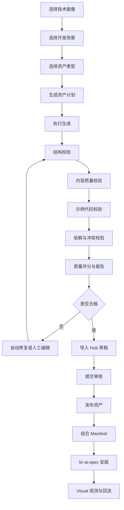

# PRD：AI 工程资产工厂与多技术栈资产 Hub

## 1. 项目背景

当前三仓已经按照 V1~V3 方向升级：

| 仓库 | 定位 |
|---|---|
| skill-q-platform | AI 工程资产 Hub，管理 Skill、Rule、Role、Flow、Scenario、Manifest、审核、版本、发布、安装记录、运行反馈 |
| br-ai-spec | CLI 执行底座，负责资产安装、同步、差异检查、升级、回滚、hub-lock.json |
| br-ai-spec-visual | 运行态可视化控制台，负责项目资产画像、技术栈分布、治理看板、运行反馈 |

当前主要覆盖前端研发资产。随着平台扩展到 Java、Spring Boot、Spring MVC、Spring Cloud、Python、Go，人工逐条编写 Skill / Rule / Role / Flow / Manifest 成本极高，且质量难以统一。

因此需要新增 **AI Asset Factory：AI 工程资产工厂**。

---

## 2. 产品定位

AI Asset Factory 是一套面向团队的工程资产生产线，基于项目标准模板、技术画像、场景定义，一键生成符合 Hub 规范的 Skill、Rule、Role、Flow、Scenario、Manifest，并完成质量校验、自动修复、导入草稿、人工审核和发布流转。

核心原则：

```text
模板定义标准
AI 负责生成
程序负责校验
人负责审核
Hub 负责发布
Visual 负责反馈
```

它不是普通“文档生成器”，也不是“一键生成后直接发布”的自动化工具，而是企业级资产生产和质量治理系统。

---

## 3. 目标

### 3.1 产品目标

1. 降低 Skill / Rule / Role / Flow / Manifest 创建成本。
2. 统一资产内容结构、命名规范和质量标准。
3. 支撑前端、后端、多语言、多框架资产体系扩展。
4. 支持 Java Spring Boot 首批后端资产快速生成。
5. 生成内容必须可校验、可评分、可修复、可导入、可审核。
6. 与现有 Manifest、CLI 安装、Visual 观测体系打通。

### 3.2 业务目标

1. 让团队能快速沉淀 Java / Spring Boot / Spring Cloud / Python / Go 工程资产。
2. 让平台从资产管理平台升级为资产生产、资产治理、资产回流平台。
3. 让技术负责人能通过模板管控团队 AI 工程资产质量。
4. 让普通开发不用理解所有 Skill / Rule 细节，只选择 Manifest 方案包即可。

---

## 4. 用户角色

| 角色 | 诉求 |
|---|---|
| 平台管理员 | 批量生成资产、管理模板、控制质量 |
| 架构师 | 定义技术画像、模板、质量门禁 |
| 后端负责人 | 快速生成 Java / Spring Boot 资产体系 |
| 开发者 | 使用标准方案包接入项目 |
| 审核人 | 审核生成资产是否合格 |
| 测试人员 | 验证生成、导入、安装、展示链路 |
| 管理者 | 查看资产覆盖率、接入率、风险和运行效果 |

---

## 5. 核心概念

### 5.1 Asset

统一资产抽象：

```text
Skill：能力，例如接口实现、测试生成、代码评审
Rule：约束，例如日志规范、异常规范、接口返回规范
Role：专家角色，例如后端实现专家、接口契约设计专家
Flow：流程，例如新增接口流程、数据库变更流程
Scenario：场景，例如新增 REST API、Bug 修复
Manifest：方案包，把多个资产组合成可安装方案
```

### 5.2 Tech Profile

技术画像，描述某类项目的技术栈：

```json
{
  "code": "backend-java-springboot",
  "name": "Java Spring Boot 技术画像",
  "domain": "backend",
  "language": "Java",
  "frameworks": ["Spring Boot", "Spring MVC"],
  "architecture": ["monolith", "service"],
  "buildTools": ["Maven", "Gradle"],
  "orm": ["MyBatis", "JPA"],
  "scenarios": ["new-rest-api", "modify-rest-api", "bugfix", "db-change"]
}
```

### 5.3 Asset Factory

资产工厂，根据 Tech Profile、Scenario、模板和生成等级批量生成资产草稿。

### 5.4 Quality Gate

质量门禁，校验资产结构、内容完整性、示例质量、技术准确性、风险控制和 Manifest 引用关系。

---

## 6. 多技术栈规划

采用：

```text
语言统筹 + 框架细分 + 场景交付 + Manifest 组合
```

分层：

```text
技术域 Domain
└── 语言 Language
    └── 框架 Framework
        └── 架构模式 Architecture
            └── 开发场景 Scenario
                └── Manifest 方案包
```

### 6.1 后端路线

V1：

```text
Backend 通用资产
Java 通用资产
Spring Boot 标准资产
Spring MVC / 传统 Java Web 兼容资产
```

V2：

```text
Spring Cloud / 微服务治理
```

V3：

```text
Python FastAPI / Django
Go Gin / gRPC
```

---

## 7. Role 设计原则

Role 不按框架无限拆。Role 表示职责，Tech Profile 表示技术栈。

推荐 Role：

```text
backend-architect
backend-implementer
api-contract-designer
database-designer
backend-code-reviewer
backend-test-engineer
backend-security-reviewer
microservice-governor
```

不要创建大量：

```text
Spring Boot 实现专家
Spring MVC 实现专家
Spring Cloud 实现专家
FastAPI 实现专家
Go Gin 实现专家
```

最终通过 Role + Tech Profile + Scenario + Manifest 组合成能力。

---

## 8. 核心流程



---

## 9. 功能需求

### 9.1 Tech Profile 管理

页面：

```text
/tech-profiles
/tech-profiles/new
/tech-profiles/[code]
```

能力：

1. 创建技术画像。
2. 维护语言、框架、架构、构建工具、ORM、场景。
3. 查看关联资产和 Manifest。
4. 为 Asset Factory 提供生成上下文。

### 9.2 Asset Factory 生成任务

页面：

```text
/asset-factory
/asset-factory/new
/asset-factory/jobs
/asset-factory/jobs/[id]
```

任务字段：

```text
技术域
语言
框架
架构模式
场景
资产类型
生成等级
是否包含正确示例
是否包含错误示例
是否包含检查清单
是否包含测试建议
输出语言
```

### 9.3 生成计划

生成前先展示将生成的资产，允许用户调整。

首批 Java Spring Boot 计划：

```text
Roles：
- backend-implementer
- api-contract-designer
- backend-code-reviewer

Skills：
- springboot-rest-api-implementation-skill
- springboot-test-generation-skill
- backend-code-review-skill

Rules：
- backend-api-contract-rule
- backend-error-code-rule
- backend-validation-rule
- springboot-controller-rule

Flows：
- springboot-new-rest-api-flow

Manifest：
- backend-java-springboot-api-standard
```

### 9.4 资产生成

输出结构：

```text
generated-assets/backend-java-springboot-api/
├── roles/
├── skills/
├── rules/
├── flows/
├── manifests/
└── reports/
```

### 9.5 质量校验

评分维度：

| 维度 | 权重 |
|---|---:|
| 结构完整性 | 20% |
| 内容清晰度 | 20% |
| 技术准确性 | 20% |
| 示例质量 | 15% |
| 可执行性 | 15% |
| 风险控制 | 10% |

分数规则：

| 分数 | 结论 |
|---|---|
| 90~100 | 可进入人工审核 |
| 80~89 | 建议补充后审核 |
| 60~79 | 需要修复 |
| 60 以下 | 不允许导入 |

### 9.6 自动修复

允许修复：

```text
缺少标准章节
标题层级不统一
字段顺序不一致
slug 命名不规范
缺少检查清单占位
缺少示例占位
```

禁止自动修复：

```text
技术结论错误
安全策略错误
数据库规范错误
权限边界判断
生产部署规则
高风险 Shell 操作
```

### 9.7 导入 Hub 草稿

规则：

1. 只允许导入为 draft。
2. 不允许直接发布。
3. slug 冲突必须提示。
4. 支持跳过、创建新版本、覆盖草稿。
5. 导入后进入审核流。

---

## 10. 三仓职责

| 能力 | skill-q-platform | br-ai-spec | br-ai-spec-visual |
|---|---|---|---|
| Tech Profile 管理 | ✅ | 读取 | 展示 |
| 资产生成页面 | ✅ | ❌ | ❌ |
| 本地资产生成 CLI | ❌ | ✅ | ❌ |
| 质量校验 | ✅ | ✅ | 展示 |
| 导入 Hub 草稿 | ✅ | 调用 | ❌ |
| Manifest 安装 | ❌ | ✅ | 展示 |
| 运行反馈 | 接收 | 上报 | 采集/展示 |
| 治理看板 | 部分 | ❌ | ✅ |

---

## 11. 首批资产范围

### Roles

```text
backend-architect
backend-implementer
api-contract-designer
database-designer
backend-code-reviewer
backend-test-engineer
```

### Skills

```text
backend-requirement-analysis-skill
api-design-skill
db-schema-design-skill
springboot-rest-api-implementation-skill
springboot-test-generation-skill
backend-code-review-skill
backend-security-review-skill
```

### Rules

```text
backend-api-contract-rule
backend-error-code-rule
backend-logging-rule
backend-exception-rule
backend-validation-rule
backend-transaction-rule
backend-idempotency-rule
java-coding-standard-rule
springboot-layered-architecture-rule
springboot-controller-rule
springboot-exception-handler-rule
java-unit-test-rule
```

### Flows

```text
backend-new-api-flow
backend-modify-api-flow
backend-bugfix-flow
backend-db-change-flow
springboot-new-rest-api-flow
springboot-modify-rest-api-flow
```

### Manifests

```text
backend-standard
java-backend-standard
java-springboot-standard
java-springboot-api-standard
java-springmvc-legacy-standard
```

---

## 12. 非功能需求

1. 所有页面使用 ui-ux-pro-max 设计系统。
2. 所有页面文案为中文。
3. 所有 CLI 输出为中文。
4. 生成任务支持异步执行。
5. 单批次默认最多生成 50 个资产。
6. 不上传源码、密钥、绝对路径、用户名。
7. 高风险资产必须人工审核。
8. 所有导入操作写审计日志。

---

## 13. V1~V3 路线

### V1：本地 Asset Factory + Hub 草稿导入

1. br-ai-spec 新增 asset-factory Skill。
2. 实现 plan / generate / validate / package / import。
3. 支持 Java Spring Boot 首批资产生成。
4. skill-q-platform 支持接收导入包。
5. 生成质量报告。

### V2：Hub 页面化资产工厂

1. Hub 页面创建生成任务。
2. 在线查看、编辑、校验、修复。
3. 导入草稿。
4. 审核发布联动。
5. 模板管理。

### V3：智能补齐与运行反馈优化

1. 根据技术画像发现缺失资产。
2. 根据 Manifest 缺口生成资产草稿。
3. 根据 Visual 失败原因生成修复建议。
4. 扩展 Python / Go。
5. 生成下一版 Manifest 草案。

---

## 14. 总体验收标准

1. 可以生成 Java Spring Boot 资产包。
2. 可以输出质量报告。
3. 可以校验每个资产分数。
4. 可以自动修复低风险问题。
5. 可以导入 Hub 草稿。
6. 可以审核发布。
7. 可以组合 Manifest。
8. 可以通过 br-ai-spec 安装到业务项目。
9. 可以通过 Visual 展示项目接入与资产质量。
10. 可以形成运行反馈闭环。
