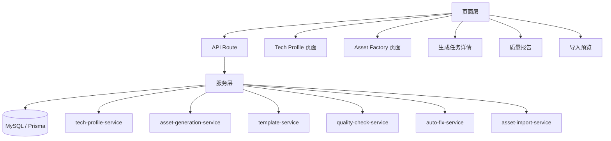

# 技术实现文档：skill-q-platform 资产工厂与多技术栈 Hub

## 1. 实现目标

`skill-q-platform` 作为 AI 工程资产 Hub，需要新增：

1. Tech Profile 技术画像管理。
2. Asset Factory 生成任务管理。
3. 模板管理。
4. 生成结果管理。
5. 质量报告与评分。
6. 自动修复。
7. 导入 Hub 草稿。
8. 审核发布联动。
9. Manifest Builder 兼容技术画像。

---

## 2. 架构设计



---

## 3. 推荐目录结构

```text
skill-q-platform/
├── app/
│   ├── tech-profiles/
│   ├── asset-factory/
│   └── api/
│       ├── tech-profiles/
│       └── asset-factory/
├── src/
│   ├── server/
│   │   ├── tech-profile/
│   │   ├── asset-factory/
│   │   └── hub/
│   ├── components/
│   │   ├── tech-profiles/
│   │   └── asset-factory/
│   └── lib/
├── prisma/
└── design-system/
```

---

## 4. Prisma 数据模型

### 4.1 TechProfile

```prisma
model TechProfile {
  id            String   @id @default(cuid())
  code          String   @unique
  name          String
  domain        String
  language      String?
  frameworks    Json?
  architecture  Json?
  buildTools    Json?
  orm           Json?
  databases     Json?
  scenarios     Json?
  description   String?  @db.Text
  status        String   @default("active")
  createdBy     String?
  createdAt     DateTime @default(now())
  updatedAt     DateTime @updatedAt

  @@index([domain])
  @@index([language])
  @@index([status])
}
```

### 4.2 AssetGenerationJob

```prisma
model AssetGenerationJob {
  id                 String   @id @default(cuid())
  name               String
  domain             String
  language           String?
  framework          String?
  scenario           String
  assetTypes         Json
  qualityLevel       String   @default("standard")
  includeExamples    Boolean  @default(true)
  includeBadExamples Boolean  @default(true)
  includeChecklists  Boolean  @default(true)
  includeTests       Boolean  @default(true)
  outputLanguage     String   @default("zh-CN")
  status             String   @default("draft")
  input              Json
  outputSummary      Json?
  averageScore       Int?
  createdBy          String?
  createdAt          DateTime @default(now())
  updatedAt          DateTime @updatedAt

  items              AssetGenerationItem[]

  @@index([domain])
  @@index([language])
  @@index([framework])
  @@index([status])
}
```

### 4.3 AssetGenerationItem

```prisma
model AssetGenerationItem {
  id              String   @id @default(cuid())
  jobId           String
  assetKind       String
  assetSlug       String
  assetName       String
  content         String   @db.LongText
  filePath        String?
  score           Int?
  status          String   @default("draft")
  issues          Json?
  suggestions     Json?
  importStatus    String?
  importedAssetId String?
  createdAt       DateTime @default(now())
  updatedAt       DateTime @updatedAt

  job             AssetGenerationJob @relation(fields: [jobId], references: [id])

  @@index([jobId])
  @@index([assetKind])
  @@index([assetSlug])
}
```

### 4.4 AssetQualityCheck

```prisma
model AssetQualityCheck {
  id        String   @id @default(cuid())
  itemId    String
  checkType String
  passed    Boolean
  score     Int
  message   String?  @db.Text
  details   Json?
  createdAt DateTime @default(now())

  @@index([itemId])
  @@index([checkType])
}
```

### 4.5 AssetTemplate

```prisma
model AssetTemplate {
  id        String   @id @default(cuid())
  code      String   @unique
  name      String
  assetKind String
  domain    String?
  language  String?
  framework String?
  content   String   @db.LongText
  version   String   @default("1.0.0")
  status    String   @default("active")
  createdBy String?
  createdAt DateTime @default(now())
  updatedAt DateTime @updatedAt

  @@index([assetKind])
  @@index([domain])
  @@index([status])
}
```

---

## 5. 状态枚举

### 5.1 AssetGenerationJob.status

```ts
export const ASSET_GENERATION_JOB_STATUS = {
  DRAFT: 'draft',
  PLANNED: 'planned',
  GENERATING: 'generating',
  GENERATED: 'generated',
  VALIDATING: 'validating',
  VALIDATED: 'validated',
  FIXING: 'fixing',
  IMPORTING: 'importing',
  IMPORTED: 'imported',
  FAILED: 'failed',
} as const;
```

### 5.2 AssetGenerationItem.status

```ts
export const ASSET_GENERATION_ITEM_STATUS = {
  DRAFT: 'draft',
  GENERATED: 'generated',
  VALIDATED: 'validated',
  NEED_FIX: 'need_fix',
  BLOCKED: 'blocked',
  IMPORTED: 'imported',
  SKIPPED: 'skipped',
} as const;
```

---

## 6. API 设计

统一响应：

```ts
export type ApiResponse<T> = {
  code: number;
  message: string;
  data?: T;
};
```

### 6.1 技术画像

```http
GET    /api/tech-profiles
POST   /api/tech-profiles
GET    /api/tech-profiles/:code
PUT    /api/tech-profiles/:code
DELETE /api/tech-profiles/:code
```

### 6.2 Asset Factory

```http
GET  /api/asset-factory/jobs
POST /api/asset-factory/jobs
POST /api/asset-factory/jobs/plan
GET  /api/asset-factory/jobs/:id
POST /api/asset-factory/jobs/:id/generate
POST /api/asset-factory/jobs/:id/validate
POST /api/asset-factory/jobs/:id/fix
POST /api/asset-factory/jobs/:id/import
GET  /api/asset-factory/jobs/:id/report.md
```

### 6.3 创建任务请求

```json
{
  "domain": "backend",
  "language": "Java",
  "framework": "Spring Boot",
  "scenario": "new-rest-api",
  "assetTypes": ["role", "skill", "rule", "flow", "manifest"],
  "qualityLevel": "enterprise",
  "includeExamples": true,
  "includeBadExamples": true,
  "includeChecklists": true,
  "includeTests": true
}
```

---

## 7. 服务层职责

### 7.1 tech-profile-service

1. 创建、更新、查询技术画像。
2. 校验 code 唯一。
3. 为生成任务提供技术栈上下文。
4. 统计技术画像下的资产和 Manifest。

### 7.2 asset-generation-plan-service

1. 根据技术画像和场景生成资产计划。
2. 防止重复 slug。
3. 按 Role / Skill / Rule / Flow / Manifest 分类输出。
4. 支持用户调整计划。

### 7.3 asset-generation-service

1. 读取模板。
2. 渲染模板变量。
3. 生成 AssetGenerationItem。
4. 写入生成结果。
5. 更新 Job 状态。

### 7.4 template-service

1. 管理模板。
2. 支持不同资产类型模板。
3. 支持不同技术栈模板。
4. 支持模板版本化。

### 7.5 quality-check-service

1. 校验结构。
2. 校验必填章节。
3. 校验示例代码。
4. 校验 Manifest 引用。
5. 计算质量分。
6. 生成质量报告。

### 7.6 auto-fix-service

1. 补齐缺失章节。
2. 修复标题层级。
3. 修复字段顺序。
4. 修复 slug 命名。
5. 生成修复日志。

### 7.7 asset-import-service

1. 将 item 导入 HubAsset / HubAssetVersion。
2. 将 manifest 导入 HubManifest / HubManifestVersion。
3. 处理冲突。
4. 写入审计日志。
5. 强制导入为 draft。

---

## 8. 质量校验规则

### 8.1 Skill 必填章节

```text
Skill 基本信息
使用时机
输入要求
执行流程
输出格式
示例代码
质量要求
失败处理
验收标准
```

### 8.2 Rule 必填章节

```text
规则基本信息
规则目的
必须遵守
禁止行为
推荐实践
正确示例
错误示例
检查清单
适用场景
不适用场景
```

### 8.3 Role 必填章节

```text
角色定位
职责范围
不负责的事情
输入信息
输出结果
协作关系
质量标准
```

### 8.4 Flow 必填章节

```text
流程目标
适用场景
流程阶段
阶段说明
失败处理
验收标准
```

### 8.5 Manifest 校验

1. schemaVersion 必填。
2. slug 唯一。
3. 引用资产必须存在。
4. 不允许循环依赖。
5. 不允许技术栈冲突。
6. 不允许引用 blocked item。

---

## 9. 页面实现

所有页面使用 ui-ux-pro-max 设计系统。

### 9.1 /asset-factory

展示：

1. 总任务数。
2. 平均质量分。
3. 待修复任务数。
4. 已导入任务数。
5. 最近生成批次。

### 9.2 /asset-factory/new

步骤：

```text
选择技术画像
选择场景
选择资产类型
选择生成等级
生成计划
确认创建
```

### 9.3 /asset-factory/jobs/[id]

Tab：

```text
生成概览
Roles
Skills
Rules
Flows
Manifest
质量报告
导入预览
操作日志
```

### 9.4 /tech-profiles

功能：

1. 技术画像列表。
2. 新增技术画像。
3. 编辑技术画像。
4. 查看关联资产和 Manifest。

---

## 10. 导入 Hub 逻辑

1. 只允许导入分数达标的 item。
2. score < 60 阻断导入。
3. score < 80 不允许提交审核。
4. 默认导入为 draft。
5. Manifest 必须在引用资产成功导入后再导入。
6. 所有导入写审计日志。

冲突策略：

```text
skip：跳过
new_version：创建新版本
overwrite_draft：覆盖草稿
```

---

## 11. 权限控制

| 操作 | developer | contributor | reviewer | admin |
|---|---|---|---|---|
| 查看任务 | ✅ | ✅ | ✅ | ✅ |
| 创建任务 | ❌ | ✅ | ✅ | ✅ |
| 执行生成 | ❌ | ✅ | ✅ | ✅ |
| 自动修复 | ❌ | ✅ | ✅ | ✅ |
| 导入草稿 | ❌ | ✅ | ✅ | ✅ |
| 提交审核 | ❌ | ✅ | ✅ | ✅ |
| 审核发布 | ❌ | ❌ | ✅ | ✅ |
| 删除任务 | ❌ | ❌ | ❌ | ✅ |

---

## 12. 安全控制

1. 扫描敏感信息。
2. 禁止导入密钥、Token、密码。
3. 示例代码必须标注仅供参考。
4. 高风险资产必须人工审核。
5. 生成任务日志不记录隐私。
6. 不允许直接发布生成资产。

---

## 13. 测试用例

### 单元测试

1. TechProfile 创建校验。
2. Job 创建校验。
3. 模板渲染。
4. Skill 结构校验。
5. Rule 结构校验。
6. Manifest 引用校验。
7. 自动修复。
8. 导入冲突处理。

### 集成测试

1. 创建技术画像。
2. 创建生成任务。
3. 执行生成。
4. 校验质量。
5. 自动修复。
6. 导入草稿。
7. 审核发布。
8. Manifest Export。

### 页面测试

1. 资产工厂首页。
2. 新建任务页面。
3. 任务详情页。
4. 质量报告页。
5. 技术画像页面。

---

## 14. 验收标准

1. 可以创建 Java Spring Boot 技术画像。
2. 可以创建资产生成任务。
3. 可以生成 Java Spring Boot 首批资产。
4. 可以查看质量报告。
5. 低分资产不能导入。
6. 可以自动修复低风险结构问题。
7. 可以导入 Hub 草稿。
8. 可以进入审核发布。
9. 可以被 Manifest Builder 使用。
10. 所有页面中文化并符合 ui-ux-pro-max。
