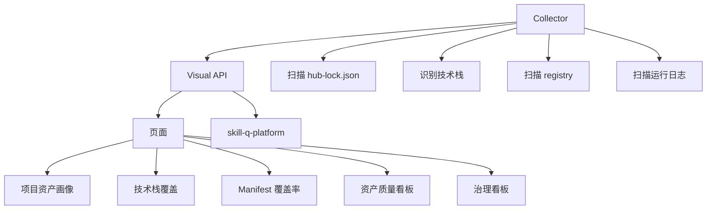

# 技术实现文档：br-ai-spec-visual 资产治理与质量可视化

## 1. 实现目标

`br-ai-spec-visual` 支持 Asset Factory 与多技术栈治理，包括：

1. 展示项目技术画像。
2. 展示团队技术栈分布。
3. 展示 Manifest 覆盖率。
4. 展示资产生成质量。
5. 展示低质量资产与风险资产。
6. 展示运行效果和失败率。
7. 将运行反馈回流 Hub。
8. 为管理者提供治理看板。

---

## 2. 架构设计



---

## 3. 目录结构

```text
br-ai-spec-visual/
├── app/
│   ├── workspaces/[id]/
│   │   ├── projects/[projectId]/assets/page.tsx
│   │   ├── projects/[projectId]/risk/page.tsx
│   │   ├── asset-quality/page.tsx
│   │   ├── asset-generation/page.tsx
│   │   ├── tech-coverage/page.tsx
│   │   ├── manifest-coverage/page.tsx
│   │   └── governance/page.tsx
│   └── api/
│       ├── collector/
│       ├── governance/
│       └── runtime/
├── src/
│   ├── collector/
│   ├── server/
│   └── components/
└── design-system/
```

---

## 4. 数据库模型

### 4.1 ProjectHubState

```prisma
model ProjectHubState {
  id               String   @id @default(cuid())
  workspaceId      String
  projectHash      String
  projectName      String?
  hubUrl           String?
  manifestSlug     String?
  manifestName     String?
  manifestVersion  String?
  manifestChecksum String?
  assets           Json?
  lockSnapshot     Json?
  updatedAt        DateTime @updatedAt
  createdAt        DateTime @default(now())

  @@unique([workspaceId, projectHash])
  @@index([manifestSlug])
}
```

### 4.2 ProjectTechProfile

```prisma
model ProjectTechProfile {
  id             String   @id @default(cuid())
  workspaceId    String
  projectHash    String
  projectName    String?
  domain         String?
  language       String?
  frameworks     Json?
  architecture   Json?
  buildTool      String?
  orm            Json?
  databases      Json?
  confidence     Float?
  detectedFiles  Json?
  createdAt      DateTime @default(now())
  updatedAt      DateTime @updatedAt

  @@unique([workspaceId, projectHash])
  @@index([domain])
  @@index([language])
}
```

### 4.3 AssetQualitySnapshot

```prisma
model AssetQualitySnapshot {
  id             String   @id @default(cuid())
  workspaceId    String
  assetSlug      String
  assetKind      String
  techProfile    String?
  score          Int?
  status         String?
  issues         Json?
  source         String?
  createdAt      DateTime @default(now())

  @@index([workspaceId])
  @@index([assetSlug])
  @@index([assetKind])
}
```

### 4.4 RuntimeFeedbackEvent

```prisma
model RuntimeFeedbackEvent {
  id               String   @id @default(cuid())
  eventId          String   @unique
  workspaceId      String?
  projectHash      String
  projectName      String?
  manifestSlug     String?
  manifestVersion  String?
  assetKind        String?
  assetSlug        String?
  assetVersion     String?
  eventType        String
  stage            String?
  status           String?
  durationMs       Int?
  success          Boolean?
  failureReason    String?  @db.Text
  payload          Json?
  createdAt        DateTime @default(now())

  @@index([workspaceId])
  @@index([projectHash])
  @@index([manifestSlug])
  @@index([assetSlug])
}
```

---

## 5. Collector 能力

### 5.1 扫描 hub-lock.json

路径：

```text
.ai-spec/hub-lock.json
```

读取：

```text
Hub 地址
Manifest slug
Manifest 版本
已安装资产列表
资产 checksum
安装时间
```

### 5.2 技术栈识别

Java / Spring Boot：

```text
pom.xml
build.gradle
src/main/java
application.yml
spring-boot-starter-web
spring-cloud-starter
mybatis-spring-boot-starter
```

前端：

```text
package.json
vite.config.ts
next.config.js
src/App.tsx
src/main.ts
```

Python：

```text
requirements.txt
pyproject.toml
fastapi
django
flask
```

Go：

```text
go.mod
gin-gonic/gin
grpc
```

### 5.3 输出结构

```json
{
  "project": {
    "name": "demo-service",
    "hash": "sha256_xxx"
  },
  "techProfile": {
    "domain": "backend",
    "language": "Java",
    "frameworks": ["Spring Boot"],
    "buildTool": "Maven",
    "orm": ["MyBatis"],
    "confidence": 0.92
  },
  "hubLock": {
    "manifestSlug": "backend-java-springboot-standard",
    "manifestVersion": "1.0.0",
    "assets": []
  }
}
```

---

## 6. API 设计

### 6.1 Collector 上报

```http
POST /api/collector/project-state
```

### 6.2 项目资产画像

```http
GET /api/workspaces/:id/projects/:projectId/assets
```

### 6.3 技术栈覆盖率

```http
GET /api/workspaces/:id/tech-coverage
```

### 6.4 Manifest 覆盖率

```http
GET /api/workspaces/:id/manifest-coverage
```

### 6.5 资产质量分布

```http
GET /api/workspaces/:id/asset-quality
```

### 6.6 运行事件

```http
POST /api/runtime/events
```

---

## 7. 页面设计

所有页面使用 ui-ux-pro-max。

### 7.1 项目资产画像页

路由：

```text
/workspaces/[id]/projects/[projectId]/assets
```

展示：

1. 项目名称。
2. 技术画像。
3. 当前 Manifest。
4. Manifest 版本。
5. 资产数量。
6. Skill / Rule / Role / Flow 数量。
7. 过期资产。
8. 本地修改资产。
9. 风险资产。
10. 推荐操作。

### 7.2 技术栈覆盖率页

路由：

```text
/workspaces/[id]/tech-coverage
```

展示：

```text
React 项目数
Vue 项目数
Java Spring Boot 项目数
Spring Cloud 项目数
Python FastAPI 项目数
Go Gin 项目数
```

### 7.3 Manifest 覆盖率页

路由：

```text
/workspaces/[id]/manifest-coverage
```

展示：

1. 某技术栈项目总数。
2. 已接入标准 Manifest 数。
3. 未接入项目数。
4. 接入率。
5. 推荐接入项目列表。

### 7.4 资产质量看板

路由：

```text
/workspaces/[id]/asset-quality
```

展示：

1. 资产平均分。
2. 低质量资产数量。
3. 阻断资产数量。
4. 按类型分布。
5. 按技术栈分布。
6. 问题 Top 10。

### 7.5 治理看板

路由：

```text
/workspaces/[id]/governance
```

展示：

1. 项目总数。
2. 接入项目数。
3. 未接入项目数。
4. 过期 Manifest 项目数。
5. 高风险资产项目数。
6. 低质量资产数量。
7. 最近运行失败率。
8. 推荐治理动作。

---

## 8. 指标计算

### 8.1 Manifest 覆盖率

```text
覆盖率 = 已接入标准 Manifest 的项目数 / 该技术栈项目总数
```

### 8.2 资产健康度

```text
资产健康度 = 质量分 * 40% + 运行成功率 * 30% + 被复用项目数 * 20% - 风险扣分 * 10%
```

### 8.3 项目治理风险

```text
项目治理风险 =
未接入 Manifest
+ Manifest 版本过旧
+ 使用 deprecated 资产
+ 本地修改未同步
+ 最近运行失败率高
+ 使用低质量资产
```

---

## 9. Runtime Event

事件类型：

```ts
export const RUNTIME_EVENT_TYPE = [
  'manifest_installed',
  'manifest_upgraded',
  'manifest_rollback',
  'asset_generated',
  'asset_validated',
  'asset_imported',
  'spec_started',
  'spec_checked',
  'skill_invoked',
  'skill_completed',
  'skill_failed',
  'rule_blocked',
  'gate_passed',
  'gate_failed'
] as const;
```

事件结构：

```json
{
  "eventId": "evt_xxx",
  "eventType": "skill_completed",
  "timestamp": "2026-04-24T10:00:00.000Z",
  "workspaceId": "workspace_xxx",
  "project": {
    "name": "demo-service",
    "hash": "sha256_xxx"
  },
  "manifest": {
    "slug": "backend-java-springboot-standard",
    "version": "1.0.0"
  },
  "asset": {
    "kind": "skill",
    "slug": "springboot-rest-api-implementation-skill",
    "version": "1.0.0"
  },
  "result": {
    "success": true,
    "failureReason": null
  },
  "privacy": {
    "sourceCodeIncluded": false,
    "absolutePathIncluded": false,
    "userNameIncluded": false
  }
}
```

---

## 10. 与 Hub 协作

Visual 从 Hub 获取：

```http
GET /api/tech-profiles/stats
GET /api/hub/assets/quality-summary
GET /api/hub/manifests/:slug
GET /api/asset-factory/stats
```

Visual 不重新定义 Manifest 和 Asset 模型，只消费 Hub 标准结构。

---

## 11. 与 br-ai-spec 协作

br-ai-spec 输出：

```text
hub-lock.json
项目技术栈识别结果
运行事件
资产安装记录
```

Visual 扫描：

```text
.ai-spec/hub-lock.json
.agents/registry
.omx/logs
openspec
```

---

## 12. 隐私与安全

1. 不展示本地绝对路径。
2. 不展示用户名。
3. 不展示源码内容。
4. 不上传密钥。
5. 项目 hash 用于识别，不暴露敏感路径。
6. Runtime Event 只上传结构化元数据。

---

## 13. 测试用例

### 单元测试

1. hub-lock 解析。
2. Java Spring Boot 项目识别。
3. Manifest 覆盖率计算。
4. 项目风险分计算。
5. 资产质量统计。
6. Runtime Event 解析。

### 集成测试

1. Collector 扫描业务项目。
2. 写入 ProjectHubState。
3. 写入 ProjectTechProfile。
4. 页面展示项目资产画像。
5. 页面展示技术栈覆盖率。
6. 运行事件回流 Hub。

### 页面测试

1. 项目资产画像页。
2. 技术栈覆盖率页。
3. Manifest 覆盖率页。
4. 资产质量看板。
5. 治理看板。

---

## 14. 验收标准

1. Collector 能识别 Java Spring Boot 项目。
2. Collector 能解析 hub-lock.json。
3. Visual 能展示项目当前 Manifest。
4. Visual 能展示项目技术画像。
5. Visual 能展示团队技术栈分布。
6. Visual 能展示 Manifest 覆盖率。
7. Visual 能展示资产质量分布。
8. Visual 能标记低质量资产。
9. Visual 能展示运行失败率。
10. Visual 能回流 Runtime Event 到 Hub。
11. 所有页面中文化。
12. 所有页面符合 ui-ux-pro-max。
